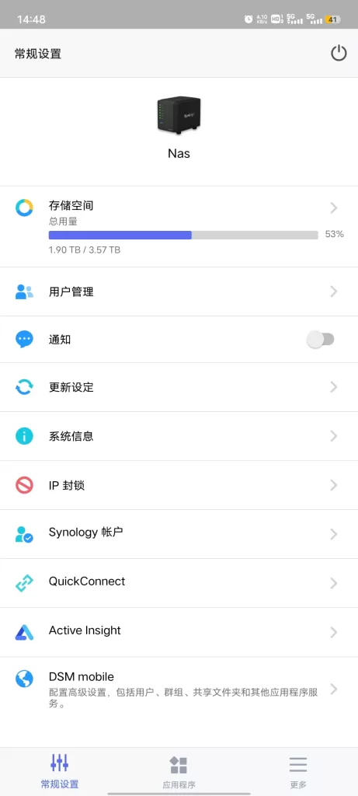
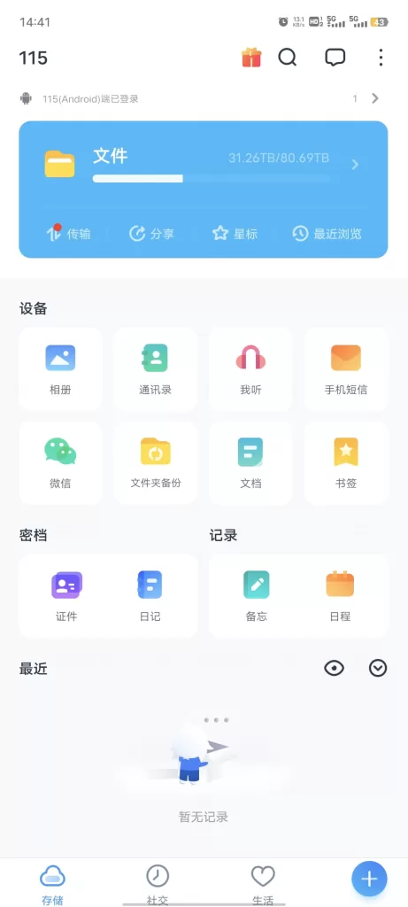
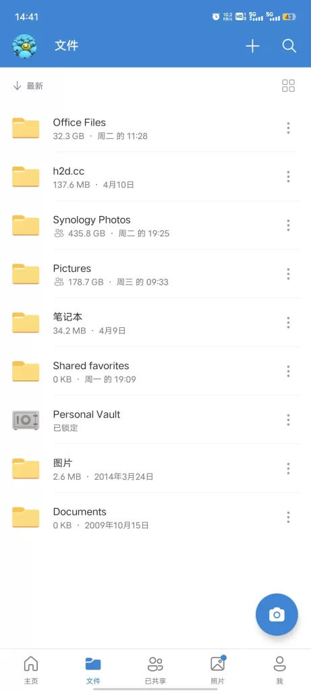
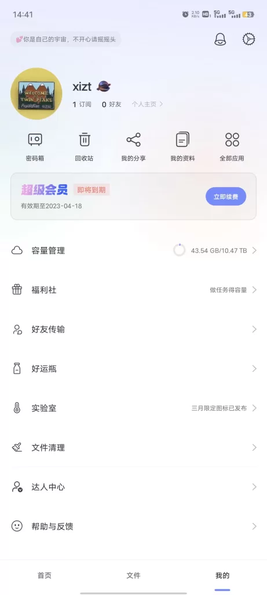
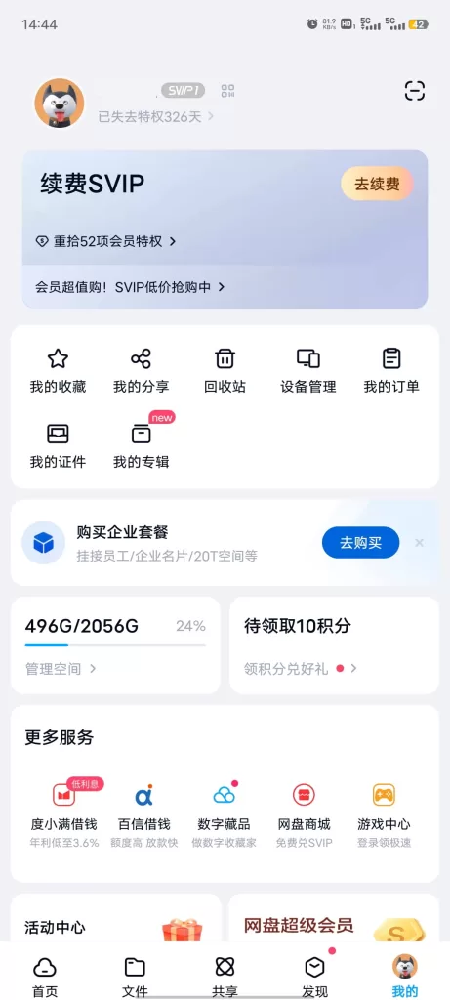
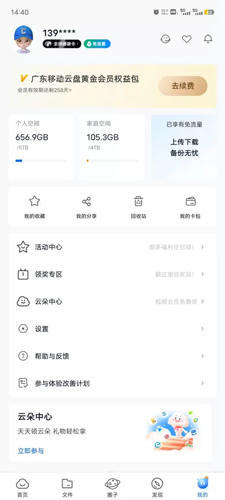
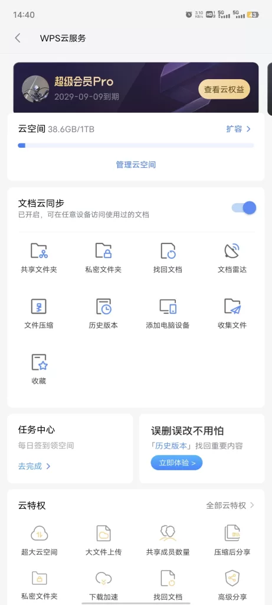
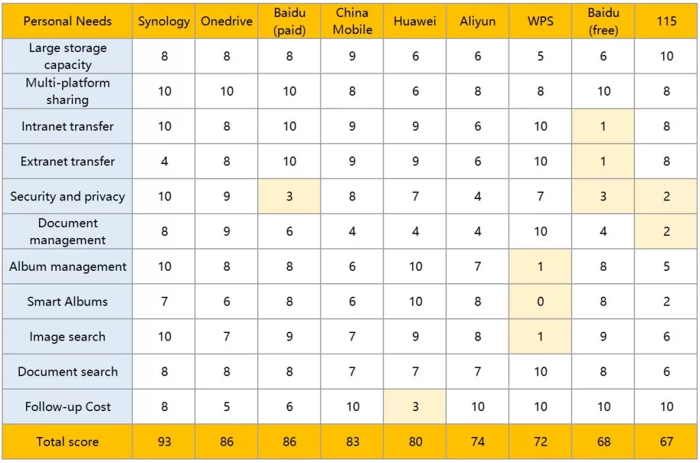

Over the years, as the number of personal electronic documents and photos has grown, I personally currently have roughly 40GB of Office files containing nearly 100,000 DOC documents and countless excel files. My family has over 120,000 files of photos and videos stored, containing jpg cr2 heiv heif mp4 avi and various other formats, which is about 700GB after removing duplicate files.Recently, I re-adjusted some of the cloud storage products and services. Here is how I design a solution for network storage aticles.

<!--more-->
## Clear about the type of device you have

- First, **be clear about the type of device you have**. For example, the main electronic products and network services I am using personally and at home are as follows:

1. I have three main cell phones currently in use at home, namely Huawei P40 Pro ,Vivo X80, Huawei mate 20. I need to meet the demand for each phone to be able to view all the photos of my family anytime and anywhere.

3. I currently have three computers at home, namely Lenovo Y9000p, Thinkpad P53, Intel NUC12, all equipped with 4K resolution monitors, corresponding to the needs of games, work and network video respectively. In addition there are iPad Pro and vivo pad and other tablet computers, often need to pass files to each other.

5. I have other digital cameras at home, which probably produce about 200GB of photos and videos per year and need secure storage.

7. I have two TVs at home, TCL 75-inch and Sony 65-inch, both with 4K resolution, which need to meet the demand for large bandwidth video viewing.

9. I have a Synology small NAS at home that can store 4TB of data, but it uses a 2.5-inch hard drive version with lower performance because it needs to be stuffed into a weak box. In addition, I have two Netgear routers at home with a third-party modified version of the Merlin system, which can readily mount large-capacity removable hard drives.

11. My family uses China Mobile's family mobile data package service, which includes more than 100GB of network traffic per month, which can meet the daily needs of using cell phones to link to cloud storage for uploading and downloading files at any time. In addition, China Mobile also gives 1000Mbps home fiber broadband, which has a download speed of 100MB/s and an upload speed of 5MB/s.

> A comprehensive analysis reveals that the biggest problem at present is that my family uses various brands and platforms of smart devices. The cell phone is mainly android platform and Huawei Harmony OS based on android platform, the computer has both windows system and Android and IOS system, and the TV is all Android system. In this case, it is difficult for me to solve my needs through a single cloud storage method. One possible idea is to replace all the major devices I am using with the same brand and the same platform. For example, replacing the Vivo phone I'm currently using with a Huawei phone. However, the main reason why I am buying a Vivo phone in 2022 is that Huawei was unjustifiably sanctioned by the U.S., which prevented the 5G chip it designed from being produced, and all the phones on sale are 4G versions. I had to buy a non-Huawei branded 5G phone because the 4G network speed was hard to satisfy me. But this problem will probably be solved in the next few years with the rapid progress of photolithography and chip manufacturing technology in mainland China.

* * *

## Break down your needs into the specialized terms

- Second, **break down your needs into the specialized terms** that correspond to cloud storage services. For example, my personal and family needs can be summarized as follows:

1. high-capacity storage space: photo storage services of 1TB or more;

3. multi-platform sharing: compatible with Android/Windows/IOS and other platforms;

5. intranet high-speed transfer: support CloudSync of Synology NAS; (WebDav and other unofficial and unstable ways are not considered)

7. extranet high-speed transfer: support 20MB/S download service and 5MB/s upload service;

9. security and privacy: integrity of data preservation and reliable privacy protection;

11. document management: professional Office document management;

13. album management: professional photo management;

15. intelligent photo albums: automatic photo organization by means of artificial intelligence;

17. efficient search: providing text \\OCR\\ intelligent recognition search;

19. suitable cost: affordable price.

* * *

## look for a network storage service that corresponds to your needs

- Next, **look for a network storage service that corresponds to your needs**. Here, I briefly list some of the storage services I have used in the last 10 years:

1. the Synology NAS Ds416slim 4\*2TB (available capacity 4TB), mainly used to store family photos and videos. one-time purchase cost in 2017 was RMB 4,000, no plans to update in the near future.

3. 115.com cloud storage.115.com cloud storage 80TB, mainly used to store illegal resources on the Internet. 2014 one-time purchase cost is RMB 400 (2014-2024), no renewal plan after expiration.

5. Onedrive Home Edition 6TB , mainly used to store online books and photos and videos, etc. Microsoft 365 Home Edition, annual cost of 220 RMB, ongoing subscription.

7. Huawei Cloud 2TB, used only to backup Huawei cell phone photos and videos. Costs 750 RMB per year, renewal cancelled in March 2023.

9. Aliyun Cloud 2TB, used only for downloading movies, TV shows and other web resources. Free.

11. Baidu Cloud 2TB , used only for downloading web resources. Free of charge, with occasional paid usage at 30 RMB per month.

13. ChinaMobile Cloud 9TB, only used to backup home files. Limited free (because I am a China Mobile mobile data package user, free gift).

15. WPS Cloud 1TB for WPS Office document storage only. 2019 one-time purchase cost is RMB 600 (2019-2029), current renewal fee is RMB 250 per year.

17. iCloud, a 200GB version was previously purchased during the family's use of iPhones and has not been used since 2018.

* * *

> After a long time of using the above products and services, here I briefly talk about the experience of using them. At the same time, I also made a table to list my scoring of these products and services, and as my personal decision basis.

- ### 1\. Synology NAS

NAS is my largest one-time investment in storage, and the value of its use is undeniable. There are mainly the following conveniences:

a. The storage capacity is large enough to store all the important family files conveniently, and it has strong privacy, so you don't have to worry about leaking personal privacy. In terms of data security, I set up two sets of Raid 1 for the four hard drives and manually back up important data to the removable drive from time to time so that I can recover the data even if the drive is destroyed.

b. You can easily backup to a network drive. For example, NAS files can be synchronized and backed up to cloud storage such as Baidu Cloud and Onedrive via the built-in CloudSync program.

c. High-speed file transfer within the home is possible. NAS folders can be mounted to any computer and smartphone, tablet, or TV at home via protocols such as Samba.

However, there are very big limitations in using Synology NAS in home use, especially in China's network environment.

a. Currently, most of the home broadband users in China are using shared IPv4 pools, and there is no fixed IPv4, so there is no way to open NAS files quickly on networks outside the home. You need to use a third party network penetration service, which increases the cost of use.

b. Although Synology provides Quick connect, an external network access service, the reliability of this service is not high in China, and the speed of file transfer is less than 500KB/s, which is less practical.

c. China's home broadband is an asymmetric network, the 1Gbps fiber optic network I am currently using at home, although the downlink speed can reach more than 100MB/s, but the maximum upload speed of files is only 5MB/s, which is difficult to achieve high-speed file outgoing transmission. operators usually limit the upload speed of home users' network to about 30-40Mbps.

d. In China's network environment, currently large files (e.g., 4K videos, TV episodes, etc.) are usually downloaded using network hard disk mode. In actual use, network drives such as Aliyun Cloud , ChinaMobile Cloud, etc. provide TV/PC clients directly to provide 4K video online viewing services. Unless the individual has a strong collection fetish, it is already very unwise to download video and TV episode files to local viewing. This also further compresses the limitations of NAS usage, making it more focused on internal home file usage rather than an aid for using network files.

* * *

- ### 2\. 115 Cloud

According to personal observation, most of the users who use 115 cloud storage are storing illegal video files. For example: pirated pornographic videos, pirated movies, etc. The following advantages are available when storing these files:

a. Large capacity. 115 Cloud provided unlimited storage space for some paid users before 2014, which could be obtained using lower cost at that time. I did not purchase the unlimited space service back then, but I purchased a 10-year regular membership for RMB 40 per year to get access to 80TB of space. The current membership renewal offer is around 200 RMB per year.

b. Fast speed. 115 Cloud download speed is about 200Mbps, which is enough for daily use, because even 4K video online only needs 100Mbps.

c. Easy to upload files. 115 Cloud can easily store files using magnet links, bt seed files, SHA1 collisions, etc. There are plenty of such resources available in some websites. For example, just by providing a magnet link of the top 500 movies in imdb list, you can store HD video files of 500 movies to the user's 115 Cloud folder in seconds.

d. The most strange thing is that in the strictly regulated environment, it is almost impossible for the cloud storage services of Internet giants such as Baidu Alibaba to provide any chance of illegal file storage, but 115 Cloud always runs stably. Needless to say, this is strange.

> Since 115 Cloud storage wanders on the edge of illegality, its biggest flaw is always the security issue, and it may simply announce its closure during some future crackdown organized by the government on the distribution of illegal files. I believe no user would dare to store important data on such a network drive.

* * *

- ### 3\. Onedrive

  
Onedrive has two kinds of storage in China, one is stored in mainland China, operated by Vnet, mainly for business users; the other is stored in Hong Kong or Singapore, operated by Microsoft itself, mainly for personal services. The main advantages are as follows:

a. Better privacy. Compared with other cloud storage in China, Onedrive does a good job in privacy protection. Other cloud stores use SHA1 collision by default when uploading files, so if the file is available in the cloud server, it will bypass the upload step and copy the file directly to the user's folder. ps: Nowadays, this has become a major disadvantage of Onedrive, because users need to upload all files through their own network. For example, uploading a movie file downloaded on the Internet will most likely take only a few seconds on other web sites (most of the Internet resources are backed up in these cloud stores), but Onedrive requires the complete re-upload of the file over the user's network.

b. Easy to connect with Windows systems and Offce software. For example, in windows 11, onedrive is the only backup method in the system settings by default. If you need to backup to local hard disk, you need to find the traditional "control panel" and choose windows 7 backup mode to backup.

Onedrive gives you the option to add all your photos from your personal folder to an album, even if they are not placed in the default photo folder, so you can manage them easily. In addition, onedrive also provides intelligent classification recognition of pictures and text ocr search of pictures.Overall, Onedrive is a moderate cloud storage service. However, since it does not provide localized personal services in mainland China, there are many inconveniences in the process of using it.

a. The speed of internet connection is not high. I subscribed to MicroSoft 365 family service, and I can open up to 6 accounts with 6TB storage space, but in the process of using it, I often encounter network blockage, the speed is fast and slow, and occasionally disconnected.

b. onedrive does not support Chinese well. There have been problems with onedrive in Chinese search. For example, document search does not support Chinese. In the latest version of the app, onedrive still doesn't support Chinese well in photo search, and only the first 50 search results are displayed each time, which is obviously not enough for me who has more than 100,000 photos.

c. Some services of Onedrive are blocked in China. For example, there is usually no way to open the photo sharing links directly, you have to borrow VPN and other ways to access them. The web version of onedrive is also blocked in China.

* * *

- ### 4\. Huawei Cloud Drive

  
Huawei's cloud storage solution is similar to iCloud in that it offers 5GB of space for free and 50GB/200GB/2024GB for a fee. The main advantages are as follows:

a. Deeply bound to the cell phone system. You can experience the convenience of cloud services in the album without perception, and because Chinese cell phone manufacturers continue to innovate in the album, the addition of various artificial intelligence recognition services makes it extremely convenient to find photos in the phone. Even if the number of photos I had stored in Huawei's cloud reached hundred of thousands, I was able to quickly filter them out through the search function.

b. The overall speed of use is smooth. On the one hand, I rarely encounter the situation that I can't open photos because of network problems, and the upload and download speeds are kept at excellent levels. On the other hand, in terms of photo album integration, the photos stored in the cloud are basically the same as local photos, so users don't need to care whether the photos are stored locally or in the cloud.

c. Comes with cell phone system backup function. If you turn on a high-capacity cloud package service, you can generally backup your phone files to the cloud as a whole, and you only need to log in to your original account when you change your phone.

  
However, as the cloud storage of cell phone manufacturers mainly focus on cell phone use, the scope of use is narrow.

a. Cross-platform use is difficult. Unless the whole family uses the same brand of cell phones and computers, it is difficult to share the cloud storage space and its convenience with each other.

b. The price is high. For example, Huawei's 2048gb package plan costs RMB 68 per month, more than three times the price of other mainstream consumer cloud storage space on the market.

> Overall, Huawei cloud storage is in the same class as Apple's iCloud. But because Huawei was sanctioned by the United States, his hardware line is currently less complete and better than Apple's, which is indeed a great pity.

* * *

- ### 5\. AliyunDrive

  
AliyunDrive is a new service launched by Alibaba Group in the last two years, with free and unlimited speed as its main selling point, which relies on Aliyun platform, currently the largest cloud service platform in China. This website is also hosted on AliCloud Singapore server. Because the back of the tree is good to ride, so Ali cloud disk currently also has a great advantage.

a. First is its main selling point of unlimited speed as well as free. Currently Ali cloud for free users to provide more than 2TB of cloud disk capacity, and able to through the daily sign-up function and participate in other free activities, regularly receive premium membership services. However, AliCloud's promise of unlimited speed is mainly a huge improvement compared to other consumer network drive services in China, but not completely unlimited speed.

b. AliCloud Drive's user interface is relatively simple and convenient, similar to One drive, and is very user-friendly compared to other consumer network drives in China, without too many ads and other cluttered content displayed.

c. The photo management function of AliCloud Drive is relatively powerful, and it can use AI intelligence to identify and sort most photos. In addition, in addition to personal file storage, Ali Cloud Drive also has a very large number of network resources to share, so you can easily access to a variety of file resources on the network.

However, because Ali Cloud Drive is generally a latecomer to the role, there are some problems in daily use.

a. The stability of AliCloud Disk App is not high enough, there are some lagging and bug problems. For example, when I used my computer to upload 200GB photos to Ali Cloud Drive, the software freezes occurred many times.

b. AliCloud's photo album function has a completely different storage logic than other web drives. By default, AliCloud will put all the photos and videos uploaded by users into its photo module, and users cannot manage their own photo folders. And after users create new albums under its photo module by themselves, they can only operate 500 photos at a time, and even for photo deletion operation, they can only delete 2000 photos at a time, which is obviously not enough for a large number of photo management needs in.

c. Ali cloud disk privacy protection and Baidu cloud disk as a difficult to say, especially Ali cloud disk itself is focused on free services, is bound to sacrifice a certain amount of user data privacy to meet aliyun computing services for certain purposes. For example, aliyun disk will intelligently identify each photo and video uploaded by users, review its legality, and even immediately displayed a warning is issued within seconds of the user uploading the video that one of the images in the video file has a violation.

d. At present, Ali Cloud Drive has already passed the initial promotion period, and as the user base continues to expand, the online fee model and other usage restrictions may increasingly become the norm.

* * *

- ### 6\. Baidu Cloud Drive

  
Baidu Cloud Drive was a network storage that I didn't want to mention here at all because there were too many bad experiences. But overall, Baidu Cloud Drive is still the most used network drive service in China. The main advantages are as follows:

a. Baidu Cloud Drive was developed earlier and has a huge user base base and a first mover advantage. It is the most complete network resource on the entire Chinese Internet. But this is actually not too attractive for me.

b. Baidu Cloud Drive provides 2TB of storage space for free users, which is enough for the vast majority of users.

c. Baidu Cloud Drive, combined with Baidu Search and Baidu Library, is the preferred file sharing method for most Chinese web users. If one is going to share a large number of files with others, using Baidu Cloud Drive, the other party is generally acceptable.

But Baidu Cloud Drive has a spotty history of development.

a. Baidu Cloud Drive is probably one of the most restrictive network drives in the world for free users. Free registered users of Baidu Cloud Drive can usually only reach 20KB/s when downloading files, which is not at all like something a modern network service company can do. It has now improved under the verbal criticism of the general media, but it is still not friendly enough for free users.

b. Baidu Cloud Drive monitors and deletes user files. As long as a file is intelligently identified by Baidu Cloud Drive as illegal or potentially risky, Baidu Cloud Drive will delete the file without informing the user. Since this intelligent identification is done automatically by the machine and does not give any hint to the user, it is easy to give the user the risk of losing the file. In case the file is deleted by mistake, there is basically no possibility for the user to get the file back.

> > The above mentioned is the case of the free version of Baidu Cloud Drive, if you buy Baidu Cloud Drive paid services, the experience will feel much better, except for automatic deletion of user files and privacy issues, the other is first-class.

* * *

- ### 7\. ChinaMobile Cloud Drive

China Mobile, China Unicom and China Telecom, the three major mobile operators in China, all offer their own network cloud storage services.

In general, the quality of cloud storage services operated by these three companies are similar. The main advantage is that mobile operators' network cloud drives usually exempt users from charging for cell phone traffic when using the cloud drive, and users are able to store and download services smoothly when using the operators' mobile communication networks and home fiber broadband.

But all three carriers' network drives have the same problem; all three of their offerings are technically inferior to other network drive services. For example, China Mobile Cloud Drive's folders can only copy and move up to a few thousand files at a time, which is extremely inconvenient for users like me who have a huge number of files. In addition, China Mobile Cloud Drive's intelligent photo recognition function can only identify up to 20 kinds of categories, which is a huge gap compared to cell phone manufacturers and other consumer network cloud drives.

However, if it is used as a file backup tool, I personally think it is still very suitable, because China's mobile operators are state-owned enterprises, they can hardly take users' private data to meet other commercial purposes like other private companies, and these giant state-owned enterprises are at a very high level in the Chinese government agencies, so it is difficult for ordinary regulators to access these files, and the privacy for users is still better than other Internet companies.

* * *

- ### 8\. WPS Cloud Drive

WPS Cloud Drive is similar to onedrive, but its functionality is completely limited to WPS office files.

I have tried to use WPS Cloud Drive to store some of my personal photos, but there is no way to manage them other than folders. And its search function is developed based on document logic, there is almost no possibility to search for photos unless you can remember the file name of the photo.

In the Chinese network environment, WPS cloud drive is the best way to store office files, he provides a complete text and OCR search function, and WPS office itself for the vast majority of non-professional users, has enough to compete with Microsoft office, the price is also much cheaper than Microsoft.

But it can be expected that, as microsoft office has begun to introduce chatgpt function, and WPS office's artificial intelligence module is still in the process of development, wps in this regard relative to Microsoft still exists a large gap.

* * *

**My personal scoring of the above storage products and services**

  
This table is based entirely on individual usage and is intended to be used only as a reference for its analysis. For example, in terms of subsequent usage costs, since I have already purchased part of the cloud storage service for a long period of time, I do not need to pay additional fees for some time in the future. In addition, Synology NAS requires expenses for electricity, and my DS416slim consumes about 100 kWh of electricity per year, which is about 70 RMB.

* * *

## My final choice of solution

After analyzing the various storage products and services in use, I personally tend to make the following arrangements.

- a. Continue to use Synology NAS as the main home storage device and use the photo function with limited external network transfer speed. I will purchase a new NAS product to replace it at an appropriate time in the future.

- b. Give up using 115 Cloud, in fact I haven't used the service for a few months and will not renew it in the future.

- c. Discontinue the use of Huawei Cloud storage service until the whole family has updated their phones to Huawei phones.

- d. Continue to use Onedrive as a backup option for family files and use its photo feature less frequently.

- e. Abandon the use of Aliyun Cloud and Baidu Cloud. In such services where network file sharing is the main application scenario, it is okay to download network resources occasionally, but storing important family and personal files is too worrying.

- f. Continue to use China Mobile Cloud as a backup for family files and use its photo function appropriately.

- g. Continue to use WPS Cloud as the primary management method for Office documents until 2029, and then see what happens later.

I hope my selection process will help you.

