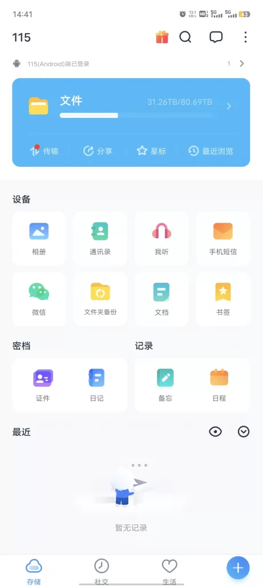
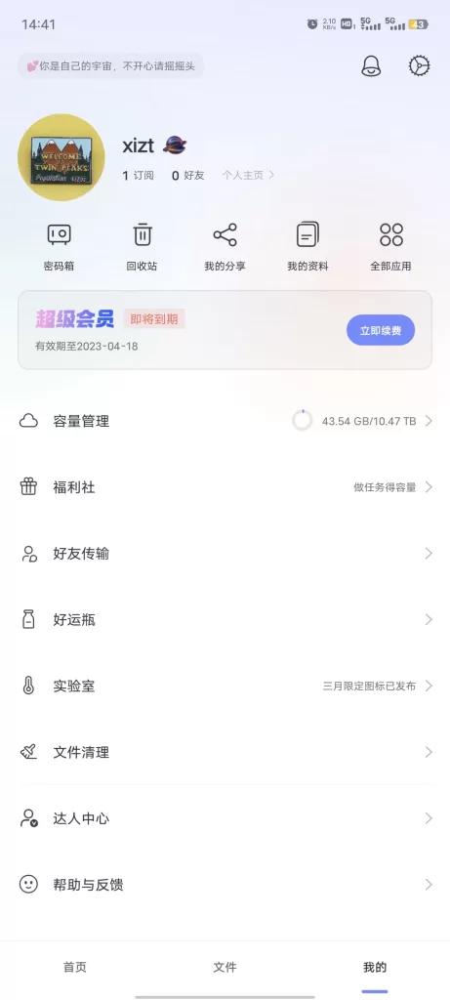

这些年来，随着个人电子文档和照片越来越多，对文件备份的需求也越来越强烈。我个人目前有大概40GB的Office文件，包含近10万个DOC文档和无数的excel文件。我一家人储存的照片和视频有12万多个文件，包含jpg cr2 heiv heif mp4 avi 等各种格式，去除重复文件后约有700GB。

## 明确个人需求
首先，明确自己的设备类型。例如，我个人及家庭在用的主要电子产品和网络服务如下：

- 我家里目前在用的主要有三台手机，分别是华为P40 Pro ,Vivo X80, 华为mate 20. 需要满足每台手机随时随地都能查看家庭所有照片的需求。
- 我家里目前在用电脑有三台，分别是Lenovo Y9000p,Thinkpad P53 ,Intel NUC12, 均配备4K分辨率显示器，分别对应着游戏、工作和网络视频需求。另外还有iPad Pro和vivo pad等平板电脑，经常需要相互传递文件。
- 我家里还有其他数码相机，大概每年能产出200GB左右的照片视频，需要安全存储。
- 我家里有两台电视机，TCL 75英寸和Sony 65英寸，均为4K分辨率，需要满足大带宽观看视频需求。
- 我家里有一台群晖小型NAS，可以存储6TB数据，但由于需要塞进弱电箱，因此使用的是2.5英寸硬盘版本，性能较低。另外，我家里还有两台Netgear路由器，采用第三方修改版的Merlin系统，可以随时挂载大容量的移动硬盘。
- 我家里使用的是中国移动的家庭手机数据套餐服务，每月包含100GB以上的网络流量，可以满足日常使用手机随时链接云存储进行上传下载文件的需求。另外，中国移动还赠送了1000Mbps家庭光纤宽带，其下载速度为100MB/s，上传速度为5MB/s。

综合分析可以发现，当前最大的问题是我家使用了各种品牌和平台的智能设备。手机主要是android平台和基于android平台的Huawei Harmony OS,电脑既有windows系统也有Android和IOS系统，电视均为Android系统。在这种情况下，我很难通过单一的云存储方式解决自己的需求。一种可行的思路是将我现在使用的主要设备均更换成同一品牌和同一平台。例如，将我目前在用的Vivo手机更换为Huawei手机。但是，我之所以在2022年购买Vivo手机，主要原因是Huawei被美国无端制裁，导致其设计的5G芯片无法被生产，在售的手机全部为4G版本。由于4G网速很难令我满意，因此我不得不购买了非华为品牌的5G手机。不过这个问题或许会随着中国大陆的光刻机制造技术和芯片制造技术的突飞猛进，在未来几年得到解决。

## 拆解服务需求

其次，将自己的需求拆解成云存储服务所对应的专业词汇。例如，我个人及家庭的需求可以概况为以下几方面：

- 大容量存储空间：1TB以上的照片存储服务；
- 多平台共享：兼容Android/Windows/IOS等平台；
- 内网高速传输：支持群晖NAS的CloudSync；(WebDav等非官方的不稳定方式不考虑）
- 外网高速传输：支持20MB/S的下载服务和5MB/s的上传服务；
- 安全和隐私：数据保存的完整性和可靠的隐私保护；
- 文档管理：专业的Office文档管理；
- 相册管理：专业的照片管理；
- 智能相册：通过人工智能方式自动整理照片；
- 高效搜索：提供文字\OCR\智能识别搜索；
- 合适的成本：价格实惠。

## 梳理当前存储服务

接下来，寻找与自己需求对应的网络存储服务。这里，我简单列举一下自己最近10年使用过的一些存储服务：

- 群晖NAS Ds416slim 4\*2TB（可用容量4TB）,主要用来存储家庭照片和视频。2017年一次性购入成本为4000元人民币，短期内无更新计划。
- 115.com云存储 80TB ,主要用来存储网络非法资源。2014年一次性购入成本为400元人民币（2014-2024年），到期后无续费计划。
- Onedrive家庭版6TB ,主要用来存储网络图书和照片视频等资源。Microsoft 360家庭版，每年成本为220元人民币，持续订阅中。
- Huawei Cloud 2TB ,仅用来备份华为手机照片和视频。每年成本为750元人民币，2023年3月已取消续订。
- Aliyun Cloud 2TB ，仅用来下载电影电视剧等网络资源。免费。
- Baidu Cloud 2TB ，仅用来下载网络资源。免费，偶尔付费使用，每月30元人民币。
- ChinaMobile Cloud 9TB ，仅用来备份家庭文件。有限免费（因为我是中国移动的手机数据套餐用户，免费赠送）。
- WPS Cloud 1TB 仅限WPS Office 文档存储。2019年一次性购入成本为600元人民币（2019-2029年），目前续费为每年250元人民币。
- iCloud，之前全家人使用iPhone期间曾购买200GB版本，2018年后未再使用。

## 使用体验

经过长时间对上述产品和服务的使用，这里我简单谈谈使用体会。同时，后面我也做了一个表格列举我对这些产品和服务的打分，并作为我个人的决策依据。

### 群晖NAS

#### 群晖NAS优点
群晖NAS是我在存储方面一次性投入最大的设备，其本身使用价值是毋容置疑的。主要有以下便利性：

- 存储容量较大，可以方便的将家庭重要文件全部存储，而且具有较强的隐私性，不必担心泄露个人隐私。在数据安全性方面，我将4块硬盘设置了两组Raid 1，并不定期手动将重要数据备份至移动硬盘，这样即便出现硬盘毁坏的情况，也能恢复数据。
- 可以轻松备份到网络硬盘。例如，可以通过内置的CloudSync程序将NAS文件同步备份到Baidu Cloud 和Onedrive等云存储。
- 可以在家庭内部实现文件高速传输。通过samba等协议可以将NAS文件夹挂载到家里任何电脑和智能手机、平板电脑、电视机。

#### 群晖NAS缺点
但在家庭使用方面，特别是在中国的网络环境中，使用群晖NAS存在非常大的限制。

- 目前中国大多数的家庭宽带用户，都是使用共享IPv4池 ，没有固定的IPv4，所以NAS文件没办法在家庭以外的网络上快速打开。需要使用第三方网络穿透服务，增加使用成本。
- 虽然群晖本身提供Quick connect这个外部网络访问服务，但在中国，这个服务的可靠性不高，传输文件的速度不到500KB/s，实用性较差。
- 中国的家庭宽带都是非对称网络，我家里目前在用的1Gbps光纤网络，虽然下行速度可达到100MB/s以上，但上传文件的速度最高只有5MB/s，难以实现文件高速外传。PS:中国政府部门规定100Mbps以上的家庭宽带网络最低上行速度为30Mbps，因此电信运营商通常将家庭用户的网络上传速度限制在30-40Mbps左右。
- 在中国的网络环境中，目前大文件（例如，4K视频、电视剧集等）通常都采用网络硬盘下载模式。而在实际使用中，Aliyun Cloud 、ChinaMobile Cloud等网络硬盘直接提供TV/PC客户端，提供4K视频在线观看服务。除非个人有强烈的收集癖好，否则将视频、电视剧集文件下载到本地观看已经是非常不明智的选择。这也进一步压缩的NAS使用限制，使其更加专注家庭内部文件使用，而非使用网络文件的辅助工具。

---

### 115 Cloud
115云存储在中国比较异类，据个人观察，使用115云存储的用户，大部分存储的都是非法视频文件。例如：盗版色情视频、盗版电影等。在存储这些文件的时候有以下优点。

#### 115 Cloud优点
- 大容量。115 Cloud在2014年前为部分收费用户提供无限存储空间，当时可以使用较低成本获得。我当年虽然没有购买无限空间服务，但是以40元人民币每年的价格购买了10年的普通会员服务，获得80TB的空间使用权限。目前会员续费优惠在每年200元人民币左右。

- 较快的使用速度。115 Cloud下载文件速度约200Mbps，足够满足日常使用，因为即便是4K视频在线观看也只需要100Mbps。  

- 文件上传便捷。115 Cloud可以便捷使用magnet链接、bt种子文件、SHA1碰撞等方式存储文件，在一些网站有大量此类资源提供。例如，只需要提供一个imdb排行榜前500名电影的magnet链接，就可以在几秒内将500部电影的高清视频文件存储到用户的115 Cloud文件夹中。  

- 最为蹊跷的是，在监管严格的环境下，Baidu Alibaba 等互联网巨头的云存储服务几乎不可能提供任何违法文件存储的机会，但115 Cloud却始终稳定运行。不得不说，这很奇怪。

#### 115 Cloud缺点
115云存储由于游走在违法边缘，所以其最大的缺陷始终是安全性问题，可能在政府今后组织的某次对违法文件的传播行为进行打击过程中就直接宣布倒闭了。我相信也没有用户敢在这种网盘上存储重要数据。

---

### Onedrive

Onedrive在中国有两种存储方式，一种是存储在中国大陆，由Vnet公司运营，主要用于商业用户；另一种是存储在香港或者新加坡，由微软自营，主要用于个人服务。主要有以下优点：

#### Onedrive优点

- 较好的隐私性。相对中国其他云存储来说，Onedrive在隐私保护方面做的很好。其他云存储在上传文件时默认都采用SHA1碰撞方式，如果云服务器中有该文件，即绕过上传步骤，直接复制该文件到用户文件夹中。Ps:如今这也成为了Onedrive一大缺点，因为用户上传所有文件都需要通过自己的网络进行。比如，上传一部网络上下载的电影文件，其他网盘极大概率只需要几秒钟就能完成（绝大部分网络资源在这些云存储中均有备份），但Onedrive则需要完完整整将该文件重新通过用户网络上传。
-
- 方便与Windows系统及Offce软件连接。例如，在windows 11系统中，onedrive是系统设置中默认的唯一备份方式。如果需要备份到本地硬盘，则需要找到传统“控制面板”选择windows 7的备份模式进行备份。
-
- 提供较好的照片存储服务。Onedrive可以选择将个人文件夹中所有照片添加到相册中，即便未放置在默认的照片文件夹下，可以很方便进行管理。另外，onedrive也提供图片智能分类识别和图片文字ocr搜索。

#### Onedrive缺点
总体而言，Onedrive属于中规中矩的云存储服务。但由于其未在中国大陆提供本地化的个人服务，所以使用过程中也存在诸多不便。

- 网络连接的速度不高。我订阅了MicroSoft 365家庭服务，最多可以开启6个账户共计6TB的存储空间，但在实际使用过程中经常遇到网络堵塞，速度时快时慢，偶尔还会断线。

- onedrive对中文支持不好。一直以来，onedrive在中文搜索方面存在问题。例如，文档搜索不支持中文。在目前最新版本的APP中，onedrive在照片搜索方面依然对中文支持不够理想，而且每次显示的搜索结果只显示前50个，对于拥有数10万照片的我来说明显不够用了。

- Onedrive的部分服务在中国被屏蔽了。例如，图片分享链接通常没办法直接打开，必须借用VPN等方式访问。网页版的onedrive在中国也是被屏蔽的。

---

### 华为云存储等
华为提供的云存储方案与iCloud类似，都是免费版提供 5GB空间，收费版提供50GB/200GB/2024GB等套餐选择。主要优点如下：

#### 华为云优点
- 与手机系统深度绑定。可以在相册里面无感知的体验到云服务的便利性，并且由于中国的手机厂商在相册方面持续创新，各种人工智能识别服务的加入，使得在手机里面查找照片，变得极为方便。即便是之前我存储在华为云端的照片数量达到数10万张，也能通过搜索功能快速筛选出来。

- 整体使用速度流畅。一方面极少会遇到因为网络问题而无法打开照片的情况，上传和下载的速度均保持在优秀水平。另一方面，在相册整合上，云存储的照片与本地照片基本无异，用户无需关心照片到底是存储在本地还是云端。

- 自带手机系统备份功能。如果开启大容量的云套餐服务，一般可以将手机文件整体备份到云端，在更换手机时只需要登录原有账号即可。

#### 华为云缺点
但是由于手机厂商的云存储主要聚焦于手机使用，使用范围较窄。

- 跨平台使用难度大。除非是全家各种手机电脑均使用同一品牌，否则相互之间很难共享云存储空间及其使用便利性。

- 价格较高。例如，华为的2048gb套餐方案需要68元人民币每个月，是其他市面上主流消费类云存储空间价格的三倍以上。

整体而言，华为云存储和Apple的iCloud是同一个等级的产品。但因为华为公司被美国制裁，目前他的硬件产品线不如Apple齐全和好用，确实是一大遗憾。

---

### AliyunDrive

阿里云盘是阿里巴巴集团最近两年推出的新服务,以免费和不限速作为主要的卖点，其背后依托的是目前中国最大的云服务平台—阿里云平台。本网站也是托管在阿里云新加坡服务器。由于背靠大树好乘凉，因此阿里云盘目前也有很大的优势。

#### AliyunDrive优点
- 首先是其主打的不限速以及免费的卖点。目前阿里云为免费用户提供2TB以上的云盘容量，而且能够通过每日签到功能以及参与其他免费活动，经常性领取高级会员服务。但是阿里云的不限速承诺，主要是相对于中国其他消费类网络硬盘服务而言有了巨大的提升，但并不是完全不限制速度。

- 阿里云盘的用户界面比较简单便捷，与One drive差不多，相比较中国其他消费类网络硬盘而言，其用户界面非常的友好，不会有太多的广告以及其他杂乱的内容显示。

- 阿里云盘的照片管理功能相对比较强大，能够使用AI智能识别和分类查找大部分照片。另外，阿里云盘除了个人文件存储之外，也有非常多的网络资源共享，可以方便的获取到各种网络上的文件资源。

#### AliyunDrive缺点

但是由于阿里云盘总体来说是一个后入者的角色，在日常使用中也存在一些问题。

- 阿里云盘APP的稳定性不够高，存在部分卡顿和bug问题。例如，我在使用电脑上传200GB照片到阿里云盘时，多次发生软件假死现象。

- 阿里云盘的相册功能与其他网盘存在完全不同的存储逻辑。阿里云盘默认会将用户上传的全部照片视频放入其照片模块下，用户无法自行管理照片文件夹。并且用户自行在其照片模块下新建相册后，每次只能操作500张照片，即便是删除照片操作，每次也只能删除2000张，对于大量照片管理需求来说显然不够用，在。

- 阿里云盘的隐私保护与百度云盘一样一言难尽，特别是阿里云盘本身属聚焦于免费服务，势必要牺牲一定的用户数据隐私性来满足aliyun计算服务某些目的。例如，阿里云盘会智能识别用户上传的每一张照片和视频，审查其合法性，甚至可以立即提示用户上传的某个视频中第几秒钟显示的画面中出现了违规信息。

- 目前阿里云盘已经度过了最初的推广期，随着用户基数的不断扩大，收费模式的上线以及其他使用限制可能会越来越成为常态。

---

### 百度云盘

百度云盘本来是我在这里本来完全不想提到的一个网络硬盘，因为有太多不好的体验。但是总体而言，百度云盘依然是中国使用量最大的网络硬盘服务。主要有以下的优势：

#### 百度云盘优点
- 百度云盘发展的时间较早，具备庞大的用户基数基础，具有先发优势。是整个中文互联网上网络资源最齐全的网盘。但这一点对于我来说，其实没有太大的吸引力。

- 百度云盘为免费用户提供2TB的存储空间，对绝大部分用户来说已经是足够。

- 百度云盘与百度搜索、百度文库等产品结合起来，是大多数中国网络用户首选的文件分享方式，如果是要与其他人共享大量文件，采用百度云盘，一般对方都能接受。

#### 百度云盘缺点
但是百度云盘在发展历史上具有斑斑劣迹。

- 百度云盘可能是全世界对免费用户限制最厉害的网络硬盘之一，免费注册的百度云盘用户，在下载文件时，通常只能达到20KB/s，完全不像是一家现代的网络服务公司能够做出的事情。在广大媒体的口诛笔伐下，目前有所改善，但是仍然对免费用户不够友好。

- 百度云盘会监测并删除用户文件。只要是被百度云盘智能识别为违法文件或有可能存在违法风险的文件，百度云盘会在未告知用户的情况下，将该文件进行删除。由于这种智能识别是机器自动进行的，而且不会给用户任何提示，因此容易给用户带来丢失文件风险。万一文件被错误删除，用户基本没有可能把文件找回。

上述提到的都是百度云盘免费版的情况，如果购买百度云盘收费服务，体验感受会好很多，除了自动删除用户文件和隐私方面问题，其他都是一流的。

---

### 移动运营商网盘

中国移动、中国联通、中国电信这三家中国主要的移动通信运营商都提供自己的网络云存储服务。总体来说，这三家公司运营的云盘服务质量都差不多。主要优点在于移动运营商的网络云盘通常会免收取用户使用云盘时的手机流量费用，用户在使用运营商的移动通信网络和家庭光纤宽带时都能够流畅地进行存储和下载服务。但是这三家运营商的网盘都有一个同样的问题，他们三者的产品在技术上不如其他网络硬盘服务。例如，中国移动云盘的文件夹每次最多只能复制移动数千个文件，对于我这样文件数量巨大的用户来说，是极其不便利的。另外，中国移动云盘的照片智能识别功能，最多只能识别出来20多种分类，跟手机厂商以及其他消费类网络云盘相比存在巨大的差距。但如果只是将其作为文件备份的工具，个人认为还是非常合适的，因为中国的移动通信运营商都是属于国企，他们几乎不可能像其他私人公司一样拿用户的隐私数据去满足其他商业目的，而且这些巨无霸国企在中国政府机构中的级别非常高，普通监管机构很难访问到这些文件，对用户来说隐私性还是要比其他互联网公司提供的产品好很多。

---

### WPS云盘

WPS云盘类似于onedrive，但他的功能完全局限在WPS office文件领域。我曾经试过使用WPS云盘存储部分个人照片，但除了文件夹之外，WPS云盘没有任何其他方式可以来管理这些照片。而且其搜索功能完全是基于文档逻辑来开发的，对于照片几乎没有搜索的可能性，除非你能记住照片的文件名。在中国的网络环境中，WPS云盘是office文件最佳的存储方式，他提供了完整的文字和OCR搜索功能，而且WPS office本身对于绝大部分非专业用户来说，已经足够与Microsoft office抗衡，价格也比Microsoft要便宜很多。但是可以预见到的是，由于microsoft office已经开始引入chatgpt功能，而WPS office的人工智能模块仍在开发过程中，wps在这方面相对微软仍存在较大的差距。

---
### 我个人对上述存储产品和服务的打分
<table>
<colgroup>
<col style="width: 17%" />
<col style="width: 12%" />
<col style="width: 6%" />
<col style="width: 10%" />
<col style="width: 12%" />
<col style="width: 9%" />
<col style="width: 8%" />
<col style="width: 8%" />
<col style="width: 8%" />
<col style="width: 7%" />
</colgroup>
<thead>
<tr class="header">
<th>Personal Needs</th>
<th>synology</th>
<th>115</th>
<th>Huawei</th>
<th>onedrive</th>
<th>Aliyun</th>
<th>
Baidu

(free)
</th>
<th>
Baidu

(paid)
</th>
<th>China mobile</th>
<th>WPS cloud</th>
</tr>
</thead>
<tbody>
<tr class="odd">
<td>Large storage capacity</td>
<td>8</td>
<td>10</td>
<td>6</td>
<td>8</td>
<td>6</td>
<td>6</td>
<td>8</td>
<td>9</td>
<td>5</td>
</tr>
<tr class="even">
<td>Multi-platform sharing</td>
<td>10</td>
<td>8</td>
<td>6</td>
<td>10</td>
<td>8</td>
<td>10</td>
<td>10</td>
<td>8</td>
<td>8</td>
</tr>
<tr class="odd">
<td>Intranet transfer</td>
<td>10</td>
<td>8</td>
<td>9</td>
<td>8</td>
<td>6</td>
<td>1</td>
<td>10</td>
<td>9</td>
<td>10</td>
</tr>
<tr class="even">
<td>Extranet transfer</td>
<td>4</td>
<td>8</td>
<td>9</td>
<td>8</td>
<td>6</td>
<td>1</td>
<td>10</td>
<td>9</td>
<td>10</td>
</tr>
<tr class="odd">
<td>Security and privacy</td>
<td>10</td>
<td>2</td>
<td>7</td>
<td>9</td>
<td>4</td>
<td>3</td>
<td>3</td>
<td>8</td>
<td>7</td>
</tr>
<tr class="even">
<td>Document management</td>
<td>8</td>
<td>2</td>
<td>4</td>
<td>9</td>
<td>4</td>
<td>4</td>
<td>6</td>
<td>4</td>
<td>10</td>
</tr>
<tr class="odd">
<td>Album management</td>
<td>10</td>
<td>5</td>
<td>10</td>
<td>8</td>
<td>7</td>
<td>8</td>
<td>8</td>
<td>6</td>
<td>1</td>
</tr>
<tr class="even">
<td>Smart Albums</td>
<td>7</td>
<td>2</td>
<td>10</td>
<td>6</td>
<td>8</td>
<td>8</td>
<td>8</td>
<td>6</td>
<td>0</td>
</tr>
<tr class="odd">
<td>Image search</td>
<td>10</td>
<td>6</td>
<td>9</td>
<td>7</td>
<td>8</td>
<td>9</td>
<td>9</td>
<td>7</td>
<td>1</td>
</tr>
<tr class="even">
<td>Document search</td>
<td>8</td>
<td>6</td>
<td>7</td>
<td>8</td>
<td>7</td>
<td>8</td>
<td>8</td>
<td>7</td>
<td>10</td>
</tr>
<tr class="odd">
<td>Follow-up Cost</td>
<td>8</td>
<td>10</td>
<td>3</td>
<td>5</td>
<td>10</td>
<td>10</td>
<td>6</td>
<td>10</td>
<td>10</td>
</tr>
<tr class="even">
<td>Total score</td>
<td>93</td>
<td>67</td>
<td>80</td>
<td>86</td>
<td>74</td>
<td>68</td>
<td>86</td>
<td>83</td>
<td>72</td>
</tr>
</tbody>
</table>

这个表格是完全按照个人使用情况制做，仅供借鉴其分析方法。例如，后续使用成本方面，由于我已经购买了部分长时间的云存储服务，所以未来一段时间无需再支付额外费用。另外，群晖NAS需要支出电费，我的DS416slim大约每年耗电100度，约70元人民币。

## 我的最终选择方案

经过对在用的各种存储产品和服务进行分析，我个人倾向于作如下安排。

- 继续使用Synology NAS作为家庭主要存储设备，并在有限外网传输速度的情况下使用照片功能。今后在适当的时机再购买新的NAS产品替代。
- 放弃使用115 Cloud，事实上我已经有几个月没有使用过该服务，后续也不会再续费使用。
- 在全家手机均更新为华为手机之前，中止使用华为云存储服务。
- 继续使用Onedrive作为家庭文件的备份选项，并低频率使用其照片功能。
- 放弃使用Aliyun Cloud、Baidu Cloud，在这类以网络文件共享为主要应用场景的服务，偶尔用来下载网络资源还可以，存储家庭和个人重要文件太令人揪心。
- 继续使用China Mobile Cloud作为家庭文件的备份，并适当使用其照片功能。
- 继续使用WPS Cloud作为Office文档的主要管理方式直至2029年，后续看情况再决定。

希望我的选择过程能给各位提供启发。