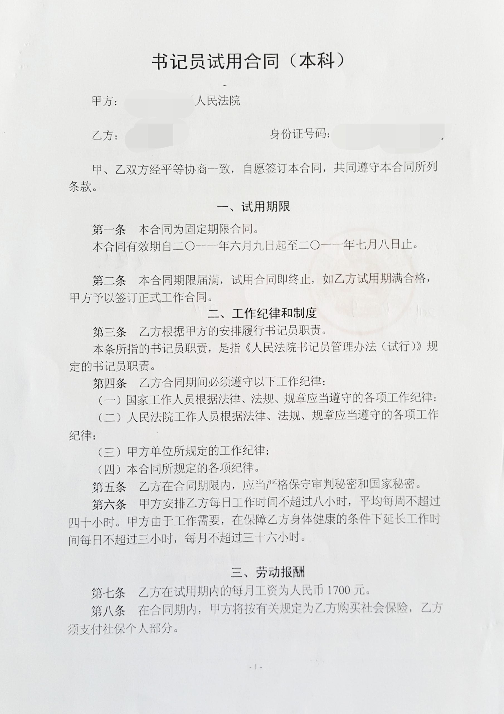
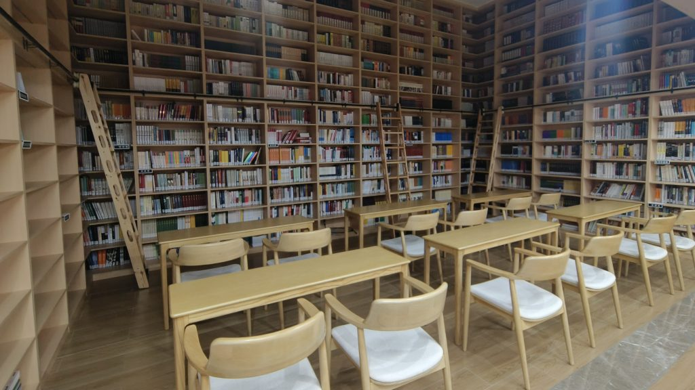
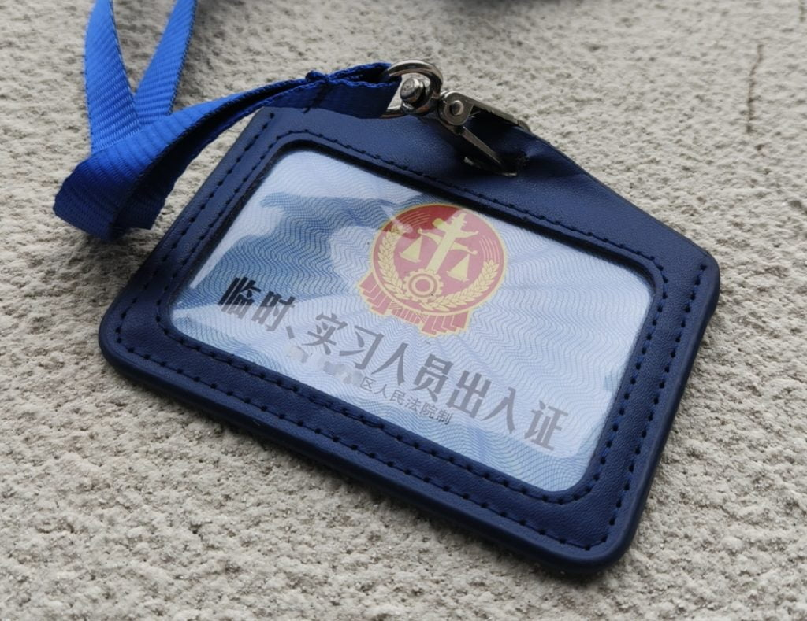

By chance I had an opportunity return to work at the court recently.

Even though it's not a permanent position, but rather a temporary job lasting only a month, it's still a valuable experience.

This is my fourth time working at a court.

- The first time was during my sophomore year of college when I interned at a district court near our university for a month, primarily involved in judgment execution work.

- The second time was during my senior year of college when I chose to intern at another district court near our university for three months, also focusing on judgment execution work.

- In the last month before graduating from college, I started working at a district court in the city where the university is located (the city has a total of five district courts), where I experienced the first part of my career, which lasted about 18 months. The first three months were the most painful period, because my salary was only 1,700 yuan, and I couldn't afford to buy a BlackBerry phone. After that, I passed the exam to become a judicial assistant, although the salary is only about 5,000 yuan, but with other benefits, the total annual income can reach the level of 100,000 yuan.During this time, because of the nature of being an assistant, I did not need to compete with other colleagues in my work, but only needed to complete my own work tasks, so I had a very happy time for more than a year, and it also made me deeply love court work. This period of my career at the Court was also the happiest period of my work and life in all these years.

<figure>

<figcaption>

This is my work contract from 2011 when I worked at the court. 

</figcaption>

</figure>

Since it has been eleven years since I last worked at the court, returning this time felt very familiar and nostalgic. For example, due to the confidentiality requirements of many court tasks, the court utilizes a dedicated internal network. As soon as I arrived at the court this time, I immediately found the internal website I used during my previous work at the court and was pleasantly surprised to discover an electronic magazine that I had edited back then. However, this is the only trace I could find of my past work at that court.

<figure>

<figcaption>

The electronic magazine that I edited while working at another court in 2012.

</figcaption>

</figure>

It's been quite eventful in the eleven years since I left the court in 2012. Returning to the court has allowed me to see many issues that I wasn't aware of before. There are significant differences between the court I had in mind and the reality I encountered, mainly in a few aspects:

1. The court work environment tends to be more isolated. Due to the relatively independent nature of court work, court personnel often have limited interactions with other government departments and members of society. Their perspectives and problem-solving approaches may differ from those of the general public, leading to a certain degree of social functioning deficit. For example, during this experience, we discovered that some judges were sued by their neighbors due to their inability to handle neighborhood disputes effectively. Others lacked social experience when dealing with simple litigation cases arising from family, school, or workplace conflicts due to their limited participation in social activities. Additionally, some young judges, who assumed judicial roles in their early twenties, lacked personal experience in relationships, marriage, and divorce but had to mediate divorce cases for others, resulting in complaints from the parties involved.

3. There is a higher proportion of women working in the courts. In China, due to law being categorized as a humanities discipline, there tend to be more female students studying law, while male students mostly choose science and engineering majors. As a result, there is a higher proportion of women working in the courts. In the four courts I have experienced, the proportion of female staff is generally above 60%. In the court I recently visited, among employees born after 1980, approximately 70% are women. It's commonly believed that women are more inclined towards sensitivity in terms of personality, while men lean towards rationality. However, law itself leans towards rationality.

5. The rapid growth of litigation cases in the courts is indeed a concerning trend. The current efficiency of the courts, with an average case processing time of 60 days for civil cases and 20 days for criminal cases, has contributed to this increase. Additionally, the low cost of litigation, where most cases are charged at 1% of the claim amount and many cases don't require hiring a lawyer, has made the process more accessible to individuals. It has become as simple as submitting pre-litigation documents and evidence to the court, akin to applying for a visa.These convenient conditions have led to a significant surge in litigation cases in the past decade. In my city, for example, there has been an average of one litigation case for every 30 people annually. It seems that citizens' initial inclination when encountering disputes is to file a lawsuit in court.While the accessibility and efficiency of the court system are positive aspects, the rapid growth of litigation cases also highlights the importance of alternative dispute resolution methods. Encouraging mediation and other forms of dispute resolution can help alleviate the burden on the courts and provide more flexible and tailored solutions for the parties involved.

7. The Chinese courts have implemented numerous performance indicators. Prior to the year 2000, there were significant incidents of wrongful convictions and miscarriages of justice in Chinese courts, which had a profound negative impact. In the past decade or so, the higher courts have introduced a myriad of performance indicators to ensure the fairness of judgments and balance the judicial process. However, this has also led to a phenomenon where judges prioritize meeting these indicators above all else during case proceedings.For example, in order to curb the rapid growth of litigation cases, the Supreme People's Court set a target of reducing the number of cases by 5% this year. As a result, many courts have established thresholds at the filing stage, requiring most cases to undergo mediation by judges before proceeding to litigation. If successful, the cases can be resolved without going to trial. However, in reality, the workload of judges has not decreased. On the contrary, the difficulty of mediating many cases has resulted in a significant waste of time.

<figure>

<figcaption>

View from the court's office

</figcaption>

</figure>

Overall, the court is still a highly desirable place of employment. The working atmosphere is harmonious, and the infrastructure and office environment are excellent. However, all of this will come to an end as my current assignment concludes. Fortunately, I will be starting a new job at a different prosecutor's office next month. In China, the courts and prosecutor's offices are relatively independent departments, and they share many similarities.

<figure>

<figcaption>

The library in the Court.

</figcaption>

</figure>

<figure>

<figcaption>

The identification card I used while working at the court.

</figcaption>

</figure>
