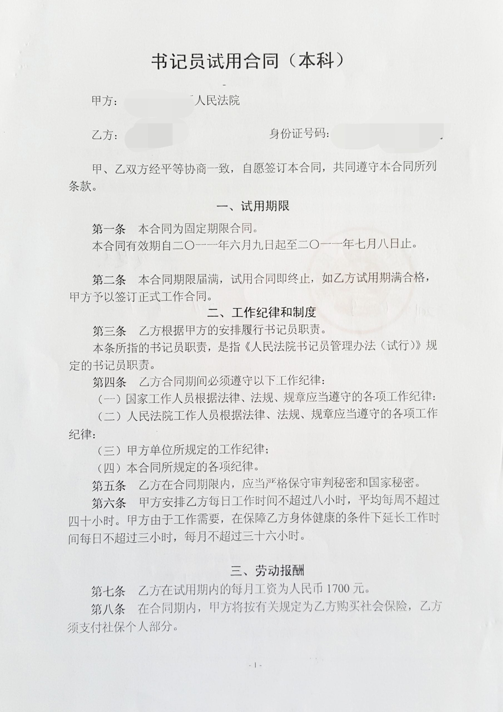
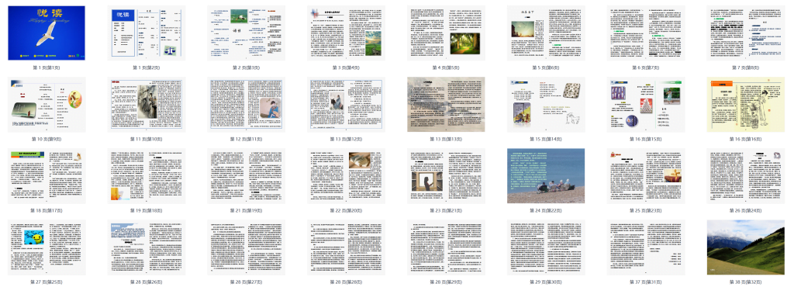
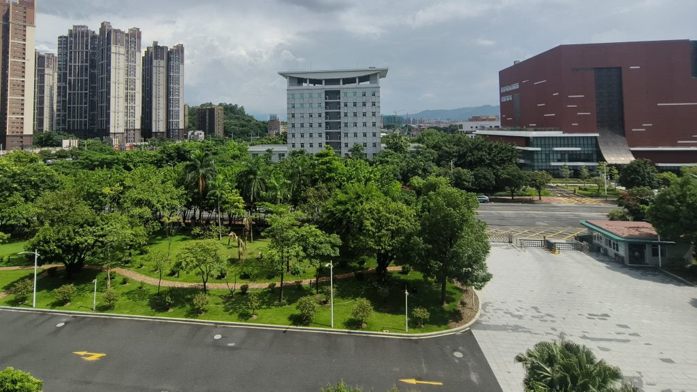
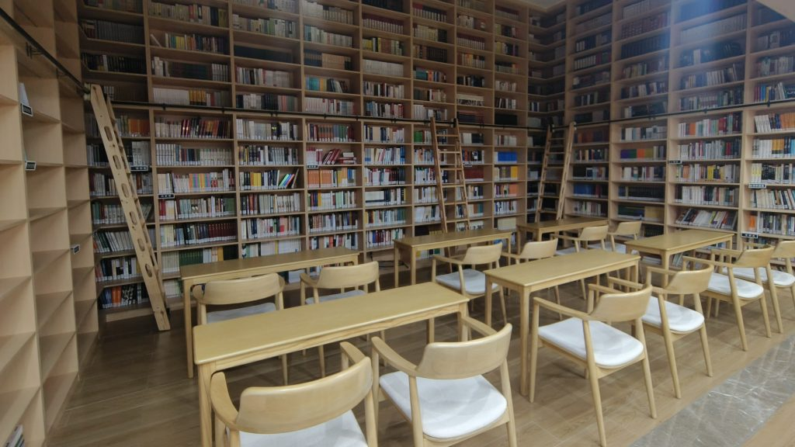
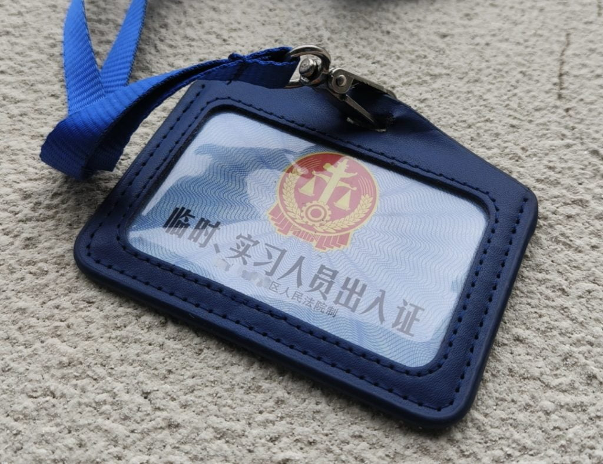

最近，我偶然得到了一个机会，可以再次回到法院工作。

虽然不是正式职位，而是一个只持续一个月的临时工作，但这仍然是一次宝贵的经历。

## 第四次在法院工作

- 第一次是在我大学二年级的时候，我在我们大学附近的一个地方法院实习了一个月，主要参与判决执行工作。

- 第二次是在我大学四年级的时候，我选择在我们大学附近的另一个地方法院实习了三个月，同样专注于判决执行工作。

- 在大学毕业前的最后一个月，我开始在我们大学所在城市的地方法院工作（该市总共有五个地方法院），在那里我经历了职业生涯的第一部分，持续了大约18个月。最初的三个月是最痛苦的时期，因为我的工资只有1700元，买不起黑莓手机。之后，我通过了考试成为一名司法助理，虽然工资只有大约5000元，但加上其他福利，年总收入可以达到10万元的水平。在这段时间里，由于助理的性质，我不需要与同事竞争工作，只需要完成自己的工作任务，所以我度过了一年多的非常快乐的时光，也让我深深爱上了法院工作。这段职业生涯也是我这些年工作和生活中最快乐的时期。

这是我2011年在法院工作时的合同。

---

## 工作感想

自从我上次在法院工作已经过去了十一年，这次回来感觉非常熟悉和怀旧。例如，由于许多法院任务的保密要求，法院使用专门的内部网络。这次一到法院，我立刻找到了我之前在法院工作时使用的内部网站，并惊喜地发现了我当时编辑的电子杂志。然而，这是我能在那个法院找到的关于我过去工作的唯一痕迹。

这是我2012年在另一个法院工作时编辑的电子杂志，当时我还写过一篇文章记录编辑过程。[《悦读》第一期](https://hyruo.com/article/2012-09-12-happy-reading/)

自从2012年离开法院以来的十一年里，发生了很多事情。回到法院让我看到了以前没有意识到的问题。我心中的法院与我所遇到的现实之间存在显著差异，主要体现在几个方面：

1. 法院的工作环境往往更加独立。由于法院工作的相对独立性，法院人员与其他政府部门和社会成员的互动有限。他们的观点和解决问题的方法可能与公众不同，导致一定程度的社会功能缺陷。例如，在这次经历中，我们发现一些法官因为无法有效处理邻里纠纷而被邻居起诉。其他人在处理家庭、学校或工作场所冲突引起的简单诉讼案件时缺乏社会经验，因为他们参与社会活动有限。此外，一些年轻法官在二十出头时就担任司法职务，缺乏个人在关系、婚姻和离婚方面的经验，但却不得不为他人调解离婚案件，导致当事人投诉。

2. 法院工作人员中女性比例较高。在中国，由于法律被归类为人文学科，学习法律的女学生往往较多，而男学生大多选择理工科专业。因此，法院工作人员中女性比例较高。在我经历的四个法院中，女性员工的比例一般都在60%以上。在我最近访问的法院中，1980年后出生的员工中，大约70%是女性。人们普遍认为，女性在性格上更倾向于敏感，而男性则倾向于理性。然而，法律本身倾向于理性。

3. 法院诉讼案件的快速增长确实是一个令人担忧的趋势。目前法院的效率，民事案件平均处理时间为60天，刑事案件为20天，促成了这一增长。此外，诉讼成本低，大多数案件按索赔金额的1%收费，许多案件不需要聘请律师，使得诉讼过程对个人更加可及。提交诉讼前文件和证据给法院变得像申请签证一样简单。这些便利条件在过去十年中导致了诉讼案件的显著激增。例如，在我所在的城市，每年平均每30人就有一件诉讼案件。似乎公民在遇到纠纷时的初步倾向是在法院提起诉讼。虽然法院系统的可及性和效率是积极方面，但诉讼案件的快速增长也突显了替代纠纷解决方法的重要性。鼓励调解和其他形式的纠纷解决可以帮助减轻法院的负担，并为当事人提供更灵活和量身定制的解决方案。

4. 中国法院实施了许多绩效指标。在2000年之前，中国法院发生了许多冤假错案，产生了深远的负面影响。在过去十年左右的时间里，高级法院引入了大量的绩效指标，以确保判决的公正性和司法过程的平衡。然而，这也导致了一个现象，即法官在案件审理过程中优先考虑满足这些指标。例如，为了遏制诉讼案件的快速增长，最高人民法院设定了今年减少案件数量5%的目标。因此，许多法院在立案阶段设立了门槛，要求大多数案件在进入诉讼前由法官进行调解。如果成功，案件可以在不进行审判的情况下解决。然而，在现实中，法官的工作量并没有减少。相反，调解许多案件的难度导致了大量时间的浪费。

法院办公室的视角

总的来说，法院仍然是一个非常理想的工作场所。工作氛围和谐，基础设施和办公环境都很优秀。然而，随着我目前的任务结束，这一切都将结束。幸运的是，我下个月将在另一个检察官办公室开始一份新工作。在中国，法院和检察官办公室是相对独立的部门，它们有许多相似之处。

法院的图书馆。

我在法院工作时使用的工作证。

