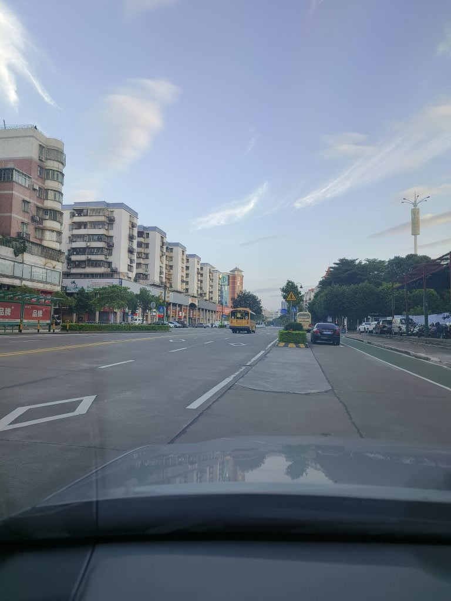

Last night, when I went to pick up Hehe from school, I was a few minutes late. She had a displeased expression on her face and complained that the other classmates had already left on the school bus. She asked why I was late and requested to take the school bus instead. On the way back home, I also thought about it. I have to make four trips to school every day, which adds up to 80 kilometers. If we calculate for a semester of 100 days, it would be 8000 kilometers. Considering the current price of gasoline, the fuel expenses alone for this semester would amount to 5000 yuan. So, I reluctantly agreed to her suggestion of taking the school bus. Later, I realized that the cost of the school bus was also not cheap, amounting to 2500 yuan per semester.
