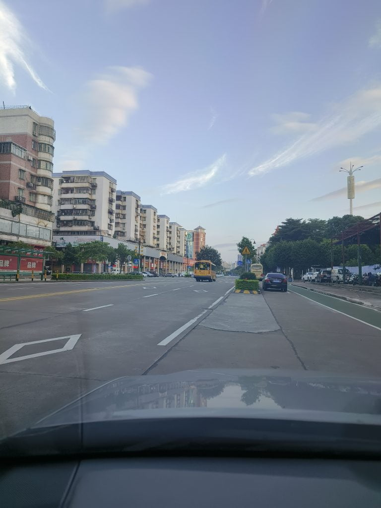

昨晚，当我去学校接女儿时，迟到了几分钟。她脸上带着不悦的表情，抱怨说其他同学都已经坐校车离开了。她问我为什么迟到，并要求以后坐校车。在回家的路上，我也考虑了这个问题。我每天要往返学校四次，总共80公里。如果按一个学期100天计算，那就是8000公里。考虑到目前汽油的价格，这个学期的油费就要5000元。因此，我勉强同意了她的建议，让她坐校车。后来，我才意识到校车的费用也不便宜，一个学期也要2500元。