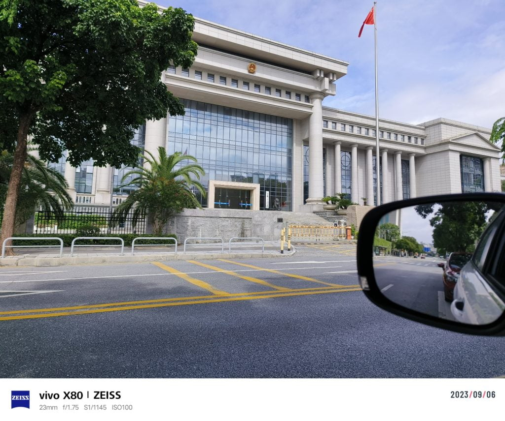

Recently, I was very honored to go to the procuratorate of a city as the leader of a working group to carry out a special work.

Our working group consists of 15 people, including senior judges, prosecutors and legal professionals. The main task of the working group is to conduct a comprehensive inspection and evaluation of criminal justice cases handled by courts, procuratorates and public security bureaus throughout the city last year, as well as administrative law enforcement cases handled by government administrative departments such as the Natural Resources Bureau, the Ecology and Environment Bureau, and the Health Bureau.

This is my first time working in the procuratorate, and I am deeply impressed by the good working atmosphere and advanced office facilities.

<figure>

<figcaption>

The Procuratorate

</figcaption>

</figure>

According to the Constitution of the People's Republic of China, the main duties of the procuratorate are to supervise the implementation of laws, including civil, criminal and administrative proceedings, and have the same status as courts in state institutions. At the same time, the procuratorate is also one of the main participants in criminal proceedings, responsible for supervising the criminal filing and investigation work of the public security organs, prosecuting criminal cases on behalf of the state, supervising the criminal trial work of the courts, and proposing public interest litigation on behalf of the state.

  
In the 2018 reform of state institutions, the functions of the procuratorate were somewhat weakened. After 2018, most of the investigation responsibilities for job-related crimes were transferred to the National Supervision Commission, and the procuratorate only retained the investigation duties for job-related crimes committed by judicial personnel.

  
In general, I feel that the procuratorate is a very serious office space, all prosecutors are very smart and intelligent, they are very rigorous and serious in their work, and they are very well managed on many details, otherwise it is difficult to win in the lawyer's nitpicky defense. During this inspection, we saw that most of the criminal cases charged by the procuratorate, including the charges, criminal facts and sentencing recommendations, can be accepted by the court, and more than 80% of criminal suspects can actively admit guilt. The vast majority of criminal cases with unclear facts and insufficient evidence have been rejected by the procuratorate and cannot enter the court trial stage; In a small number of cases, after the prosecution is instituted and before the court begins, because the lawyer discovers that there are obvious problems in the case, the procuratorate will also withdraw the prosecution or modify the prosecution. In the end, less than 10 percent of the verdicts in cases are inconsistent with the content of the procuratorate's prosecution, and once such a case occurs, the procuratorate has special departments and personnel to study these problems, and through repeated study and discussion, try to avoid the continuation of such problems.

  
  
Becoming a judge or prosecutor is a dream that all of us legal professionals have, but because of the nature of my current job, this idea may never come.I have to say this is a regret.

