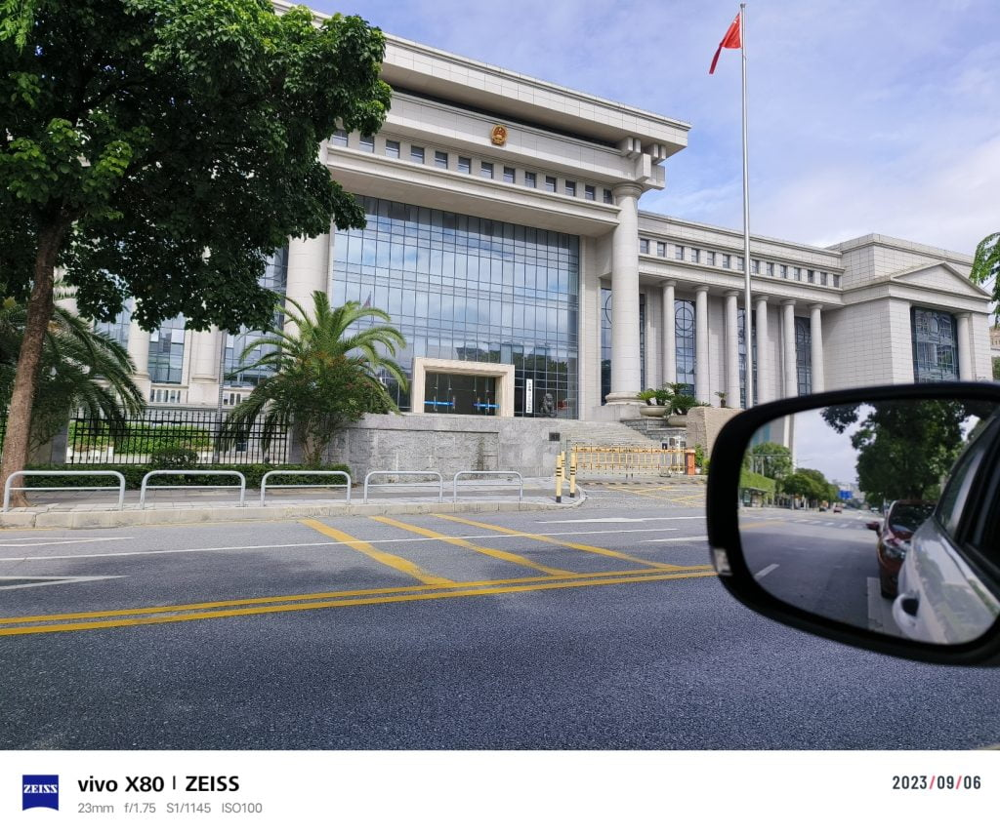
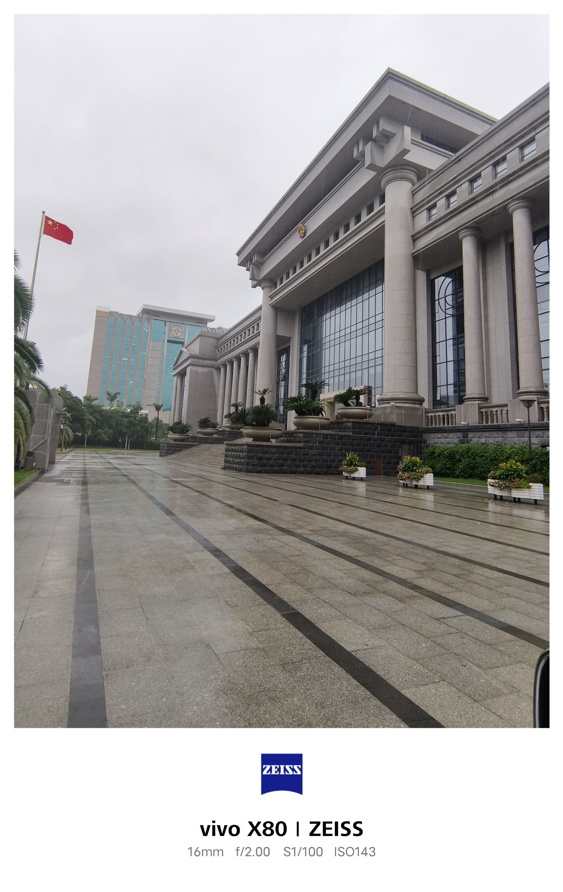

近日，我非常荣幸地作为工作组组长，前往某市检察院开展专项工作。

我们工作组由15人组成，包括资深法官、检察官和法律专业人士。工作组的主要任务是对该市去年法院、检察院和公安局处理的刑事司法案件，以及自然资源局、生态环境局、卫生局等政府行政部门处理的行政执法案件进行全面检查和评估。

这是我第一次在检察院工作，良好的工作氛围和先进的办公设施给我留下了深刻的印象。

检察院

根据中华人民共和国宪法，检察院的主要职责是监督法律的实施，包括民事、刑事和行政诉讼，在国家机构中与法院具有同等地位。同时，检察院也是刑事诉讼的主要参与者之一，负责监督公安机关的刑事立案和侦查工作，代表国家提起刑事案件公诉，监督法院的刑事审判工作，并代表国家提起公益诉讼。

在2018年国家机构改革中，检察院的职能有所弱化。2018年后，大部分职务犯罪侦查职责移交给国家监察委员会，检察院仅保留司法人员职务犯罪的侦查职责。

总的来说，我觉得检察院是一个非常严肃的办公空间，所有检察官都非常聪明和智慧，他们在工作中非常严谨认真，在许多细节上管理得非常好，否则很难在律师的吹毛求疵的辩护中取胜。在这次检查中，我们看到检察院提起公诉的大多数刑事案件，包括指控、犯罪事实和量刑建议，都能被法院接受，超过80%的犯罪嫌疑人能积极认罪。绝大多数事实不清、证据不足的刑事案件已被检察院驳回，不能进入法院审判阶段；在少数案件中，在提起公诉后、法院开庭前，因为律师发现案件中存在明显问题，检察院也会撤回起诉或修改起诉。最终，不到10%的案件判决结果与检察院的起诉内容不一致，一旦出现此类案件，检察院有专门的部门和人员研究这些问题，并通过反复研究和讨论，尽量避免此类问题的延续。

成为法官或检察官是我们所有法律专业人士的梦想之一，但由于我目前工作的性质，这个想法可能永远不会实现。不得不说这是一个遗憾。

