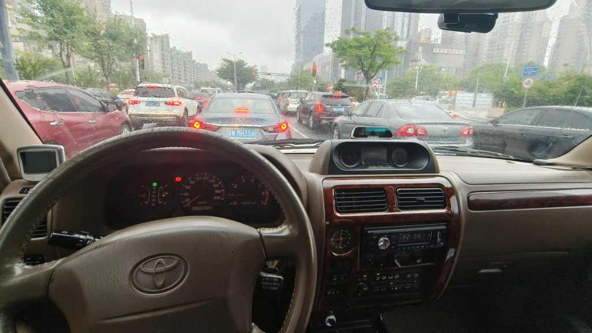

Recently, I have been commuting to a prosecutor's office that is 40 kilometers away. Initially, I planned to drive my own car, but then I discovered that the office had an unused official vehicle, so I applied to use it for work purposes. It's an old car, over 20 years old, a 1997 Toyota Land Cruiser with a 2.7L V6 engine and AT tires. It's the type of car that makes all sorts of noises except for the horn. Since driving became quite monotonous, I ended up bringing a Bose Bluetooth portable speaker and connected it to my phone to play music. Surprisingly, the overall effect was pretty good. It turns out that as long as the speaker volume is loud, road noise, wind noise, and various interior noises are not a problem.

<figure>

<figcaption>

Toyota land cruiser 1997

</figcaption>

</figure>

<figure>

<figcaption>

Bose soundlink mini

</figcaption>

</figure>
