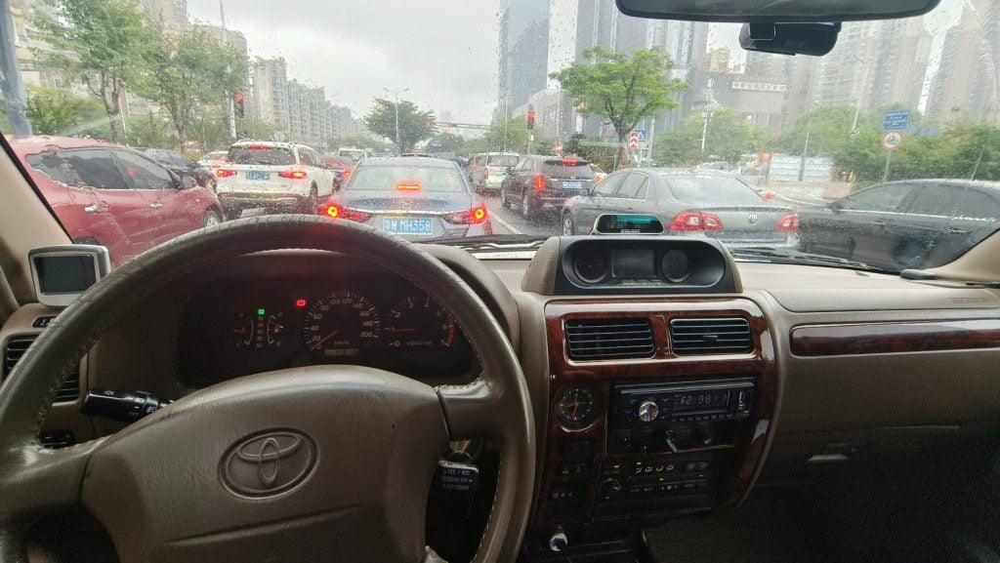
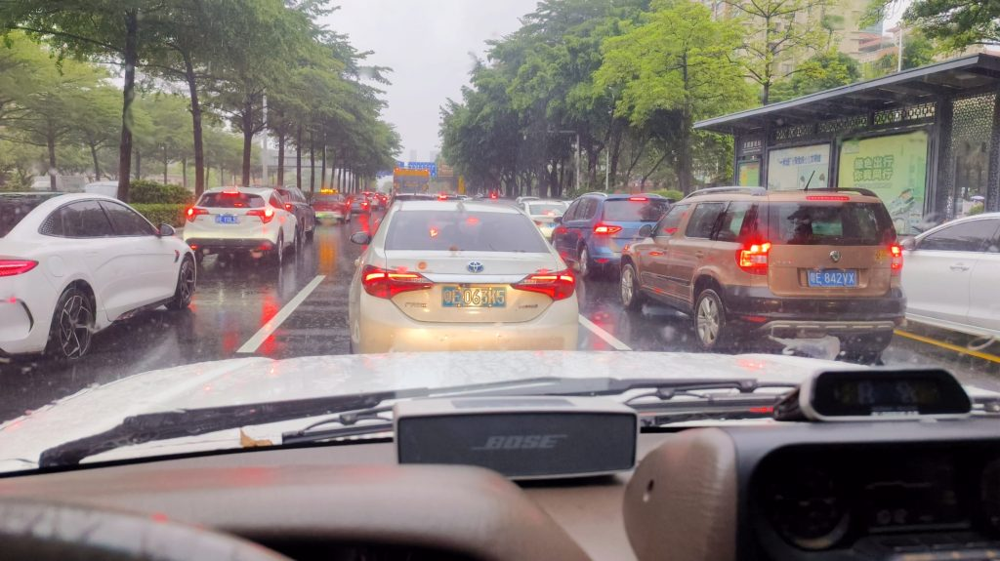

最近，我一直在往返于一个距离40公里的检察院上班。起初，我打算开自己的车，但后来我发现办公室有一辆闲置的公务车，于是我申请将其用于工作。这是一辆老旧的车，超过20年历史，是一辆1997年的丰田陆地巡洋舰，搭载2.7升V6发动机和自动变速器轮胎。这辆车除了喇叭不响，其他地方都响。由于开车变得相当单调，我最终带了一个Bose蓝牙便携式扬声器，并将其连接到我的手机上播放音乐。令人惊讶的是，整体效果相当不错。事实证明，只要扬声器音量足够大，路噪、风噪和各种内部噪音都不是问题。

<figure>

<figcaption>

Toyota land cruiser 1997

</figcaption>

</figure>

<figure>

<figcaption>

Bose soundlink mini

</figcaption>

</figure>