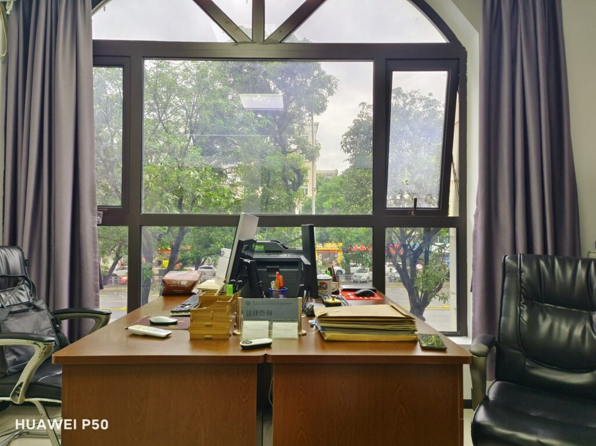
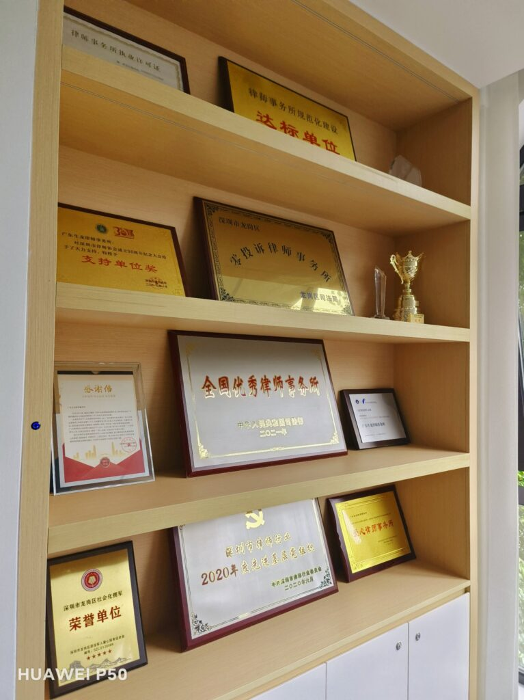
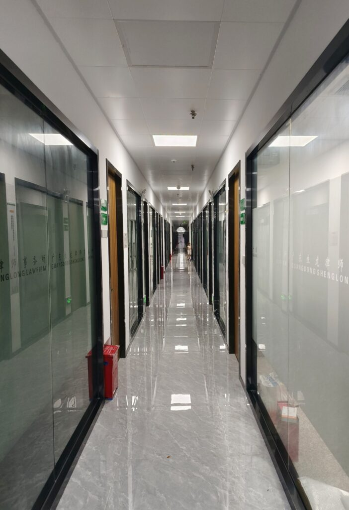

  
Due to the COVID-19 pandemic, I haven't had much contact with many friends from out of town in recent years. Taking advantage of the weekend, I visited two college classmates who are lawyers in Shenzhen.

<!--more-->

<figure>

<figcaption>

One of lawyer's office

</figcaption>

</figure>

  
  
In China, graduates with a major in law have several main employment channels, including courts, procuratorates, administrative law enforcement agencies, and law firms. Among them, law firms are usually the most popular choice of employment because they do not require participation in the highly challenging civil service examination. In our class, out of 40 classmates, seven of them joined law firms after graduation. However, two of them later switched to government legal departments, and now there are five remaining.  

  
Being a lawyer is a rapidly growing profession that demands high individual capabilities. Of my two classmates who are lawyers in Shenzhen, one became a partner in a small law firm due to obtaining the lawyer's practicing certificate early. Currently, the law firm has around ten lawyers. The other classmate joined a very large law firm, which was recognized as an excellent law firm nationwide in 2021. It has approximately 100 lawyers.

<figure>

<figcaption>

This is a larger firm

</figcaption>

</figure>

During the communication with my two classmates, I had three main thoughts:

1. In the current year of 2023, the legal profession still generally relies on personal family background. If individuals have good social connections and a certain amount of capital accumulation, pursuing a career in law can be relatively smooth. However, if personal family conditions are difficult, it is very challenging to establish oneself as a lawyer in a major city. It requires several times more effort than others to have a chance of achieving some degree of success.

3. The legal industry in China is undergoing a significant transformation. The traditional model where individual lawyers take on cases as independent agents (essentially being their own bosses) is being squeezed by the "salary system" employed by large law firms. In this model, lawyers work as employees of the law firm and receive relatively fixed compensation. Currently, the largest law firm in China has 15,000 lawyers, and even smaller law firms are actively expanding and moving towards corporate operation models. Most young lawyers work for senior lawyers.

5. The legal profession in large cities has become highly competitive. For example, in the city of Shenzhen where these two classmates are located, there are already over 20,000 lawyers, with a ratio of 1 lawyer per 1,000 residents, similar to the situation in the UK. Due to the relatively low litigation costs in China, a large portion of civil litigation cases do not require the involvement of lawyers. In criminal cases, if the defendant cannot afford a lawyer, the government will provide a designated lawyer for free defense. This significantly suppresses the demand for legal services. As a result, the income of lawyers in China cannot be compared to countries like the UK and the US. With more people in the profession, the share of the income pie for each individual becomes smaller.
