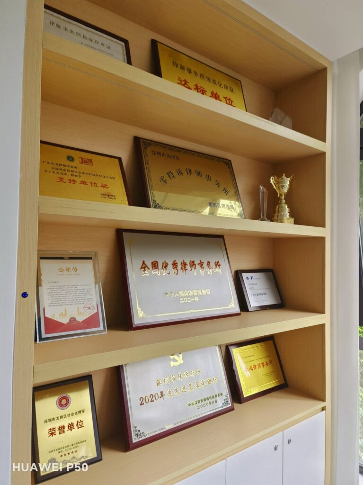

由于COVID-19大流行，近年来我与许多外地的朋友接触不多。趁着周末，我拜访了两位在深圳做律师的大学同学。

<figure>

<figcaption>

One of lawyer's office

</figcaption>

</figure>

  
  
在中国，法律专业毕业生的主要就业渠道包括法院、检察院、行政执法机构和律师事务所。其中，律师事务所通常是最受欢迎的就业选择，因为它们不需要参加极具挑战性的公务员考试。在我们班上，40名同学中有7人在毕业后加入了律师事务所。然而，其中两人后来转到了政府的法律部门，现在只剩下5人。

  
律师是一个快速发展的职业，要求个人能力很高。我的两位在深圳做律师的同学中，有一位因为早早获得了律师执业证书，成为了一家小型律师事务所的合伙人。目前，这家律师事务所有大约十名律师。另一位同学加入了一家非常大的律师事务所，该所在2021年被认定为全国优秀律师事务所，拥有大约100名律师。

<figure>

<figcaption>

This is a larger firm

</figcaption>

</figure>

在与两位同学交流的过程中，我有三个主要想法：

1. 在2023年的今天，法律职业仍然普遍依赖个人的家庭背景。如果个人有良好的社会关系和一定的资本积累，从事法律职业可以相对顺利。然而，如果个人家庭条件困难，在大城市成为一名律师非常具有挑战性。这需要比别人多几倍的努力，才有机会取得一定的成功。

3. 中国的法律行业正在经历重大转型。传统模式下，律师作为独立代理人接案（基本上是自己当老板）的模式，正被大型律师事务所采用的“薪资制度”所挤压。在这种模式下，律师作为律师事务所的员工，获得相对固定的报酬。目前，中国最大的律师事务所有15,000名律师，即使是较小的律师事务所也在积极扩张，并向公司化运营模式转变。大多数年轻律师为资深律师工作。

5. 大城市的法律职业竞争非常激烈。例如，我的两位同学所在的深圳市，已经有超过20,000名律师，每1000名居民中就有1名律师，与英国的情况相似。由于中国诉讼成本相对较低，很大一部分民事案件不需要律师的参与。在刑事案件中，如果被告负担不起律师费用，政府将提供指定律师进行免费辩护。这大大抑制了对法律服务的需求。因此，中国律师的收入无法与英国和美国等国家相比。随着从业人数的增加，每个人分得的收入份额变得更小。

