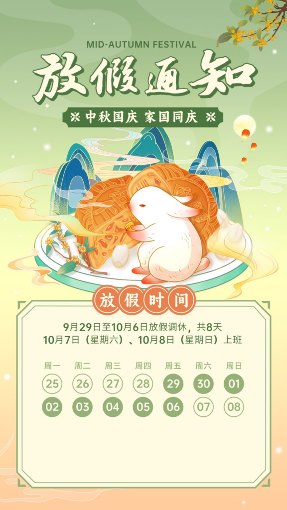

  
In two days, we will soon have the Mid-Autumn Festival and National Day holiday, which totals 8 days. Today, I heard in an internal meeting that government departments predict that this holiday will be much livelier than previous years, and the number of people traveling may increase by more than 20% compared to 2019 before the COVID-19 pandemic. So, I want to take this opportunity to assess how many holidays I currently have.  
  
    1.Annual Leave: 10 days  
    I have been working for over 12 years now, and according to the regulations, after working for 10 years, I am entitled to 10 days of annual leave, and after 20 years, it increases to 15 days.  
  
    2.Home Leave: 5 days  
    Since my mother lives in the countryside, which is over 800 kilometers away from my current workplace, I can have a home leave every four years to visit her, and the duration is 20 days. On average, it's five days per year.  
  
   3. Care Leave: 5 days  
    As an only child, I have five days of care leave each year to take care of the elderly at home. If my parents are hospitalized, this leave can be extended to 15 days.  
  
    4.Statutory Holidays: 11 days  
    Currently, China has 11 statutory holidays.  
  
    5.Weekends: 104 days off  
    Saturdays and Sundays make up 104 days off.  
  
In total, I have 135 days of leave, which accounts for 37% of the year, and the number of working days per year is 230.

  
  
There are also other types of leave, such as maternity leave, marriage leave, childcare leave, bereavement leave, sick leave, personal leave, and so on, but currently, I am unable to enjoy most of these leaves. For example, parents are entitled to an additional ten days of childcare leave each year until their child turns three, but my child is already five years old.  
  
It's important to note that many of these leaves are only available to those working in government departments or state-owned enterprises. Employees in private or foreign-owned enterprises may have different vacation policies. Especially in some small private companies, it's difficult for employees to have their leave effectively guaranteed. For instance, many small companies adopt a working pattern of 12 hours a day and six days a week. Apart from the eleven statutory holidays mandated by the government, it's difficult to enjoy other personal leaves.  
  
Overall, as China is still the world's largest developing country, there is still a significant gap in terms of workers' holiday protection compared to developed countries in Europe and America. However, this issue has gained widespread attention from the government and society, and I believe there should be significant improvements in the future.

