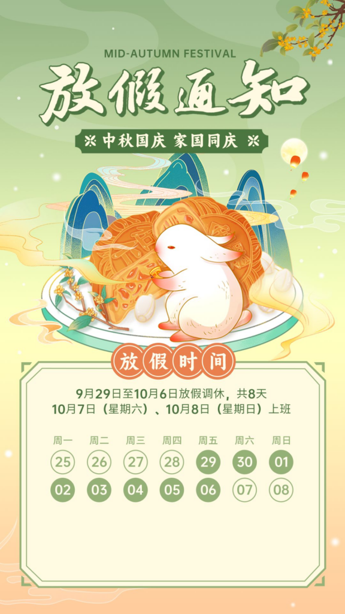

再过两天，我们将迎来中秋节和国庆节的假期，总共8天。今天，我在一个内部会议上听说，政府部门预测这个假期将比往年更加热闹，出行人数可能会比2019年新冠疫情前增加超过20%。因此，我想借此机会评估一下我目前有多少假期。

## 主要假期情况

### 年假：10天
我已经工作超过12年了，根据规定，工作满10年后，我有权享受10天的年假，工作满20年后，年假增加到15天。

### 探亲假：5天
由于我母亲住在农村，距离我目前的工作地点超过800公里，我每四年可以有一次探亲假去探望她，假期时长为20天。平均每年是5天。

### 护理假：5天
作为独生子女，我每年有5天的护理假来照顾家中的老人。如果我的父母住院，这个假期可以延长到15天。

### 法定假日：11天
目前，中国有11个法定假日。

### 周末：104天休息
周六和周日构成了104天的休息日。

总计，我有135天的假期，占全年的37%，每年工作日的数量是230天。

  
## 其他假期  
  
还有其他类型的假期，如产假、婚假、育儿假、丧假、病假、个人假等等，但目前我无法享受大部分这些假期。例如，父母在孩子三岁前每年有权享受额外的十天育儿假，但我的孩子已经五岁了。

需要注意的是，许多这些假期只适用于在政府部门或国有企业工作的人。私营或外资企业的员工可能有不同的休假政策。特别是在一些小型的私营公司，员工的休假很难得到有效保障。例如，许多小公司采用每天工作12小时，每周工作6天的工作模式。除了政府规定的十一个法定假日外，很难享受其他个人假期。

总的来说，由于中国仍然是世界上最大的发展中国家，与欧美发达国家相比，在工人假期保护方面仍有很大差距。然而，这个问题已经引起了政府和社会的广泛关注，我相信未来会有显著的改善。

