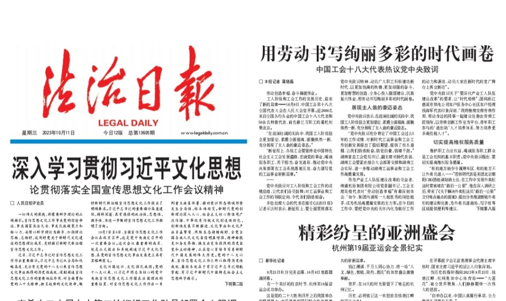
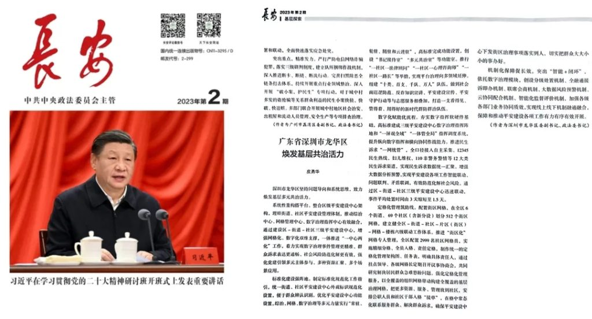
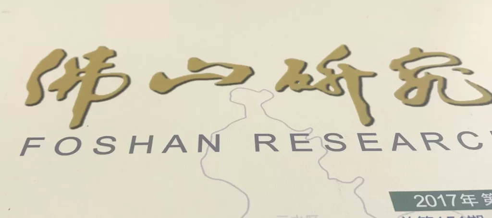
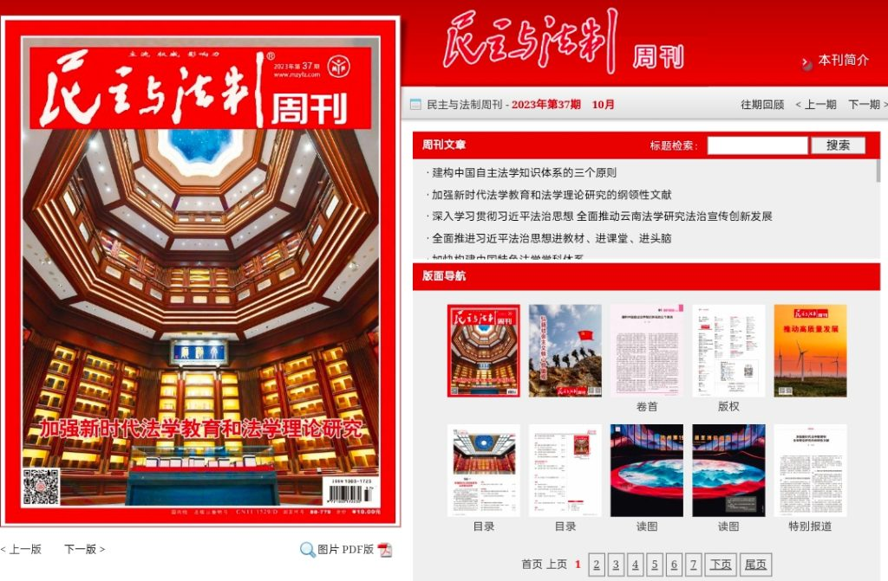

This is my first time having an article published in the "Legal Daily." The "Legal Daily" is the most important mainstream media in the field of democratic rule of law in China. It is the largest legal information provider and the most influential professional legal media group in China. It was renamed from the "Legal System Daily" in 2020. Being able to have an article published in this newspaper can be considered a fortunate coincidence and a very rare opportunity.

Since I started working, I have published many articles in various newspapers and magazines, including the "Changan" magazine of the Central Political and Legal Affairs Commission, the "Democracy and Rule of Law" weekly of the China Law Society, the "Democracy and Rule of Law" newspaper, the "Southern Daily" and "Southern Rule of Law Report" in Guangdong Province, as well as our local "Foshan Daily" and various internal publications. Today, while chatting with a friend on WeChat, I talked about my past experience in writing, and I realized that writing is not as difficult as I thought.

<figure>

<figcaption>

Legal Daily

</figcaption>

</figure>

Before entering my current position in August 2014, I had never published any articles in mainstream media. Many of the work summaries and materials in my previous job were simply copied from colleagues' work reports found on search engines, with slight modifications to complete the tasks. At that time, I had no concept of writing formal and serious articles.

According to the writing standards of government documents, we need to write in Microsoft Office or WPS Office using A4 paper format, and there are strict formatting requirements. For example, the margins should be 3.7 cm at the top, 3.5 cm at the bottom, 2.8 cm on the left, and 2.6 cm on the right. The title of the article must be written in the second font size using the FangZheng XiaoBiao Song font. The content of the article must use the third font size with the FangZheng FangSong-GB2312 font. The first-level headings must use the third font size in bold, and the second-level headings must use the third font size in bold with the Kai font. There are also specific requirements for line spacing and paragraphs, including the maximum number of characters per line.

<figure>

<figcaption>

Chang'an Magazine

</figcaption>

</figure>

However, when I started writing, I didn't know all of this. I was used to using code editors like VSCode or Notepad++ for writing, and I saved files in TXT format. I felt that the characters in code editors were smaller, making it easier to read directly on the screen, and I didn't have to worry about text formatting. Additionally, I used the WordPad application in Windows for writing. I still have many RTF files saved on my office computer to this day.  
  
Once the content formatting of the article was adjusted, I used to like saving files in the XPS format in Windows. Many of my colleagues' computers didn't have PDF readers installed at that time, but XPS readers were built-in on Windows and could be opened without the need for additional software.  
  
The first time I published an article in a formal magazine was in September 2014, which was about a month after I started my current position. It was published in an internal publication called "Foshan Research." The file versions that I still have on my computer are in the XPS format that was used back then.

<figure>

<figcaption>

Foshan Research

</figcaption>

</figure>

Within Chinese government agencies, one important factor in evaluating the quality of work is whether it has received positive coverage in mainstream media or has been recommended and reprinted as an exemplary case in internal publications. Therefore, many government departments prioritize hiring staff who are skilled in writing articles. Sometimes, similar to the publication fees required for many academic papers, some government agencies have to allocate specific funds to publish positive articles in mainstream media. However, in all my years of work, I have never had to spend money to publish an article in this way because the department I work for simply does not have that budget.

<figure>

<figcaption>

Democracy and Legal Magazine

</figcaption>

</figure>

To effectively publish articles in mainstream media, here's a summary of my own experience:  
  
1. The first point is to stay up-to-date with current affairs. For example, in 2017, I published an article in "Chang'an" magazine focusing on strengthening the protection of the rights of young people. At that time, there were several severe criminal cases targeting minors in China. I analyzed the causes of those cases and combined them with effective local practices and experiences in protecting minors, providing targeted suggestions and recommendations. After I sent the article to the editor-in-chief's email at the magazine, it was quickly accepted and published.  
  
2. The second point is to maintain a friendly relationship with journalists and editors if you aim to publish articles in a specific publication on an ongoing basis. For instance, over the years, I have maintained a very friendly relationship with the Guangdong Journalist Station of Democracy and Legal News Agency, frequently communicating with them about the current topics they are focusing on. Based on their needs, I see if I can provide relevant news leads and materials. If there is a suitable article, it is usually easier to get it published.  
  
3. The third point is to consider the length of the article before submission and provide appropriate versions accordingly. For example, before publishing an article in the "Legal Daily," I carefully studied the layout and length requirements of the newspaper. Generally, they accept articles of 2500, 1500, 800, or 200 words. Before being sure if the article would be accepted, I prepared four different versions of the article corresponding to these lengths. This way, if the editor decides to use the article, they don't need to make further edits or modifications, saving them time in typesetting. Luckily, they chose the 2500-word version I provided this time.  
  
In conclusion, it is quite fulfilling to publish articles in mainstream media during one's spare time. These articles are usually permanently preserved and can be found in serious academic and journal databases. They are also easily searchable on search engines, leaving a lasting memory for oneself in the future.
