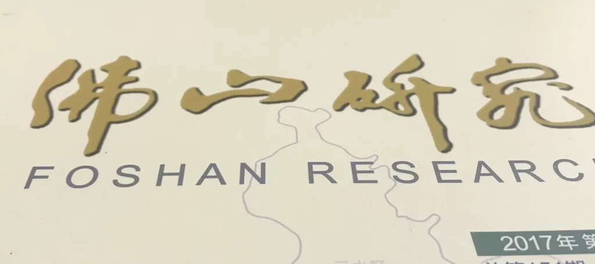

这是我第一次在《法治日报》上发表文章。《法治日报》是国内民主法治领域最重要的主流媒体，是中国最大的法律信息提供者，也是中国最具影响力的专业法律传媒集团，2020年由《法制日报》更名而来。能在该报上发表文章，可以说是一种幸运的巧合，也是一次非常难得的机会。

自从参加工作以来，我在各类报纸杂志上发表过很多文章，包括中央政法委《长安》杂志、中国法学会《民主与法制》周刊、《民主与法制》报、广东省《南方日报》和《南方法治报》，以及我们本地的《佛山日报》和各种内部刊物。今天，在微信上与一位朋友聊天时，谈到了自己过去写作的经历，我意识到写作并没有我想象的那么难。

  

法治日报

在2014年8月进入现职位之前，我从未在主流媒体上发表过任何文章。我之前工作中的许多工作总结和材料，都是简单地从搜索引擎上找到同事的工作报告，稍加修改就完成了任务。那时，我根本没有写正式严肃文章的概念。

根据政府文件的写作标准，我们需要在Microsoft Office或WPS Office中使用A4纸格式进行写作，并且有严格的格式要求。例如，页边距应为上3.7厘米、下3.5厘米、左2.8厘米、右2.6厘米。文章标题必须使用方正小标宋字体第二号字，文章正文必须使用仿宋GB2312字体第三号字。一级标题必须使用黑体第三号字，二级标题必须使用楷体第三号字加粗。行距和段落也有具体要求，包括每行最多字符数。

  
长安杂志

然而，当我开始写作时，我并不知道这一切。我习惯于使用VSCode或Notepad++等代码编辑器进行写作，并将文件保存为TXT格式。我觉得代码编辑器中的字符较小，更容易直接在屏幕上阅读，而且不必担心文本格式。此外，我还使用Windows中的写字板应用程序进行写作。直到今天，我的办公电脑上还保存着许多RTF文件。

一旦调整了文章内容格式，我曾经喜欢在Windows中将文件保存为XPS格式。当时，许多同事的电脑上没有安装PDF阅读器，但Windows内置了XPS阅读器，无需额外软件即可打开。

我第一次在正式杂志上发表文章是在2014年9月，也就是我开始现职位大约一个月后。它发表在一份名为《佛山研究》的内部刊物上。我电脑上仍然保存的文件版本是当时使用的XPS格式。

  
佛山研究

在中国政府机构中，评价工作质量的一个重要因素是它是否在主流媒体上得到了正面报道，或者是否被内部刊物推荐和转载为典型案例。因此，许多政府部门优先招聘擅长写作文章的员工。有时，类似于许多学术论文所需的出版费，一些政府机构不得不拨出特定资金在主流媒体上发表正面文章。然而，在我多年的工作中，我从未以这种方式花钱发表过文章，因为我所在的部门根本没有这笔预算。

  
民主与法制杂志

为了有效地在主流媒体上发表文章，我总结了自己的经验：

- 第一点是关注时事。例如，2017年，我在《长安》杂志上发表了一篇关于加强青少年权益保护的文章。当时，中国发生了几起针对未成年人的严重刑事案件。我分析了这些案件的原因，并结合了当地保护未成年人的有效做法和经验，提供了有针对性的建议和建议。在我将文章发送到杂志主编的电子邮件后，它很快就被接受并发表了。

- 第二点是与记者和编辑保持友好关系，如果你打算在特定出版物上持续发表文章。例如，多年来，我一直与《民主与法制》新闻社广东记者站保持着非常友好的关系，经常与他们就他们关注的当前话题进行沟通。根据他们的需要，我看看是否可以提供相关的新闻线索和材料。如果有合适的文章，通常更容易发表。

- 第三点是在提交文章之前考虑文章的长度，并相应地提供适当的版本。例如，在发表《法治日报》上的文章之前，我仔细研究了报纸的版面和长度要求。一般来说，他们接受2500、1500、800或200字的文章。在确定文章是否会被接受之前，我准备了四个不同长度的文章版本。这样，如果编辑决定使用文章，他们就不需要进一步编辑或修改，节省了排版时间。幸运的是，他们这次选择了我提供的2500字版本。

总之，在业余时间在主流媒体上发表文章是相当充实的。这些文章通常永久保存，可以在严肃的学术和期刊数据库中找到。它们也很容易在搜索引擎上搜索到，为未来留下持久的记忆。