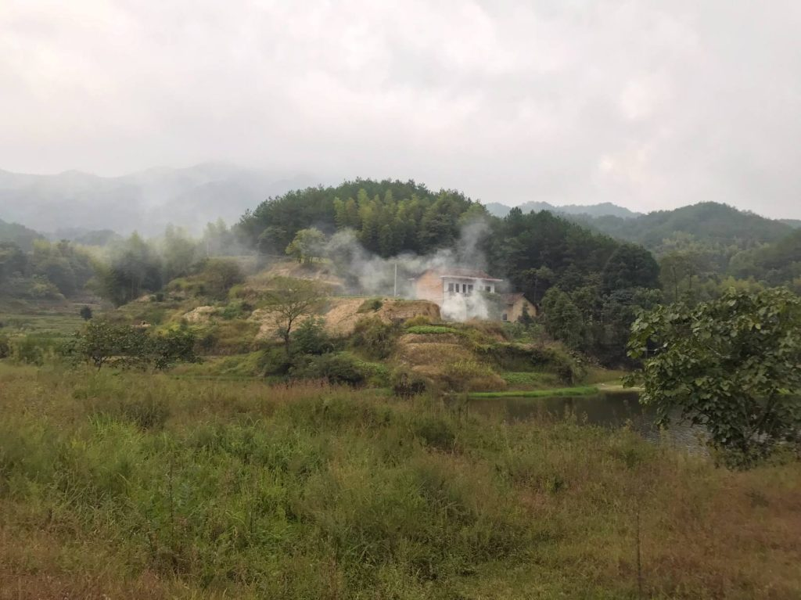

Today is my wife CC's 35th birthday, and in a few months, I will also turn 35. In recent years, the "phenomenon of being 35" has undoubtedly been a very popular topic in China. Taking this opportunity, I would like to briefly share my views on this issue.

I first heard about the "phenomenon of being 35" around 2009. It was during the summer vacation of my college years when I stayed at my cousin's house in Changsha, Hunan. He told me that he was preparing to apply for the Hunan Provincial Civil Service Exam. However, being born in 1980, he was already approaching 30 years old, and if he couldn't pass the exam, he wouldn't have many opportunities to apply because the age limit for the civil service exam was 35 years old and below. I was quite surprised to hear about this.  
  
My cousin had always been a role model for me in terms of academics. Throughout his educational journey, he always excelled. He successfully enrolled at Xiangtan University in 2000 and earned a master's degree in Control Engineering from Wuhan University of Science and Technology in 2004. After graduating in 2007, he joined Sany Heavy Industry, which was the best private company in Hunan Province at that time and also one of the largest construction machinery manufacturing companies globally.

<figure>

<figcaption>

Sany machine

</figcaption>

</figure>

The income my cousin earned at Sany Heavy Industry astonished me. However, he told me that he would rather find a government position with a much lower income than continue working at the company. The reason was that the work pressure at the company was too high, and internal competition was extremely intense. If he couldn't transition from a technical position to a managerial position before the age of 35, there wouldn't be many good career prospects for him. So, he preferred to take a government position as early as possible.  
  
During his application for the government exam, an absurd incident occurred. The online registration system required applicants to submit a personal photo, which had to be one inch in size and with a maximum file size of 30KB. This meant compressing the photo to the extreme, leading to frequent failures in photo submission. The photo would either become too blurry due to excessive compression or fail to meet the size requirements. It took many attempts before he finally succeeded in uploading an appropriate photo.  
  
In the end, my cousin successfully passed the professional technical recruitment exam organized by the Hunan Provincial Bureau of Quality and Technical Supervision in 2009. He was assigned to the Quality and Technical Supervision Bureau in Zhuzhou City. Later on, he also secured a permanent position in this unit and gradually grew into a senior engineer.

<figure>

<figcaption>

Bureau of Quality and Technical Supervision's Work

</figcaption>

</figure>

If my cousin's situation gave me a preliminary understanding of the "phenomenon of being 35," the following case left a deep impression on me.  
  
Since 2014, after I started working, there has been a female colleague in the same office. She was born in 1985 but wasn't good at exams, so she worked in our unit as a temporary employee. (Although she was considered a temporary employee, I have never seen any government department actively dismiss anyone unless they voluntarily resigned.) This female colleague, through arduous efforts, finally passed the civil service exam at the end of 2018 after years of trying. However, to reduce the difficulty, the job she obtained was located in a relatively remote area about 120 kilometers away from our place. By the time she passed the probationary period, she was almost 35 years old, as she had turned 34 when she became a civil servant. According to the government department's internal transfer rules, which also have an age limit of 35 and below, she had almost no chance of returning to work in her hometown. Unless she gave up her civil servant status and resigned to seek another career, but this would be an unwise decision in China, especially for older women.

It is worth mentioning the rules regarding internal job transfers within Chinese government agencies. Before 2021, it was relatively easy for employees in my city to transfer to different positions. Any civil servant within the territory of China, as long as they were below the age of 35 and met the basic requirements in terms of terms of education and specialization for the desired position, theoretically had the opportunity to transfer. Since my city is located in the Guangdong-Hong Kong-Macao Greater Bay Area, with relatively high salaries and good working environments, many local residents who wanted to work in the government sector would usually choose to pass the civil service exam in a less competitive area, such as remote mountainous regions, and then transfer back to the major cities.

However, this indirect approach has become increasingly difficult to achieve since 2021, as the Organization Department of the Communist Party of China Central Committee issued new regulations that have largely closed this loophole.

<figure>

<figcaption>

The new regulations

</figcaption>

</figure>

In recent years, the "phenomenon of being 35" has shifted from an internal government regulation to a misconception that has spread to the societal level, particularly in large IT and internet companies. Many people believe that they may face unemployment once they reach the age of 35. Of course, this may also be related to China's demographic dividend. Some major corporations believe that individuals who have been with the company for a long time are more likely to become complacent and fail to keep up with market changes and technological advancements. On the other hand, young people who continuously flock to major cities in search of job opportunities are seen as more dynamic and driven.

Middle-aged individuals often face challenges in the job market and find it difficult to secure new positions that match their previous jobs in terms of status and benefits. They often have to settle for lower-quality jobs to meet their basic living needs. Many of them experience a strong sense of crisis in their careers and fear unemployment. As a result, they become extremely competitive internally, extending their working hours without limits to demonstrate their loyalty to their work and the value they bring to the company. Even when faced with demanding requirements or tendencies towards abusive behavior from the company or management, they are willing to endure it, as the pressures of life and family force them to compromise their dignity.

<figure>

<figcaption>

extremely competitive internally

</figcaption>

</figure>

In fact, for the majority of society, the age of 35 is considered the golden age for work. People in this age group have matured mentally and have accumulated a great deal of work experience. They possess a strong sense of social responsibility and family responsibility. I also hope that our society can have less age discrimination, so that everyone has a fair opportunity for growth and development.  
  
Our generation has experienced tremendous social changes and carries immense social pressure. When I was a child, my family was very poor. It wasn't until 1998 that we bought our first black and white television. Throughout the 1990s, my parents' annual income was probably less than $300, and we lived in extreme poverty. This was the living situation for the majority of people in my hometown at that time. So personally, I care a lot about the certainty of life. I believe that maintaining a stable job is of utmost importance. The pressures of family and life leave me with limited choices to make mistakes, because one wrong step could lead to continuous and permanent losses for my family and myself. Even though the combined annual income of my wife and me is more than 200 times what my parents used to earn, I still worry about this issue. Of course, this way of thinking may also be a shared sentiment among many Chinese people, otherwise the civil service examination in China would not be so popular.

<figure>

<figcaption>

This is the topography and geomorphology of my hometown village.

</figcaption>

</figure>

I often imagine what kind of life I would have if I hadn't studied hard when I was young and didn't get into university. Or if I hadn't chosen to work in the court and instead continued to seek employment in society, what kind of job status would I be in now? Perhaps I would be running a small company like some of my cousins of the same age, working as a laborer in the manufacturing industry, or doing small business in Southeast Asia or even Africa. Maybe I would be like some of my classmates from college, already a successful lawyer or working as a legal or HR manager in a small or medium-sized enterprise. I might even continue to work in advertising companies or telecommunication enterprises in the field of marketing. But in the end, life has no "what ifs." Since I have chosen the current career path, I can only resolutely continue on this path. This is also the helpless choice of our generation's fate.

<figure>

<figcaption>

This is the lawyer's certificate I obtained after passing the judicial examination in 2013.

</figcaption>

</figure>

<figure>

<figcaption>

This is the class photo of my middle school graduation in 2003.

</figcaption>

</figure>
