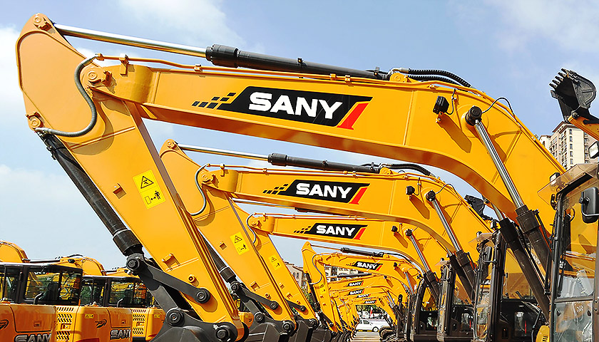
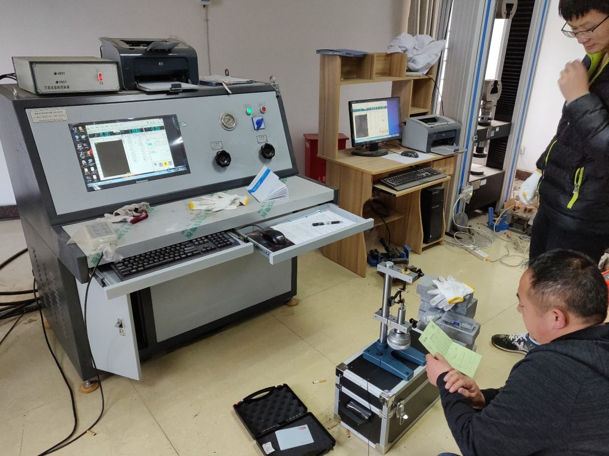
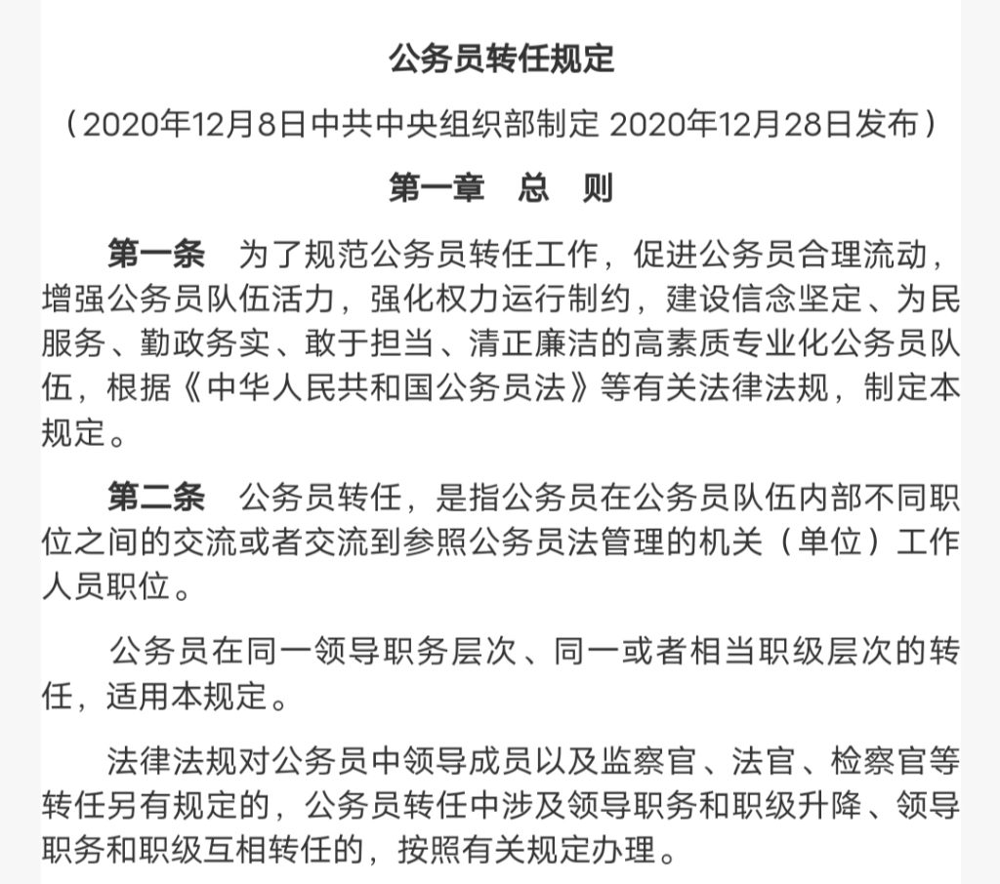
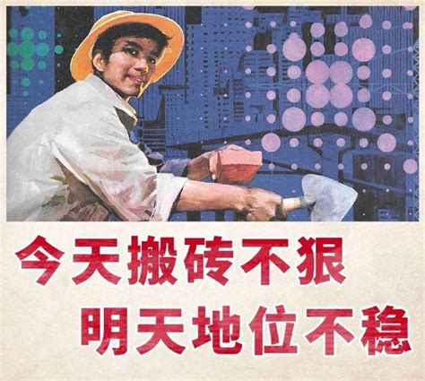
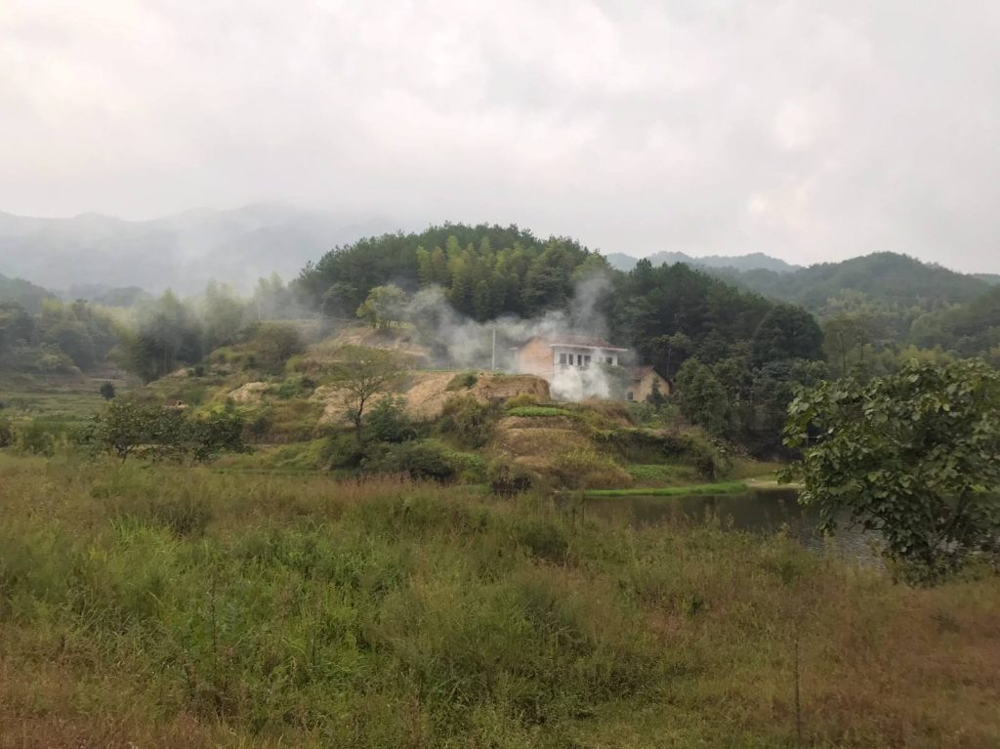
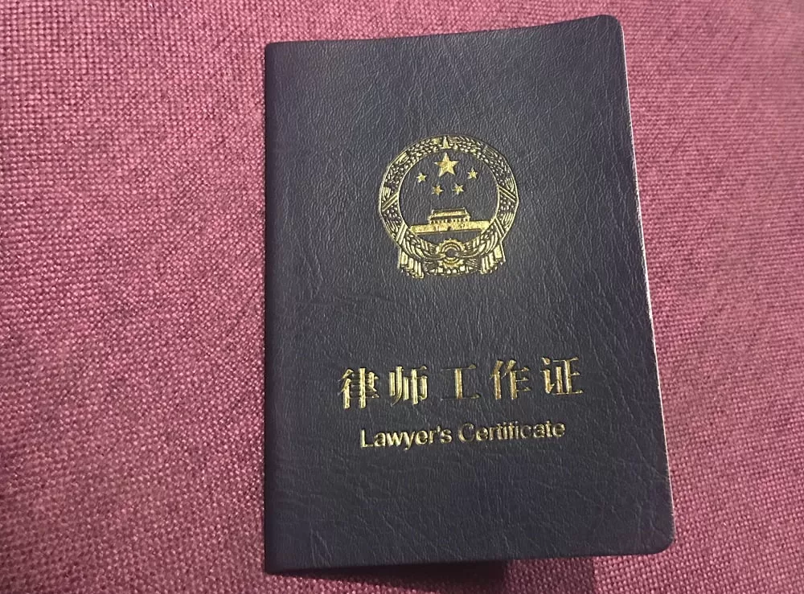
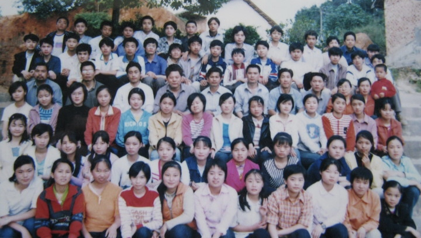

今天是妻子CC的35岁生日，再过几个月，我也将迎来35岁。近年来，“35岁现象”无疑是中国非常热门的话题。借此机会，我想简单分享一下我对这个问题的看法。

我第一次听说“35岁现象”大约是在2009年。那是我大学时代的暑假，我住在湖南长沙的表哥家里。他告诉我，他正准备报考湖南省公务员考试。然而，作为1980年出生的人，他已经快30岁了，如果他不能通过考试，他将没有多少机会申请，因为公务员考试的年龄限制是35岁以下。听到这个消息，我感到很惊讶。

表哥在学术上一直是我的榜样。在他的教育历程中，他一直表现出色。他于2000年成功考入湘潭大学，2004年在武汉科技大学获得控制工程硕士学位。2007年毕业后，他加入了当时湖南省最好的私营企业三一重工，也是全球最大的建筑机械制造公司之一。

  
三一机器

表哥在三一重工的收入让我惊讶。然而，他告诉我，他宁愿找一个收入低得多的政府职位，也不愿继续在公司工作。原因是公司的工作压力太大，内部竞争非常激烈。如果他不能在35岁之前从技术岗位转到管理岗位，他的职业前景就不会很好。因此，他更愿意尽早找一个政府职位。

在他报考公务员考试期间，发生了一件荒唐的事情。在线报名系统要求申请人提交一张个人照片，照片必须是一英寸大小，最大文件大小为30KB。这意味着要将照片压缩到极致，导致照片提交经常失败。照片要么因压缩过度而变得太模糊，要么不符合尺寸要求。经过多次尝试，他终于成功上传了一张合适的照片。

最后，表哥在2009年成功通过了湖南省质量技术监督局组织的专业技术招聘考试。他被分配到株洲市质量技术监督局。后来，他也在该单位获得了永久职位，并逐渐成长为一名高级工程师。

  
质量技术监督局的工作

如果说表哥的情况让我初步了解了“35岁现象”，那么接下来的案例给我留下了深刻的印象。

自2014年开始工作以来，办公室里有一位女同事。她出生于1985年，但不擅长考试，所以作为临时员工在我们单位工作。（虽然她被认为是临时员工，但我从未见过任何政府部门主动解雇任何人，除非他们自愿辞职。）这位女同事经过艰苦努力，终于在2018年底通过了公务员考试，多年来一直在尝试。然而，为了降低难度，她得到的职位位于离我们这里约120公里的相对偏远地区。当她通过试用期时，她已经快35岁了，因为她成为公务员时已经34岁了。根据政府部门的内部调动规则，也有35岁以下的年龄限制，她几乎没有机会回到家乡工作。除非她放弃公务员身份，辞职另谋职业，但在中国，尤其是对年长的女性来说，这将是一个不明智的决定。

值得一提的是中国政府机构内部工作调动的规则。在2021年之前，我所在城市的员工调动到不同职位相对容易。任何在中国境内的公务员，只要年龄在35岁以下，并且符合所需职位的教育背景和专业要求，理论上都有机会调动。由于我所在的城市位于粤港澳大湾区，工资相对较高，工作环境良好，许多想在政府部门工作的当地居民通常会选择在竞争较小的地区（如偏远山区）通过公务员考试，然后再调回大城市。

然而，自2021年以来，这种间接方法变得越来越难以实现，因为中共中央组织部发布了新规定，很大程度上堵住了这个漏洞。

  
新规定

近年来，“35岁现象”已从内部政府规定转变为社会层面的误解，特别是在大型IT和互联网公司。许多人认为，一旦他们达到35岁，他们可能会面临失业。当然，这也可能与中国的人口红利有关。一些大公司认为，在公司工作时间较长的人更容易自满，无法跟上市场变化和技术进步。另一方面，不断涌入大城市寻找工作机会的年轻人被认为更有活力和动力。

中年人在就业市场上面临挑战，很难找到与之前工作在地位和福利方面相匹配的新职位。他们往往不得不接受低质量的工作以满足基本生活需求。他们中的许多人对自己的职业生涯感到强烈的危机感，害怕失业。因此，他们在内部变得极具竞争力，无限制地延长工作时间，以展示他们对工作的忠诚和对公司的价值。即使面对公司的苛刻要求或虐待行为，他们也愿意忍受，因为生活和家庭的压力迫使他们妥协尊严。

  
内部竞争激烈

事实上，对于大多数人来说，35岁被认为是工作的黄金年龄。这个年龄段的人在心理上已经成熟，积累了大量的工作经验。他们具有强烈的社会责任感和家庭责任感。我也希望我们的社会能够减少年龄歧视，让每个人都有公平的成长和发展机会。

我们这一代人经历了巨大的社会变革，承受着巨大的社会压力。我小时候，家里很穷。直到1998年，我们才买了第一台黑白电视机。在整个90年代，我父母的年收入可能不到300美元，我们生活在极度贫困中。当时，我家乡大多数人的生活状况就是这样。所以，我个人非常关心生活的确定性。我认为保持稳定的工作是最重要的。家庭和生活的压力让我没有多少选择犯错，因为一步走错可能会导致我和家人持续和永久的损失。尽管我和妻子的年收入总和是我父母过去收入的200多倍，但我仍然担心这个问题。当然，这种思维方式也可能是许多中国人的共同感受，否则中国的公务员考试不会如此受欢迎。

  
这是我家乡村庄的地形和地貌。

我经常想象，如果我年轻时没有努力学习，没有考上大学，我会过什么样的生活。或者如果我没有选择在法院工作，而是继续在社会上找工作，我现在会处于什么样的工作状态？也许我会像一些同龄的表兄弟一样经营一家小公司，在制造业当工人，或者在东南亚甚至非洲做小生意。也许我会像一些大学同学一样，已经成为一名成功的律师，或者在小企业担任法律或人力资源经理。我甚至可能继续在广告公司或电信企业的营销领域工作。但最终，生活没有“如果”。既然我已经选择了目前的职业道路，我只能坚定地继续走下去。这也是我们这一代人命运的无奈选择。

  
这是我2013年通过司法考试后获得的律师证书。

  
这是我2003年中学毕业的班级照片。