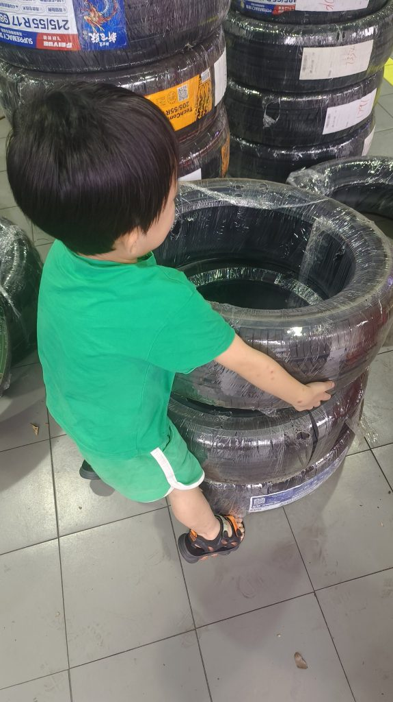
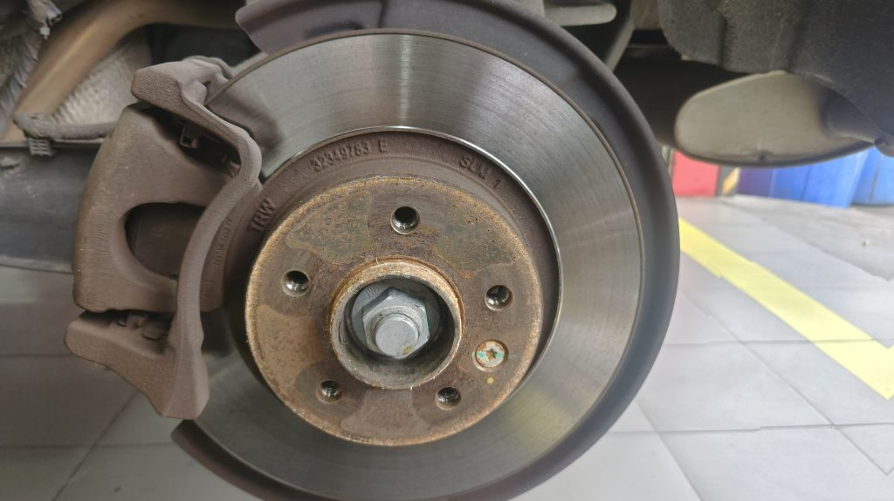
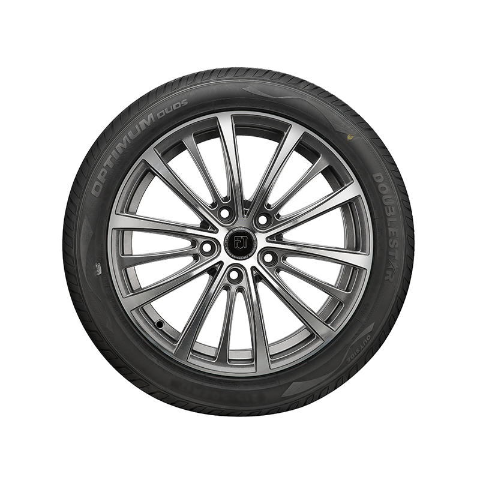

It's a Chinese brand SUV that I purchased in 2017. I mainly use it for commuting to work and driving my kids around. So far, I've been driving it for six years and the mileage is only 50,000 kilometers. However, the tire treads were worn out, so I decided to replace all four tires. The original tires were German brand Continental, size 235/55/R18, but they were quite expensive, costing around 700 Chinese yuan per tire. So, for all four tires, it would have been 2,800 Chinese yuan. That's why this time I opted for Chinese brand tires of the same size, which only cost 1,000 Chinese yuan for all four. It was a more affordable option.

<figure>

<figcaption>

Dodo try to move the tire

</figcaption>

</figure>

  
  
During the tire replacement process, I noticed that the connection points between the four wheel axles and the tires were rusty. So, apart from installing the new tires, I also had them treated for rust and performed a four-wheel alignment. As a result, the total payment came to around 1,300 yuan.

<figure>

<figcaption>

Rusty

</figcaption>

</figure>

Although these tires are cheaper, the manufacturer still provides a considerate three-year warranty. In addition, the sales platform also offers a three-year accident subsidy. For example, if the tires develop bulges, the sales platform can provide an additional 80% reimbursement of the purchase price.

<figure>

<figcaption>

Doublestar tire

</figcaption>

</figure>
