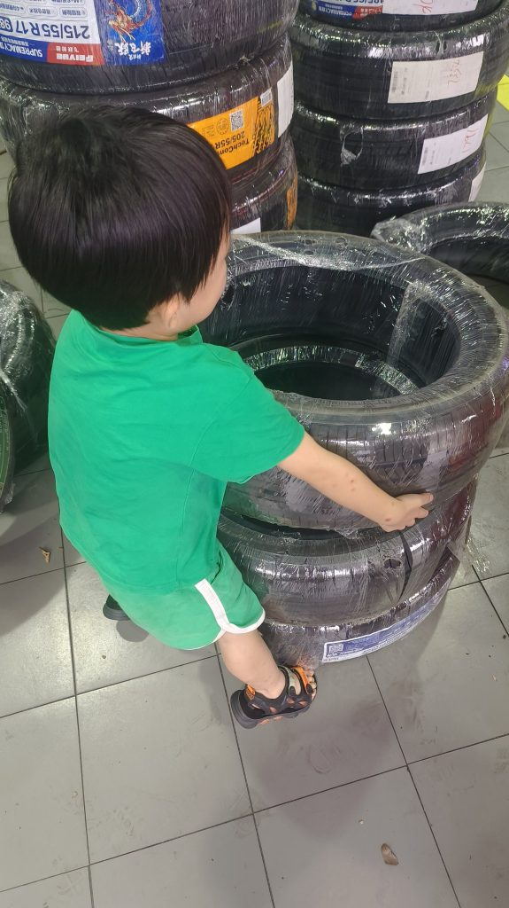
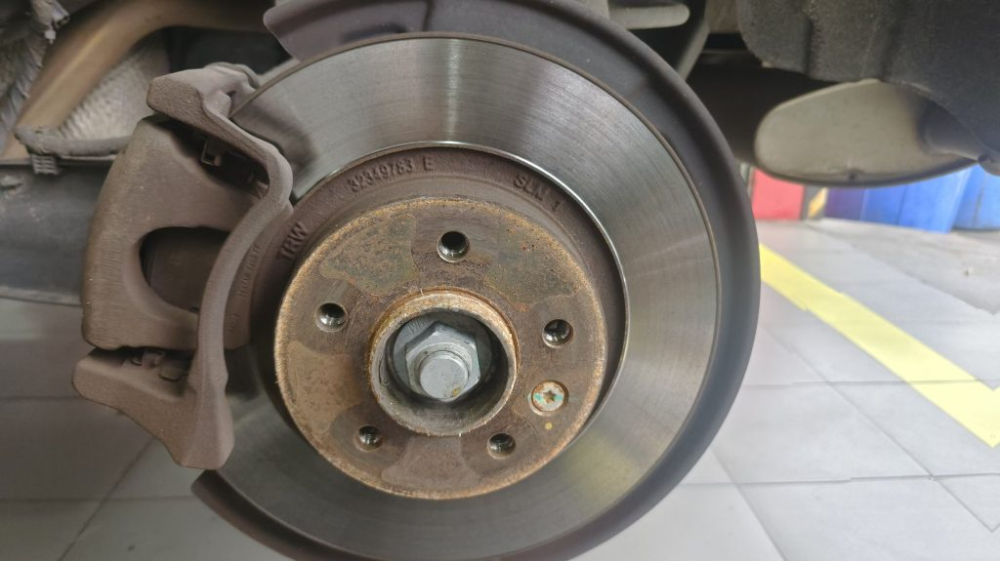

这是一辆我2017年购买的中国品牌SUV。我主要用它上下班和接送孩子。到目前为止，我已经开了六年，里程只有5万公里。但是轮胎花纹已经磨损，所以我决定更换所有四个轮胎。原装轮胎是德国品牌大陆牌，尺寸为235/55/R18，但它们相当昂贵，每个轮胎大约700元人民币。所以，四个轮胎总共要花费2800元人民币。因此，这次我选择了同样尺寸的中国品牌轮胎，四个轮胎总共只需1000元人民币。这是一个更经济实惠的选择。

<figure>

<figcaption>

Dodo try to move the tire

</figcaption>

</figure>

  
  
在更换轮胎的过程中，我注意到四个轮轴与轮胎之间的连接点生锈了。因此，除了安装新轮胎外，我还对它们进行了防锈处理并进行了四轮定位。因此，总费用约为1300元人民币。

<figure>

<figcaption>

Rusty

</figcaption>

</figure>

尽管这些轮胎更便宜，但制造商仍然提供了周到的三年保修。此外，销售平台还提供了三年事故补贴。例如，如果轮胎出现鼓包，销售平台可以提供额外80%的购买价格补偿。

<figure>

<figcaption>

Doublestar tire

</figcaption>

</figure>