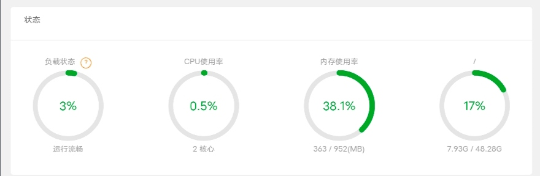

Previously, I had been using Alibaba Cloud servers registered with a promotional offer, with a configuration of 2 CPU cores and 2GB of memory. However, since that product is about to expire and I cannot continue to renew it with the promotional offer, I don't plan on using it anymore. So, during this time, I have been searching on the Nodeseek forum to find a cloud server with a suitable price.

<figure>

<figcaption>

Alibaba cloud

</figcaption>

</figure>

  
This morning, I saw someone on the forum post a promotional offer for a cloud server operated by an individual seller. They were offering a cloud server with 1 CPU core and 1GB of memory for only 1 Chinese Yuan per month. However, many comments below mentioned that these types of cloud servers have extremely poor performance and may become unusable after a while. They suggested trying to register for an Oracle Cloud service account instead, as they offer free cloud servers as well.  
  
Therefore, I decided to give registering for an Oracle Cloud service account a try.

When I first registered, I entered my personal information and contact address in English and attempted to verify using my Visa credit card from China Construction Bank. As expected, the verification failed. Then, I searched online and found many discussions where people mentioned that registering for an Oracle Cloud service account is a mysterious problem because there doesn't seem to be any consistent pattern. Some even mentioned trying for one or two years without success.  
  
With a "give it a try" attitude, on my second attempt, I decided to abandon any clever methods. I directly registered using Chinese information, provided the most common QQ email account in China, and chose a server location far from my place, in Hyderabad, India. For verification, I used my Mastercard from Guangfa Bank. Miraculously, it was successful this time.  
  
However, when I shared this information on the forum, many people still didn't believe it. Orz.  
[https://www.nodeseek.com/post-33594-5#45](https://www.nodeseek.com/post-33594-5#45)

<figure>

<figcaption>

it seems 1 physical core and 1 virtual thread.

</figcaption>

</figure>

  
Oracle Cloud service accounts provide two types of free servers by default: traditional x86 servers and ARM servers.  
  
Since my blog website requires minimal resources, I chose to use a 1 CPU core and 1GB memory x86 server. I installed the Ubuntu system and BT panel and set up Litespeed, PHP, and MySQL. It looks promising.  
  
When I have time, I'll try using Oracle's free 4 CPU core and 24GB memory ARM server to build a Mastodon application.
