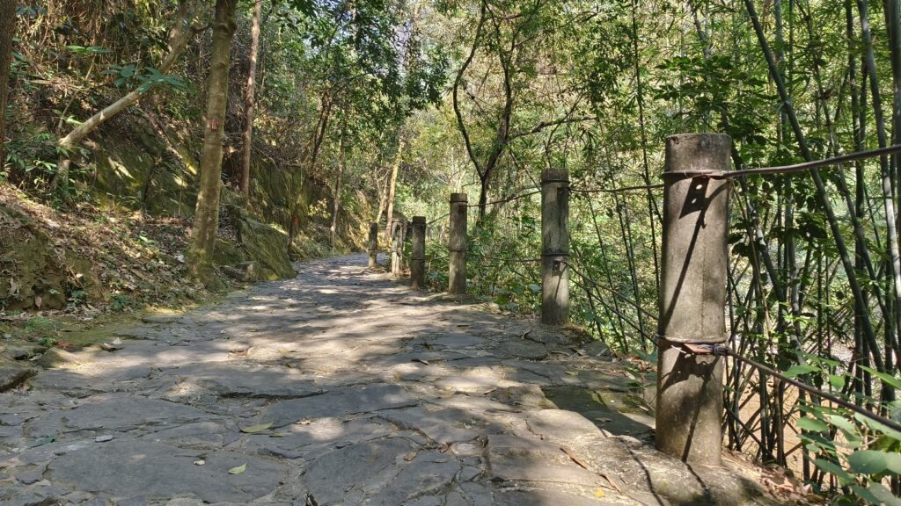
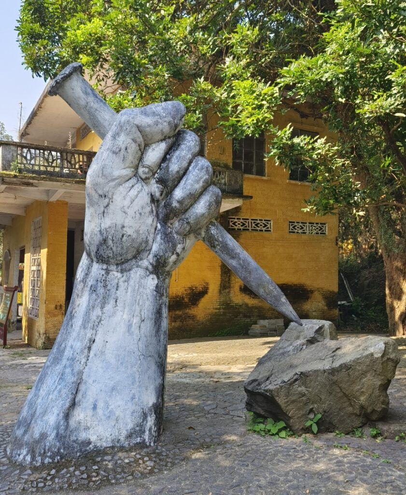
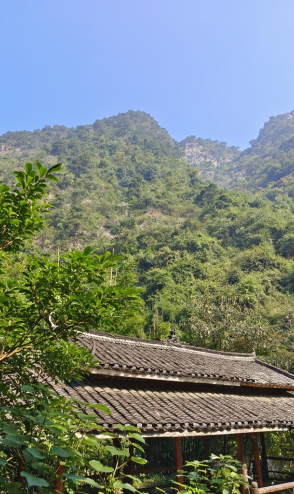
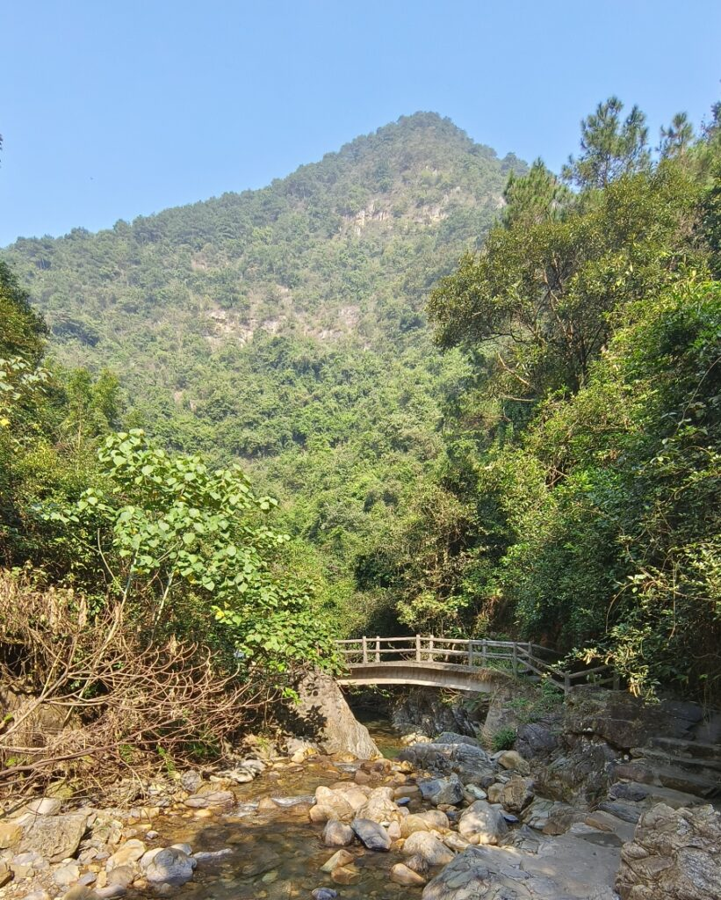
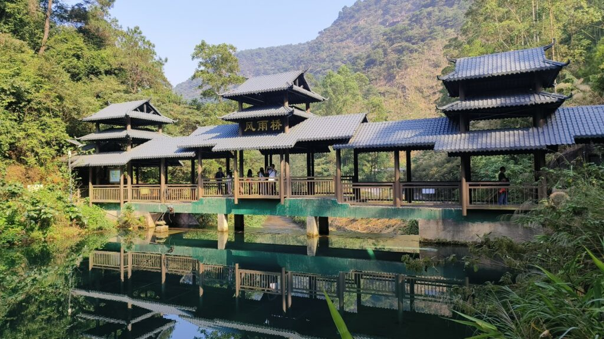
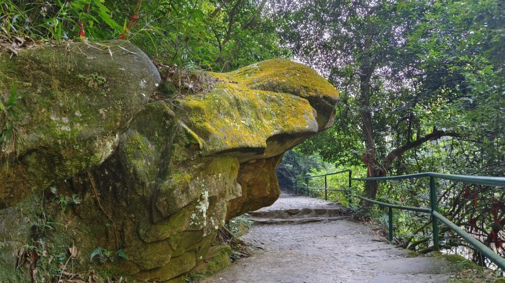

Today, I participated in our company's union activity and went to Zhaoqing Ziyun Cave Scenic Area with my colleagues. It is a relatively niche attraction with not many tourists, but the scenery is quite beautiful. Additionally, it is conveniently located near the city, making transportation relatively easy.  

Location map
