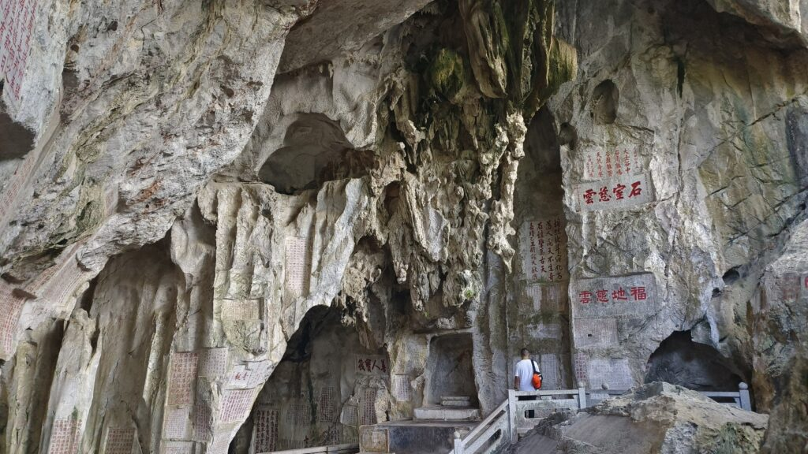
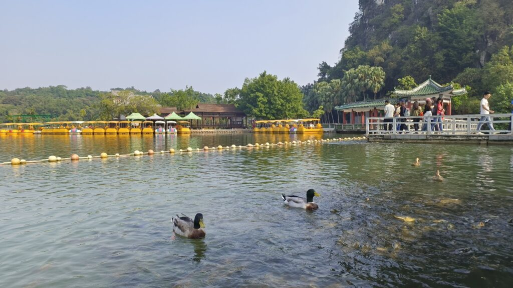
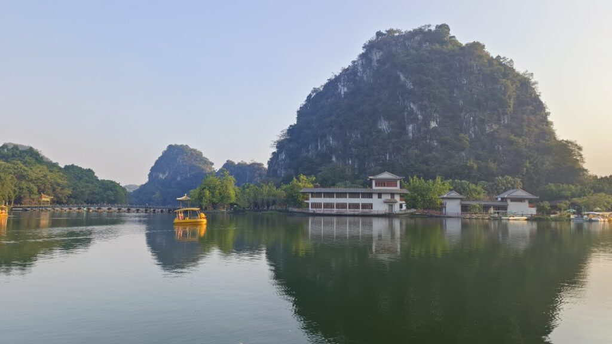
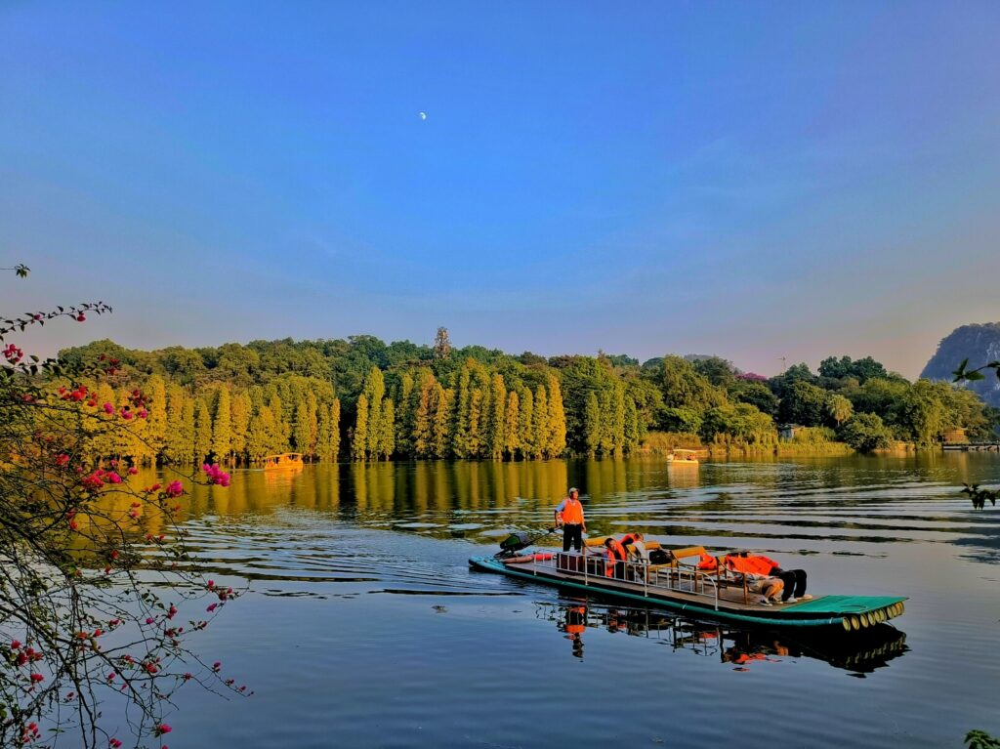
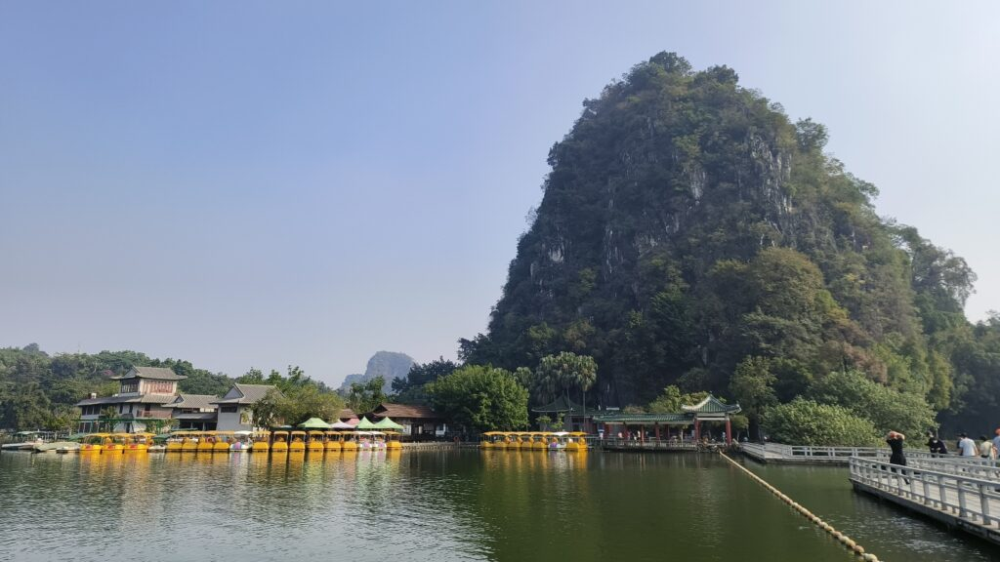
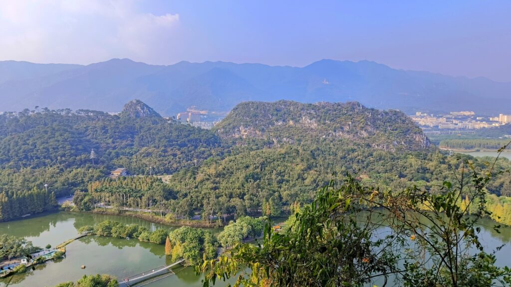

Seven-Star Rock is located in Zhaoqing City, Guangdong Province. The scenic area covers a total area of 8.23 square kilometers. It is named Seven-Star Rock because the seven limestone peaks are arranged in a pattern similar to the Big Dipper constellation in the sky. It is a AAAA-level scenic spot in China.
