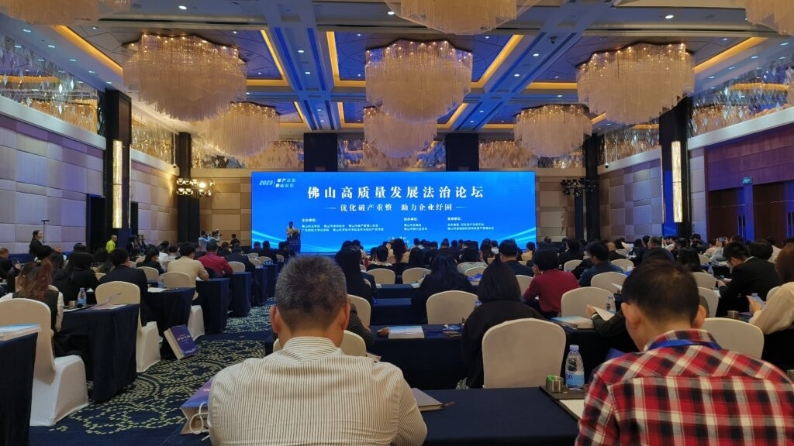
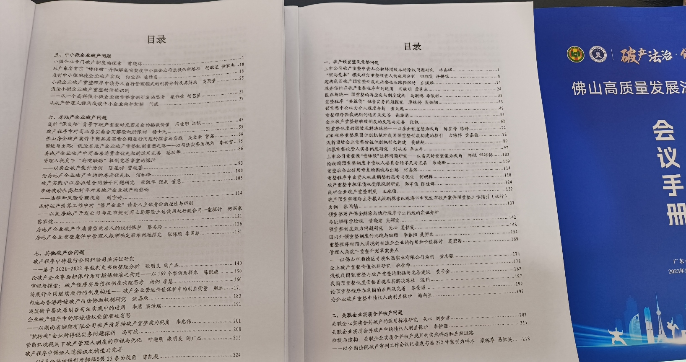
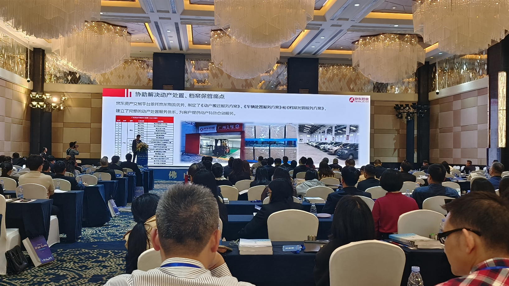
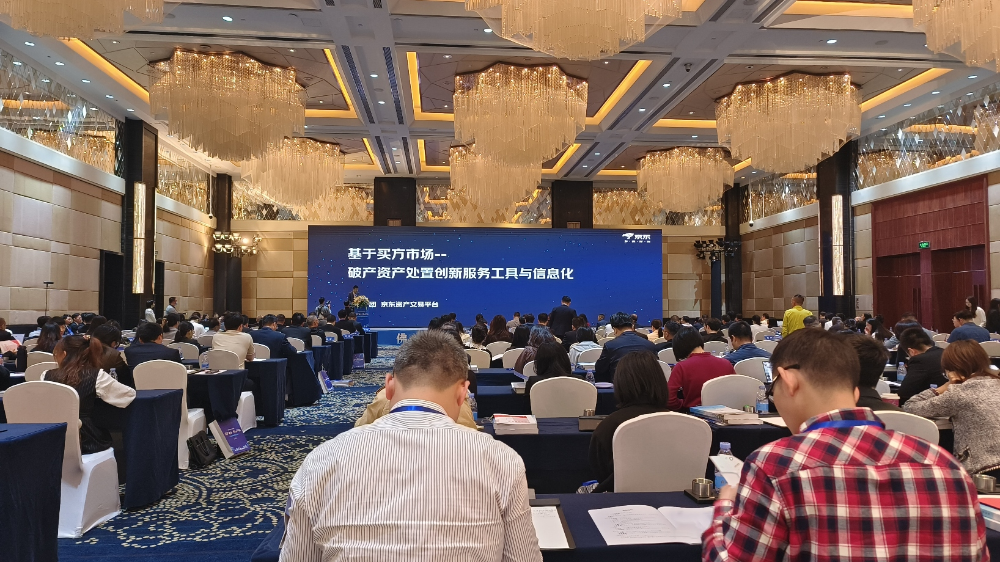

Today, I had the great pleasure of attending the Foshan High-Quality Development and Rule of Law Forum. The theme of this forum was bankruptcy and the rule of law. The event featured two top experts in the field of bankruptcy law in China: Professor Li Shuguang from China University of Political Science and Law, and Professor Xu Yangguang from Renmin University of China. In addition, Judge Ding Haihu, an expert in bankruptcy adjudication from the High People's Court of Guangdong Province, was also invited to speak at the event.

The forum received more than 150 paper submissions, covering a wide range of topics including bankruptcy reorganization and pre-reorganization systems, substantive consolidation of related enterprises in bankruptcy, court trial mechanisms for bankruptcy cases, handling of debt evasion issues, bankruptcy issues faced by small and medium-sized enterprises, and bankruptcy issues in the real estate industry.

The event was jointly organized by the Foshan Law Society and the Foshan Lawyers Association, with sponsorship and support from JD Group's Judicial Auction Platform.

