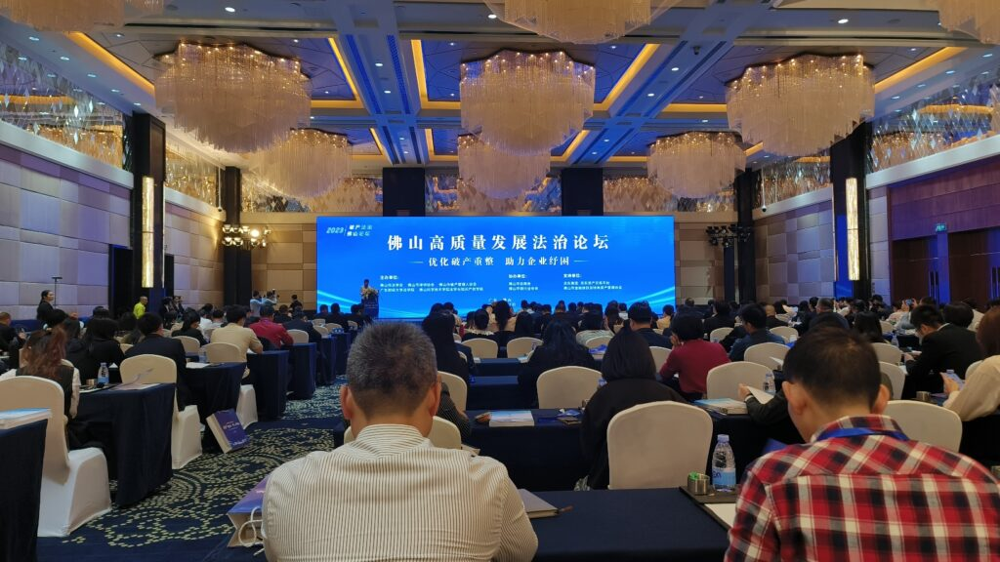
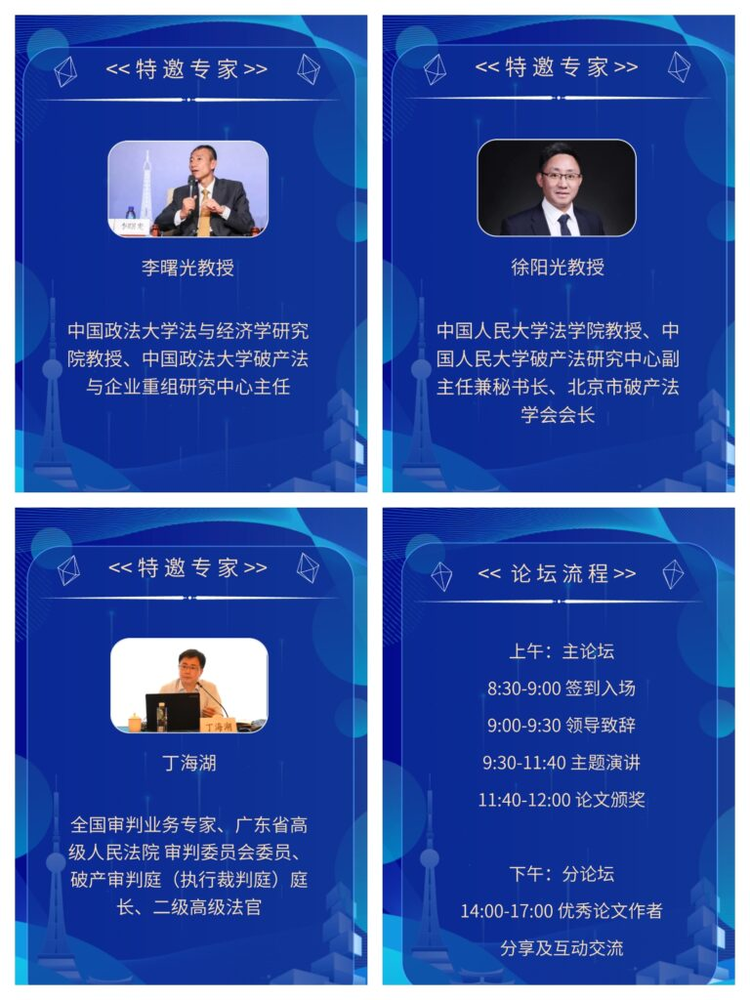
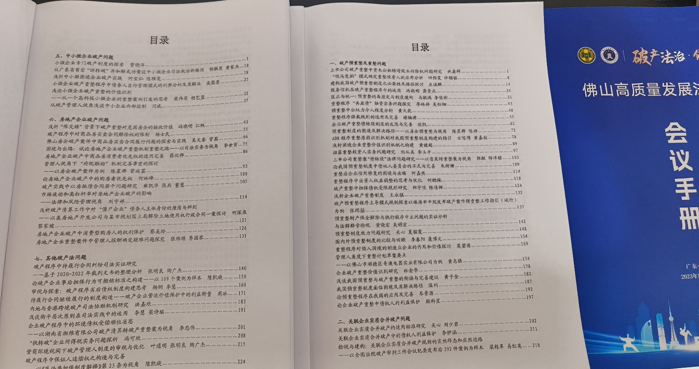
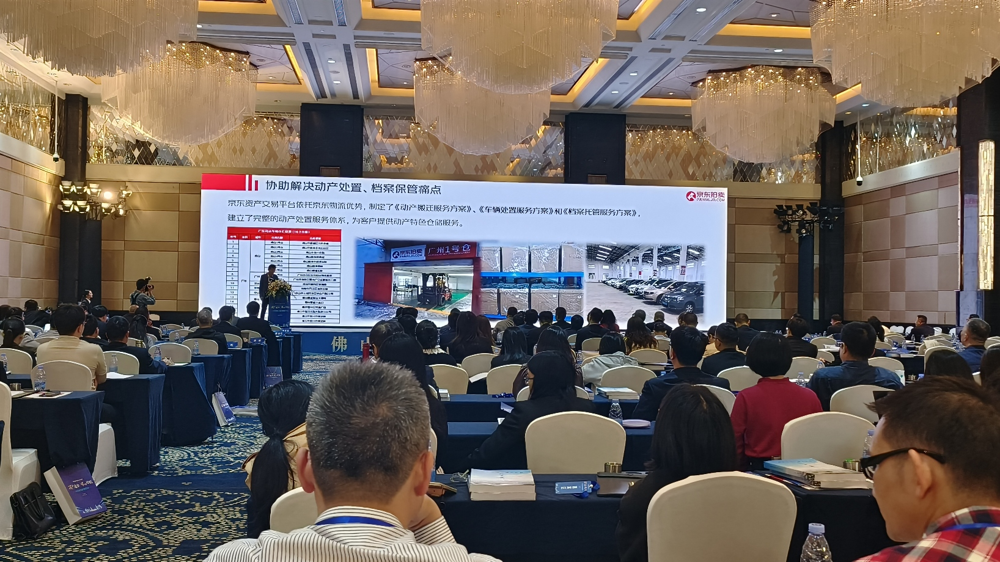
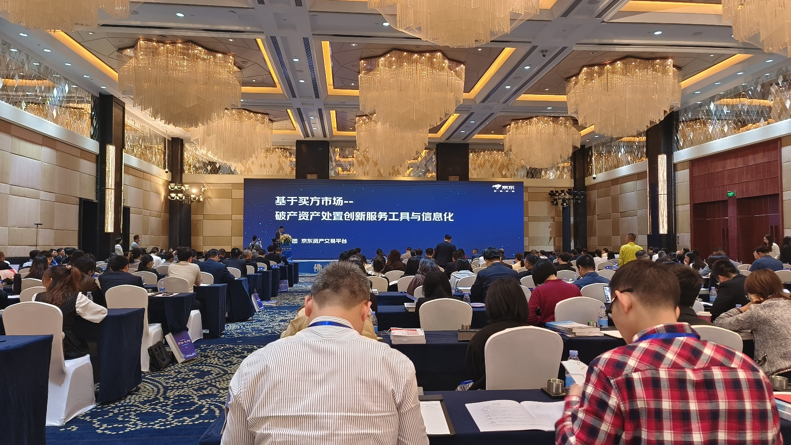
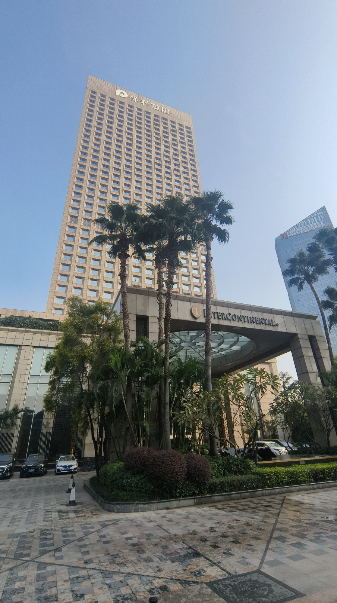

今天，我有幸出席了佛山高质量发展与法治论坛。本次论坛的主题是破产与法治。活动邀请了中国破产法领域的两位顶级专家：中国政法大学的李曙光教授和中国人民大学的徐阳光教授。此外，还邀请了广东省高级人民法院破产审判专家丁海湖法官在活动中发表演讲。

论坛收到了150多篇论文投稿，涵盖了破产重整和预重整制度、破产中关联企业的实质合并、破产案件的法院审理机制、债务逃避问题的处理、中小企业面临的破产问题以及房地产行业的破产问题等广泛议题。

本次活动由佛山市法学会和佛山市律师协会共同主办，并得到了京东集团司法拍卖平台的赞助和支持。

