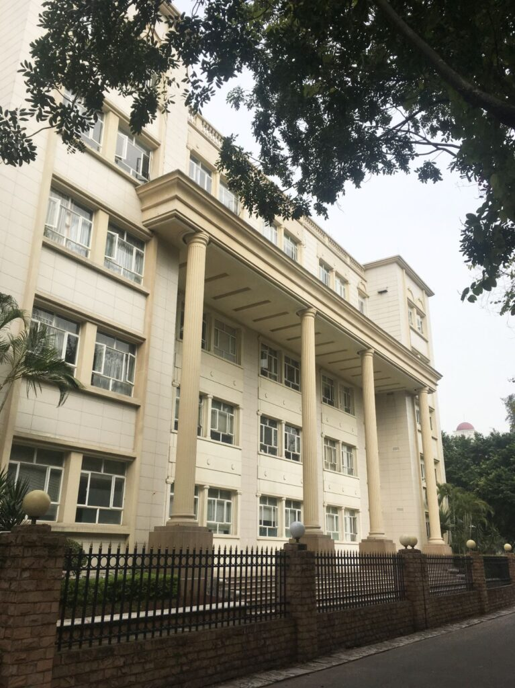
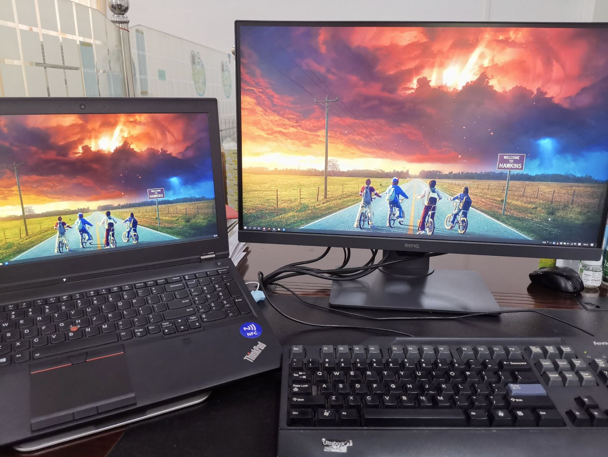
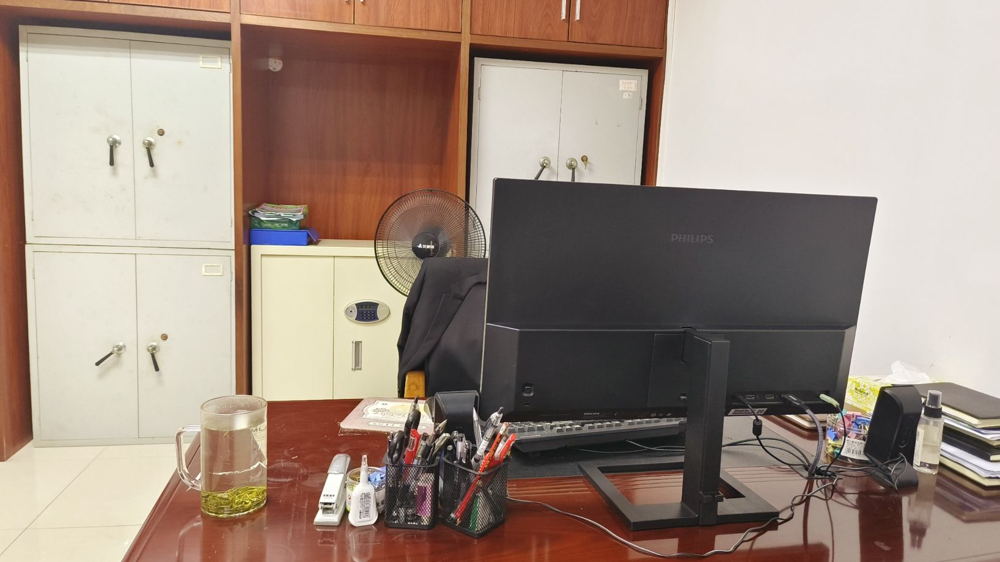

Recently, due to some reasons, we have had to move from our original office building to another office building. I worked in the previous office building for 9 years, during which time I also changed several offices, but none of these moves were as impactful as the current one, which involves a complete relocation to a different building. Although the original office building was constructed in 1983, it was still adaptable to current office needs. However, the newly occupied office building, despite being built at a later time, has an interior that seems very serious and oppressive.

<figure>

<figcaption>

original office building

</figcaption>

</figure>

<figure>

<figcaption>

new office building

</figcaption>

</figure>

<figure>

<figcaption>

New office

</figcaption>

</figure>

