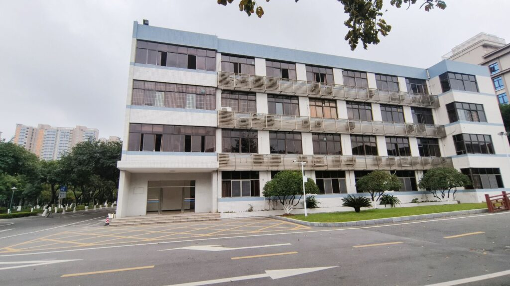
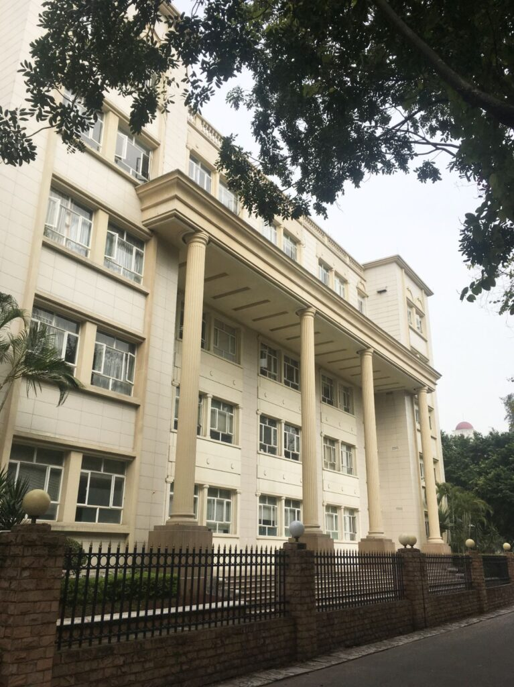
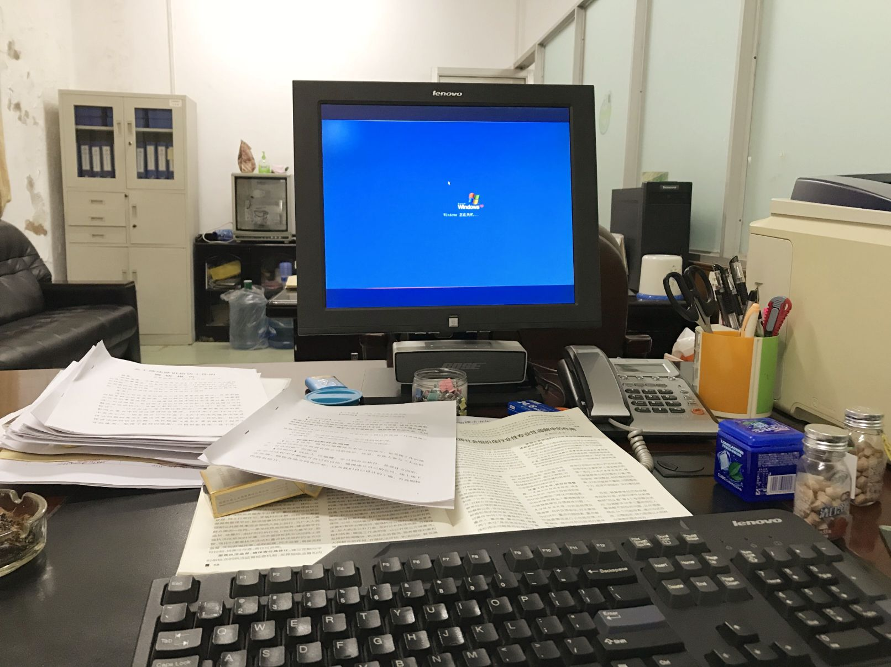
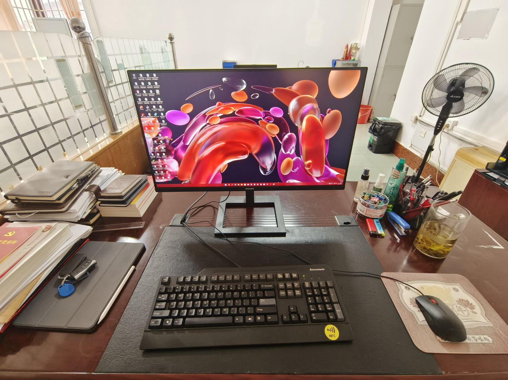
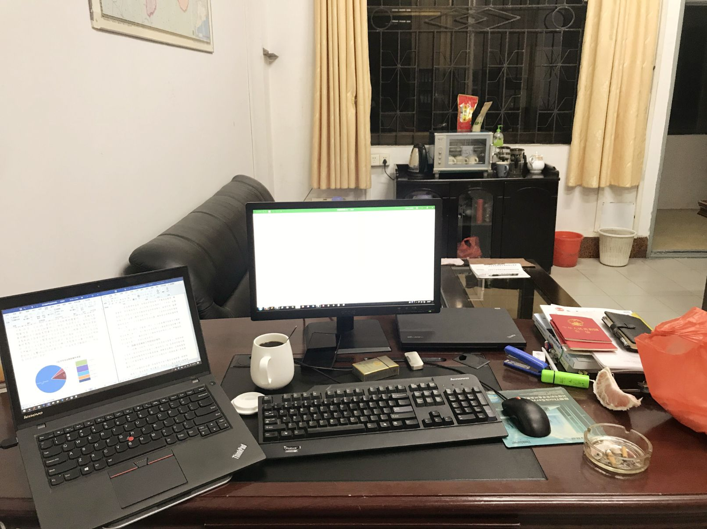
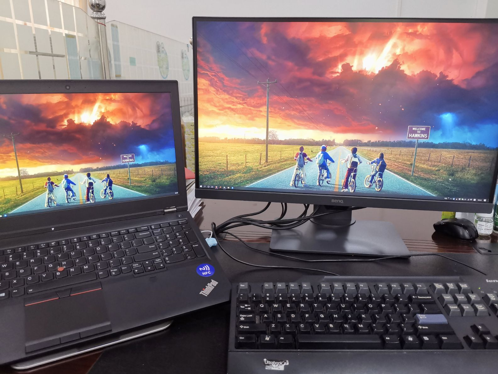
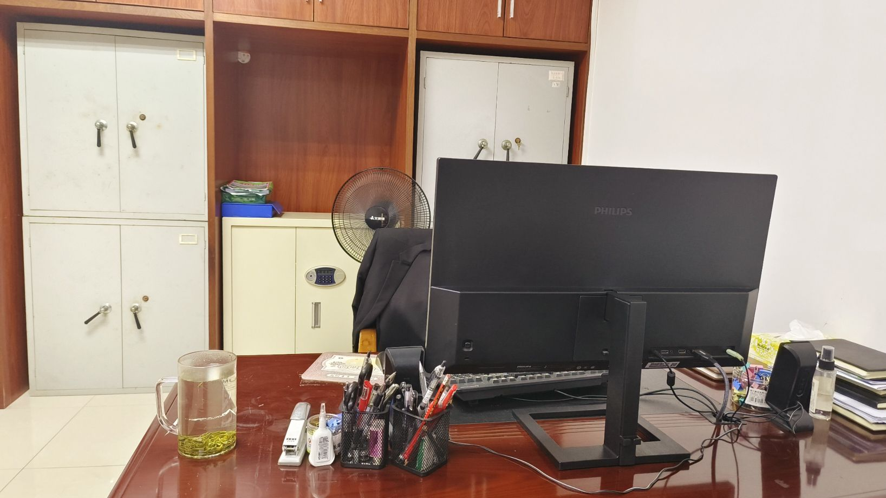
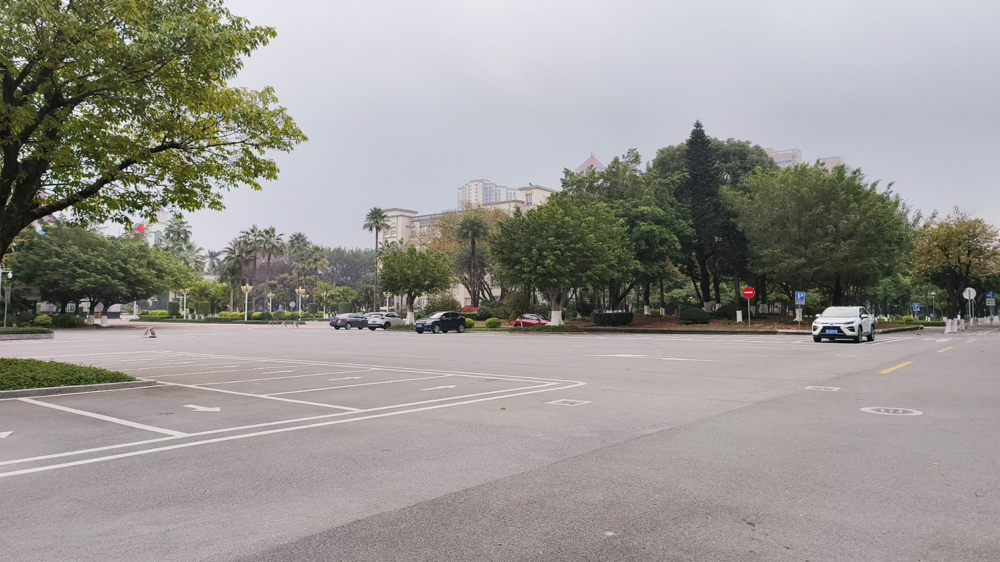

最近，由于某些原因，我们不得不从原来的办公楼搬到了另一栋办公楼。我在之前的办公楼工作了9年，期间我也换过几次办公室，但这次的搬迁对我影响最大，因为我们需要完全搬到另一栋楼。尽管原来的办公楼建于1983年，但它仍然能够适应现在的办公需求。然而，新搬入的办公楼虽然建造时间较晚，但其内部环境却显得非常严肃和压抑。

<figure>

<figcaption>

original office building

</figcaption>

</figure>

<figure>

<figcaption>

new office building

</figcaption>

</figure>

<figure>

<figcaption>

New office

</figcaption>

</figure>

