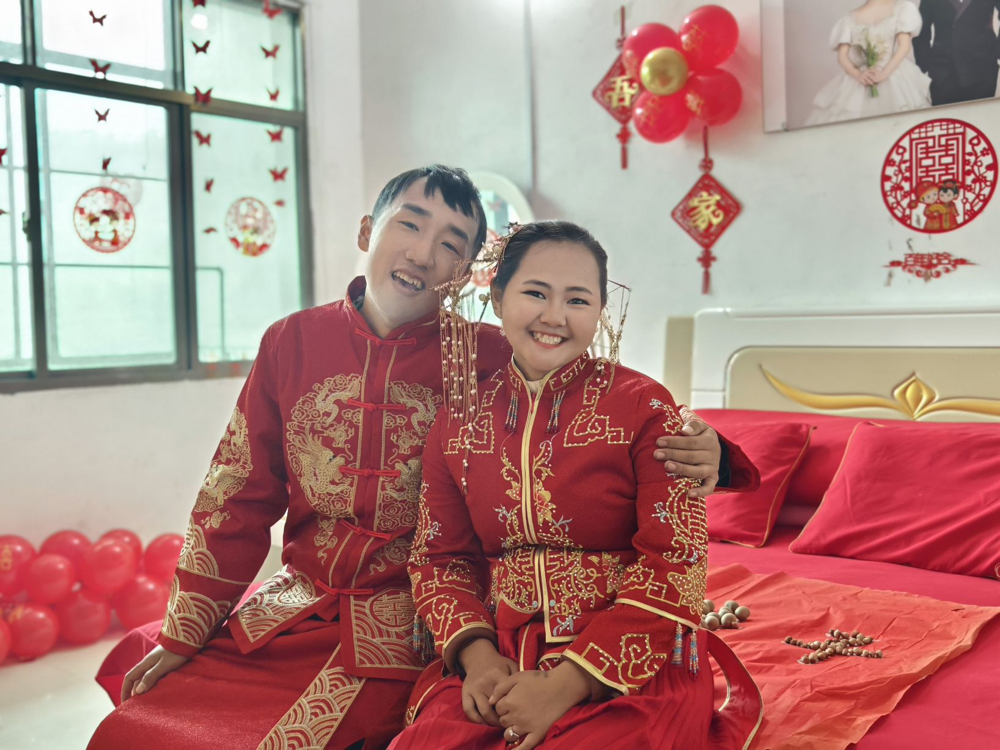
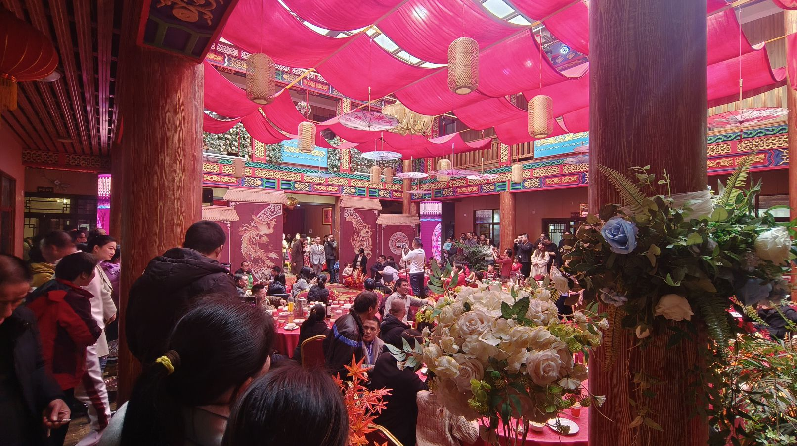
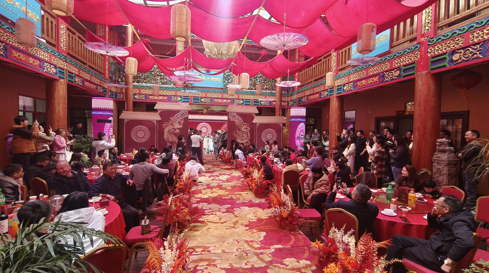
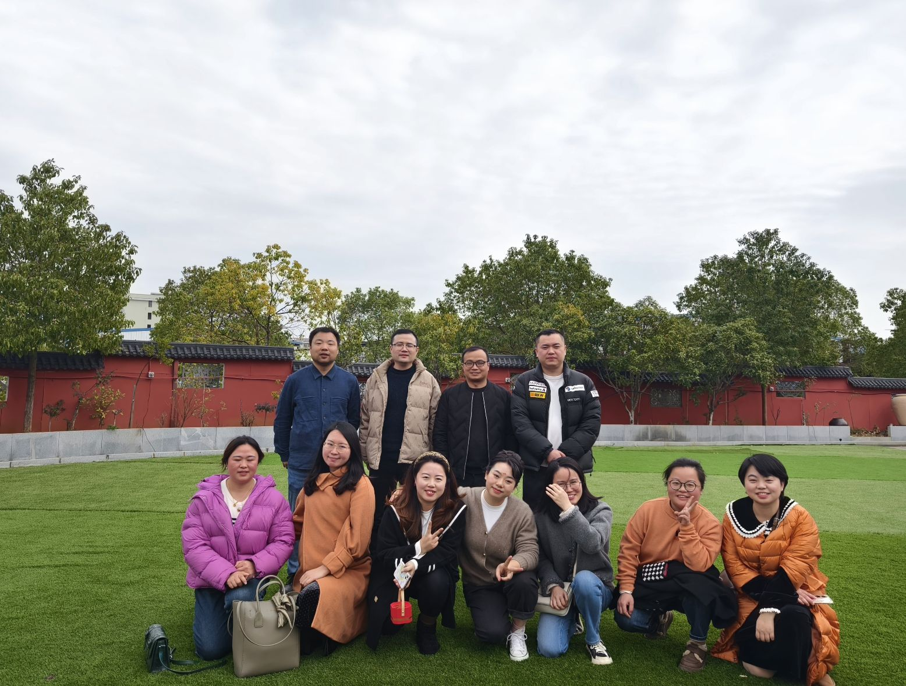

Recently, I rushed back from Guangdong to Hunan to attend two weddings. One was my cousin's wedding, and the other was the wedding of a high school classmate whom my wife and I both know. These two weddings have been long awaited and are considered well-deserved. Among them, my cousin's wedding began to be planned at the beginning of 2023. His wife comes from a remote mountainous area in Yunnan and belongs to the Lahu ethnic group. Another classmate's wedding was planned three years ago but was unable to be held due to the impact of the COVID-19 pandemic, which has always been difficult to gather a large number of people. Therefore, it was only held this year during the Spring Festival when everyone had spare time to make up for the wedding. In fact, their son is already three years old.  

<figure>

<figcaption>

High school classmates in the wedding

</figcaption>

</figure>
