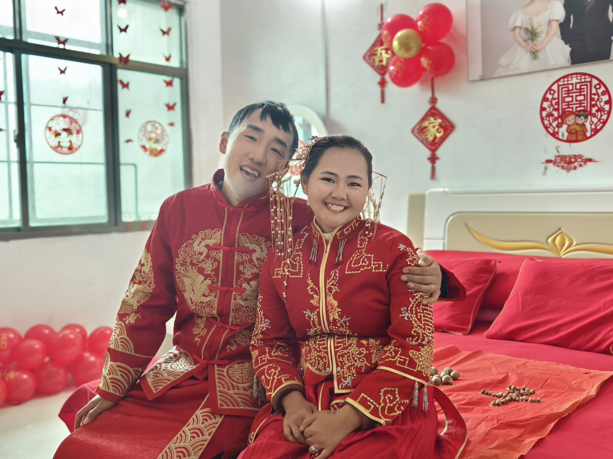
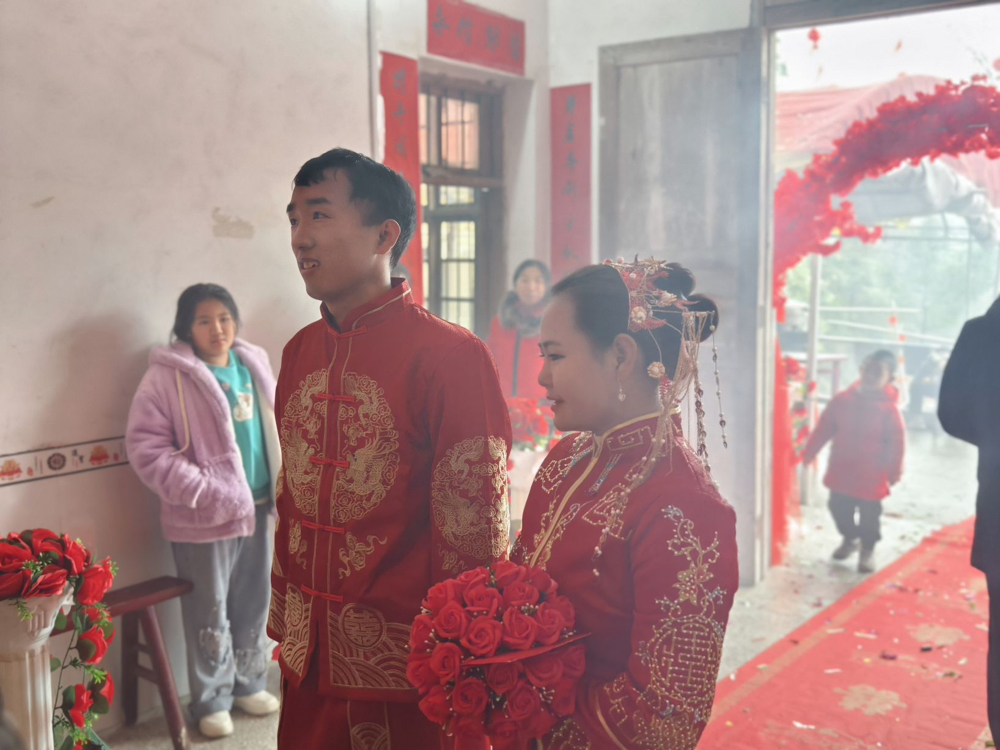
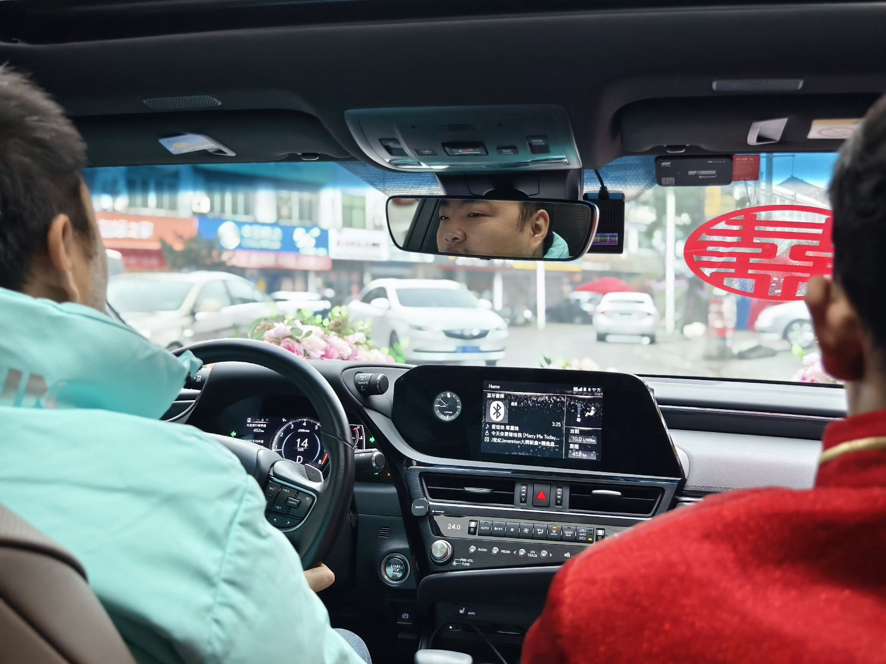
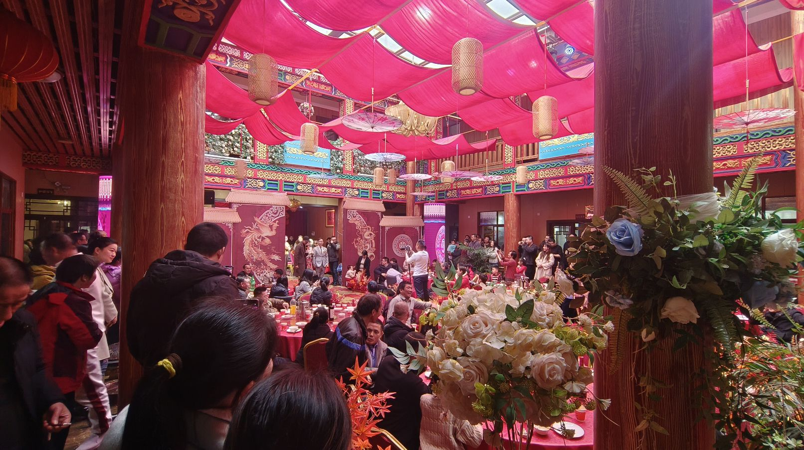
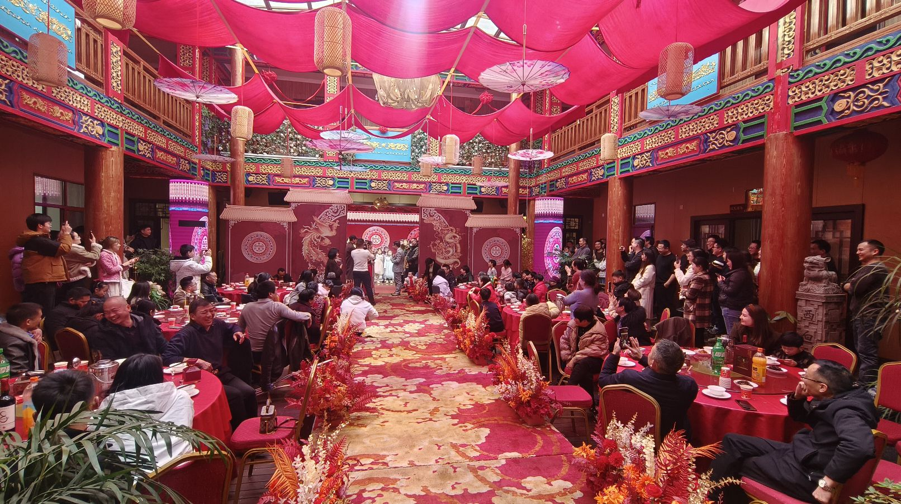
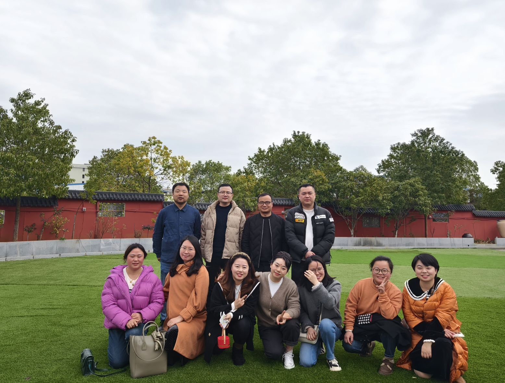

最近，我匆匆从广东赶回湖南参加了两场婚礼。一场是我堂弟的婚礼，另一场是我和妻子的高中同学的婚礼。这两场婚礼都是期待已久的，被认为是实至名归的。其中，我堂弟的婚礼从2023年初就开始筹划了。他的妻子来自云南的一个偏远山区，属于拉祜族。另一位同学的婚礼则是三年前就开始计划了，但由于新冠疫情的影响，一直无法举行，因为很难聚集大量人员。因此，直到今年春节期间大家都有空余时间才补办了婚礼。实际上，他们的儿子都已经三岁了。

<figure>

<figcaption>

High school classmates in the wedding

</figcaption>

</figure>
