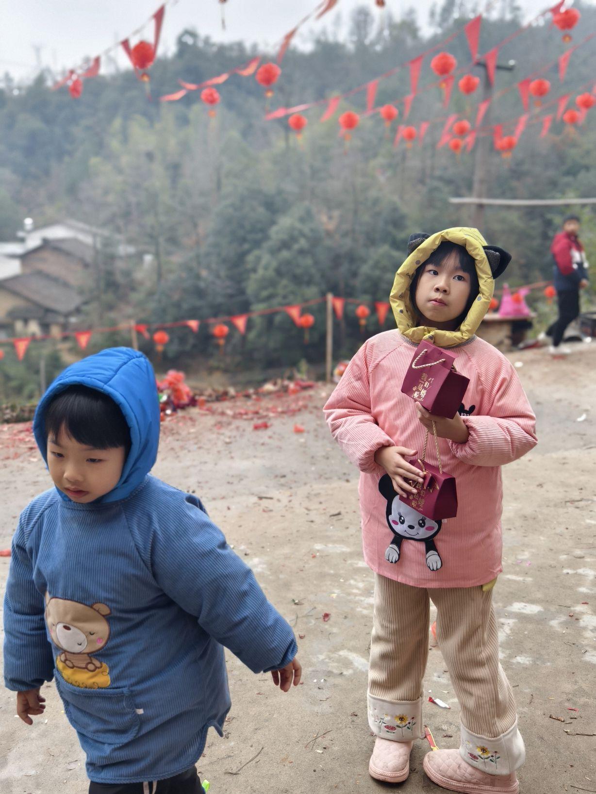
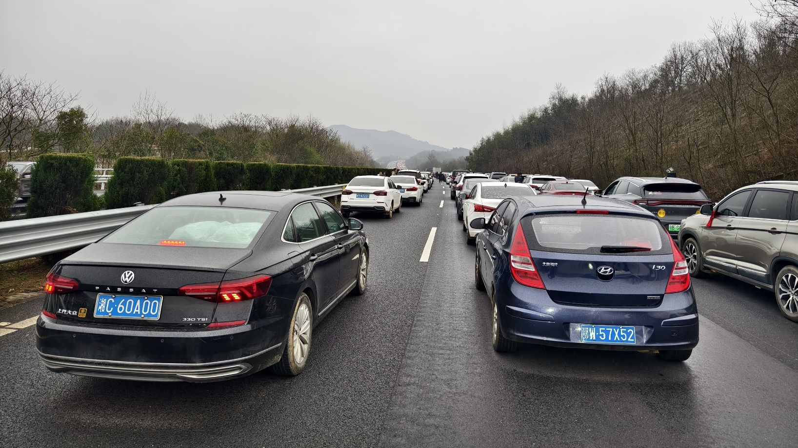
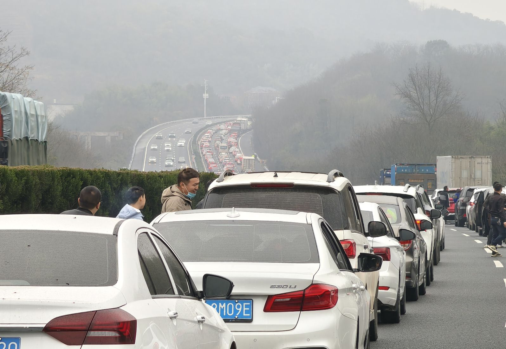
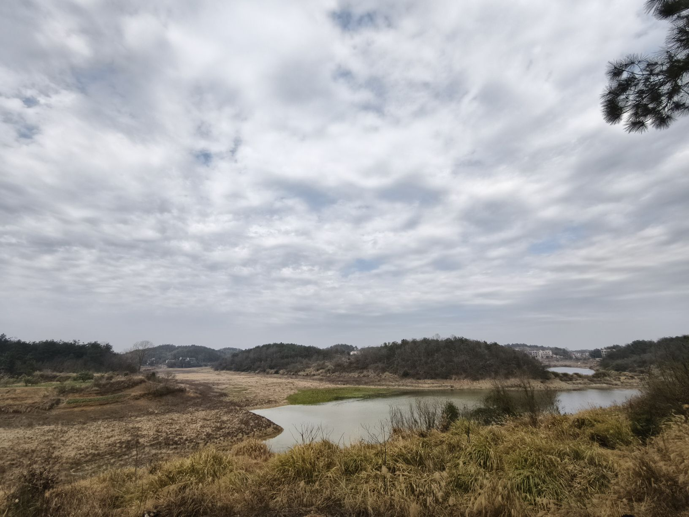

2024年的中国农历新年假期共计8天，大多数地方在新年前夕也会有假期，这也被视作实际假期的一部分，使得总天数达到9天。趁着长假，我毫不犹豫地带着孩子们回到了湖南的家乡过年。尽管往返途中的交通堵塞超过了十个小时，但与家庭团聚的快乐和亲情的温暖相比，这些小困难似乎微不足道。

- <figure>
    
    
    
    <figcaption>
    
    Children played well in my honetown
    
    </figcaption>
    
    </figure>
    

- <figure>
    
    
    
    <figcaption>
    
    Traffic jams
    
    </figcaption>
    
    </figure>
    
- <figure>
    
    
    
    <figcaption>
    
    Traffic jams
    
    </figcaption>
    
    </figure>
    
- <figure>
    
    
    
    <figcaption>
    
    Traffic jams
    
    </figcaption>
    
    </figure>
    

