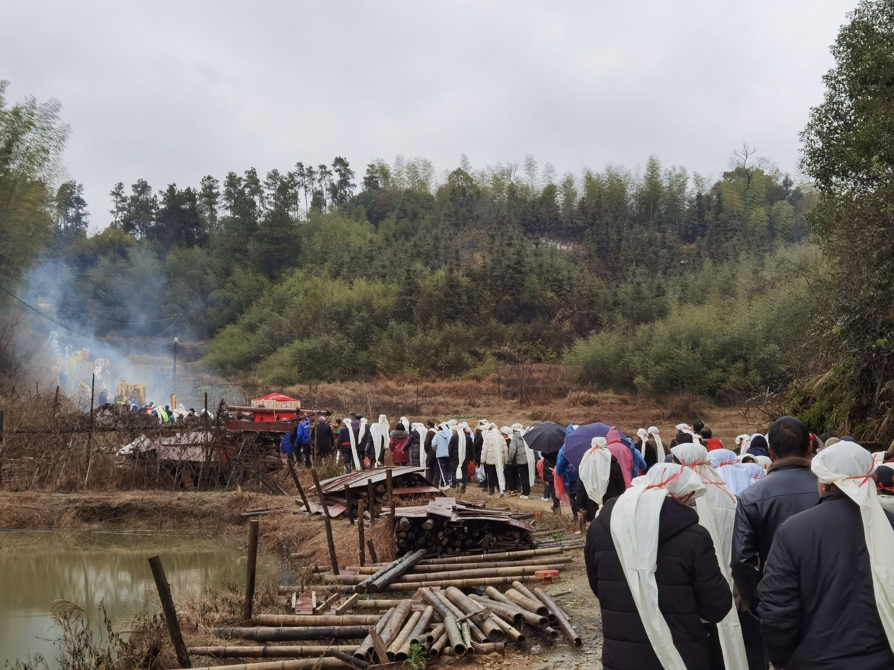
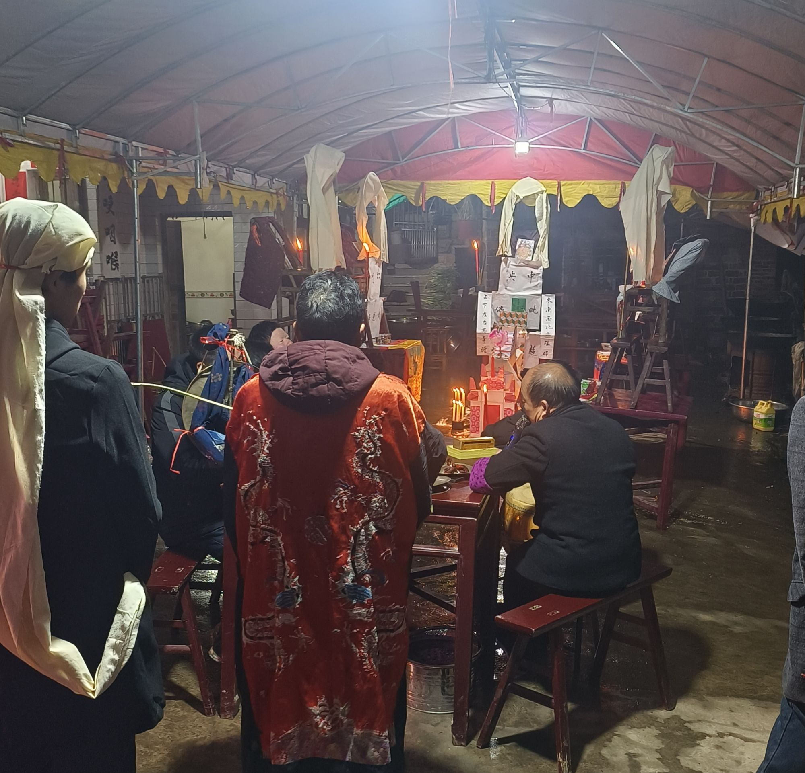
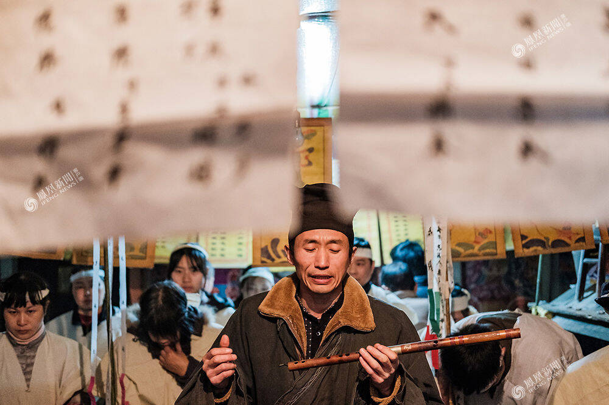
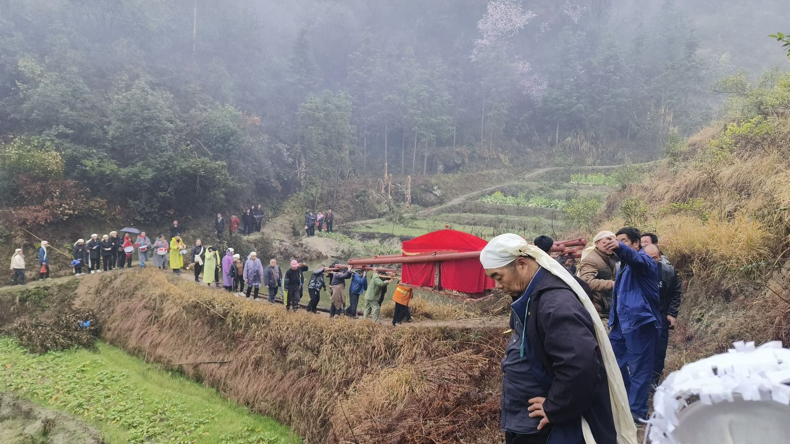
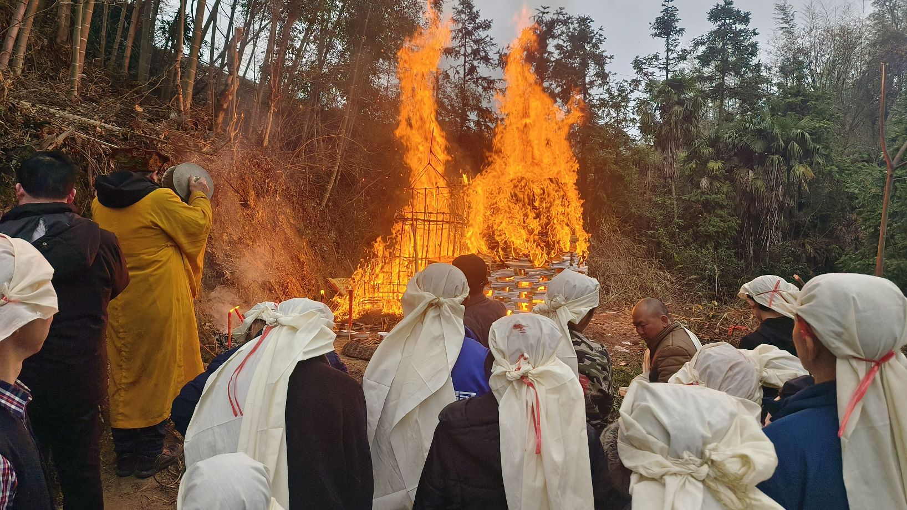
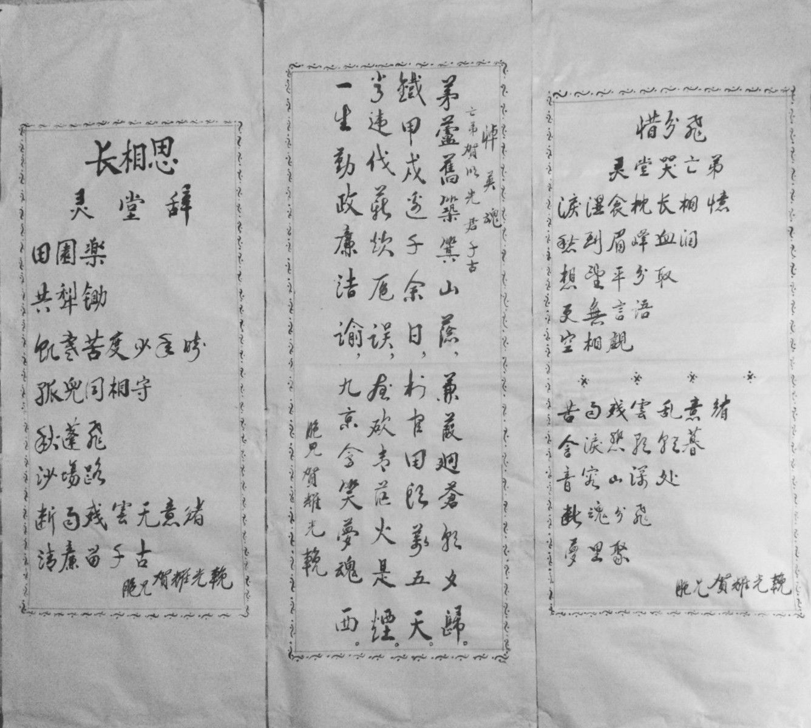
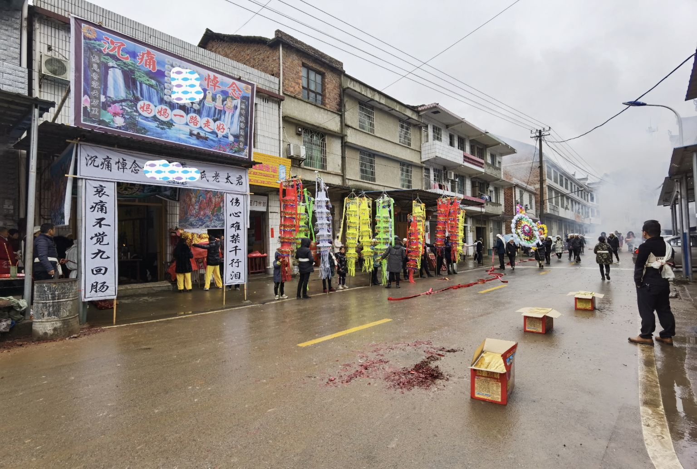
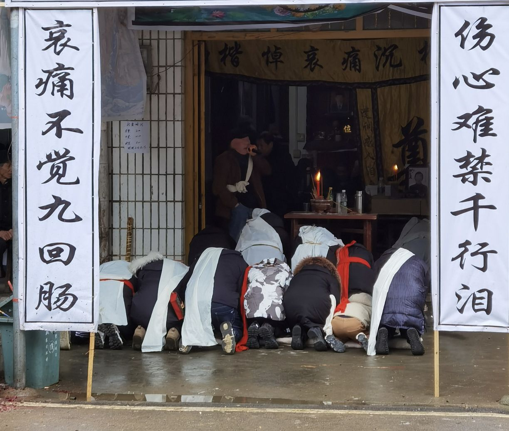

Funerals have always been an important ritual in human civilization. In terms of traditional Chinese culture, earth burial has been a significant part of Han culture. Besides the Han, there are other burial practices such as cremation, water burial, and sky burial. As China's urbanization movement accelerates, the traditional cultural practice of earth burial has become increasingly rare. Now, in most parts of China, cremation has replaced earth burial. My hometown, Hunan, may be one of the few provinces in China where Han people are the majority and still retain a significant amount of earth burial traditions.

  
## I. Naive Understanding

Throughout my childhood, I rarely encountered funerals. The only vivid memory I have was in early 1995 when one of my grandfather's younger brothers returned to our hometown in Hunan from Jiujiang, Jiangxi Province, where he had lived and worked for several decades. He was already over 60 years old at that time. Shortly after returning, he passed away due to an illness, and the funeral was held at our house. This was the first funeral I had ever experienced, leaving an indelible impression on my childhood. Several scenes often appear in my dreams to this day.

<figure>

<figcaption>

Funeral procession

</figcaption>

</figure>

- Scene One: It was the first time I saw adults crying so heart-wrenchingly. After my great-uncle passed away, his daughter couldn't stop wailing at the funeral, muttering incoherently about regret, sorrow, and exhaustion. Several relatives and friends couldn't console her.  
    

- Scene Two: It was my first time seeing a Buddhist monk in person, a profession I had only seen on television before. However, due to our earth burial customs, we needed to invite monks to perform rituals according to Buddhist traditions for the deceased. They chanted Buddhist scriptures for several days for my departed great-uncle.  
    

- Scene Three: When it was time to bury my great-uncle, I realized for the first time how arduous the process was. The coffin containing the body weighed at least 600 kilograms. To lift it, we needed a massive wooden frame and round poles, adding up to over 750 kilograms in total. It took 16 strong adults to carry it, and each person lifting the coffin needed a backup to alternate, otherwise, it would be difficult for one person to carry it for such a long time.  
    

- Scene Four: Since my hometown is located in the central mountains of Hunan, it was nearly two kilometers from our house to the burial site, and the mountain paths were usually narrow. Therefore, at the front of such a large group, a strong man had to carry a machete to clear the way. If any trees or shrubs along the road might block the procession, they had to be cut down immediately. Even so, there was still an accident on the way to the burial site. Due to the uneven primitive mountain path, the coffin tilted sideways while being carried. In the end, someone had to jump on top of the coffin to sway it back into balance.

## II. Full Experience

For a long time after 1995, I rarely attended any funerals until 15 years later. From 2010 to 2024, I experienced five funerals from start to finish, which were for my father, father-in-law, grandfather, grandmother, and maternal grandmother, all of whom were buried in the earth burial tradition. Additionally, I attended over ten funerals for other relatives. The shortest funeral was for my father-in-law, which took only four days from the time of death to the burial. The longest was for my grandmother, which spanned thirteen days. Despite the significant difference in time, the processes were largely similar.

<figure>

<figcaption>

Sacrificial rituals

</figcaption>

</figure>

1. **Placing in the Coffin**  
    This is a crucial step that usually takes several hours to a day from the time of death to the placement in the coffin. In rural Hunan, households with elderly members often have a coffin ready, typically made from solid wood and polished with a large amount of tung oil before being painted to ensure tight sealing. Such a coffin usually weighs over 250 kilograms.  
    Before the deceased is placed in the coffin, it is customary to wait until all family members have arrived, which sometimes requires a longer wait if the children of the deceased are not present. For instance, my father-in-law passed away in a hospital in Guangdong, and at that time, apart from my wife, his other daughters were not in Guangdong. So, I drove my own car and transported his body overnight from Guangdong back to our hometown in Hunan, which was over 650 kilometers away, by which time my wife's sisters had already been waiting at their father's house.  
    When the deceased is to be placed in the coffin, the family hires a local embalmer to help with makeup and dressing. Then, an elderly person knowledgeable in the theories of Yin and Yang and the Eight Trigrams selects an appropriate time to place the body into the coffin. The coffin is typically filled with a large amount of quicklime for preservation. After the coffin lid is closed, it is sealed with wood glue, and long iron nails are hammered in to prevent any movement. During the summer when temperatures are high, it is usually necessary to rent a large refrigerator to cover the coffin and prevent the body from oxidizing too quickly.  
    

3. **Seeking Guidance from the Deities**  
    In rural Hunan, every village has a Earth God Temple. On the evening of the day the deceased is placed in the coffin, the family usually takes the portrait of the deceased to the Earth God Temple for a sacrifice led by a monk or a Taoist priest. This is done to inform the Earth God that someone in their jurisdiction has passed away, providing personal information such as the name and date of birth of the deceased. It also serves to guide the soul of the deceased, with continuous sounds of gongs, firecrackers, and the burning of spirit money to show the deceased the way home.  
    The Water God is one of the most important deities in Han culture. After the death, the family, led by a monk or Taoist priest, goes to the river near the home to sacrifice to the Water God, which is similar in form to the sacrifice to the Earth God. Additionally, personal items such as clothes, shoes, and socks worn by the deceased are usually taken to the water's edge to be burned as part of the sacrifice.  
    

5. **Continuous Light and Incense**  
    From the time the deceased is placed in the coffin until the burial, a continuous light (changmingdeng) is lit beneath the coffin and before the portrait of the deceased. The light must never be extinguished, no matter how long it takes, and the same applies to the incense before the portrait, symbolizing the unbroken tradition in Chinese culture. Previously, we generally used rapeseed oil to light the lamps, but now special candles are available for purchase. The most challenging part is the incense, as traditional incense sticks usually burn for only about 30 minutes before needing to be replaced. Ensuring that incense is burning continuously for 24 hours is a very demanding task and usually requires several people to take turns watching over it. Nowadays, we can buy incense sticks over a meter long that can burn for seven to eight hours, greatly reducing the labor intensity.  
    

7. **Chanting Scriptures for the Deceased  
    **After the death, it is customary to spend three to seven days inviting monks and Taoist priests to the home to chant scriptures for the deceased, including well-known Buddhist texts like the "Vajra Sutra" and Taoist texts like the "Rebirth Incantation." The children of the deceased are expected to accompany the chanting throughout.  

    

9. **The Ritual for Guiding the Deceased**  
    During the process of guiding the deceased, there is an important ritual called crossing the "Bridge of Helplessness." The Bridge of Helplessness is a necessary passage in Chinese folklore for reincarnation. This process involves sacrificing to many deities of the underworld, with family members usually following the monk and Taoist priest outdoors while barefoot.  
    

11. **Individual Sacrificial for the Deceased**  
    Throughout the funeral process, various relatives of the deceased offer a large amount of paper spirit money, mountains of gold and silver, clothes, houses, and other sacrificial items to the deceased. At my grandmother's funeral last month, we burned nearly 500 kilograms of spirit money and various sacrificial items. Traditionally, we believe that the best spirit money is made from bamboo paper, which is produced from bamboo that has been growing for no more than a year, and is stamped with copper coin patterns. However, spirit money that is printed in colorful designs resembling contemporary currencies is considered worthless.  
    

13. **Family Sacrifice**  
    Family sacrifice is a very important step in the funeral process, usually conducted on the evening before the deceased is buried. The participants are all the relatives of the deceased. For example, nearly a hundred people participated in the family sacrifice at my grandfather's funeral. This includes children, daughters-in-law, sons-in-law, nieces, nephews, grandchildren, great-grandchildren, and other extended family members. Each category of relatives arranges a separate sacrificial activity, typically led by one person who reads the eulogy they have co-written, followed by a series of sacrificial rituals. This family sacrifice activity can sometimes take up to six or seven hours to complete.  
    

15. **Selection of Burial Site and Time**  
    In rural Hunan, it is common for the deceased to be buried in the family ancestral graveyard or on the family's own mountainous land. However, the specific location and orientation are usually determined only after a local expert has assessed the feng shui (geomancy). The timing of the burial is also very auspicious, generally chosen according to the traditional Chinese calendar, in alignment with the deceased's and the family members' birth dates based on the theories of Yin and Yang and the Eight Trigrams. Sometimes, if the timing is not convenient, I have even seen cases where the burial had to be delayed for over 30 days.  
    Since the burials are all conducted on the mountains, the graves are still dug manually. In our hometown, the graves are usually excavated to a depth of 2.5 meters, with dimensions of 2.2 meters in length and 1 meter in width. For those who have never dug such a pit, it may take three people digging continuously for three days to complete it. However, there are also some professionals who can finish the job in just one day.  
    

17. **Funeral Procession**  
    The funeral procession is similar to what I described in the first part. Currently, we still use the method of 16 people carrying the coffin. Along the way, spirit money is scattered, and firecrackers are set off. The descendants of the deceased, dressed in mourning attire, accompany the body to the burial site on the mountain. In addition to this, there are other procession members, including monks, Taoist priests, bands that have been hired to perform, dragon and lion dance troupes, as well as friends, relatives, and local villagers. This is known as a grand funeral in Chinese traditional culture.  
    

19. **Announcing the Death and Begging for Rice**  
    This practice is now rare, but I personally experienced it once over a decade ago. At that time, communication was not very convenient, so it was customary for the children of the deceased to personally visit the homes of friends and relatives to announce the death by kneeling and kowtowing. Nowadays, this is mostly replaced by communication tools such as mobile phones or WeChat. The practice of begging for rice from a hundred households still occurs occasionally. It mainly refers to a situation where the time of death, according to the theories of Yin and Yang and the Eight Trigrams, is considered very unfavorable. In order to avoid negative occurrences, the deceased’s family goes to nearby households to beg for a small amount of rice from each, which is then cooked together into a pot of rice and consumed by the family.  
    

<figure>

<figcaption>

The burial is a long way

</figcaption>

</figure>

## III. My Personal Thoughts

Funerals are solemn and serious events in any culture around the world, and this is especially true in China, with its 5000-year-old civilization. From the grandiose funerals of ancient emperors and modern national leaders to the modest ones held by every household for their departed loved ones, they are all treated with the same gravity. In traditional Chinese culture, weddings and funerals are considered the two most significant events in one's life. Even though funerals are considered "sad events," many still refer to them as "joyous occasions" alongside weddings, referring to them as "red and white joyous occasions." The "red" refers to weddings, and the "white" to funerals, both considered joyous events.

In recent decades, with the comprehensive advancement of Chinese modernization, the daily lives of most people have undergone drastic changes. In the fast-paced modern lifestyle, traditional funerals are often seen as outdated and superstitious. Some believe that funerals are entirely unnecessary, arguing that once a person dies, they know nothing more, and thus the practice of holding a funeral is futile. In urban high-rise apartments, for instance, when a family member passes away, they are immediately taken to the crematorium, the ashes placed in an urn, and then buried in a cemetery, all within just a couple of hours. Such a practice is considered unlucky if extended for even a second longer, and the idea of earth burial is even more opposed. As someone born and raised in a traditional Chinese rural area and who has worked and lived in cities, I also have a very contradictory mindset. Here, I will try to analyze the pros and cons and express my personal preference.

<figure>

<figcaption>

Burn the Stygian coin

</figcaption>

</figure>

**A. Disadvantages of Traditional Earth Burial**  

1. **Time-consuming and Labor-intensive.**  
    As mentioned earlier, traditional earth burials can take anywhere from four to twenty days, which is too long for modern society. Even in government or state-owned enterprises, employees can only take up to five days of leave for their immediate family members. If the funeral lasts longer, it will undoubtedly affect their work and income stability. In some private enterprises, taking leave for a funeral can result in the deduction of wages, and the randomness of the time of death can even lead to job loss.The earth burial ceremony is an extremely physically demanding activity, especially for the direct descendants of the deceased, such as sons and grandsons. The numerous kneeling and bowing rituals are particularly unpleasant, and sometimes, when accompanying monks in chanting scriptures, one has to kneel for several hours. For some older individuals, this can be quite a burden. It is not uncommon to hear about instances in rural areas where family members, due to the prolonged funeral rituals, have suffered sudden illnesses as a result of consecutive nights of intense efforts to cope with the ceremonies.  
    

3. **Expensive.**  
    In my hometown, the average cost of a funeral is over 80,000 yuan, which is high considering the generally low income in mountainous regions. In 2019, my wife's father's funeral cost nearly 150,000 yuan, which is the average cost in her hometown. According to local government statistics, the per capita annual net income in our county was only 20,700 yuan in 2022, meaning that a funeral can consume a family's income for over a year.  
    

5. **Disturbing the peace.**  
    In rural Hunan, two things are indispensable for a funeral: firecrackers and loud speakers or loudspeakers. The average funeral involves over 1,000 kilograms of firecrackers, with explosions every few minutes. Even on the funeral procession route, large fireworks are set off every few meters, causing significant noise pollution. Loud speakers or loudspeakers play dirges throughout the day, which also affects nearby residents.  
    

7. **Some practices have a negative impact.**  
    It is not uncommon to see some funerals incorporating inappropriate activities, such as striptease or love song performances, which are considered lowbrow or inappropriate and generally cause psychological resistance.  
    

9. **Obvious urban-rural differences.**  
    In the process of urbanization, ordinary people in cities do not have their own land, and commercial cemeteries are only large enough for urns, making earth burial impossible. Additionally, the residential properties in cities are generally commercial, leaving no space for large-scale funeral arrangements as in rural areas.  
    

<figure>

<figcaption>

Oration

</figcaption>

</figure>

**B. Advantages of Traditional Earth Burial**

1. **A Final Review of the Deceased's Life.**  
    Traditional funerals provide a systematic and comprehensive review and evaluation of the deceased's life or the relationship with the deceased from different perspectives of the participants. This is solidified through eulogies and collective sacrificial rituals, which is known as "final judgment." More than 2,000 years ago, Confucius said, "A person's words are kind when they are about to die." In Chinese culture, each person in the latter half of their life thinks about being as positive as possible and attaches great importance to their reputation after death, which is commonly referred to as the historical evaluation. Even if this history is limited to a small circle of friends and relatives, it is of great importance to the deceased's family and descendants. A traditional funeral allows everyone to reflect on the deceased's life, which is undoubtedly an invisible moral constraint for each living person, as death is inevitable for everyone. Of course, regardless of the deceased's life, people will respect them and give them a final, objective, and positive evaluation, creating a harmonious and positive atmosphere and eliminating hatred and negative emotions.  
    

3. **A Physical and Mental Baptism.**  
    I believe there is no other moment that can compare to a traditional funeral in making people reflect on the meaning of life and existence. Faced with one ritual after another, it is difficult not to deeply contemplate the true meaning of life. Reflecting on the experiences of kinship, love, and friendship with the deceased, one can consider if they have done anything wrong or right. It is also an opportunity to think about what needs to be improved or enhanced in the future. For instance, during my father's funeral, I contemplated how to handle relationships with my children, even though I was not married at that time. Similarly, the names of my son and daughter were thought of during my grandfather's funeral, even though they were not born yet.  
    

5. **Building Closer Family Ties.**  
    In today's fast-paced society, it is difficult to maintain close contact with relatives with blood ties, and gatherings like traditional funerals that last more than five days are unlikely to happen again in the future. For instance, relationships with cousins and other elders. As we share 1/2 of our genes with our cousins and siblings, these connections are significant.  
    

7. **Obtaining Spiritual Comfort.**  
    There are many instances where children have not treated their parents well during their lifetime, especially in families with strained mother-in-law and daughter-in-law relationships. In Chinese culture, filial piety is paramount, and if children are not filial, they not only face criticism from others but also suffer from inner turmoil. However, it is not always easy to improve these relationships, as many people say, "Why do such complex funerals? If you treat them well while they are alive, that's enough." In fact, because filial piety is difficult to fulfill, many families cannot express their gratitude to their elders when they are alive. Therefore, they rely on a grand funeral to seek spiritual comfort. Although it may seem like hindsight, it is a common sentiment.  
    

9. **Debts Cleared with Death.**  
    In Chinese culture, it is believed that once a person is buried, their soul finds peace, regardless of the conflicts or hatred they had with others in life. Even if there is a tradition of "debts passed on to the children," it is now limited to the inheritance of assets. Any debts beyond the inheritance are considered cleared. In traditional culture, this settlement often takes place during the funeral, often symbolized by a bow before the deceased's portrait in front of everyone. After the deceased is buried, these matters are no longer mentioned.  
    

<figure>

<figcaption>

The scene of the funeral

</figcaption>

</figure>

In summary, I believe that providing a decent funeral for the deceased is necessary, whether it is earth burial or cremation, traditional or modern. However, there are also a few suggestions:

1. **The length of the funeral should not be too short or too long.**  
    If it is only a short memorial service lasting a few minutes or tens of minutes, it might as well not be held, as it would not achieve any effect. However, in modern urban funeral homes, there is often a queue for memorial services, which objectively does not allow for a very long duration. Additionally, even traditional funerals should not be too long. The practice of extending for more than ten days is indeed divorced from reality and unnecessary. In fact, during my grandmother's recent funeral, I once argued with professionals that it would be best to complete it within seven days. However, due to other special reasons, I eventually had to comply with their opinion and it lasted 13 days. I believe that in urban areas, if the main procedures of the funeral can be extended to one or one and a half days, it would be more appropriate. By adding some necessary ritual elements, we can create a more profound historical and cultural atmosphere, which is very meaningful for life and death education. Traditional rural funerals should be controlled to three to four days at most. If they are too long, there is no real significance. In fact, I have attended several funerals and there have always been some long "vacuum periods" that could easily be compressed to complete the funeral within the scheduled time.  
    

3. **Some unnecessary earth burial customs can be combined or simplified.**  
    It is not to say that all traditional earth burial customs in rural areas are feudal superstitions, but there are indeed many meaningless rituals that can be simplified or combined. Some kneeling and bowing customs can be appropriately retained, but there is no need to kneel and kowtow to everyone. Some mythical and religious customs do not need to be carried out in every detail, and some practices that disturb the peace can be simplified or canceled. However, we should not be like the government of Nantong City, Jiangsu Province, which recently issued a document banning the burning of spirit money and sacrificial items across the city, citing the need to eliminate feudal superstition. This move has been widely criticized.  
    

5. **Show more tolerance and understanding for traditional customs.**  
    After the founding of the People's Republic of China in 1949, a massive campaign against feudal superstition was launched nationwide. In an era when over 90% of the population was illiterate, with feudal superstition ubiquitous and the general populace being generally ignorant, such a movement was indeed necessary. However, after decades of reform and opening up, it is now difficult for people to truly believe in feudal superstition. Instead, there is a greater emphasis on the inheritance of some traditional customs and culture, which is adapted to showcase contemporary people's thoughts and demeanor. It is unnecessary to completely eliminate them. I sincerely hope that the earth burial customs in Hunan can continue to be practiced in rural areas. Looking around, this custom has almost disappeared in all traditional Han areas across China.  
    

<figure>

<figcaption>

Funerals are held at home

</figcaption>

</figure>

