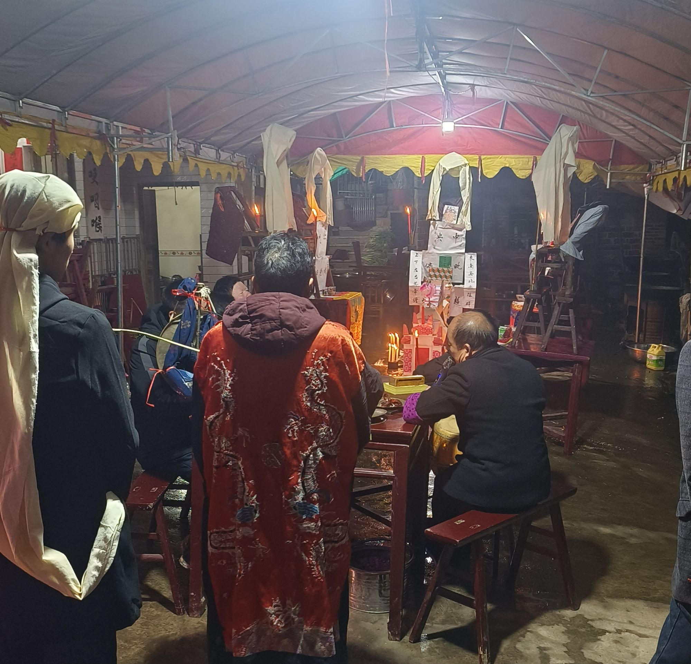
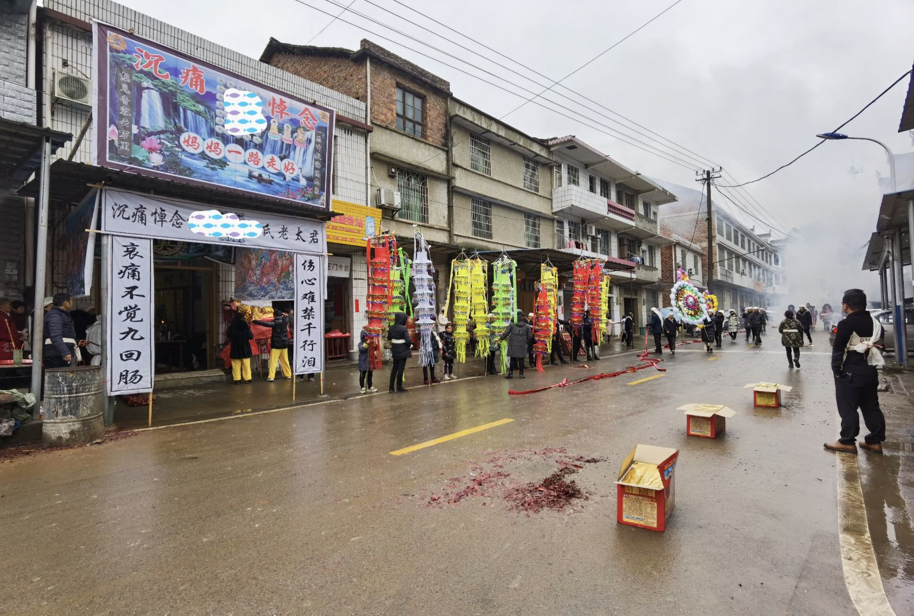
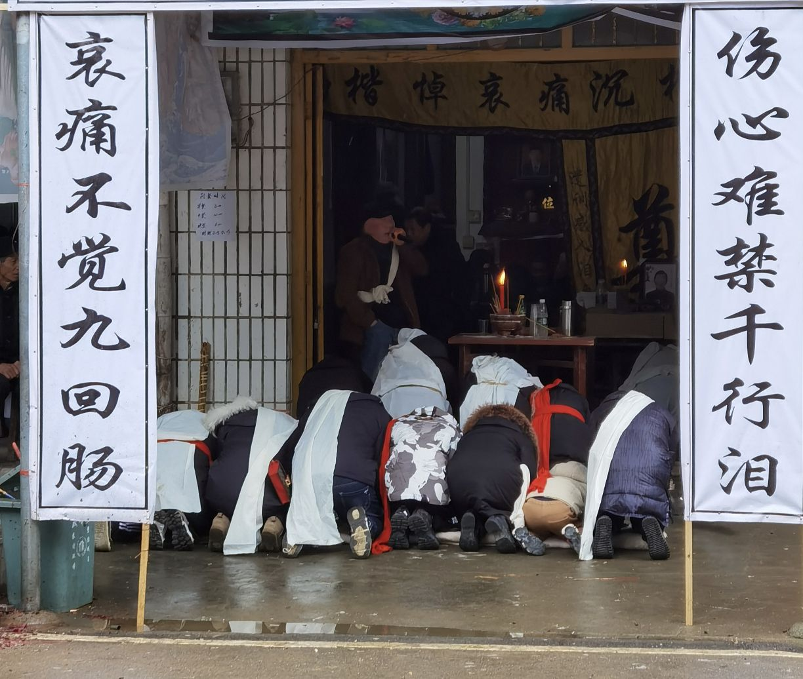

葬礼一直是人类文明中的一个重要仪式。就中国传统文化来说，土葬一直是汉族文化的重要一环。在汉族以外，还有其他火葬、水葬、天葬等做法。随着中国的城市化运动越来越快，土葬这种传统的文化习俗，已经越来越罕见，现在中国绝大多数地方都已经采用火葬来替代土葬，而我的家乡湖南可能是全中国汉族为主的地区中，为数不多仍保留大量土葬传统的省份。

## 懵懂认识
在我整个少年时代，很少接触到葬礼。印象深刻的是在1995年初，我爷爷的一个弟弟从工作生活几十年的江西省九江市回到湖南老家，那时候他已经60多岁了，回来后就住在我家，但是没过多久就因病去世，于是整个葬礼都是在我家举办的。这也是我人生中所经历的第一场葬礼，给我的童年留下了不可磨灭的印象，其中有几个场景经常会出现在我日后的梦境中。

1. 我第一次看到有成年人能够哭的这么撕心裂肺，在我这位叔爷爷去世后，她的女儿在葬礼上一直号啕大哭，嘴里含糊不清地说着很多悔恨懊恼而又伤感疲惫的话语，好几个亲戚朋友都拉不住她。
2. 这是我第一次见到和尚这个职业，以前只在电视上面见过，但由于我们土葬的习俗，需要请和尚按照佛教的习俗对死者进行超度，他们在那里连续为我逝去的叔爷爷念了几天佛教经文。
3. 在送我叔爷爷的遗体进行土葬时，我第一次认识到这个过程竟然是如此的艰难，遗体安放后的棺材，起码有600千克，为了能抬得动棺材还要用到巨大的木制框架和圆形木杆，合计起来超过750公斤，需要16位身强力壮的成年人才能抬得动，而且每一个参与抬棺的人还需要有一名后备人员进行交替作业，否则一个人很难坚持抬那么长的时间。
4. 由于我老家地处湖南中部山区，从家里面到埋葬棺材的坟地有接近两公里山路，而这些山路通常都是比较狭窄的，因此，在这么一个庞大的队伍前边，还得有一个彪形大汉扛着大砍刀去开路，一旦路边的树木或灌木可能会挡住行进的队伍，要立马砍掉。即便这样，在去土葬的路上还是出现了一点意外，因为16个人在抬棺时受原始山路凹凸不平影响，棺材在抬的过程中出现了侧倾现象，最后是有人专门跳到棺材上面去摆动棺材，才保持了平衡。

## 全程经历

在1995年之后的很长一段时间，我几乎没有参加过任何一场葬礼，直到15年后。从2010年到2024年，我全程经历了5场葬礼，分别是我的父亲、岳父、爷爷、奶奶还有外婆，都是采用的土葬方式。这里面用时最短的是我岳父的葬礼，从去世到安葬只用了4天时间，用时最长的是我奶奶的葬礼，从去世到安葬经历了13天。虽然时间上差距很大，但过程却大致相同。

1. **入殓**
​这是一个非常重要的步骤，通常从人去世到入殓，都需要几个小时到一天不等的时间。在湖南农村，家中有老人的，家家户户都会备有棺材，通常是由硬质的树木做成，并用大量桐油打磨后刷漆，确保密封严实，这样的棺木一般都超过了250公斤。
​死者在入殓前，通常都要等家属到齐之后才能开始，有时候死者的子女可能不在身边，那就需要等待更长的时间。例如，我的岳父是在广东的医院去世，当时除了我妻子以外，岳父的其他女儿均不在广东，所以我驾驶自己车，连夜将岳父遗体从广东运回650公里外的湖南老家，此时我妻子的姐姐们已经在岳父家等待。
​死者在入殓时，家属都会请当地专门的入殓师帮忙化妆更衣。然后由当地专门研究阴阳五行和八卦理论的老人，挑选一个合适的时间，再将遗体安放到棺材中。棺材里面通常也会放入大量的生石灰进行防腐。在盖上棺盖后，还要用木胶密封缝隙，并用粗长的铁钉钉入，防止松动。如果是在夏季温度较高的时候，通常还需要租赁一个很大的冰柜，盖在棺材上面，防止遗体过快氧化。

2. **求神引路**
​在湖南农村，每个村都会有一个土地庙。在死者入殓后的当天晚上，家属通常都要带着死者遗像，由和尚或者道士带领去土地庙进行祭祀。一方面告知土地神在其管辖的区域又有人去世，并详细说明死者姓名、出生年月等个人信息。另一方面，为死者灵魂带路，通过一路上连绵不断的铜锣声、鞭炮声和焚烧冥币，告知死者该如何找到回家的路。
​水神是汉族文化中最重要的神之一，死者去世后，家属还要在和尚或道士带领下，到家附近的河流边去祭祀水神，形式与土地神几乎一样。另外，死者身前穿过的衣服鞋袜等个人用品，通常也要到水边祭祀焚烧。

3. **长明灯和香火不断**
​在死者入棺后至安葬前，死者棺木下方和遗像前，均要点燃长明灯，不管过多长时间，灯都不能熄灭，遗像前的线香也是如此，这就是中国传统文化中的香火不断。在十几年前，我们一般是使用菜籽油来点灯，现在有专门的蜡烛购买。但难度最大的是香火，因为以前的线香通常只能点燃30分钟左右就需要更换，如何确保24小时都有线香在燃烧，是件很耗费精力的事情，通常只能几个人轮流来照看。现在我们能买到一米多长的线香，一根能燃烧七八个小时，大大降低了劳动强度。

4. **经文超度**
​死者去世后，我们通常都要花三到七天时间请和尚道士到家里来为死者念经超度，包括众所周知的佛教《金刚经》道教《往生咒》等等。在持诵经文时，死者的子女都要全程陪同。

5. **超度仪式**
​在为死者进行超度的过程中，还有一个重要的仪式，叫走“奈何桥”，“奈何桥”是中国民间神话中转世投胎必经的地点，这个过程中需要祭祀地府很多位神灵，家属通常需要打赤脚跟随和尚和道士在户外进行。

6. **单独为死者的祭祀仪式**
​在葬礼过程中，死者的各类亲属都要为死者送上大量纸质的冥币、金山银山、衣服、房子等祭祀用品。在上个月我奶奶的葬礼上，我们焚烧了将近500公斤的冥币和各类祭祀用品。其中，我们传统观点认为冥币必须是由成长期在一年以内的竹子制成的竹纸盖以铜钱印才是最好的品种，而像那些参照当代各国货币印刷出来的花花绿绿的冥币则一文不值。

 

7. **家祭**
​家祭是葬礼上非常重要的一个步骤，一般是在死者安葬的前一天晚上进行。家祭的参与者是死者所有的亲属。例如在我爷爷的葬礼上，近百人参与了家祭活动。包括子女、儿媳妇、女婿、侄子、侄女、外甥、外甥女、孙子女、外孙子女、姻亲子侄等等，每一类亲属要安排一场祭祀活动，通常由一人作为代表来宣读他们所共同撰写的祭文，然后是一系列的祭祀仪式。这种家祭活动，有时候需要长达六七个小时才能完成。

8. **安葬地点及时间选择**
​在湖南农村，一般去世的人都是选择在自家祖坟地或者自己家的山地进行安葬，但通常都要由当地专门的人员看过风水之后才能确定具体的地点及朝向。
​安葬的时间也是很讲究，一般都要使用中国按照传统历法，对照死者的生辰八字，以及家属的生辰八字，按照阴阳五行和八卦理论来选择。有时候时间不凑巧的，我甚至见过从去世到安葬需要等待30多天的情况。
​由于都是安葬在山上，所以葬坑仍然是采取手工挖掘方式进行，在我们家乡，葬坑通常都需要挖2.5米深，长宽分别为2.2米和1米，对于没有挖过这种土坑的人来说，可能需要三个人连续挖掘三天才能成功，但是也有一些专业人员，只需要一人一天就能够完成。

9. **出殡**
​出殡的过程与我在第一部分讲得相同，目前我们仍然是采取16个人抬棺的方式进行。过程中，沿路都要撒冥币和燃放烟花爆竹，死者后辈都要披麻戴孝送死者上山安葬。除此之外，还有其他送葬队伍，包括和尚道士、上门演出的乐队、舞龙舞狮队以及亲朋好友和当地的村民等，这在中国传统文化中叫做风光大葬。

10. **报丧和乞讨百家米**
​这个程序到如今已经少见，但是我在十几年前还是亲身经历过一次。那时候由于通讯还不是很方便，在死者去世后，通常都要由子女亲自到亲朋好友家去跪地磕头报丧，如今已经都是用手机或者微信等通讯工具取代了。乞讨百家米的情况，目前偶有发生，主要指的是，如果死者的死亡时间按照阴阳五行和八卦理论属于一个很不好的时间点，那么死者家属为了避免发生不好的事情，就要去附近100户人家乞讨大米，每份一丁点，然后把这些大米做成一锅饭吃完。

## 一点自己的想法

葬礼在全世界任何文化中都是一个庄重而严肃的事情，对于5000年文明的中国来说尤其如此。大到古代皇帝和现代国家领导人的葬礼，小到每家每户为逝去亲属所举办的葬礼均如此。在中国传统文化中，婚礼和葬礼是人生中最重要的两件事，即便葬礼属于“丧事”很多人还是会把这两个并称为“红白喜事”，其中“红事”指婚礼，“白事”指葬礼，认为都是“喜事”。

最近几十年来，随着中国式现代化的全面推进，大多数人的日常生活方式已经发生了翻天覆地的变化，在快节奏的生活模式下，传统葬礼已经被很多人当做迂腐不堪的封建迷信来看待。一些人觉得葬礼完全是多余的，人死后什么都不知道了，办葬礼毫无意义。有的在城市高楼大厦中生活的家庭，遇到长辈去世，立马送到殡仪馆火化然后将骨灰装进骨灰盒选个墓地就埋了，全程只要两三个小时，仿佛再多一秒钟都不吉利，至于土葬，更是绝对抵触。作为中国传统农村地区出生长大，又一直在城市工作生活的我来说，也有非常矛盾的心理，这里我试图从正反两个方面来分析，并提出我个人的倾向性观点。

* **传统土葬的缺点**
	* **耗时耗力**
​正如我在前面所说，传统土葬短则四五天，长则一二十天，对于现代社会来说，时间太长了。即便是在政府机关或者国有企业工作的人群，他们在直系亲属去世时，最多也只能享受五天假期，如果葬礼的时间过长，势必影响到他们工作和收入的稳定性。特别是在部分民营企业工作的人员，请丧假还需要扣除相应天数的工资，并且因为死者死亡时间的随机性，这种计划外的请假，甚至可能导致因此而丢掉工作。
​土葬仪式是一项非常耗费体力的活动，特别是对于死者的直系后代，儿子、孙子等。繁多的跪拜仪式，让人特别难受，有时候陪着和尚念经，就得在旁边跪上几个小时，对于一些年龄较大的人来说，很受罪。经常在听说在农村有人家里长辈去世时，因为葬礼时间过长，子女连续熬夜高强度应付葬礼仪式导致突发疾病的情况。

	* **花费太大**
​在我老家，举办一场葬礼平均要花费8万元以上，这是因为我老家山区人民经济收入普遍较低的情况下。事实上，我妻子与我家是同一个县不同的乡镇，2019年在她父亲的葬礼上，我们花费了将近15万元人民币，而这也仅仅是她们乡镇普通的葬礼成本。按照县政府统计，到2022年我县人均居民纯收入仅20700元，一场葬礼，需要耗费一家四口一年以上的收入。

	* **扰民**
​在湖南农村举办葬礼，有两个东西必不可少，一是烟花爆竹，二是大音响或者喇叭。一场葬礼，从头到尾燃放的烟花爆竹，起码超过1千公斤，每隔几分钟就要燃放一个，在送葬的路上，甚至每隔几米就要燃放一箱大型的烟花，噪音污染很大。大音响或者喇叭要全天播放哀乐，对周围的居民也会有明显的影响。

	* **低俗活动掺杂**
​经常在网上看到有些地方在举办葬礼时，会加入一些非常出格的活动，比如加入了脱衣舞女表演、情歌对唱表演等低俗或者明显不合时宜的环节，造成人们在心理上普遍的抵触。

	* **城乡差异明显**
​在城市化的过程中，普通人在城市没有自己的土地，而商业的墓地面积只够埋骨灰盒，根本没有办法进行土葬。另外普通人在城市居住的房产，基本上都是商业房产，几乎没有可能像农村宅基地建房一样，可以空余出很大的面积来举办葬礼。

* **传统土葬的好处**
	* **对死者人生最后的回顾**
​传统葬礼会从每一个参与者不同的角度来对死者的一生或者与死者之间的交往历程来做系统而全面的回顾和评价，并以祭文和集体祭祀仪式对这些内容予以固化，也就是“盖棺定论”。几千年前孔子说“人之将死，其言也善”，中国文化中每个人在自己的人生后半段，都会想着要尽量积极向善，非常重视自己在死后的名声，也就是俗称的历史评价，即便这个历史只是在亲友之间很小圈子里面的历史，但这种评价，对于死者家庭和后人却是极为重要的。一个传统的葬礼，让所有人都有时间和精力来思考死者的一生，这无疑对每一个生者都是无形的道德的约束，毕竟谁又不会死呢。当然，无论死者的一生怎样，在葬礼上，人们都会给予他最后的尊重，并尽量给出客观而偏向积极的评价，尽可能营造和谐积极的氛围，消弭仇恨与消极情绪。

	* **一次身心洗礼**
​我觉得没有任何一个其他时刻能与传统葬礼时刻相比更能让人思考生命和生活的意义，特别是在一个又一个繁琐冗长的葬礼仪式面前，很难让人不去深入思考人生的意义到底是什么？思考自己与死者之间的亲情、爱情、友情经历，是否有自己做错的地方、做得好的地方。有哪些需要自己在今后的人生中改善或提升的事情。自己在今后的过程中又如何看待与其他亲友之间的关系。例如，在我父亲的葬礼上，我就一直在思考今后如何处理与子女之间的关系，即便那个时候我都还没有结婚。另外，我儿子和女儿的姓名也是在我参加爷爷葬礼的过程中思考出来的，即便那时候他们还没有出生。

	* **构建更加亲近的亲戚关系**
​当代社会生活节奏非常快，我们已经很难有较长的时间能够与存在血缘关系的亲戚之间密切联系，像传统葬礼这样一次五天以上的聚集，在未来的生活中应该再难以遇到了。例如，堂兄弟、表兄弟，以及与各种长辈之间的关系，毕竟我们与自己的堂兄弟姐妹、表兄弟姐妹之间都有1/2的基因源自共同的祖父母或外祖父母。

	* **获得心灵的慰藉**
​有很多的子女在自己父母长辈在生时对待他们并不好，特别是一些婆媳关系比较糟糕的家庭，儿媳妇往往与丈夫的父母关系很糟糕。但是在中国传统文化中，百善孝为先，子女如果对父母不够孝顺，除了遭受旁人的非议，自己也内心难安。但是很多时候这种关系的处理都不是想当然就能改善的，也正如很多人所说，为什么要办那么复杂的葬礼呢？死者在生的时候，你对他好一点就行。事实上，正是由于尽孝这个事情很难做好，很多家庭的子女就是无法在长辈还活着时尽到孝心，因此，他们更加需要一场隆重的葬礼来获得心灵上的慰藉。虽然有点事后诸葛亮的味道，但却也是人之常情。

	* **人死债消**
​中国文化讲究入土为安，不管一个人与死者生前存在多大的矛盾或仇恨，只要人一死，这些问题也就烟消云散了。即便一些地方还有“父债子还”的传统，但如今仅仅局限在继承遗产的范围内，超过遗产的部分也一笔勾销了。在传统文化中，这种清算通常就在葬礼过程中完成，很多时候就是以债主、仇人在所有人见证的葬礼上对着死者遗像的一个鞠躬为标志。等到死者入土为安后，就再也不会提起这些事情。

总而言之，我认为给死者一个体面的葬礼是有必要的，无论是土葬还是火葬，是传统葬礼还是新式葬礼。但也有以下几点建议：
 
1. **葬礼的时间不宜过短或过长。**
如果只是一个几分钟或几十分钟的追悼会，还不如不办，几乎起不到任何效果。但现代城市殡仪馆，很多时候都得排队办追悼会，客观上也没条件搞太长时间。另外，即便是传统葬礼也不宜时间过长。那种动辄十多天的搞法，真是脱离现实了，明显没有必要。事实上，最近我奶奶这次葬礼，我曾经跟专业人士据理力争过，最好是在7天内完成，但因为其他特殊原因，最终只能听从他意见，持续了13天。我觉得城市里面的葬礼，如果能把主要的程序延长到一天或者一天半是比较合适的，在现有模式基础上，增加一些必要的仪式环节，营造更加浓厚的历史文化氛围，对于生命和死亡教育是很有意义的。农村的传统葬礼，控制在三到四天即可，太长的话意义不大，事实上我参加了这几次葬礼，都有一些较长时间的“真空期”，完全可以压缩时间办完。

2. **一些没必要的土葬习俗可以合并或精简。**
也不是说农村传统土葬习俗全是封建迷信，但确实有很多没有意义的环节，可以精简或者合并。一些跪拜习俗可以适当保留，但没必要逢人跪下磕头，一些神话和宗教习俗不需要面面俱到，一些扰民做法可以精简或取消。但也不要像江苏省南通市一样，该市政府以杜绝封建迷信为由，最近出台文件在全市范围内禁止燃烧冥币和祭祀用品，受到了广泛的批评。

3. **多给传统习俗一些宽容和理解**
1949年新中国成立后，在全国开展了浩浩荡荡的反封建迷信活动，在一个90%以上的人口都是文盲、封建迷信无处不在、民众普遍愚昧的时代，开展这种运动是很有必要，但经过几十年改革开放，如今的人们已经很难再相信真正的封建迷信活动，更多的是对一些传统习俗和文化的传承，只是借传统文化形式因地制宜展现当代人的思想和风貌，没必要一棒子打死。我很希望湖南的土葬习俗，在农村地区能够继续坚持下去，放眼望去，目前全中国汉族传统地区这种习俗都已经快绝迹了。

