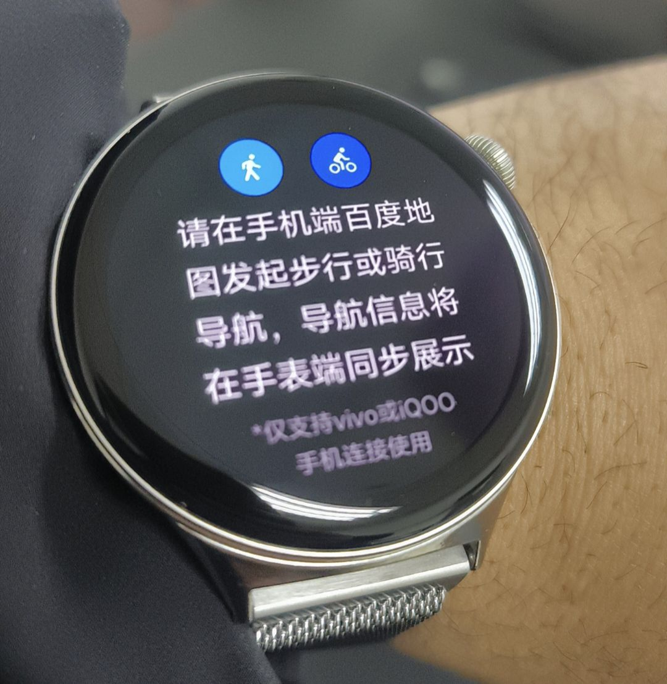
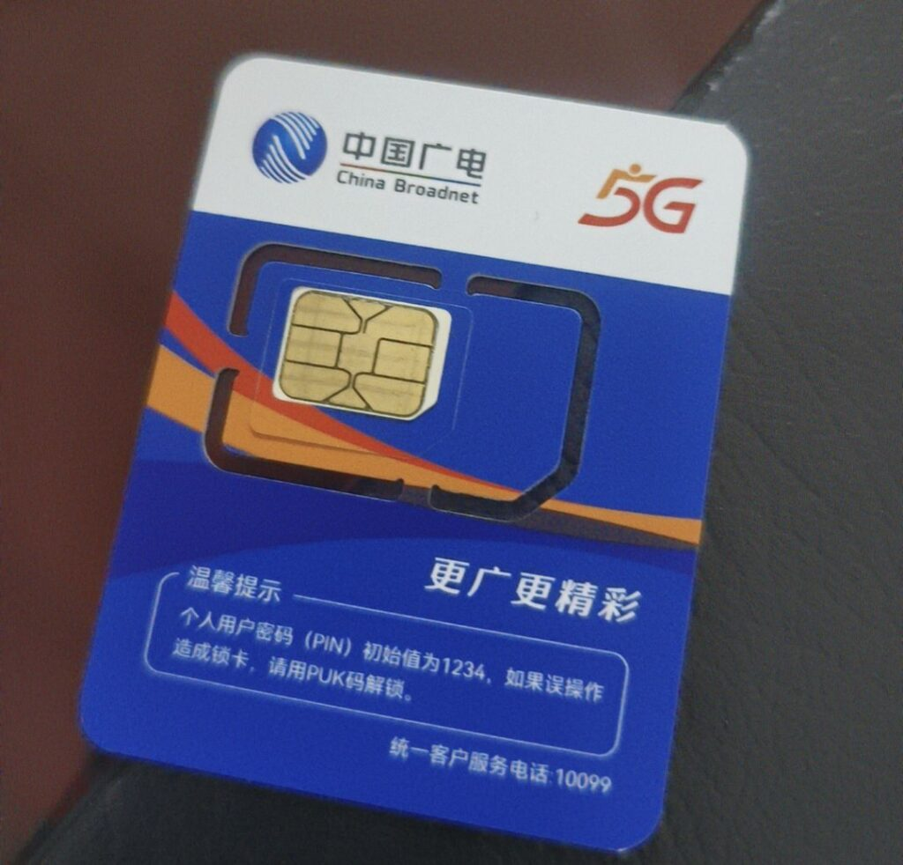
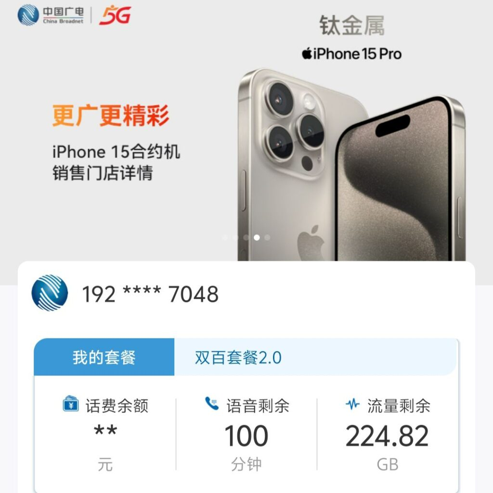
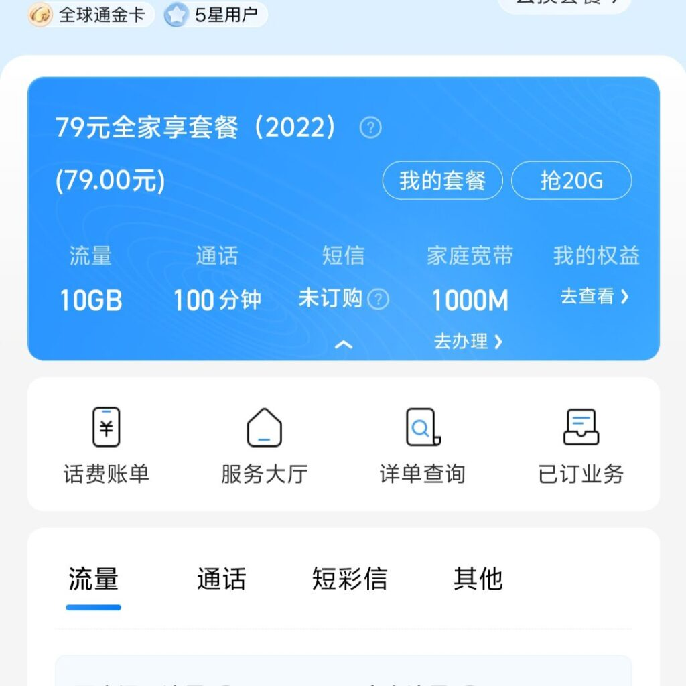

Recently, I purchased the Vivo X100 Pro smartphone and also got the Vivo Watch 3 smartwatch. Additionally, because I found my previous mobile plan with China Mobile to be too expensive, I added a mobile SIM card plan from China Broadcasting Network. Here, I'll briefly share my experiences with these products.

## VIVO X100 PRO  

The Vivo X100 Pro claims to be one of the most powerful camera phones among domestic Chinese smartphones. From my recent usage, I feel it lives up to this reputation, and I decisively chose the 1TB storage version when purchasing. The Dimensity 9300 CPU it's equipped with is a significant upgrade from the Dimensity 9000 in the Vivo X80 I used previously, and the memory has also increased from 12GB to 16GB, which means I probably won't need to consider changing phones for a few years.  

Before using the Vivo X80, I had never purchased any Vivo products, nor had I bought anything from its sister brand, OPPO. However, in the past few years, Vivo and OPPO have frequently been among the top five in China's smartphone sales rankings, and sometimes even in the top five globally. During the period when Huawei was unreasonably sanctioned by the U.S. government and couldn't produce 5G phones, I was due for a phone upgrade and bought the Vivo X80, my first 5G phone. I was immediately impressed. Whether it's the phone's system features, smooth operation, or camera performance, this phone has brought me great surprises. In my history of using BlackBerry, iPhone, Samsung, and Huawei phones, I believe this product ranks in the top three in my mind, along with the BlackBerry 9780 and iPhone 4s.

## VIVO Watch 3  
The Vivo Watch 3 is the third smartwatch I've purchased, and if counting other smart bands, it's the fifth wearable smart device I've owned. I've previously owned the Apple Watch 3, Huawei Watch Fit 2, Honor Band 4, and Xiaomi Band 7. The Vivo watch is not particularly outstanding among smartwatches and lacks the competitive edge of the brand's smartphones. However, it's more affordable, and most importantly, since I'm already using a Vivo phone, using a Huawei or other brand's watch would pose significant compatibility issues. I would have to install a Huawei watch app on my Vivo phone, and this app needs to be set to always run in the background and set to "high power consumption" mode to ensure it's not automatically cleared by the phone system. In fact, for a long time before buying the Vivo Watch 3, the Huawei smartwatch I wore was never connected to my Vivo phone; the watch's Bluetooth function was always turned off because I never knew when it would suddenly disconnect from the Vivo phone, and some phone notification features couldn't be guaranteed to respond on the watch.  

The main drawback of the Vivo watch is that it runs on Vivo's self-developed BLUEOS system, which is too simple and only supports a few apps. Fortunately, it can still use WeChat, China's most important social app. However, because there are so few apps, the watch has an exceptionally long battery life. In my daily use, I found that the watch can last for 15 days without charging, almost as long as many long-lasting smart bands, which is much better than the daily charging experience of the Apple Watch 3.

VIVO Watch 3

## China Broadnet Mobile Plan  
    China Broadnet is the fourth national mobile operator in China, following China Mobile, China Unicom, and China Telecom. Possibly because it's a new entrant to the mobile market, China Broadnet offers very attractive mobile plan options. Currently, I chose the 29 yuan per month plan (only 19 yuan per month for the first year), which includes over 150GB of high-speed 5G data and 100 minutes of monthly call time. Compared to my previous China Mobile plan, which was 199 yuan per month for 70GB of data and 500 minutes of calls, plus a free 1000Mbps home fiber broadband, this new plan is a real bargain. After purchasing the China Broadnet SIM card, I downgraded my China Mobile plan to 79 yuan per month, which only includes 10GB of data and 100 minutes of calls, but fortunately, the 1000Mbps home broadband was retained.  
    China Broadnet uses mobile communication frequencies in cooperation with operators like China Mobile and China Unicom. So far, whether in urban or remote areas, the overall network signal has been satisfactory. After several months of use, I haven't encountered any network congestion or loss of phone signal, even in highway tunnels.

<figure>

<figure>

<figcaption>

China Broadnet sim card

</figcaption>

</figure>

<figure>

<figcaption>

China Broadnet plan

</figcaption>

</figure>

<figure>

<figcaption>

China Mobile plan

</figcaption>

</figure>

</figure>
