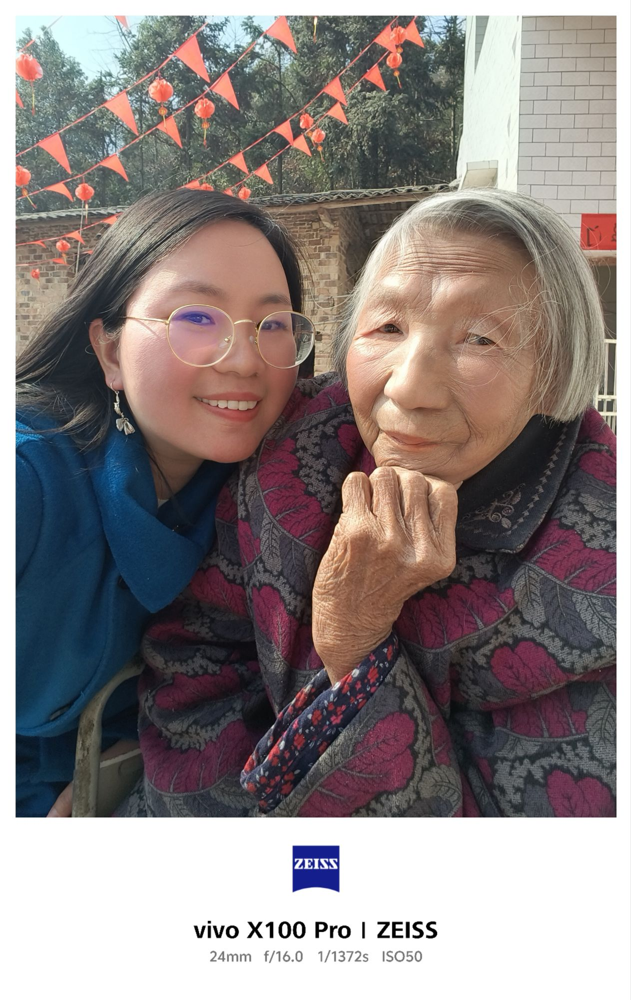
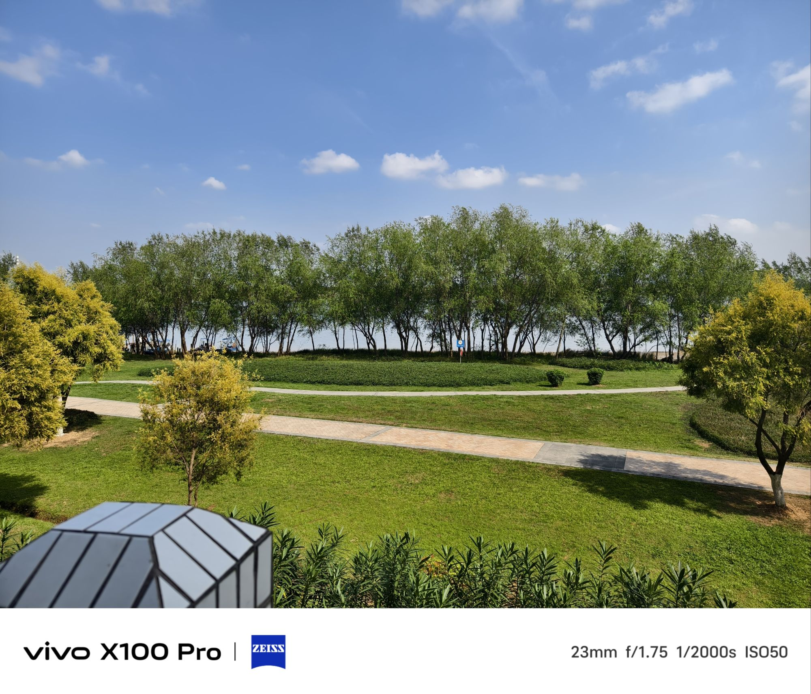
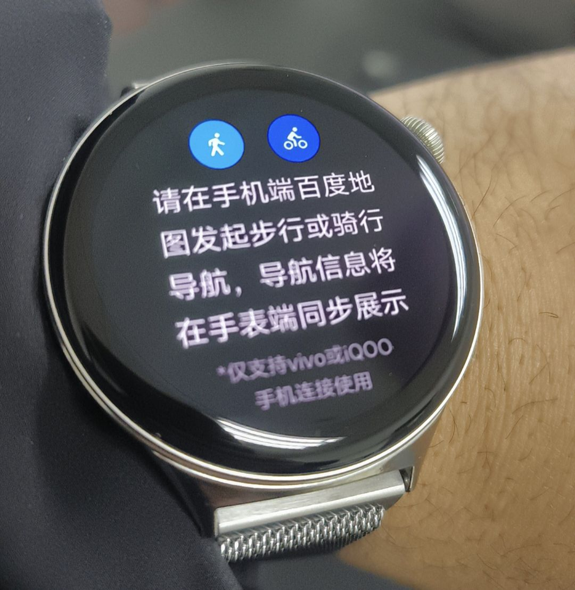
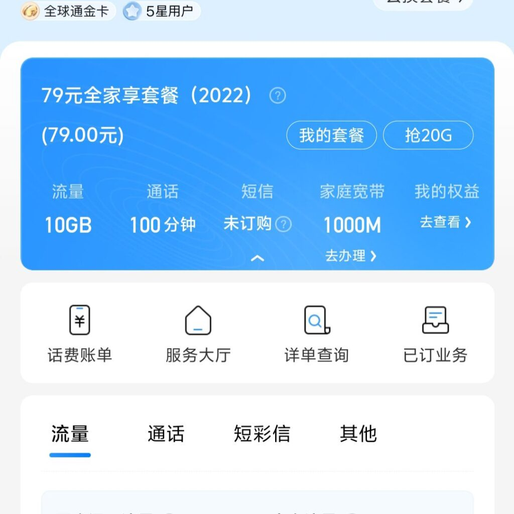

最近购入一台Vivo X100 Pro手机，同时购买了Vivo Watch 3智能手表。另外，由于之前使用中国移动的手机资费套餐感觉过于昂贵，也新增了一张中国广电的手机SIM卡套餐。这里简单谈谈自己使用这些产品的几点体会。

## VIVO X100 PRO
VIVO X100 PRO号称是中国目前国产手机中拍照功能最强大的手机之一，从最近的使用情况来看，我感觉它还是担得起这个称号的，购买时也果断选择了1TB存储的版本。搭载的天玑9300 CPU相比之前使用VIVO X80的天玑9000已经有了较大的升级，内存也从12GB增加到16GB，可能未来几年都不用再考虑更换手机了。
在使用VIVO X80之前，我从未购买过任何VIVO产品，当然，也未购买过VIVO的同门品牌OPPO的任何产品。但在前些年的手机销售榜单上，经常看到VIVO和OPPO排名全中国前五，甚至有时候还能进入到全世界手机销量的前五名。在华为被美国政府无理制裁导致无法生产5G手机的那段时间，因为正逢本人更换手机周期，因此第一次购买了VIVO x80这款5G手机，后来就彻底被它吸引住了。无论在手机系统功能、使用的流畅度还是拍照等各方面，这款手机都带给我非常大的惊喜，在我之前使用BlackBerry,iPhone,SAMSUNG,以及华为手机的历史上，我认为这款产品在我心目中可以排名至前三位。另外两款是黑莓9780和iPhone4s。

## VIVO Watch 3
VIVO Watch 3是我购买的第三款智能手表，如果包含其他智能手环在内，则是第5款能够戴在手腕的智能设备。之前购买过Apple Watch 3,Huawei watch Fit 2,Honor Band 4,Xiaomi band 7等产品。VIVO这款手表其实在一众智能手表中并不突出，远远没有该品牌手机的竞争力强。但好在价格较为便宜，最关键是我已经在使用VIVO手机了，如果继续佩戴华为或其他品牌的手表，则在智能手表与手机的适配性方面存在很大障碍。因为我不得不在VIVO手机上安装一个华为的手表应用，而且这个应用需要设置永远在后台运行，同时设置“高耗电”模式才能确保该应用不被手机系统在后台自动清理掉。事实上，在购买VIVO watch 3之前的很长一段时间里，我佩戴的华为智能手表压根就没有与VIVO手机连接，手表上的蓝牙功能一直是关闭的，因为我永远不知道这个华为手表什么时候又会突然与VIVO手机中断连接，一些手机通知提醒功能压根就无法保证在手表上响应。
VIVO这款手表的主要缺点是手表所搭载的VIVO自研BLUEOS系统过于简单，仅有少量APP可以在手表上使用，唯一值得庆幸的是，好在它还能使用微信这个中国最重要的社交APP。但也正是因为APP很少，所以这款手表的续航时间特别长，我在日常佩戴使用的过程中发现，这个手表居然可以做到连续15天不用充电，几乎能做到与很多长续航的智能手环一样持久，比Apple Watch 3那种一天一充电的体验来说真是好太多。

## 中国广电手机资费套餐
中国广电是中国第四家全国性的移动通信运营商，前三家是中国移动、中国联通、中国电信。也许是因为刚进入移动通信市场，因此中国广电有着非常优惠的手机资费套餐。目前我选择的是29元每月套餐（首年只需19元每月），有150GB以上的高速5G流量以及100分钟每月的电话通话时长。相比起我之前使用的中国移动套餐，简直算是白菜价。我之前使用中国移动每月199元的手机资费套餐，包含每月70GB的手机流量以及500分钟通话时长，另外赠送一条1000Mbps的家庭光纤宽带，但在购买中国广电手机卡之后，我已经将中国移动的手机套餐进行降级，目前使用的是79元每月套餐，仅仅包含20GB的手机流量和100分钟通话时长，但好在1000Mbps的家庭宽带仍保留了。
中国广电采用的移动通信频段有很多多是与中国移动、中国联通等运营商合作，目前来说无论是在城市或偏远郊区，整体网络信号都是合格的，经过几个月的使用，我没有遇到到任何网络拥堵、手机信号丢失等情况，即便是在公路隧道中，亦如此。

![[1c789b027aaa4bed9334ac5f630e0756.png]]
