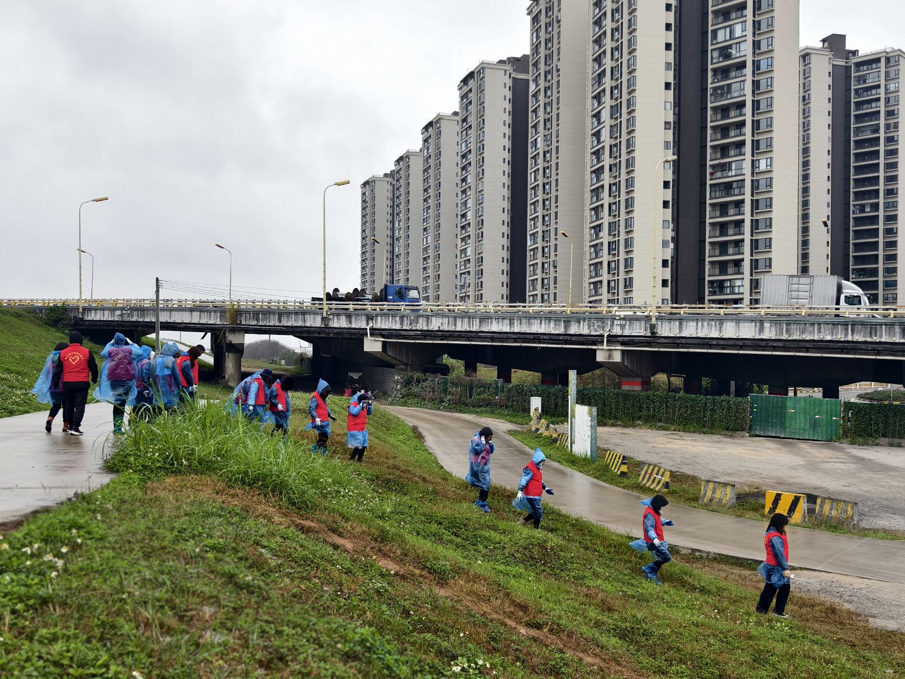
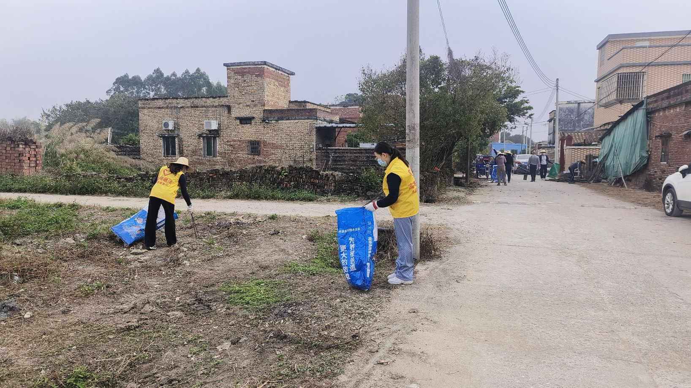
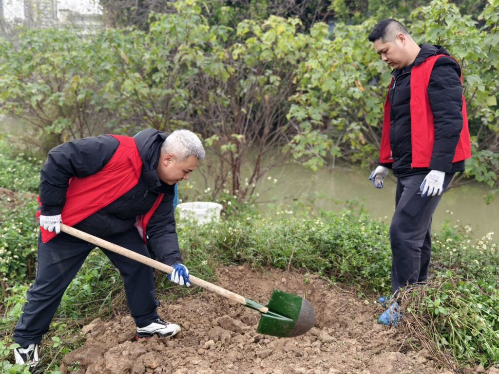
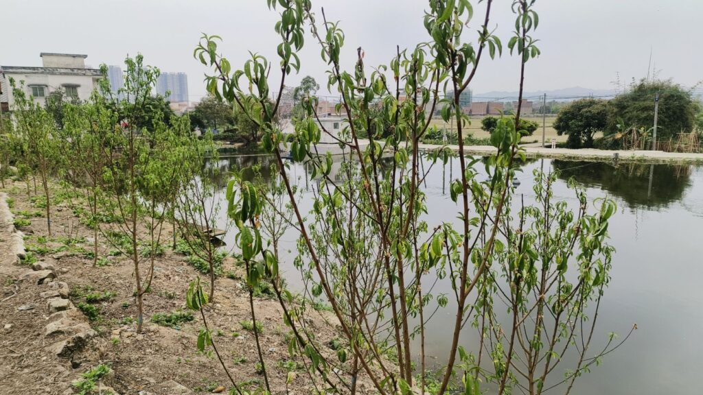
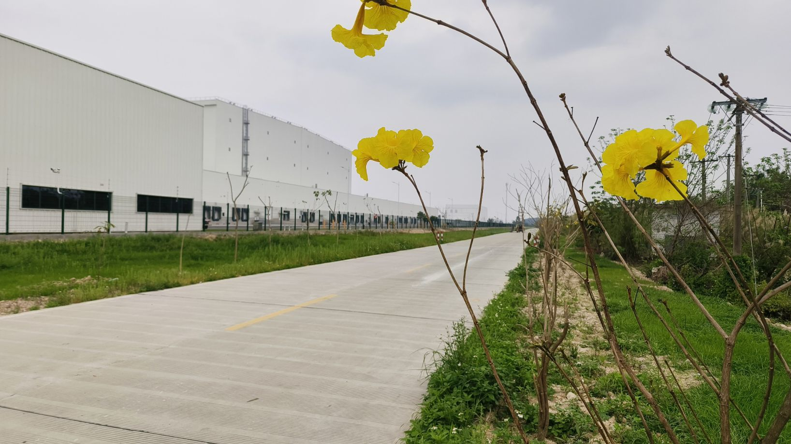

Recently, I have been participating in a series of rural volunteer public welfare activities for several days. The main tasks are twofold: one is to help solve the problem of rural uncleanliness, and the other is to carry out tree planting activities in rural areas. Here, I would like to focus on the reasons behind the first issue.

**I. Land Nature Problem  
**Due to the nature of land ownership in China, which is only state-owned land and rural collective land, all urban land is state-owned, while most rural land is collectively owned by local villagers. In both urban and rural areas, lakes, mines, rivers, railways, highways, and national roads are also owned by the state. However, during the process of urbanization, the actual demarcation between collective land and state-owned land is not as clear as it seems, especially in the border areas between cities and rural areas. It is almost impossible for ordinary people to accurately identify whether the land they are standing on is state-owned or collective. This has led to a significant social issue, namely, who is responsible for waste disposal. According to land ownership, if it is waste on state-owned land, the government has specific departments responsible for its management. But if it is waste on collective land in rural areas, the responsibility falls on the local villagers. For the government, with tax revenue and financial income, they can well afford the sanitation work within the city. However, for rural collectives, it is impossible to tax the villagers and it is also difficult to ask them to pay for sanitation services, given their generally lower incomes. The rural sanitation work often relies on the staff of the villagers' committees, but these personnel are scarce, making it difficult for them to spare time from their regular duties to engage in sanitation work.

  
**II. Land Dispute Problem  
**Due to the rapid development of urbanization in China, cities are inevitably encroaching on rural land, converting collective land ownership into state-owned land. This process is known as "land requisition." However, because the process of land requisition itself requires a lengthy administrative procedure, local governments cannot start the process only when the land is about to be used. They usually plan ahead many years in advance and start the requisition plan by purchasing the collective land and storing it. After the government buys the collective land, another crucial step is the approval of the superior government. Typically, the central government will annually set a maximum number for converting collective land into state-owned land, and each province, city, and administrative area must strictly adhere to their respective maximum numbers for changing land ownership within their quotas. If the indicators are exceeded, the relevant officials will be held accountable. In fact, many local officials have been held criminally responsible for this issue.

This leads to a problem: in the eyes of the villagers, the collective land in their own village has been purchased by the government and is no longer considered their own; however, from the government's perspective, although the land has been paid for, in terms of legal ownership, it remains collective land. Once these lands become deserted for more than two years or encounter other legal disputes, there is a high likelihood that they may revert to the villagers. Additionally, the collective land collected by the government, due to its original agricultural use, cannot be utilized with the various machinery and equipment employed in urban sanitation cleaning processes. Moreover, since neither party is willing to take on the responsibility of sanitation cleaning, it is easy for third parties to take advantage of this situation. Some urban residents and small and medium-sized enterprises may take the opportunity to dump garbage on these lands when there is no supervision, or even illegally occupy these lands to construct temporary structures.

  
**III. Villagers' Initiative Problem  
**Collective land is collectively owned by the local villagers. In theory, each villager has the responsibility to maintain the sanitation of the collective land. However, since this responsibility is collective rather than proportional, it is impossible to quantify how much each villager should specifically contribute to the cleaning. If villagers collectively carry out cleaning, it will also lead to the phenomenon of "the more capable, the more responsible," causing those who are more actively involved to bear more. Moreover, the current major problem in rural areas is population "hollowing out," with most of the working-age population having moved to cities to seek a living, leaving behind mostly the elderly and left-behind children. The village we visited had a registered population of 4,275, but the actual daily resident population was only 2,184, with 52% being over 60 years old. Particularly in some remote areas of the village, many houses built over 40 or 50 years ago have been abandoned by their owners. These uninhabited places have become the "paradise" for those who dump garbage randomly, and without someone checking, these piles of garbage might remain undiscovered for a long time.

<figure>

<figcaption>

abandoned traditional southern Chinese houses

</figcaption>

</figure>

  
**IV. About Tree Planting in Rural Areas  
**March 12th is designated as Tree Planting Day in China. Every year at this time, Chinese people engage in various tree planting activities. For example, this year, on Tree Planting Day, the public welfare volunteer service I participated in planted a total of 1,100 trees in a village. Apart from a small part where excavators can be used, most of the planting is still done manually. While tree planting is generally easy, ensuring the survival rate of the saplings is much more challenging. The trees we planted in early March have already started to turn yellow and wither, requiring follow-up replanting. But some of the trees have grown well. For example, the row of yellow goldenrain trees we planted next to the IKEA Home Furnishing Logistics Base has already bloomed after only 20-plus days.

