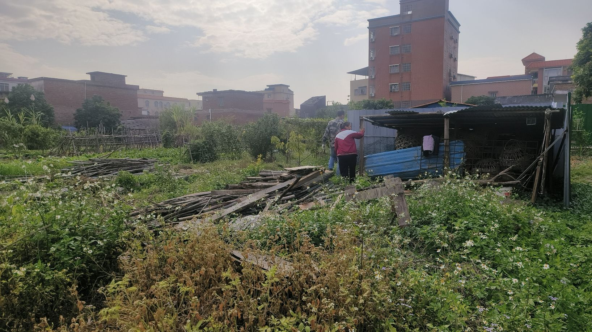

参加农村公益活动。最近连续参加了很多天的农村志愿服务公益活动，主要是干两件事情，一是帮助解决农村脏乱差问题，二是在农村开展植树活动。这里我想重点讲讲第一个问题的原因。

## 一、土地性质问题

由于中国的土地权属只有国有土地和农村集体土地两种，城市土地全部属于国有，而农村土地大部分属于当地村民集体所有，另外，无论是在城市还是农村，湖泊、矿场、河流、铁路以及高速公路、国道等也均为国家所有。但在城市化进程中，集体土地与国有土地的实际分界线并非那么清晰，特别是在城市与农村的交界地带，对普通人来说，要精准识别脚下踩踏的土地到底是国有土地还是集体土地是几乎不可能的。这也就由此产生一个较大的社会问题，即垃圾清理的责任到底在谁。按照土地性质，如果是城市土地上的垃圾，政府有专门的部门负责管理。但如果是在农村集体土地上的垃圾，清理责任则是当地全体村民。对于政府来说，有税收有财政收入保障，他们可以很好的负担起城市范围的卫生工作，但对于农村集体来说，他们不可能向村民征税，也难以要求村民在普遍较低收入的情况下缴纳卫生清理费用。农村卫生清洁工作很多时候都依赖于村民委员会的工作人员，但这些人员数量又很少，在本职工作之余很难抽出时间去从事卫生清洁工作。

## 二、土地争议问题

由于中国城市化的迅猛发展，城市不可避免要不断蚕食农村土地，将农村土地的集体土地权属变更为国有土地，这个过程也就是“征地”。但是因为征地行为本身需要漫长的行政程序，地方政府不可能等到马上就要使用土地时才开始征地。他们通常会长远谋划，提前很多年便启动征地计划，先支付征地款将集体土地购买过来收储。而在政府购买集体土地后，该土地想要转变为国有土地，还有非常重要的一个环节——上级政府审批。通常中国政府部门每年会自上而下提出一个集体土地转为国有土地的最大数值，每个省份、每个城市、每个城市辖区均要严格按照各自的最大数值，在其限额内对已土地权属进行变更，如果超出指标，相关官员则需要受到责任追究。事实上很多地方官员都因为这个问题被追究刑事责任。  

这就衍生出一个问题，在村民眼中，自己村中的集体土地已经被政府购买了，事实上不再属于村民；但在政府眼中，虽然这些土地已经支付了价款，可在法律上，土地性质仍然是集体土地，一旦这些土地荒废超过2年或遇上其他司法纠纷，很有可能会继续回归村民。另外，政府收储的集体土地，由于原本用途均为农用性质，所以城市卫生清洁过程中所使用的各种机器设备几乎都不能在这些农村土地上使用。加之双方都不愿承担卫生清洁责任，很容易给第三人钻空子——一些城市居民、中小企业会趁无人监管时将垃圾倾倒在这些土地上，或者违法占用这些土地搭建一些临时性构筑物。

## 三、村民主动性问题

集体土地都是属于当地村民集体共有，理论上来说，每个村民都有责任去承担集体土地上的卫生清理责任。但是，由于这种责任是共同的而非按份的，每个村民需要具体承担多少卫生清理责任完全无法定量计算出来，如果村民一同去开展清理，也势必造成“能力越大责任越大”的现象，导致越积极参与的村民可能付出越多。更何况，目前农村最大的问题是人口“空心化”，大部分适龄劳动人口都早已去到城市谋生，剩下来的，大部分都是老人和留守儿童。我们此次去到的这个村子，登记有户籍人口4275人，但实际日常居住人口仅有2184人，其中60岁以上老人占52%。特别是村中一些偏远区域，十室九空，绝大部分建于四五十年之前的房子都已经被房主废弃。而这些无人居住的地方，更加成为那些随意倾倒垃圾者的“乐园”，如果不是有人进去查看，可能这些垃圾很长时间都不会被发现。  

## 四、关于农村种树这个问题

3月12日在中国被定义为植树节。每年这个时候，中国人都会开展大量植树活动，例如，今年植树节，我所参加的公益志愿服务活动，总共在一个村子里种下1100棵树。除了小部分地方适合使用挖掘机作业外，很多地方都还是依靠人工挖掘方式种树。虽然种树过程总体来说比较容易，但要想保证树苗的成活率就很难了。我们从3月初开始种的这些树，有不少都已经发黄枯萎，需要后续去补种。但也有些树已经生长得不错，例如，我们在宜家家居物流基地旁边种下的这一排黄花风铃木，才过了20多天，已经开花了。

