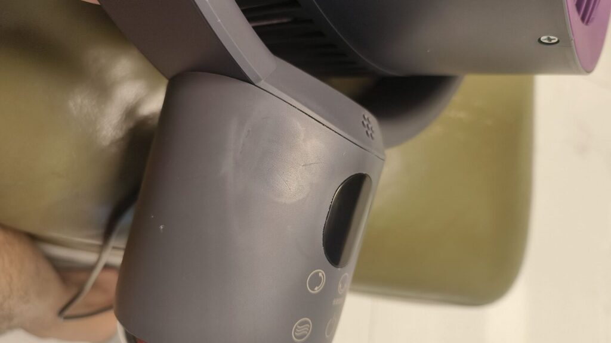
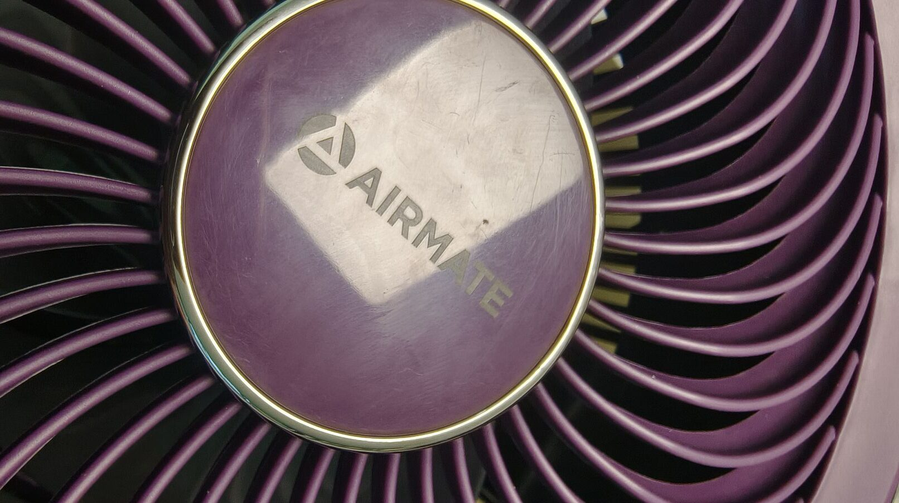
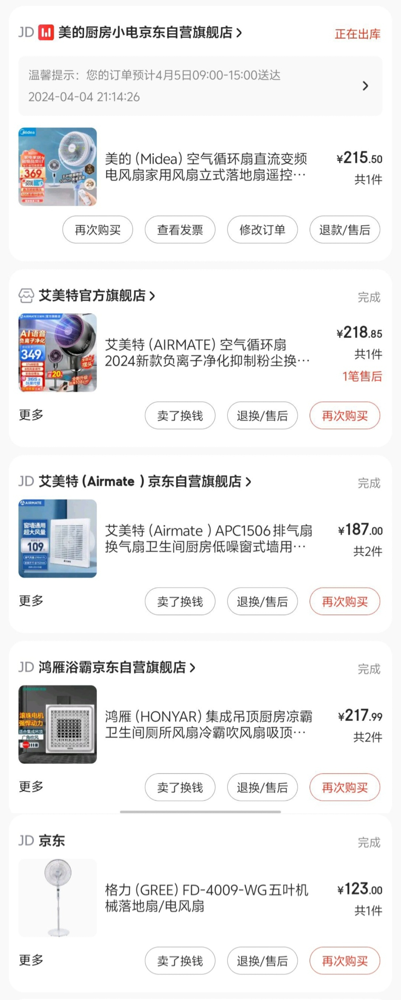
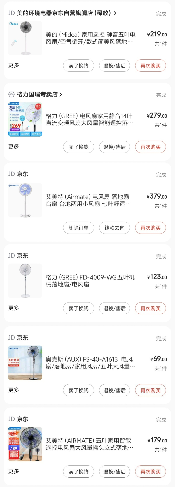

最近天气越来越热，我在京东APP上选择了一款Airmate FA18电风扇。促销海报上宣称这是一款高质量、静音并具有AI语音功能的电风扇，但我收到的产品让我产生了怀疑。它看起来像是一个制作粗糙的产品。首先，产品标志有很多使用痕迹，看起来像使用了很长时间，这意味着它可能是一个二手产品。此外，我在电风扇的几个部分发现了许多瑕疵，这让我质疑这是否是一款假货。由于我是从京东的Airmate官方旗舰店购买的，根据我20年的网购经验，这样的渠道卖假货几乎是不可能的。而且，我在京东网购近千次，从未遇到过这样的问题。我将这些照片发给了客服，他们很快就安排了退货。由于这次极其不愉快的购物体验，我不想再继续购买这个品牌的产品，并立刻购买了一款由美的电器生产的电风扇。

  
事实上，我之所以一开始选择购买Airmate电风扇，是因为我对他们历史上的产品有信任。我之前购买过这个品牌的两个电风扇，对两个都有很好的体验。但这次之后，我再也不想买这个品牌了。而且，美的电器实际上是我们市最大的本地企业之一，也是世界500强企业之一，其产品一直受到消费者的信赖。

