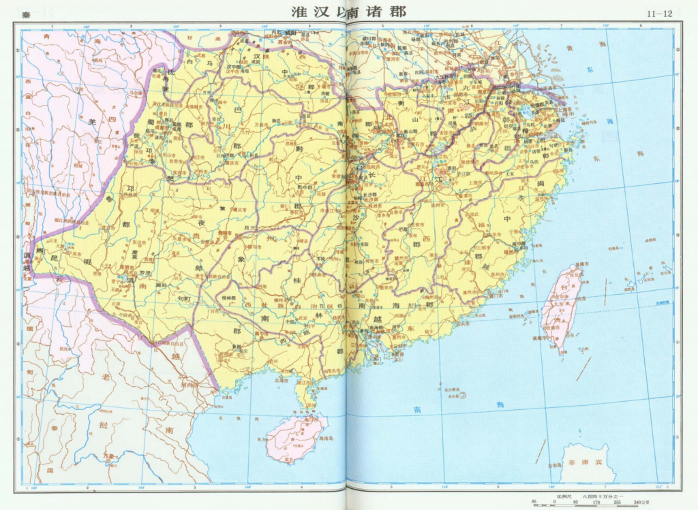
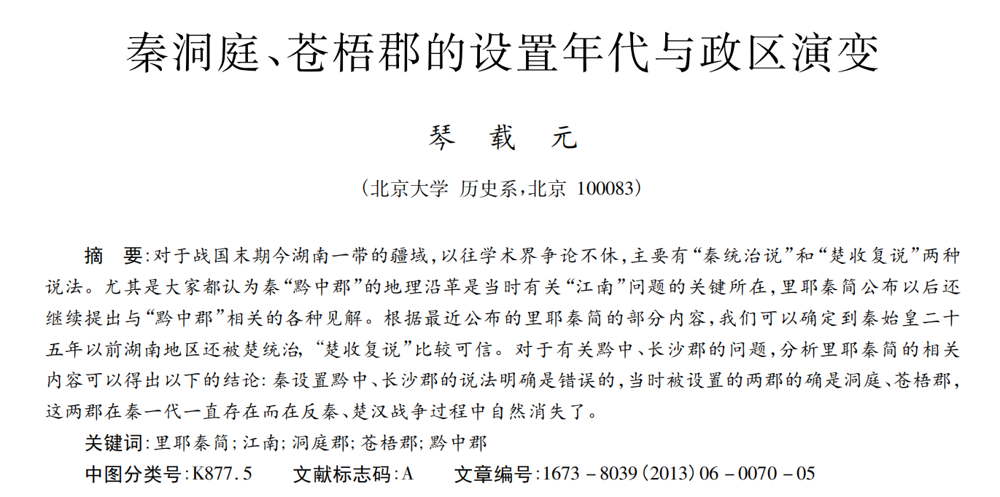
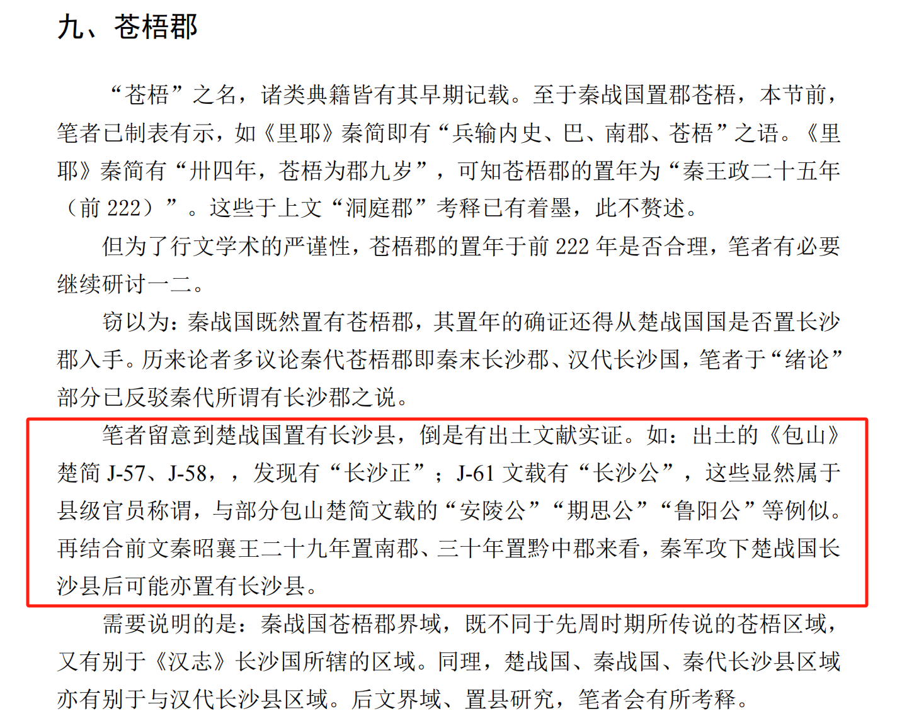
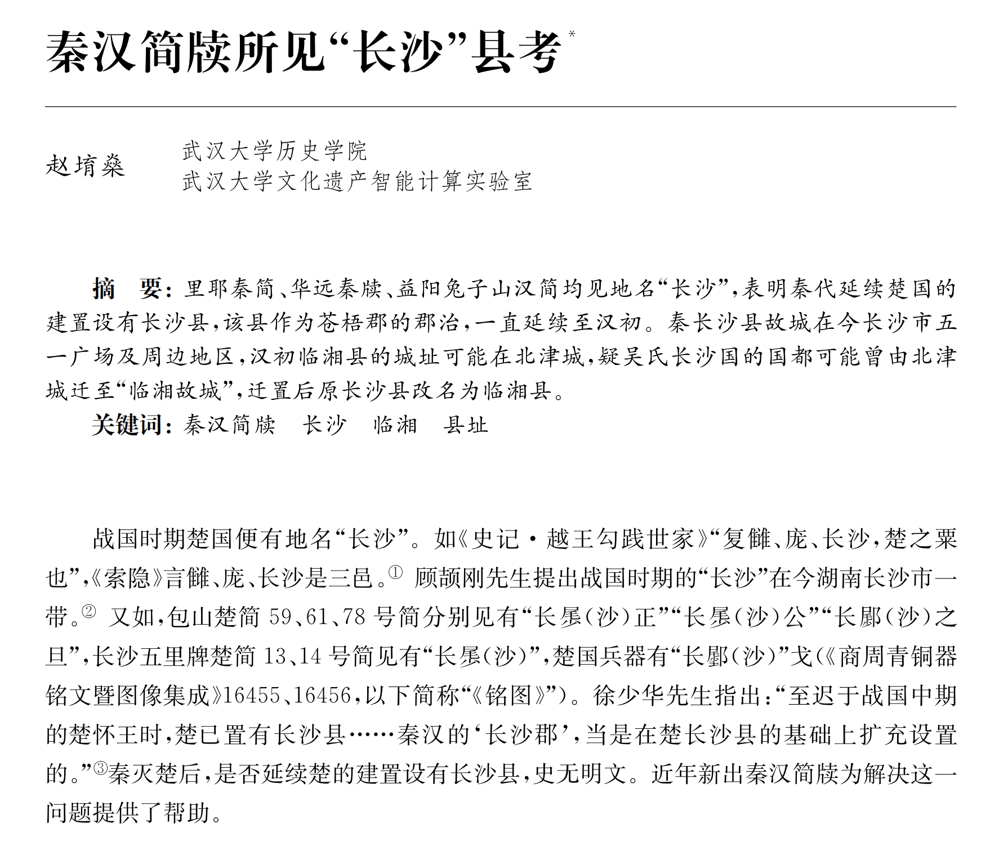
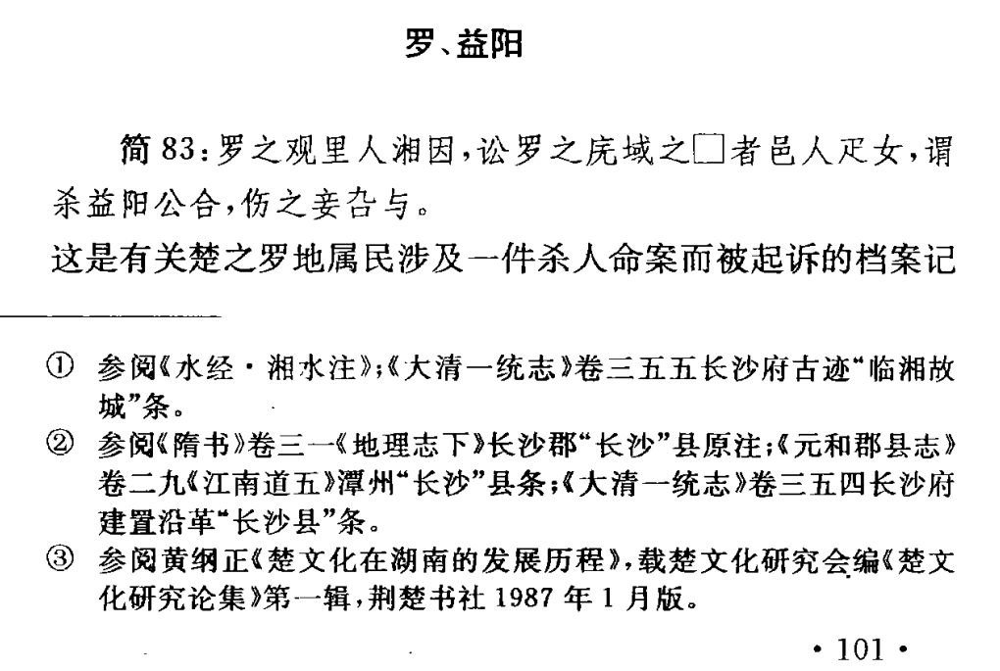
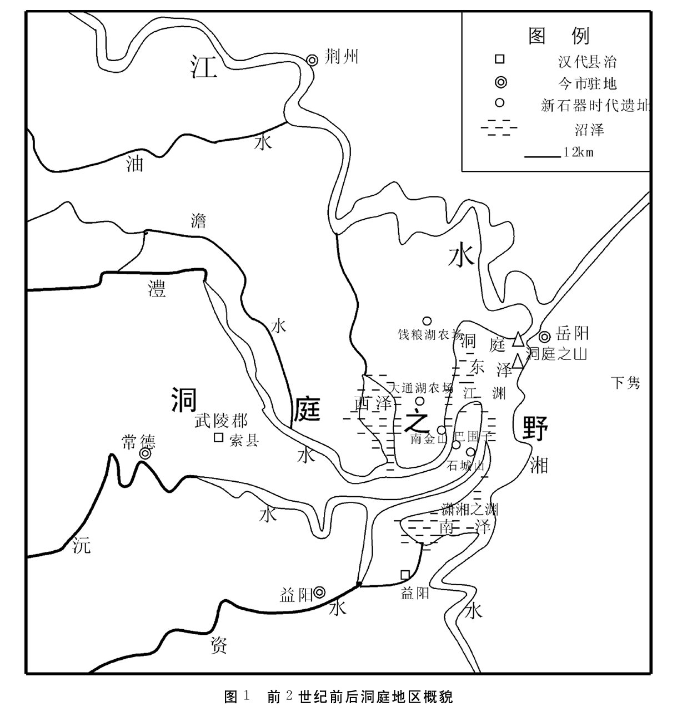
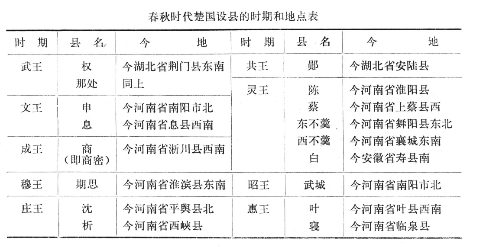
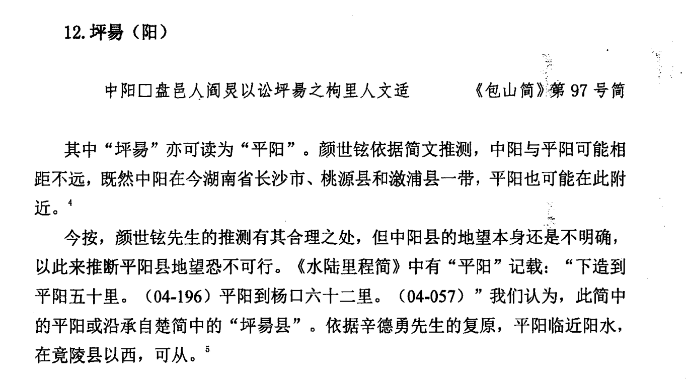

Recently, I came across an article that claimed Chaling, Leiyang, and Liling as the three oldest counties in Hunan, with Chaling County established in 221 BC, Leiyang County in 202 BC, and Liling County during the Eastern Han Dynasty, which is 1900 years ago. However, I have serious doubts about this conclusion.

* * *

## 1.Chu State: Pioneer in Establishing Counties in China

Although traditional Chinese historians believe that the system of counties in China began with Shang Yang’s reforms in the Qin state in 356 BC, according to archaeological evidence, the current consensus in the historical field is that the system of counties in China originated at least from the Spring and Autumn period (770-476 BC), and many scholars trace this origin back to the Western Zhou period (1046-771 BC). In any case, the Chu State (approximately 1042-223 BC) was the earliest to establish counties, and the Hunan region was developed and incorporated into the Chu State during the Warring States period (476-221 BC) until the Qin conquered the Chu. This raises a question: before 221 BC, was there a county-level region in Hunan that survived, whether it was a county of the Qin Dynasty (221-207 BC) or of the Chu State.

* * *

## 2.Changsha Jun\* in Historical Texts

```
* "Jun" 郡 is a type of administrative division in ancient China, belonging directly to the state, with counties at the next level，similar to "prefecture".
```

When I first saw this article, Changsha County immediately came to my mind. This is because, in my memory, the history of Qin Dynasty’s Hunan has almost been overturned since the discovery of the Liye Qin bamboo slips in Western Hunan. For a period of 2000 years, the history of Qin Dynasty’s Hunan was based on records such as “Records of the Grand Historian” and “Book of Han,” which were divided into Changsha Jun and Qianzhong Jun. The historical records used in Chaling County also have this background. However, the conclusion that Chaling County was established in 221 BC, directly drawn from the “Book of the Later Han Dynasty · Counties and States IV” about Changsha Jun, seems hasty, as the “Book of the Later Han Dynasty” does not confirm that Changsha Jun was established in 221 BC either.

> Changsha Jun was established by the Qin. It is located 2,800 li ( ancient Chinese length unit) south of Luoyang. It consists of thirteen cities, with 255,854 households and 1,953,072 people. Including Linxiang, You, Chaling, Ancheng, Ling, Xiangnan, Liandao, Zhaoling, Yiyang, Xiajun, Luo, Liling, Rongling, etc.
> 
> ——“Book of the Later Han Dynasty · Counties and States IV”

> In the 26th year of Qin Ying Zheng (221 BC), Chaling County was established, governing the current Chaling and Yanling counties, belonging to Changsha Jun.
> 
> ——“Annals of Chaling County”



Since Changsha Jun may be a later conjecture without solid evidence, according to Sima Qian’s “Records of the Grand Historian” (104 BC), in 202 BC, Emperor Liu Bang of the Han Dynasty enfeoffed Wu Rui, a founding general, as the King of Changsha, establishing the Changsha Kingdom, which lasted until 7 AD. This record from the dynastic history should be accurate. Then, the term “Changsha” must have a source. My conjecture is that if Changsha Jun did not exist, then Changsha County might have existed. After all, the Qin Dynasty had only fallen five years before the establishment of the Changsha Kingdom. So, I started searching for evidence with this conjecture.

* * *

## 3.Qin Dynasty’s Changsha Jun Debunked

In fact, the record of Changsha Jun in the “Book of the Later Han Dynasty · Counties and States IV” has already been debunked in contemporary times; that is, there was no place called “Changsha Jun” in the Qin Dynasty. At the same time, there are also considerable doubts about the records of Qianzhong Jun, and it is highly likely that there was no place called “Qianzhong Jun” in the Qin Dynasty either.

> The statement that the Qin set up Qianzhong and Changsha Juns is clearly wrong. The two prefectures that were actually set up were Dongting and Cangwu, and these two prefectures continued to exist throughout the Qin Dynasty but naturally disappeared during the Anti-Qin and Chu-Han Wars.

<figure>



<figcaption>

“The Establishment Era and Political Region Evolution of Qin’s Dongting and Cangwu Jun” by Qin Zaiyuan.

</figcaption>

</figure>

* * *

## 4.Chu State Established Changsha County

Although Changsha Jun did not exist in the Qin Dynasty, this does not mean that the history of Changsha can only be traced back to the Han Dynasty. For example, some scholars have found that as early as the Warring States period, the Chu State had already established Changsha County.[^1]



* * *

## 5.Changsha County was the Capital of Cangwu Jun

More recently, scholars have concluded through the study of Qin Dynasty bamboo slips such as Liye Qin Jian and other documents that Changsha County was the capital of Cangwu Jun during the Qin Dynasty, debunking the previously misunderstood two thousand years of Changsha Jun, which was actually Cangwu Jun.[^2]

> Liye Qin Jian, Huayuan Qin Du, and Yiyang Tuzishan Han Jian all mention the place name “Changsha,” indicating that the Qin Dynasty continued the Chu State’s establishment of Changsha County, which served as the capital of Cangwu Jun and continued until the early Han Dynasty. The ancient city of Qin Changsha County is located in the present Wuyi Square and surrounding areas in Changsha City, and the city site of Linxiang County in the early Han Dynasty may have been in Beijin City. It is suspected that the capital of the Wu’s Changsha Kingdom may have been moved from Beijin City to the “Linxiang Ancient City,” and after the move, the original Changsha County was renamed Linxiang County.



* * *

## 6.The Establishment Time of Changsha County

In addition, according to the textual research on the establishment time of Changsha County cited in the article, it can be known that the time when the Chu State established Changsha County was roughly between 329 BC and 296 BC during the reign of King Huai of Chu.[^3]

At the same time, among the multiple place names examined in the paper, there is also the current Yiyang, which is still in use and belonged to the Chu State’s counties during the Warring States period.



* * *

## 7.Changsha County is One of the Oldest Counties in Hunan

**Conclusion: Since both Changsha and Yiyang are located in northern Hunan, and the Chu State developed the Hunan region from north to south, during the Warring States period when the areas of YunMengZe and Dongting Lake were still vast[^4], these two places adjacent to Dongting Lake should be the earliest counties established by the Chu State in the Hunan region.**



* * *

## 8.Other

Counties Established by Chu State Regarding this, I also looked into the list of counties established by the Chu State during the Spring and Autumn period and the Warring States period that have been verified by current historical research. From the counties established by the Chu State in the Spring and Autumn period verified by scholars in the 1980s, it can be seen that the sphere of influence of the Chu State had not reached the Hunan region at that time[^5], and the same is true for the more than forty counties established by the Chu State in the Spring and Autumn period that have been verified in recent years.[^6]



Finally, from the counties established by the Chu State in the Warring States period that have been verified by scholars, no place names that correspond to the current cities and counties in various parts of Hunan have been found either.[^7]
  



* * *

[^1]: Li Fengxian: “Research on the Year, Boundary, and County Establishment of Qin Dynasty’s prefectures during the Warring States Period.” Ph.D. dissertation, Qinghai Normal University, 2023. 

[^2]: Zhao Yuxuan: “Examination of ‘Changsha’ County in Qin and Han Dynasty Bamboo and Silk Documents.” “Documents Unearthed.” First issue, 2024. 
   
[^3]: Xu Shaohua: “Eight Comments on the Places Mentioned in the Baoshan Chu Slips.” “Journal of Chinese Historical Geography.” Vol. 4, 1996. 

[^4]: Zhou Hongwei: “Another Discussion on the Historical Process of Dongting Lake’s Changes.” “Journal of Chinese Historical Geography.” Vol. 20, No. 2, 2005. 

[^5]: Yang Kuan: “On the Nature of the County System of the Chu State during the Spring and Autumn Period.” “Research on Chinese History.” No. 4, 1981. 

[^6]: Chen Jian: “The Origin and Transformation of the County System in the Pre-Qin Period.” Ph.D. dissertation, Jilin University, 2019. 

[^7]: Zheng Yifan: “A Preliminary Study on the Counties of the Chu State during the Warring States Period.” Master’s thesis, Wuhan University, 2017. 
