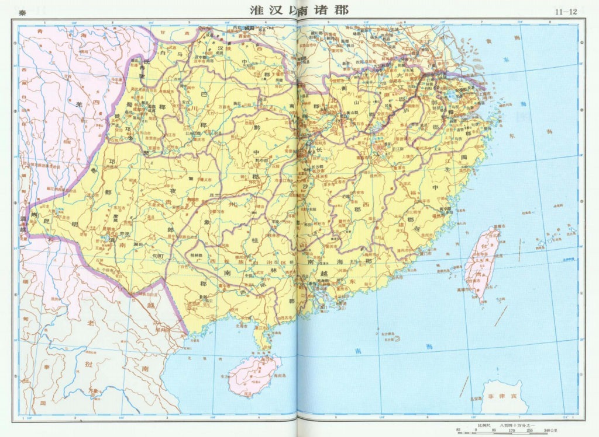
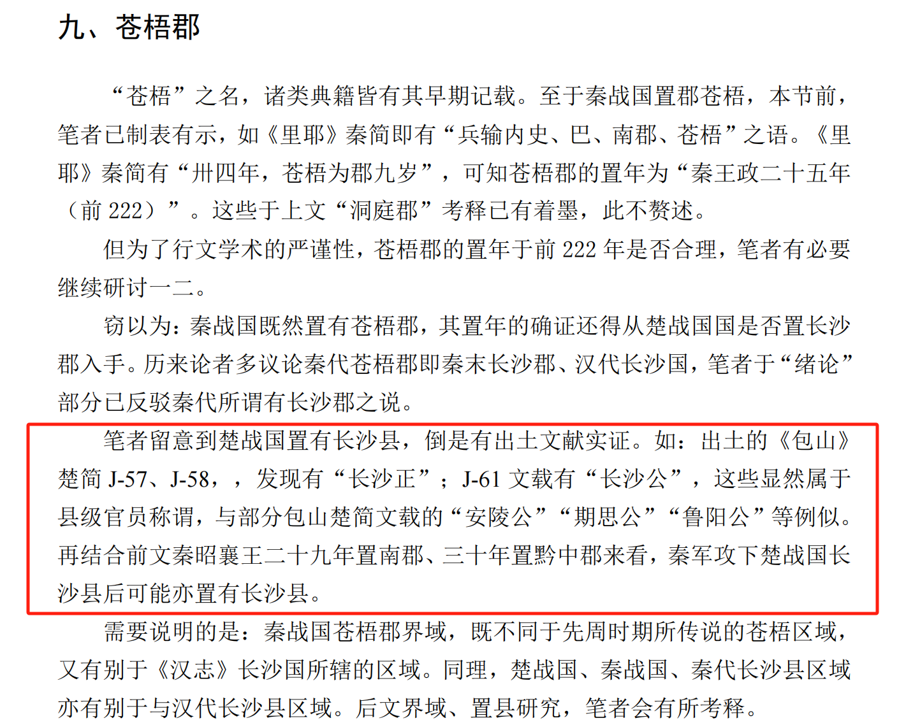
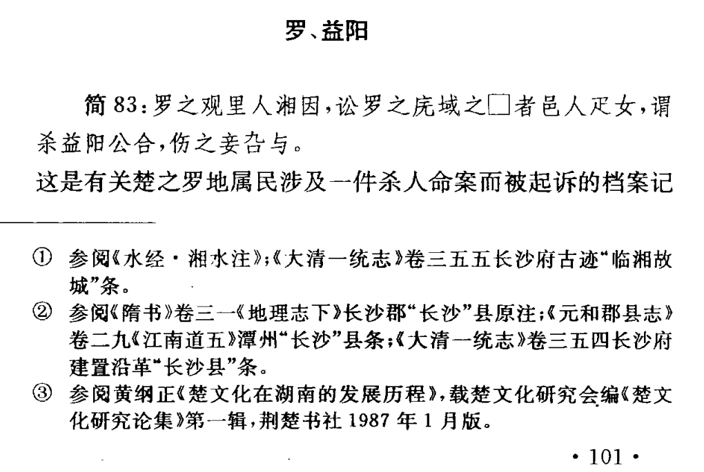
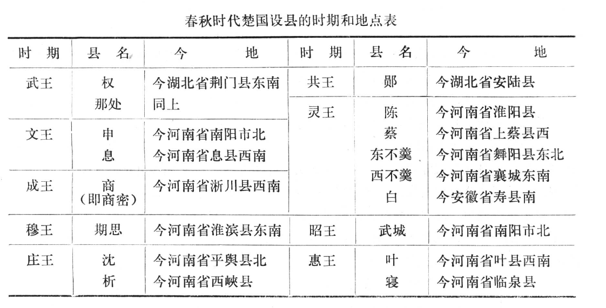

最近看到一个文章，称茶陵、耒阳、醴陵为湖南最古老的三个县，其中茶陵县始建于公元前221年，耒阳县始建于公元前202年，醴陵县建于东汉时期，距今1900年。但我对这个结论表示充分的怀疑。

---

## 1.楚国是中国最早设县的地区

虽然传统中国历史学家认为，中国的县制始于公元前356年秦国商鞅变法，但根据考古实证，目前史学界通说认为，中国县制起码起源于春秋时期（公元前770—公元前476年 ），也有很多学者将该起源上溯到西周时期（前1046～前771年），但无论哪种说法，楚国（约公元前1042年——公元前223年）都是最早设县的，而湖南地区在战国时期（公元前476年—前221年）被楚国开发并入，直至秦灭楚之前都属于楚国范围。由此产生疑问，即在公元前221年之前，湖南地区到底是否有县一级区域留存于世，无论其是秦朝（公元前221年——公元前207年）的县，还是楚国的县。

## 2.历史书中的长沙郡
其实我第一时间看到这个文章就立马想到长沙县。因为在我印象中，自从湘西的里耶秦简出土之后，秦朝湖南的历史几乎都被颠覆。在长达2000年的时间里，秦朝湖南的历史一直以《史记》《汉书》等记载为准，即分属于长沙郡和黔中郡。在茶陵县所使用的历史记载中也为该背景。但茶陵县志援引《后汉书·郡国四》中关于长沙郡的记载，直接得出茶陵县建于公元前221年，有点草率，因为《后汉书》也没确认长沙郡就是公元前221年设置的。

> 长沙郡秦置。雒阳南二千八百里。十三城，户二十五万五千八百五十四，口百五万九千三百七十二。
> 包含〖临湘〗〖攸〗〖荼陵〗〖安城〗〖霝阝〗〖湘南〗〖连道〗〖昭陵〗〖益阳〗〖下隽〗〖罗〗〖醴陵〗〖容陵〗等十三县。

——《后汉书·郡国四》

> 秦赢政二十六年（前221年），置茶陵县，治所含今茶陵、炎陵县全境，属长沙郡。

——《茶陵县志》

由于长沙郡可能是后代猜测出来的，并没有真凭实据，但按照司马迁《史记》（公元前104年）的记载，公元前202年汉高祖刘邦封开国功臣吴芮为长沙王，并以此范围建立长沙国，一直持续到公元7年。这段当朝正史中的记载应当无误。那么，这“长沙”二字必定有来源才对，我猜想的是如果长沙郡不存在，那显然可能存在长沙县这么个地方。毕竟长沙国成立时，秦朝才灭亡5年。于是我带着这个猜想开始搜索论据。

## 3.秦朝长沙郡被证伪

事实上，《后汉书·郡国四》中关于长沙郡的记载早已在当代被证伪，即秦朝并不存在一个叫“长沙郡”的地方。同时，关于黔中郡的记载，也很大程度存在疑问，秦朝大概率也不存在一个叫“黔中郡”的地方。

> 秦设置黔中、长沙郡的说法明确是错误的，当时被设置的两郡的确是洞庭、苍梧郡，这两郡在秦一代一直存在而在反秦、楚汉战争过程中自然消失了。

## 4.楚国设长沙县

虽然长沙郡在秦朝不存在，但这并不意味着长沙的历史就只能追溯到汉朝。例如，有学者在研究战国时期秦郡设置的过程中发现，早在战国时期，楚国就已经设置长沙县。[^1] 

## 5.长沙县是苍梧郡的郡治

近期更有学者通过对里耶秦简等秦朝简牍研究，得出长沙县在秦朝是苍梧郡的郡治所在，之前误传两千年的长沙郡，实则是苍梧郡的结论。[^2] 

> 里耶秦简、华远秦牍、益阳兔子山汉简均见地名“长沙”，表明秦代延续楚国的建置设有长沙县，该县作为苍梧郡的郡治，一直延续至汉初。秦长沙县故城在今长沙市五 一广场及周边地区，汉初临湘县的城址可能在北津城，疑吴氏长沙国的国都可能曾由北津城迁至“临湘故城”，迁置后原长沙县改名为临湘县。

## 6.长沙县的始设时间

另外，根据文中所援引长沙县始设时间考证，可以知道，楚国设置长沙县的时间大致为公元前329年——公元前296年楚怀王在任期间。[^3] 

同时，在该论文所考证的多个地名中，另有益阳地名现今仍在使用，同属于战国时期楚国的县域。

## 7.长沙县是湖南最古老的县之一

**结论：由于长沙、益阳均位于湖南北部，而楚国开发湖南地区，是自北向南而来，在云梦泽、洞庭湖面积依然广阔的战国时代[^4]，这两个挨着洞庭湖的地方应当就是楚国在湖南地区最早设置的县了。**

## 8.其他
对此，我也查找了一下目前历史学界已考证的春秋战国时期楚国设县名单。从学者在1980年代考证的17个楚国在春秋时期设置的县来看，当时楚国势力范围并未抵达湖南地区[^5]，在近年来考证的楚国40余个春秋时期的县中，亦如此。[^6]

最后，从学者考证的楚国在战国时期设置的其他县来看，亦未能找到能够与目前湖南各地市县相同的地名。[^7]

[^1]:李奉先：《战国秦郡置年、界域及置县研究》.青海师范大学2023年博士论文
[^2]:赵堉燊：《秦汉简牍所见“长沙”县考》.《出土文献》.2024年第一期.
[^3]:徐少华：《包山楚简释地八则》.《中国历史地理论丛》1996年第4辑.
[^4]:周宏伟：《洞庭湖变迁的历史过程再探讨》《中国历史地理论丛》2005年年第20卷第2辑.
[^5]:杨宽：《春秋时代楚国县制的性质问题》.《中国史研究》1981年第4期.
[^6]:陈剑：《先秦时期县制的起源与转变》.吉林大学2019年博士论文
[^7]:郑伊凡：《战国楚县初探》.武汉大学2017年硕士论文.