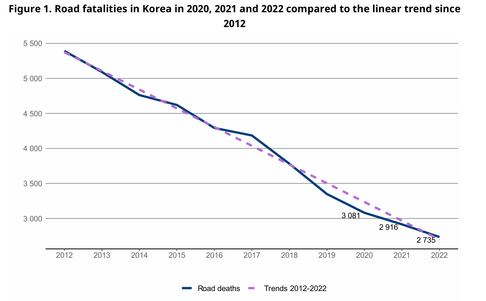
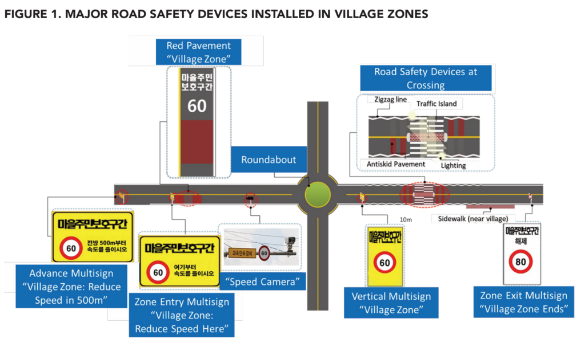
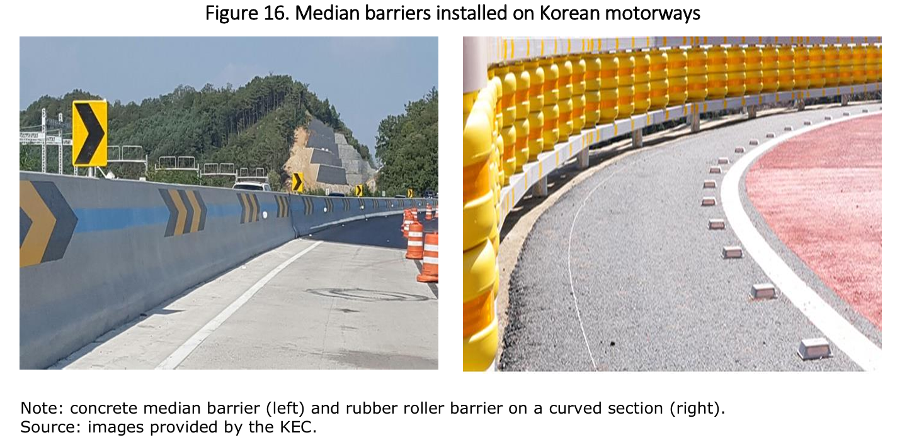

## 1\. The traffic safety situation in South Korea has changed completely

According to the latest statistics from the World Health Organization, South Korea's traffic accident death rate per 100,000 people has dropped from 25.6 in 2000 to 8.6 in 2019, rising more than 100 places in the global ranking in 20 years, second only to Qatar, Latvia, the Bahamas and Russia.


Further inquiries found that according to the data released by the South Korean government in recent years, the number of traffic accident deaths in South Korea has continued to decline for four consecutive years since 2020. In 2022, there were 2,735 deaths, and the mortality rate per 100,000 people has dropped to 5.3. By 2023, it will further drop to 2,551 people, and the traffic accident fatality rate per 100,000 people has dropped to 4.9, making it one of the world's leading countries in traffic safety.

  
_Road Safety Country Profiles Korea 2023 [\[1\]](https://fosu.cc/article/Korea%E2%80%99s-Experience-in-Governing-Traffic-Accidents#fn1)_

  
_Road Safety Country Profiles Korea 2023 [\[1:1\]](https://fosu.cc/article/Korea%E2%80%99s-Experience-in-Governing-Traffic-Accidents#fn1)_

* * *

## 2\. Traffic safety used to be a major social issue in South Korea

If you search for "South Korea's traffic safety", it is not difficult to find that several years ago, South Korea had a high traffic fatality rate, ranking last among OECD countries.

> Jeju, Nov. 16 (Yonhap) -- Seol Jae-hoon, director of the Traffic Safety Research Headquarters of the Korea Institute of Transportation, attended a seminar on "Policy Proposals for Improving Traffic Culture" held at the Jeju Provincial Government Building on Nov. 16 and said that the number of traffic accident fatalities per 100,000 people in Malaysia in 2010 was 11.3, the highest among the 29 OECD member countries.[\[2\]](https://fosu.cc/article/Korea%E2%80%99s-Experience-in-Governing-Traffic-Accidents#fn2)

> Chinanews.com, July 7 According to Yonhap News Agency, on the 7th, the Organization for Economic Co-operation and Development (OECD) revealed that based on 2011, South Korea ranked second among the 31 OECD member countries with 105 traffic accident fatalities, ranking second after Poland (109). The number of traffic fatalities in South Korea is 1.7 times higher than the OECD average of 63.[\[3\]](https://fosu.cc/article/Korea%E2%80%99s-Experience-in-Governing-Traffic-Accidents#fn3)

In 2012, former South Korean President Lee Myung-bak said in a speech on national radio and the Internet that looking at the statistics related to disasters and disasters around the world, it is difficult to say that South Korea is close to joining the ranks of developed countries. In 2010, for example, more than 10,000 people died each year in work-related injuries, car accidents, and fires, and the economic loss amounted to 32 trillion won. In 2011, more than 340,000 people were injured in traffic accidents. With 15,000 suicides, the highest number of OECD countries, and the rapid growth of suicide rates among the elderly population, South Korea's social security situation in all aspects is extremely serious. Lee Myung-bak pointed out that only when the people can live and work in peace and contentment and have a safe living environment can they be called truly developed countries.

* * *

## 3\. South Korea's main practices for improving traffic safety

On the whole, South Korea's management of traffic accidents in recent years has experienced a process of transformation from local regional pilot to national promotion, from key areas of prevention to universal prevention, from temporary movement to legislative system, from extensive policy to fine management.

### Congressional resolution - Traffic accidents are reduced to zero movement  

In 2013, the National Assembly passed the Resolution on Reducing Road Traffic Accidents to Zero, which aims to radically improve road safety in South Korea. Although this goal may seem exaggerated, it does win broad public support, after all, slogans such as "promote zero emissions from vehicles" are common in many countries.

The resolution mainly includes three aspects:

- Actively formulate and revise relevant laws and systems such as the Traffic Safety Law

- Securing financial resources for traffic safety projects

- Establishment of an organization dedicated to the supervision and management of traffic safety affairs (Traffic Safety Research Institute)

The resolution consists of four basic principles [\[4\]](https://fosu.cc/article/Korea%E2%80%99s-Experience-in-Governing-Traffic-Accidents#fn4)

- Human life and health take precedence over all transportation purposes

- Suppliers and regulators of road transport systems are equally responsible as users

- The road traffic system minimizes human error and, if it occurs, damage

- Road traffic system suppliers, regulators, and citizens work together to achieve safety

### Nationwide call for ideas  

For example, the newly established Traffic Safety Research Institute has launched a nationwide open contest to call for ideas to help reduce road traffic accidents with 3 million won a year. Among them, the project that won the grand prize in 2014 was the designation of a low-speed zone in the village.

> In 2011, South Korea began to designate low-speed zones around disability care centers, but due to the lack of awareness of pedestrian protection in South Korea for a long time, in fact, pedestrian safety in South Korea has not been guaranteed. In 2013, South Korea had the lowest pedestrian road traffic fatality rate in the OECD, and the situation was particularly bad for the elderly, with the death rate for pedestrians over 65 years old nearly five times higher than the OECD average.

Thanks to the adoption of the Resolution on Reducing Road Traffic Accidents to Zero, the Ministry of Land, Infrastructure, Transport and Tourism of the Republic of Korea will coordinate the funding of the traffic safety project, and local funds will no longer be required. As a result, after 2014, villages across South Korea have been competing to join the low-speed highway zone program. The plan consists of two elements, one is to reduce the speed limit in the village area by demarcating low-speed zones, and the other is to install electronic monitoring equipment in each low-speed zone to give priority to pedestrians.

<figure>



<figcaption>

The Republic of Korea’s Campaign to Bring Road Crashes to Zero [\[4\]](https://fosu.cc/article/Korea%E2%80%99s-Experience-in-Governing-Traffic-Accidents#fn4)

</figcaption>

</figure>

According to statistics, in the pilot village area, the total number of car accidents decreased by 37%, the number of fatalities decreased by 29%, and the number of injuries decreased by 43% in the first six months after the installation of low-speed zone facilities. Seeing the success of the pilot program, more districts are seeking to establish village areas to improve pedestrian safety. The following year, 20 sections were added in 8 districts, and by 2018, another 30 sections were installed in 10 districts. Local residents generally welcomed the establishment of village areas, and some local governments decided to install village areas at their own expense. For example, in 2018, the Gapyeong government installed two villages from its own budget at the request of local residents. As of 2018, 64 villages in 23 regions of South Korea have joined the program.[\[5\]](https://fosu.cc/article/Korea%E2%80%99s-Experience-in-Governing-Traffic-Accidents#fn5)

### The safety plan is published annually  

Since the adoption of the Resolution on Reducing Road Traffic Accidents to Zero, South Korea has developed a series of plans to improve traffic safety every year. For example, in 2016, 26 measures in five areas were introduced, and 46 safety projects were continuously promoted, with the goal of reducing the traffic fatality rate to 1.6 deaths per 10,000 vehicles by 2017, making the use of seat belts mandatory for all seats on all roads, strengthening penalties for traffic violations, improving traffic safety education, and strengthening the regulation of commercial vehicle safety.[\[6\]](https://fosu.cc/article/Korea%E2%80%99s-Experience-in-Governing-Traffic-Accidents#fn6)

1. Establish a pedestrian-first transportation culture
    - Improving traffic laws: Continue to enforce **the policy of mandatory seat belts for all seats** and increase penalties for the most frequently reported violations by whistleblowers
    
    - Prohibition of reckless driving and revision of sanctions (implementation of monitoring facilities in locations with optimal control)
    
    - The new regulations to control careless driving **are punishable by up to one year in prison or a fine of up to $4,000**
    
    - Differentiated revisions to the provisions on liability insurance payout ratios for uninsured vehicles and escape accidents
    
    - Enforce control over illegal, unregistered vehicles
    
    - ****Vehicles with properly installed safety devices are rewarded by offering premium discount promotions****
    
    - Enhance road safety advertising by promoting collaboration among diverse road safety-related agencies
    
    - Improve policies that encourage citizen engagement, including "Good Driver Miles", experience-oriented "Advanced Education Centers", etc

3. Implement a security-oriented infrastructure
    - Continuous improvement of high-accident sites and hazardous road areas
    
    - Implement safety facilities including roundabouts and rest areas
    
    - Enhancement of incident management strategies in regional traffic information centers (CCTV surveillance)
    
    - Expansion of residential and school areas,**and legislation to establish a speed limit of 30 km/h for "community road areas"**
    
    - ****Promote Lane Departure Warning System (LDWS) and Automatic Emergency Braking System (ABES) standards****
    
    - Carry out the "pedestrian-oriented environmental development" project and **increase the setting of areas for the elderly**

5. Set up a customized transportation system for the transportation disadvantaged
    - Itinerant education for senior drivers and **complements training centers for senior drivers**
    
    - Traffic accident prevention programs in rural areas
    
    - Promote children's vehicle safety awareness campaigns and centralize control of children's school buses
    
    - Arrange traffic volunteers at school hours to prevent road accidents
    
    - ****Helmets and child safety seats are available in limited quantities****

7. Enhance safety regulations for commercial vehicles and upgrade accident response systems
    - Conduct traffic safety assessments of commercial transport companies that cause traffic accidents and fatalities, and reward and incentivize companies that perform well
    
    - **Digital recording of dangerous driving behaviors** to enhance safety-oriented driving behaviors
    
    - Driver training and providing experiential education

9. Strengthen national transport policies
    - Strengthen the working-level meetings of the "Traffic Safety Policy Council" and the "Council for the Promotion of Transport".
    
    - Strengthen the traffic safety capacity building of local government departments
    
    - The assessment of local traffic culture indicators will improve the attention of local governments to road safety awareness  
        `The above bold part is a rare measure in China`

  
_Motorway Safety in Korea[\[7\]](https://fosu.cc/article/Korea%E2%80%99s-Experience-in-Governing-Traffic-Accidents#fn7)_  

South Korea has installed barrier drums and rubber rollers in all high-speed turning areas, while standardizing the color and shape of road signs. The use of different colors to distinguish ground conductors at all highway intersections, two interchanges less than one kilometre apart from each other, overpasses with black dots, and overpasses with parking areas on sharp curves has reduced traffic safety risks to some extent.


### The most stringent revision of the Road Safety Law in history

In accordance with the requirements of the Resolution on Reducing Road Traffic Accidents to Zero, South Korea has revised the Road Safety Act several times and has continuously upgraded the measures.

1. Significant reduction in driving speed  
     In April 2021, South Korea's revised Road Traffic Act began to implement the "Safe Speed 5030 Policy". Accordingly, the **speed limit on urban arterial roads has been lowered to 50 km/h**, the **speed limit on roads near homes and schools has been lowered to 30 km/h, and** the speed limit on intercity highways has remained unchanged. The new law strengthens penalties for speeding, with violators punishing a minimum fine of 30,000 won and demerit points, and in severe cases, they may face a suspended driver's license and criminal penalties.
    - Over below 20km/h ：30,000 won
    
    - Over 20～40km/h：60,000 won + 15 points
    
    - Over 40～60km/h：90,000 won + 30 points
    
    - Over 60～80km/h：120,000 won + 60 points
    
    - Over 80~100km/h: 300,000 won or less, detention + 80 points
    
    - Over 100km/h: 1,000,000 won or less, detention + 100 points
    
    - More than 100 km/h three times: Imprisonment for up to 1 year or a fine of up to 5 million won + license revocation
    
    - __There are penalty points for each traffic violation, and if the cumulative penalty points for multiple violations exceed 40 points, the driver's license will be suspended (suspended). If you accumulate 121 points or more in 1 year, 201 points or more in 2 years, or 271 points or more in 3 years, your driver's license will be revoked (you cannot use it again).__

> According to the Korean survey, the new regulations will reduce the incidence of urban traffic accidents by 24.1%, the probability of serious injuries caused by traffic accidents by 21.5%, and the probability of death by 30%, while driving time will only be 2-3 minutes longer. - _Embassy of the People's Republic of China in the Republic of Korea: Please note when driving in South Korea: South Korea implements the "Safe Speed 5030 Policy"._

2. Pedestrian protection significantly enhanced  
    On July 12, 2022, South Korea's revised Road Traffic Act significantly increased the obligation to protect pedestrians for right-turning vehicles. Put simply, when turning right, the vehicle must confirm whether there is a pedestrian crossing or preparing to cross the road, and the offender will be subject to penalties such as administrative fines or demerit points.
    - Drivers must stop temporarily when a pedestrian hesitates or waves to a driver to cross the street, when a pedestrian waits in front of a crosswalk, when a pedestrian walks or runs quickly towards a crosswalk, or when a pedestrian turns to pay attention to a signal.
    
    - In the children's reserve area, regardless of whether there are traffic lights or not, it is mandatory to stop temporarily in front of the pedestrian crossing for observation.
    
    - Violating the above regulations will result in penalties for violating the signal light, including a deduction of 10 points and a fine of 60,000 won.
    
    - If a traffic accident with a pedestrian occurs during the period, the offender will be sentenced to imprisonment for up to 5 years and a fine of up to 20 million won in accordance with the gross negligence offense under the Traffic Accident Handling Act.

> The South Korean police expect the implementation of the new law to significantly reduce pedestrian accidents and establish a more advanced pedestrian-centric road culture. - _Legal Daily: South Korea's new version of the Road Traffic Act has greatly strengthened pedestrian protection_

* * *

## 4\. South Korea's Traffic Safety Outlook

In 2022, South Korea formulated a new round of comprehensive five-year plan for traffic safety, which calls for a 50% reduction in traffic fatalities by 2027 from 2020 levels. South Korea's Ministry of Land, Infrastructure, Transport and Tourism has stated that it will redouble its efforts to prevent traffic-related deaths in order to achieve the UN's recommended goal of preventing at least 50% of traffic deaths and injuries by 2030 as soon as possible. To achieve this goal, the South Korean government plans to advance the country's transportation system upgrade by maximizing the use of information and communication technology, big data, and other cutting-edge technologies. At the same time, South Korea also plans to promote a conditional driver's license system for the elderly, as the country is widely expected to become a super-aging society by 2025.[\[8\]](https://fosu.cc/article/Korea%E2%80%99s-Experience-in-Governing-Traffic-Accidents#fn8)


For example, the Ministry of Land, Infrastructure and Transport of the Republic of Korea has announced that it will spread the next-generation intelligent transportation C-ITS system by 2027 to achieve the goal of zero traffic accidents. The system includes location-based data collection, location-based traffic information, toll collection system, providing information on road dangerous road sections, road weather information, driving support for road construction sections, danger warning of traffic signal violations at intersections, right turn safe operation support, bus operation management, yellow bus operation guidance, school district speed control, pedestrian collision warning, vehicle collision avoidance support, emergency vehicle approach warning and vehicle emergency warning.[\[9\]](https://fosu.cc/article/Korea%E2%80%99s-Experience-in-Governing-Traffic-Accidents#fn9)

Judging from the above measures, some of the measures do have reference points for China. For example, the mandatory wearing of seat belts is currently strictly implemented in only a few cities in China. Seat belts are rarely worn in the back of most vehicles.

* * *

## 5\. A little personal impression

On the whole, South Korea has indeed achieved remarkable results in the management of traffic accidents in recent years, and it is indeed not easy to catch up with the old developed countries from its original backward position in the world. Judging from South Korea's experience, I think there are several aspects that are worth affirming and learning from. But after checking the figures from the National Bureau of Statistics, I feel that I will talk about this matter later when I have time, and it seems that there is no need to write about it now.

<figure>


<figcaption>

[National Data](https://data.stats.gov.cn/english/easyquery.htm?cn=C01)

</figcaption>

</figure>

<figure>


<figcaption>

[WHO data  
](https://data.who.int/indicators/i/D6176E2)

</figcaption>

</figure>

<figure>


<figcaption>

[WorldBank data](https://data.worldbank.org/indicator/SH.STA.TRAF.P5?contextual=default&end=2019&locations=CN-KR-US-RU-VN&start=2000&view=chart)

</figcaption>

</figure>

  

```
The World Health Organization (WHO) and the World Bank are both subordinate agencies of the United Nations, and China is one of the founding members of the United Nations and a permanent member of the Security Council.
```

* * *

1. [Road Safety Country Profiles Korea 2023](https://www.itf-oecd.org/sites/default/files/korea-road-safety.pdf) [↩︎](https://fosu.cc/article/Korea%E2%80%99s-Experience-in-Governing-Traffic-Accidents#fnref1) [↩︎](https://fosu.cc/article/Korea%E2%80%99s-Experience-in-Governing-Traffic-Accidents#fnref1:1)

3. [韩联社.韩国交通事故死亡率居OECD之最](https://www.yna.co.kr/view/ACK20121116002600881) [↩︎](https://fosu.cc/article/Korea%E2%80%99s-Experience-in-Governing-Traffic-Accidents#fnref2)

5. [中新网.韩国交通事故死亡率居经合组织成员国第2位](https://www.chinanews.com.cn/gj/2014/07-07/6357301.shtml) [↩︎](https://fosu.cc/article/Korea%E2%80%99s-Experience-in-Governing-Traffic-Accidents#fnref3)

7. [WorldBank, Republic of Korea’s Campaign to Bring Road Crashes to Zero](https://www.effectivecooperation.org/system/files/2021-06/gdi_delivery_note_on_improving_road_safety_for_pedestrians_in_korea.pdf) [↩︎](https://fosu.cc/article/Korea%E2%80%99s-Experience-in-Governing-Traffic-Accidents#fnref4)

9. [교통사고 제로화 실천 추진방안과 원칙](https://m.blog.naver.com/edusns1/120212386428) [↩︎](https://fosu.cc/article/Korea%E2%80%99s-Experience-in-Governing-Traffic-Accidents#fnref5)

11. [Comprehensive Measures to Reduce Traffic Accident Fatalities](https://irf.global/assets/pdf/Korea-MOLIT-2016-Traffic-Safety-Enforcement-Plan.pdf) [↩︎](https://fosu.cc/article/Korea%E2%80%99s-Experience-in-Governing-Traffic-Accidents#fnref6)

13. [Motorway Safety in Korea](https://www.itf-oecd.org/sites/default/files/docs/motorway-safety-korea.pdf) [↩︎](https://fosu.cc/article/Korea%E2%80%99s-Experience-in-Governing-Traffic-Accidents#fnref7)

15. [韩国的目标是到2027年通过先进的系统和更强的监控将交通死亡人数减半](https://en.yna.co.kr/view/AEN20220609006600320)

17. [제9차(2022~2026년) 국가교통안전기본계획](https://itskorea.kr/downloadFile.do?fileId=FILE_000000000045623&fileSn=1) [↩︎](https://fosu.cc/article/Korea%E2%80%99s-Experience-in-Governing-Traffic-Accidents#fnref8)
