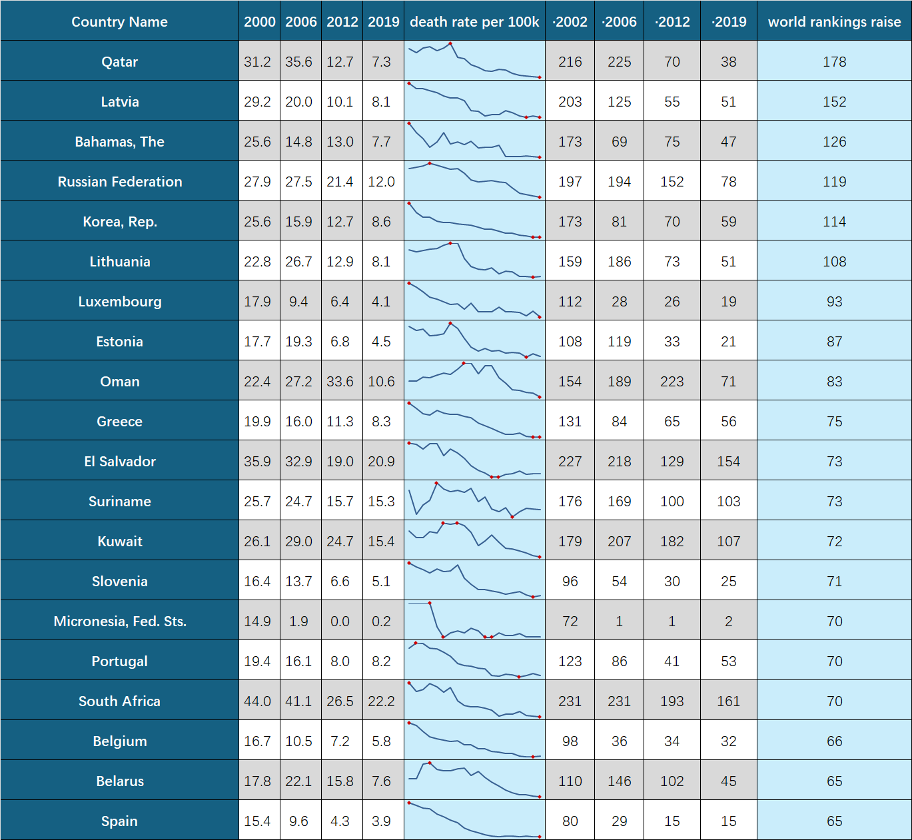
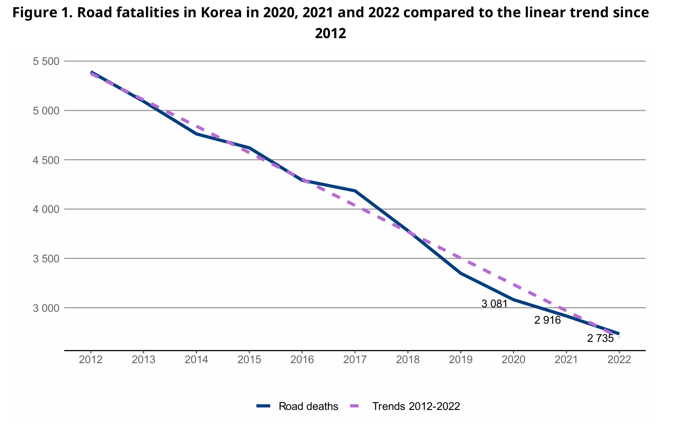
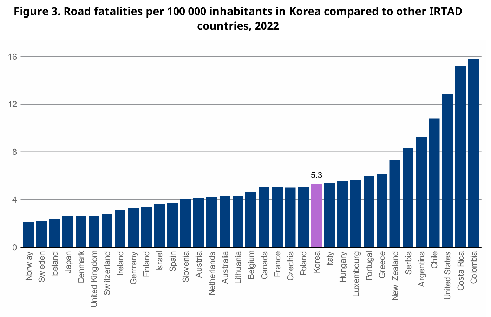
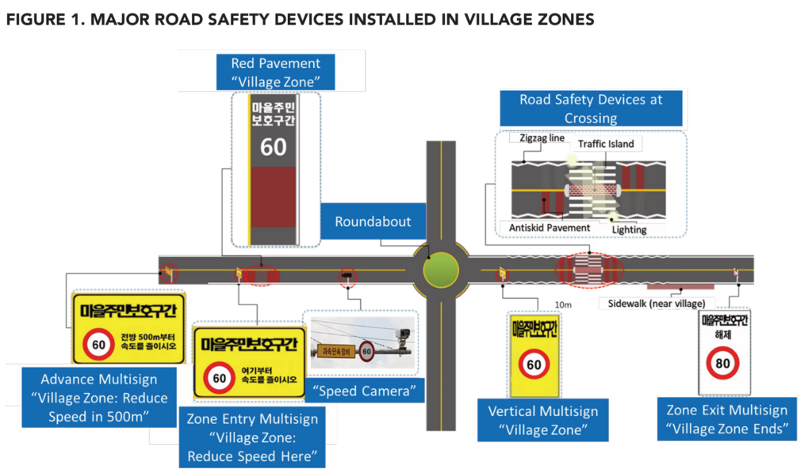
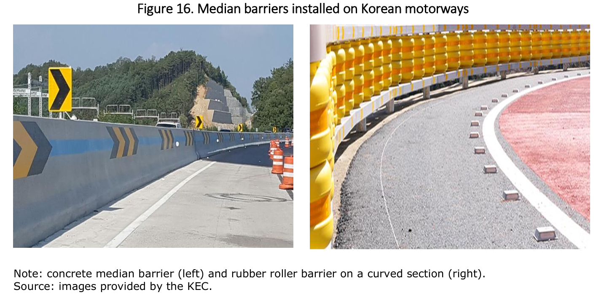
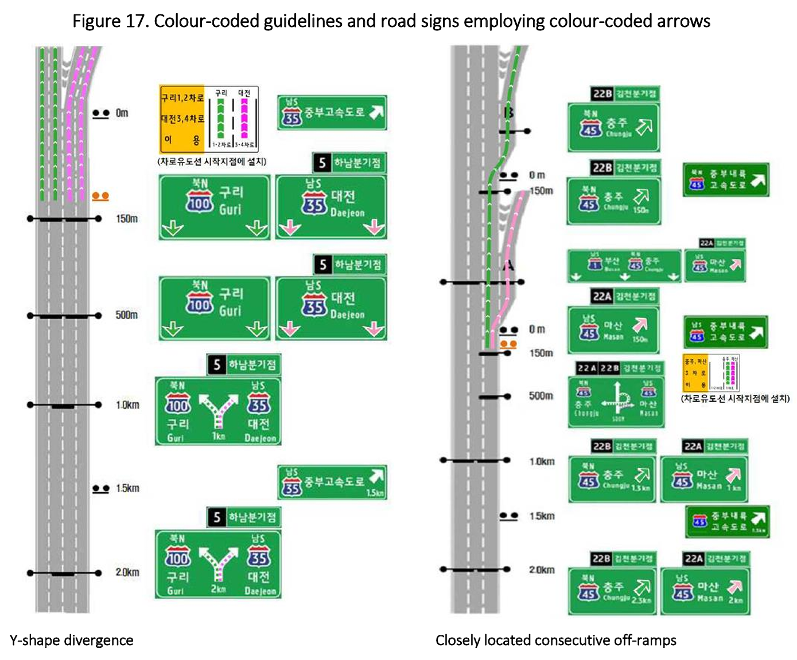
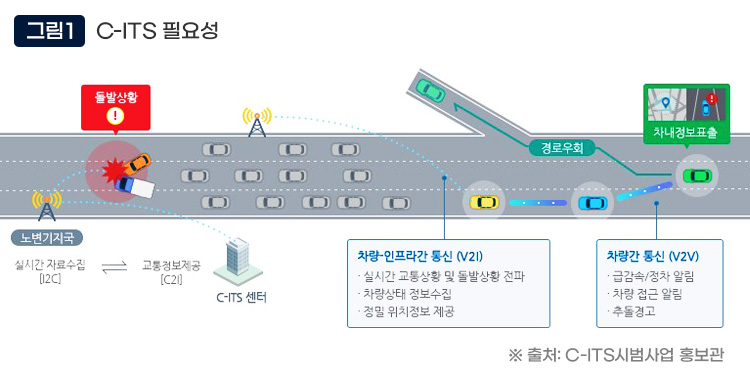
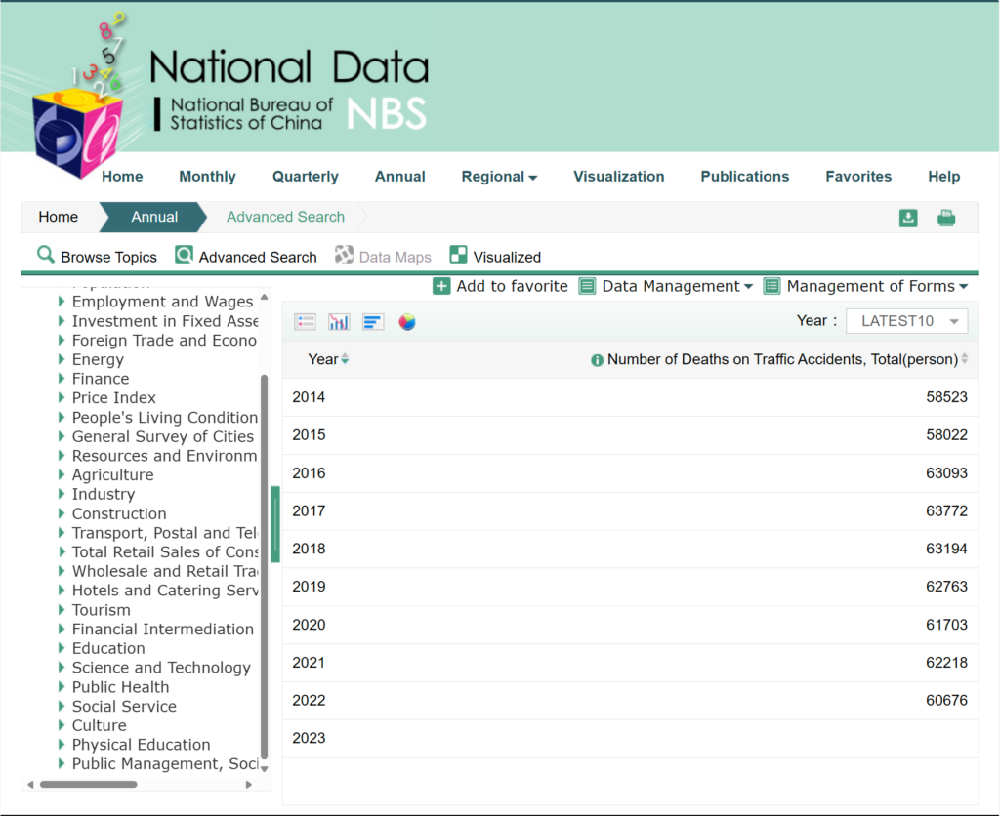
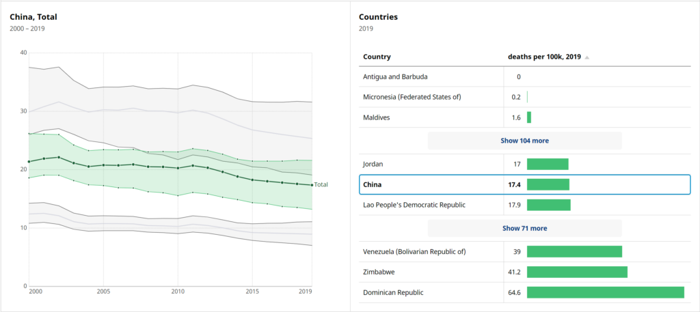

## 1. 韩国交通安全形势得到彻底改变
过去这20多年，韩国是全世界治理交通事故问题最有成效的国家之一，据世界卫生组织最新数据统计，韩国每10万人交通事故死亡率从2000年25.6下降到2019年为8.6，20年间全球排名上升100多个名次，仅次于卡塔尔、拉脱维亚、巴哈马和俄罗斯。

更进一步查询发现，按照韩国政府最近几年公布数据，自2020年以来，韩国交通事故死亡人数继续四连降。2022年死亡2735人，每10万人死亡率已降至5.3。到20223年进一步下降到2551人，每10万人交通事故死亡率已降至4.9，已经跻身全球交通安全领先国家行列。

  
Road Safety Country Profiles Korea 2023 [\[1\]](https://fosu.cc/article/Korea%E2%80%99s-Experience-in-Governing-Traffic-Accidents#fn1)_

  
Road Safety Country Profiles Korea 2023 [\[1:1\]](https://fosu.cc/article/Korea%E2%80%99s-Experience-in-Governing-Traffic-Accidents#fn1)

---

## 2. 交通安全问题曾经是韩国的重大社会问题

如果以“韩国交通安全“为关键词搜索，不难找到若干年前，韩国交通事故死亡率一直很高，在OECD国家中排名位居最后。

> 韩联社济州11月16日电 韩国交通研究院交通安全研究本部长薛载勋16日出席在济州道政府大楼举行的“改善交通文化的政策方案”研讨会并表示，2010年我国每10万名的交通事故死亡人数为11.3名，在经合组织29个成员国中最多。[^2]

> 中新网7月7日电 据韩联社报道，7日，经济合作开发组织(OECD)透露，以2011年为基准，韩国以105名的交通事故死亡人数在31个OECD成员国中，居波兰(109名)之后排在第二位。韩国的交通事故死亡人数是OECD平均值(63名)的1.7倍。[^3]

2012年韩国前总统李明博曾在全国性广播与互联网演说中表示，纵观全世界各项灾难和灾害有关统计数据，还难以说韩国快要加入发达国家行列。以2010年为例，韩国在工伤、车祸、火灾等方面造成的死亡人数每年超过1万人，经济损失达32万亿韩元。2011年交通事故造成的伤员人数超过34万人。自杀人数则为1.5万人，属于经合组织成员国中最高水平，加上老年人口的自杀率快速增长，韩国各方面社会安全问题形势极为严峻。李明博提出，只有国民能够安居乐业，拥有安全的生活环境，才能称得上是真正的发达国家。

---

## 3. 韩国改善交通安全的主要做法

简单梳理了以下韩国最近10几年在改善交通安全方面的一些做法，整体上看，韩国这些年治理交通事故问题，经历了从局部区域试点到全国性推广，由重点领域防范到普适性防范，从临时性运动到立法规制，从粗放型政策到精细化管理相转变的过程。

### 国会决议:交通事故降至零的运动
2013年，韩国国会通过了《关于将道路交通事故降至零的决议》，旨在从根本上改善韩国道路的安全性。虽然这个目标看起来很夸张，但的确赢得了民众广泛的支持，毕竟类似“促进汽车零排放”之类的口号在各国都数见不鲜。

该决议主要包括三方面内容：
*  积极制定和修订交通安全法等相关法律和制度
*  确保交通安全项目财政资源
*  建立专门监督和管理交通安全事务的组织（交通安全研究院）

该决议主要包括四个基本原则[^4]
* 人的生命和健康高于一切交通运输目的
* 道路运输系统的供应商和监管者与用户一样承担责任
* 道路交通系统将人为错误降至最低，如果发生错误，将损害降至最低
* 道路交通系统供应商、监管机构和公民合作，从而实现安全

### 全国征集创意
例如，为了配套制度落地，新组建的交通安全研究院每年拿出300万韩元在全国范围发起了公开征集帮助减少道路交通事故的创意比赛。其中，2014年的获得特等奖的项目是在村庄划定低速区。 

> 2011年，韩国开始在残疾人护理中心周边划定低速区，但由于长期以来韩国对行人保护意识的欠缺，事实上韩国行人安全一直得不到保障。在2013年，韩国行人道路交通事故死亡率在经合组织中排名倒数第一，并且对老年人来说，情况尤其糟糕，65岁以上行人的死亡率是经合组织平均水平的近5倍。

得益于《关于将道路交通事故降至零的决议》通过，交通安全项目资金由韩国国土交通部统筹进行保障，不再需要地方出钱。因此，2014年后，韩国各地村庄争相加入公路低速区计划。该计划共包含两项内容，一是通过划定低速区将村庄区限速降低，二是对每一个低速区安装电子监控设备，对行人进行优先保护。

*The Republic of Korea’s Campaign to Bring Road Crashes to Zero*[^5]

 据统计，在试点村庄地区，安装低速区设施后的前六个月，车祸总数下降了37%，死亡人数下降了29%，受伤人数下降了43%。看到试点计划的成功，更多的地区寻求建立村庄区域，以提高行人安全。第二年在8个地区增加了20个路段，到2018年在10个地区又安装了30个路段。当地居民普遍欢迎建立村区，一些地方政府决定自费安装村区。例如，2018年，加平政府应当地居民的要求，使用自己的预算安装了两个村庄。截至 2018 年，韩国 23 个地区有 64 个村区加入这一计划。[^4]

### 每年公布安全计划
自《关于将道路交通事故降至零的决议》通过后，韩国每年都会制定一系列改善交通安全的计划。例如，2016年推出了5个方面26项措施，并持续推进46个安全项目，目标是到2017年将交通事故死亡率降低到每万辆车1.6人死亡，并在所有道路上的所有座位强制使用安全带，加强交通违法行为的处罚，提升交通安全教育并加强商业车辆安全的规制。[^6]

1. 建立行人优先的交通文化
	*  改善交通法规：继续执行**所有座位强制使用安全带的政策**，并提高对举报者最常报告的违法行为处罚标准
	*  禁止鲁莽驾驶并修订制裁规定（在控制效果最佳的位置实施监控设施）
	*  新制定的规例以控制粗心大意驾驶，**可处以一年监禁或最高4000美元罚款**
	*  对未投保车辆和逃逸事故的责任保险支付率规定进行差异化修订
	*  执行对非法、未注册车辆的控制
	*  **通过提供保费折扣促销，奖励正确安装安全装置的车辆**
	*  通过促进多样化道路安全相关机构的合作来增强道路安全广告 
	*  改善鼓励公民参与的政策，包括“好司机里程数” ，以体验为导向的“高级教育中心”等
2.  实施以安全为导向的基础设施
	*   持续改善高事故地点和危险道路区域
	*   实施包括环岛和休息区在内的安全设施
	*   加强区域交通信息中心的事件管理策略（闭路电视监控）
	*   扩大居民区和学校区域，**并立法设立速度限制为30公里/小时“社区道路区域” **
	*   **推广车道偏离警告系统（LDWS）和自动紧急制动系统（ABES）标准**
	*   开展“以行人为导向的环境发展”项目，**增加老年人区域的设置**
3. 为交通弱势群体设定定制交通系统
	* 为老年驾驶员提供巡回教育，并补充专为**老年驾驶员设立的培训中心**
	* 在农村地区进行的交通事故预防计划
	* 推广儿童车辆安全宣传活动，并集中控制儿童校车
	* 在学校放学时间安排交通志愿者，以防止道路交通事故
	* **限量发放儿童头盔和儿童安全座椅**
4. 增强商业车辆的安全规定并升级事故响应系统
	*  对造成交通事故和死亡的商业运输公司进行交通安全评估 对表现优秀的公司给予奖励和激励
	*  **危险驾驶行为数字化记录**，以增强以安全为导向的驾驶行为
	*  驾驶员培训和提供体验式教育
5. 强化国家交通政策
	*  加强“交通安全政策理事会”工作层面会议和“促进交通安全理事会”的运作
	*  加强地方政府部门的交通安全能力建设
	*  地方交通文化指标考核，提高地方政府内部对道路安全意识的关注
`以上加粗部分为国内少见的措施`

 
*Motorway Safety in Korea[^7]*

又比如，韩国对所有高速转弯区设置隔离桶和橡胶辊屏障，同时对道路标识的颜色和形状进行了标准化。推动在所有高速公路交叉路口、两个立交桥彼此相距不到一公里、在包含黑点的立交桥、以及停车区位于急转弯路段的立交桥等四种位置使用不同颜色对地面导线进行区分，这些措施都一定程度减少了交通安全风险。

### 史上最严修改道路安全法
按照《关于将道路交通事故降至零的决议》要求，韩国先后多次修订《道路安全法》，并将措施不断升级。

1. 行车速度大幅下降
2021年4月，韩国修订后的《道路交通法》开始实施“安全速度5030政策”。据此，**市区干道限速下调为50公里/小时**，**住宅、学校附近道路限速下调为30公里/小时**，城际高速公路限速不变。新法加强了对超速驾驶的处罚力度，违者将被处以最低3万韩元的罚金并扣分，严重者可能面临吊销驾照和刑事处罚。
	* 超20km/h以下：3万韩元
	* 超20～40km/h：6万韩元 + 15分
	* 超40～60km/h：9万韩元 + 30分
	* 超60～80km/h：12万韩元 + 60分
	* 超80～100km/h：30万韩元以下、拘留 + 80分
	* 超100km/h以上：100万韩元以下、拘留 + 100分
	* 三次超100km/h以上：1年以下有期徒刑或500万韩元以下的罚款 + 吊销执照
	* *每一个违反交通法规都有相应的罚分标准，多个违规行为累计起来的罚分超过40分，会处以中止驾驶执照(暂停使用)。如果1年内累计罚121分以上、2年内累计罚201分以上、3年内累计罚271分以上时，会处以吊销驾驶执照(不能再用)。*

> 韩方调查数据显示，新规实施后，城市交通事故发生率将降低24.1%，因交通事故造成的重伤概率将降低21.5%，死亡概率将降低30%，而行车时间仅多出2-3分钟。——*中华人民共和国驻大韩民国大使馆：在韩驾车请留意：韩国实施“安全速度5030政策”*

2. 行人保护显著增强
2022年7月12日，韩国修订后的《道路交通法》大幅提高了右转车辆对行人的保护义务。简而言之，就是车辆在右转时必须确认是否有行人正在或准备过马路，违者将被处以行政罚款或扣分等处罚。
	*  当行人在人行横道前犹豫不决或向司机挥手表示要过马路时、当行人在人行横道前等待时、当行人向人行横道快速行走或奔跑时、当行人转头注意信号时，司机都必须暂时停车。
	* 在儿童保护区内，不管有无信号灯，在人行横道前都必须暂时停车观察。
	* 违反上述规定，司机将受到违反信号灯的处罚，包括扣10分和罚款6万韩元。
	* 如果期间还发生与行人的交通事故，那么将依据《交通事故处理法》中的重大过失犯罪，处以5年以下有期徒刑和2000万韩元以下的罚款。
	
> 韩国警方期待新法实施后能大幅减少行人交通事故，建立更加先进的以行人为中心的道路文化。——*法治日报：韩国新版《道路交通法》大幅强化行人保护*

---

## 4. 韩国交通安全展望
2022年韩国制定了新一轮的交通安全综合五年计划，该计划要求到2027年将交通死亡人数从2020年的水平减少50%。韩国韩国国土交通部声称将加倍努力防止与交通有关的死亡，以实现联合国建议的目标，即到2030年早日预防至少50%的交通死亡和伤害。为了实现这一目标，韩国政府计划通过最大限度地利用信息和通信技术、大数据和其他尖端技术来推进该国的交通系统升级。同时，韩国还计划推动为老年人提供有条件的驾驶执照制度，因为人们普遍预计该国将在2025年成为超老龄化社会。[^8]

例如，韩国国土交通部提出要在2027年前普及下一代智能交通C-ITS系统，以实现零交通事故目标。其中该系统包括了基于位置的数据收集、基于位置的交通信息、收费系统、提供道路危险路段信息、道路天气信息、道路施工路段的驾驶支持、交叉路口违反交通信号的危险预警、右转安全运行支持、公交车运营管理、黄色公交车运营指导、学区速度控制、行人防撞预警、车辆防撞支援、紧急车辆接近预警和车辆紧急预警等15项基本服务。[^9]

从上述措施来看，部分措施对于国内确实有可借鉴之处。例如，强制系安全带这个措施，目前国内仅有个别城市能够严格实施。大部分车辆后排都很少系安全带。

---

## 5. 一点个人的感想
总体来看，韩国这些年在治理交通事故上确实成效显著，从原来的全球落后位置奋起直追，赶上了老牌发达国家，确实是不容易。从韩国的经验来看，我觉得有几些方面还是值得肯定和借鉴的。但在查询了国家统计局的数字后，感觉这事还是以后有空再说吧，现在似乎没啥必要再写了。

*国家统计局数据*

*世界卫生组织数据*

`世界卫生组织和世界银行都是联合国下属机构，中国为联合国创始国之一，是安理会常任理事国。`

[^1]:[Road Safety Country Profiles Korea 2023](https://www.itf-oecd.org/sites/default/files/korea-road-safety.pdf)
[^2]:[韩联社.韩国交通事故死亡率居OECD之最](https://www.yna.co.kr/view/ACK20121116002600881
)
[^3]:[中新网.韩国交通事故死亡率居经合组织成员国第2位](https://www.chinanews.com.cn/gj/2014/07-07/6357301.shtml)
[^4]:[교통사고 제로화 실천 추진방안과 원칙](https://m.blog.naver.com/edusns1/120212386428)
[^5]:[WorldBank, Republic of Korea’s Campaign to Bring Road Crashes to Zero](https://www.effectivecooperation.org/system/files/2021-06/gdi_delivery_note_on_improving_road_safety_for_pedestrians_in_korea.pdf)
[^6]:[Comprehensive Measures to Reduce Traffic Accident Fatalities](https://irf.global/assets/pdf/Korea-MOLIT-2016-Traffic-Safety-Enforcement-Plan.pdf)
[^7]:[Motorway Safety in Korea](https://www.itf-oecd.org/sites/default/files/docs/motorway-safety-korea.pdf)
[^8]:[韩国的目标是到2027年通过先进的系统和更强的监控将交通死亡人数减半](https://en.yna.co.kr/view/AEN20220609006600320
)
[^9]:[제9차(2022~2026년) 국가교통안전기본계획](https://itskorea.kr/downloadFile.do?fileId=FILE_000000000045623&fileSn=1)