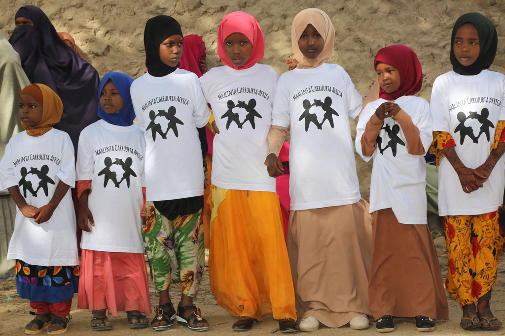
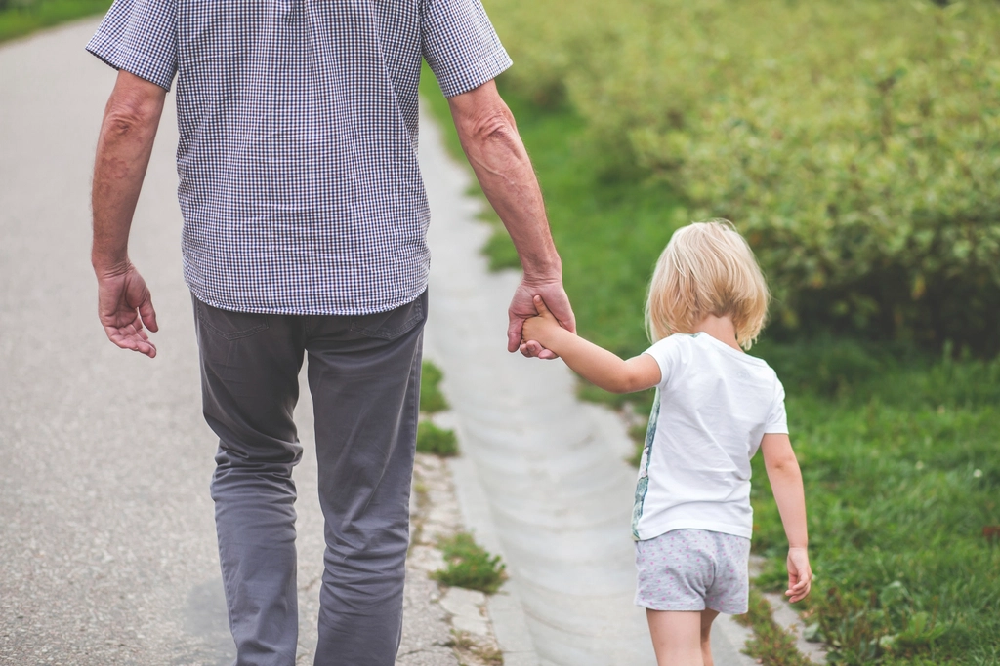

In recent years, the issue of the prevention of sexual assault of minors has received extensive attention, including the promulgation of a series of laws and regulations such as the Law on the Protection of Minors and the Regulations on the Protection of Minors in Schools, all of which emphasize the need to strengthen the prevention of sexual assault of minors. However, in general, most of the above-mentioned prevention work is concentrated in schools, and there is not much mention of the problem of sexual assault of minors at the social level, especially between families and neighbors, and a large proportion of sexual assault of minors with intellectual disabilities occurs between families and neighbors.

* * *

## 1\. Shocking cases

A simple search on the Internet is not difficult to find that cases of minors being sexually assaulted at home are not uncommon. Here are a few typical cases as follows:

- **A case of a 9-year-old girl being sexually assaulted**

The unfortunate incident of a 9-year-old girl in Guangzhou who was sexually assaulted by a neighbor for 3 years and whose parents did not know about it has recently attracted the attention of readers. At present, the suspect of sexually assaulting the girl is being detained on suspicion of child molestation, and the lawyer said that the suspect can be sentenced to more than 10 years in prison. It is reported that the reason why the girl was sexually assaulted by the monster neighbor for a long time was that the monster neighbor was an acquaintance and had intimidated the girl for a long time.[^1]

- **Sexual assault of a 12-year-old girl with intellectual disabilities**

In October this year, Xiaowen, a minor girl from Maoming, Guangdong Province, who has intellectual disability problems, became pregnant and was about to undergo abortion surgery. This was her second sexual assault and second pregnancy in eight months. The previous time, in March of this year, when the police were involved in the investigation, but a similar tragedy happened again in a short period of time.[^2]

- **A case of sexual assault of a mother and daughter (13 years old) with intellectual disabilities**

A mentally handicapped mother and daughter in Lianghe Town, Linshui County, Guang'an City, Sichuan Province, fell prey to many elderly local men and were sexually assaulted many times. This cruel fact was uncovered because the 13-year-old daughter was found to be more than 5 months pregnant, and the local police took blood from adult males in the town for DNA testing, and found that the suspect was actually an 84-year-old man.[^3]

- **A 60-year-old man sexually assaulted a mentally handicapped woman from the same village and was sentenced to three years and seven months in prison**

Wang, a 60-year-old man in Bozhou, Anhui Province, knew that Zhang XX in the same village was mentally and intellectually disabled, but still had sexual relations with him, but he did not know that his actions constituted the crime of rape. Recently, the Qiaocheng District People's Court of Bozhou City pronounced a verdict on the case, and the court sentenced the defendant Wang Moumou to three years and seven months in prison for rape in the first instance.[^4]

It was further discovered that some media outlets had investigated these articles, and in addition to telling outrageous storylines, these articles were even more shocking in terms of the figures quoted in the articles. For example, DT Finance once wrote that among the 134 cases of sexual assault of minors it investigated, 54.2% of children under the age of 14 and 8.2% had intellectual disabilities. Among the perpetrators, there are not only strangers who committed random crimes, Didi drivers, netizens who have just met, but also acquaintances including friends, relatives, neighbors, etc. Among them, the proportion of family members committing crimes reached 15.5%, which is the highest proportion of acquaintances committing crimes. In addition, the proportion of repeated sexual assault in cases committed by family members is as high as 94%.

> In the 22 months from January 2018 to October 2019, prosecutors across the country prosecuted 32,500 people for sexual assault against minors, an average of 49 per day.  
> ——DT Finance[^5]

* * *

## 2\. Lack of legislation

The 2020 revision of the Law on the Protection of Minors is the main legal basis for the prevention of sexual assault, and the issue of sexual assault is mentioned 11 times, including the following:

- Minors' parents and other guardians must not retain persons who have sexually violated minors to care for minors on their behalf

- Schools and kindergartens shall establish systems for the prevention of sexual assault

- Schools and kindergartens must not conceal situations of sexual violations against minors

- Schools and kindergartens shall carry out education on the prevention of sexual assault

- Schools and kindergartens shall employ protective measures for minors who have suffered sexual violations

- Sexual assault of minors is prohibited

- Units with close contact with minors should review whether the applicant has a record of sexual assault when recruiting staff

- The State is to establish a system for inquiring into information on persons convicted of sexual assault

- State organs are to carry out necessary protective measures for minor victims of sexual assault and their families

- Judicial organs handling cases of sexual violations of minors are to follow the provisions of special procedures

It can be seen that in terms of the prevention of sexual abuse of minors, the Law on the Protection of Minors mainly limits the rules to schools. But there are still quite a few loopholes in other areas.

- **Vulnerabilities at the household**

At the family level, the Law on the Protection of Minors only stipulates that when a minor's parents or other guardians are unable to fully perform their guardianship duties due to reasons such as going out to work, they may not entrust a person with a record of sexual assault to take care of a minor on their behalf. There is no regulation for situations such as parents or guardians sexually assaulting minors, and only the relevant catch-all clauses can be applied by reference.

- **Vulnerabilities at the societal**

As for how to prevent minors from being sexually assaulted at the social level, in addition to restricting persons with sexual assault records from engaging in occupations that have close contact with minors, no other work measures have been formulated.

- **Loopholes in the judicial process**

In the judicial process, there are also great difficulties in the protection of minors with intellectual disabilities. Because the victim is both a minor and a mentally handicapped child, does not have full capacity for conduct, has limited ability to judge violations, cannot understand the social consequences of such conduct, does not know how to protect the scene and evidence, and cannot effectively testify, it is difficult to collect evidence and solve it.

> A girl under the age of 18 in Xikou Town, Xiuning County, Anhui Province, was sexually assaulted by three people in the same village from May last year to January this year, resulting in pregnancy. This online post has attracted the attention of many netizens. The bureau responded that on April 26 this year, the public security department immediately intervened in the investigation after receiving the report, and then took criminal coercive measures against the criminal suspect Wang in accordance with the law, and after the case was transferred to the Xiuning County Procuratorate for trial, the procuratorate made a decision not to approve the arrest in accordance with the law, and the criminal suspect has now been changed to residential surveillance. —— _It was revealed that a girl in Anhui was sexually assaulted and pregnant by 3 people, and the procuratorate made a decision not to approve the arrest_ [^6]

* * *

## 3\. The base number of minors with intellectual disabilities who have been sexually assaulted

### The number of people who are difficult to count

- **Estimates from media: 2.8 million**\*

The size of the population with intellectual disabilities in China has always been a mystery. According to estimates, some self-media say that the proportion of the country's mentally handicapped population is 1%, that is, 14 million, of which 50% are minors, and the number of newborns with intellectual disabilities is about 1.1 million every year. The number of "marginal intellectual disabilities" who fall between the mentally retarded and the normal (generally with an IQ below 70 as the criterion) is even larger, numbering in the tens of millions.[^7] 
_According to the estimate of 17.95% of the population aged 0-14 in the communiqué of China's Seventh Population Census, minors account for about 20% of the population, the same below.[^8]_

- **Sample survey: 2 million**

According to the results of China's first national sample survey of disabled persons in 1987, the current disability rate of intellectual disability is 12.7 per thousand (including intellectual disability in comprehensive disability). According to the Second National Sample Survey of Persons with Disabilities in 2006, there were about 9.88 million people with intellectual disabilities (including intellectual disabilities in comprehensive disabilities), accounting for about 0.75 per cent of the total population and 11.9 per cent of the disabled population.[^9]

- **Number of registrants: 430,000**

In 2008, the China Disabled Persons' Federation (CDPF) launched the construction of a national basic database of persons with disabilities, collecting and managing the basic population information of persons with disabilities in conjunction with the issuance of second-generation certificates for persons with disabilities, and through identity authentication with the Ministry of Public Security's "National Citizenship Information Service System", it has established the only authoritative national basic information database for persons with disabilities in China. As of June 3, 2013, a total of 37,952,000 persons with disabilities had been collected in the National Basic Database of Persons with Disabilities, of which 2,157,000 were intellectually disabled.[^10]

- **Number of people served: 170,000**

In addition, according to the statistics of the China Disabled Persons' Federation, there are 656,000 intellectually disabled people in China in 2022[^11]Receiving rehabilitation services decreased by 208,000 from 864,000 in 2020.

> On the one hand, it shows that it is indeed difficult to find out the base number of people with intellectual disabilities in China, and on the other hand, it also confirms that the state and society do not pay enough attention to this group. After all, in the folk, the abbreviation of intellectual disability is "intellectual disability", which is a common insulting word. As a family, it is obviously impossible to take the initiative to report that their child is "mentally retarded", and often can only be counted through hospital identification or other means. But just like the sensational "Xuzhou Iron Chain Girl".[^12]The practice of some families imprisoning people with intellectual disabilities for a long time objectively makes it difficult to keep these data in place.

In horizontal comparison, the prevalence of intellectual disability among children over the age of 5 is about 1% globally, of which about 0.6% is severe intellectual disability[^13]。 The National Survey of Children's Health found that in 2011~2012, the intellectual disability rate of children aged 2~17 was about 1.1%[^14]。 Domestic academic research usually uses the 0.75% conclusion of the 2006 sample survey as the benchmark for studying this issue.[^15]That is, the number of minors with intellectual disabilities in China is about 2 million in proportion.

In fact, since the average life expectancy of people with intellectual disabilities is obviously much shorter than that of the general population, the actual proportion of minors in the total of about 10 million people with intellectual disabilities should be much higher, and it is more reasonable to have between 3 million and 4 million.

### The number of victims is more difficult to count

In the 90s of the last century, some foreign studies found that the group with intellectual disabilities had the highest proportion of sexual abuse among all vulnerable groups[^16], 90 per cent of people with intellectual disabilities have experienced sexual assault, and 82 per cent of them have been sexually assaulted before the age of 18[^17], about 49% of whom have been sexually assaulted more than 10 times[^18]。 For a long time, China's public security departments have not published data on the incidence rate of criminal cases and the rate of solving cases, so it is difficult to find out the data in this area in China.[^19]

- Wang Songbo et al., a scholar from mainland China, conducted a survey of hospitalized patients with mental disorders during the recovery period and found that 29.9% of female patients reported having been sexually assaulted, and 75.9% of them reported experiencing physical violence at the same time as they reported having been sexually assaulted.

- From 2004 to November 2007, the Lu County People's Court in Sichuan Province accepted and concluded a total of 45 rape cases, of which 21 (46.7 percent) were victims with intellectual disabilities.

- From 2005 to October 2007, the Beijing Miyun People's Court concluded a total of 86 rape cases, of which 23 (26.7 percent) were victims of intellectual disabilities.

- From 2005 to May 2007, the Rugao Municipal People's Court in Jiangsu Province concluded a total of 35 rape cases, of which 14 were victims of intellectual disabilities, accounting for 40 percent. Of these, 4 rape cases were concluded between January and April 2007, and 5 victims were all intellectually disabled.

> Under the influence of traditional culture, women in China have always attached more importance to chastity and honor, and the reporting rate of sexual assault cases is low, and the judicial "black number" of sexual assault is the highest among all types of crimes. Therefore, in reality, there are a large number of cases of sexual assault of people with intellectual disabilities who are not reported and are dealt with by the judicial authorities. If the standard of 25% in foreign countries is extrapolated, then there should **be no less than 600,000 victims of sexual assault by mentally disabled people in China.** A _Review of Research on Sexual Assault of People with Intellectual Disabilities_[^20]

In addition, the study found that men with intellectual disabilities are almost equally likely to be sexually assaulted than women, and that men with intellectual disabilities are also at high risk of sexual assault.

* * *

## 4\. Difficulties in preventing sexual abuse of minors with intellectual disabilities

### Difficult to research

At present, there is a lack of research on the prevention of sexual assault of minors with intellectual disabilities in China. For example, in terms of sexual assault prevention education, there are few studies on sexual assault prevention education, there are more quantitative studies and less qualitative studies, and most of the research content is research on the current situation and countermeasures of child sexual abuse prevention, but there is little attention paid to how the work is carried out, and how the teaching methods, strategies and effectiveness are.[^21]The reasons for this mainly include the following aspects.

1. **Difficult to study**: The study of minors with intellectual disabilities is inherently challenging, because sexual assault incidents may have a low reporting rate due to various reasons (e.g., victims are unable to communicate effectively, fear of retaliation, etc.), and the relevant population may have great difficulties in communication, understanding and expression skills, which greatly increases the difficulty of research.  
    

3. **Low social attention**: At present, the whole society still pays little attention to people with intellectual disabilities, resulting in insufficient support and attention for related research. In terms of the scope of personal work, the attention to people with intellectual disabilities is far lower than the attention to special groups such as patients with severe mental disorders and the deaf-mute, after all, the latter cause accidents and accidents are very common and more harmful to society.  
    

5. **Lack of professionals**: The study of minors with intellectual disabilities requires expertise in special education, mental health, law, and social work, which may be relatively lacking. In the process of research, I found that there is a big gap between the countermeasures, suggestions or specific measures proposed by many papers in this field and the actual situation.

## Strong concealment

For a long time, due to social and cultural prejudices, people have generally been in a state of "talking about sexual perversion", and they have avoided the issue of sexual assault. As for the sexual abuse of minors with intellectual disabilities, it is itself superimposed with multiple prejudices.

1. **Marginalized groups** People with intellectual disabilities are marginalized groups, often not regarded as normal people, and are easily excluded and discriminated against by society. It is difficult for family members to maintain rational choices when dealing with people with intellectual disabilities, and many families are prone to choose inhumane ways to treat people with intellectual disabilities due to economic factors and various reasons.  
    

3. **A** **way forward** Few families of origin can take care of people with intellectual disabilities for the rest of their lives, and most families will choose to seek another home for people with intellectual disabilities when they become adults.
    - For women with intellectual disabilities, traditional Chinese rural families often take advantage of their normal fertility to marry off to groups such as "old singles", "disabled people" and "absolute poor households" , so that the original family can get rid of the "burden". Families with better family conditions are likely to spend extra money and find them a slightly better partner, as was the case with a cousin of mine.
    
    - For men with intellectual disabilities, it is even more miserable, often sent out by their families to do the hardest, most tiring or simple physical work, and suffer the most exploitation. I have two twin cousins who are currently in this state.
    
    - _In this context, in order to achieve the purpose of "marriage", the original family of the person with intellectual disabilities may still conceal the fact that the minor is sexually assaulted._  
        

5. **Relatives commit crimes** Due to the lack of awareness of people with intellectual disabilities and their high dependence on relatives, relatives have more opportunities to have intimate contact with them alone, which objectively increases the possibility of sexual abuse by relatives. And this kind of sexual assault is extremely difficult for the public power and the outside world to find out.

* * *

## 5\. The general idea of preventing sexual abuse of minors

Although the provisions of the Law on the Protection of Minors on the prevention of sexual abuse of minors are not satisfactory, many measures and future plans are proposed in other laws and administrative regulations, but no special attention is paid to the issue of sexual abuse of minors with intellectual disabilities.

### Legal aspects

- The Law on the Promotion of Family Education stipulates that the parents or other guardians of minors shall pay attention to the mental health of minors in light of the physical and mental development characteristics of minors of different ages, educate them on safety knowledge in areas such as sexual assault prevention, help them master safety knowledge and skills, and enhance their awareness and ability to protect themselves.

- The Civil Code provides protective provisions on the statute of limitations for the right to claim compensation for sexual assault of minors, which shall be calculated from the date on which the victim reaches the age of 18.

### At the level of administrative regulations

The main norms of administrative regulations on the prevention of sexual abuse of minors are the Notice on the Development of Chinese Women and the Program for the Development of Chinese Children (2021-2030) issued by the State Council, which lists nearly 20 preventive measures, in addition to the same measures listed in the Law on the Protection of Minors, there are the following plans.

- Effectively control and severely punish illegal and criminal acts of rape, indecency, and humiliation of girls and women with intellectual or mental disabilities, and prevent and severely punish illegal and criminal acts of sexual violations against children in accordance with law.

- Sexual assault committed by persons with special responsibilities to children is severely punished in accordance with law.

- Establish and improve mechanisms for caring for key populations and families, mechanisms for discovering and reporting infringement cases, mechanisms for joint prevention and coordination of multiple departments, and systems for supervising the promotion of infringement cases.

- Raise awareness and capacity among children, families, schools, and communities to identify, prevent, prevent, and report sexual abuse.

- Explore the establishment of a system for disclosing information on persons who have committed crimes against children, and strictly implement a system for the filing of foreign teachers' certificates of no criminal record.

- Strengthen case filing and case filing supervision, and improve case filing standards and conviction and sentencing standards.

- Explore the formulation of special evidentiary standards for cases of sexual violations against children.

- Strictly punish illegal and criminal conduct that uses the internet to sexually lure or sexually violate children in accordance with law.

### Departmental rules and local regulations

- At the level of departmental regulations, it is mainly the education, the Communist Youth League, the women's federation and other institutions that make special provisions on the prevention of sexual assault on students. For example, in December 2018, the General Office of the Ministry of Education issued a notice on further strengthening the prevention of sexual assault of students in primary and secondary schools (kindergartens) , proposing five work measures. However, the content of the measures is generally the same as those enumerated in the Law on the Protection of Minors, with the main difference being that the preventive responsibilities of local government bodies and schools are emphasized.

- In terms of local regulations and local government normative documents, it is mainly a refinement of the Law on the Protection of Minors and other laws and regulations at the national level, most of which are copied from the original text, and no new measures are proposed. For example, the regulations on the protection of minors in Beijing, Shandong and other places, the three-year action implementation plan for improving the quality of care services for left-behind children and children in difficult situations in urban and rural areas in Chongqing, and the construction plan for child-friendly cities in Huzhou (2023-2025).

* * *

## 6\. Special system for the prevention of sexual abuse of minors with intellectual disabilities

Generally speaking, for minors with intellectual disabilities who are enrolled in school normally, the state has established a preliminary prevention system in the construction of a sexual assault prevention system. However, for minors with intellectual disabilities who have completed compulsory education (generally 15 years old), some minors with intellectual disabilities who are unable to attend school normally, and there is still a certain gap in how to prevent the sexual abuse of minors with intellectual disabilities at the family and social levels, I personally believe that a special system for preventing the sexual abuse of minors with intellectual disabilities can be established from the following aspects.

1. **Reproductive intervention**  
    Actively intervenes in family fertility services for people with intellectual disabilities to help them understand the reproductive process and possible consequences, so that families with intellectual disabilities can have equal opportunities and resources so that they can make reproductive decisions that are suitable for them. When necessary, in special circumstances such as where minors with intellectual disabilities are sexually assaulted and pregnant, medical services for the termination of pregnancy shall be actively intervened, to ensure that the reproductive rights of minors with intellectual disabilities are respected, and to avoid unnecessary new social tragedies.  
    

3. **State Assessment**  
    Carry out regular assessments for minors with intellectual disabilities, and establish a team of multidisciplinary professionals including doctors, nurses, psychological counselors, social workers, and other multidisciplinary professionals through cooperation with medical institutions, social welfare institutions, educational institutions, and other relevant institutions, to provide comprehensive status assessment services for minors with intellectual disabilities, assess possible problems in home and school supervision, and check whether there are sexual assaults and other violent victims.  
    

5. **Family Follow-up Surveys**  
    Establish a system of face-to-face home visits, with teachers, social workers, and other personnel regularly carrying out home visit services to the families of minors with intellectual disabilities, assessing the growth status of minors with intellectual disabilities in the family, and investigating possible sexual assault and other violent victimizations.  
    

7. **Promote smart wearable devices**  
    Ma Dugong, a self-media person, has been strongly advocating that all minors should wear smart wearable devices to avoid possible accidents. Although this idea is obviously too extreme, if it is only carried out among minors with intellectual disabilities, it may be a very good practice, and the government can provide the equipment free of charge, and continue to monitor the use of the equipment, supporting the special protection of face-to-face interviews, evaluations and other systems.  
    

9. **Implement special legal rules**  
    Give full play to the preventive effects of criminal punishments, establish special detection rules for cases of sexual assault on minors with intellectual disabilities, and avoid emboldening potential criminals due to some unsolvable cases. For example, where minors with intellectual disabilities are unable to verbally express the circumstances of the violation, they may learn from the practices of foreign countries and the Taiwan region and use dolls with anatomical details of the human body to use body language instead, which is to be treated as the victim's statement.[^22]

> In 2001, Taiwan began to purchase a large number of domestic violence and sexual assault prevention and treatment centers in the jurisdiction. In order to assist in the investigation of sexual assault crimes against young children and children with intellectual disabilities, and to increase the rate of prosecution and conviction, the relevant departments of Taiwan have developed and produced male and female interrogation dolls of different genders as tools to assist case handlers in questioning specific child victims. Pop-up books, human body charts, and other related tools commonly used in daily life assist in questioning juvenile victims. -- _Research on the issue of the acceptance of victims' statements in cases of sexual assault against minors_[^22]

* * *

[^1]: [A 9-year-old girl in Guangzhou was sexually assaulted by a neighbor](https://baike.baidu.com/item/%E5%B9%BF%E5%B7%9E9%E5%B2%81%E5%A5%B3%E7%AB%A5%E8%A2%AB%E9%82%BB%E5%B1%85%E6%80%A7%E4%BE%B5%E4%BA%8B%E4%BB%B6/15499432)  

[^2]: [Maoming police investigated "12-year-old mentally handicapped girl was sexually assaulted again" and underwent abortion surgery on the 16th](https://www.thepaper.cn/newsDetail_forward_4969911) 

[^3]: [Sichuan mentally disabled mother and daughter were sexually assaulted, and the 13-year-old daughter was pregnant, and the suspect was an octogenarian](https://www.thepaper.cn/newsDetail_forward_8123360) 

[^4]: [A 60-year-old man was sentenced to three years and seven months in prison for sexually assaulting a mentally handicapped woman from the same village](https://www.chinacourt.org/article/detail/2016/02/id/1805666.shtml) 

[^5]: [Behind the 112 cases of sexual assault of minors: who is committing the violence? Who is crying for help?](https://mp.weixin.qq.com/s?__biz=Mzg5NDg2NjMyMg==&mid=2247645186&idx=1&sn=21d81746b2e48cd095e209dc9d649b90&source=41#wechat_redirect) 

[^6]: [It was revealed that the Anhui girl was sexually assaulted by 3 people and became pregnant, and the procuratorate made a decision not to approve the arrest](https://www.guancha.cn/society/2016_10_12_376986.shtml) 

[^7]: [The flippancy of subjecting mentally handicapped children to general education is essentially abandonment](https://m.huxiu.com/article/233316.html?f=ydzx) 

[^8]: [Communiqué of the Seventh National Population Census](https://www.gov.cn/guoqing/2021-05/13/content_5606149.htm)

[^9]: [Wu L, Qiu Z, Wong D, et al. The research on the status, rehabilitation, education, vocational development, social integration and support services related to intellectual disability in China \[J\]. Res Dev Disabil, 2010, 31: 1216-1222.](https://www.sciencedirect.com/science/article/abs/pii/S0891422210001800) 

[^10]: [Zhang Jun: Data analysis of the National Basic Database of Disabled Population, Statistical Survey, No. 3, 2013](https://kns.cnki.net/kcms2/article/abstract?v=yqeyU9EK6jThjnWu2Efe3BJgNWcBuU7yR4p6ul7RBWjnm7NtKbqC-87g-EM8EYtPsma5JqLDeX9A8hFJTVvh2FlGN5MxWAdDhTKnqfGNEaZnZOxSGux-DoM6iW5j6tDd&uniplatform=NZKPT&flag=copy) 

[^11]: [Progress of the main business of the cause of the disabled in China](https://www.cdpf.org.cn/zwgk/zccx/ndsj/zhsjtj/2022zh/8a6c50f56bae42d9b4cad0440ce01931.htm) [︎ ↩]

[^12]: [Feng County gave birth to an eight-child woman](https://baike.baidu.com/item/%E4%B8%B0%E5%8E%BF%E7%94%9F%E8%82%B2%E5%85%AB%E5%AD%A9%E5%A5%B3%E5%AD%90%E4%BA%8B%E4%BB%B6/60063632) 

[^13]: [Hughes-Mccormack LA, Rydzewska E, Henderson A, et al. Prevalence of mental health conditions and relationship with general health in a whole-country population of people with intellectual disabilities compared with the general population \[J\]. BJPsych Open, 2017, 3(5): 243-248](https://pubmed.ncbi.nlm.nih.gov/29034100/) 
    
[^14]: [Momany E T, Damiano P C, Carter K D. Outcomes of care for Iowa medicaid enrollees: state fiscal year 2008. Final report to the Iowa Department of Human Services \[R\]. Iowa: University of Iowa, 2009.](https://ppc.uiowa.edu/publications/outcomes-care-iowa-medicaid-managed-care-enrollees-state-fiscal-year-2007-final-report) 

[^15]: [Wang Miaomiao, Lu Guohua, Li Anqiao, Qiu Zhuoying: Research on the Health Status and Health Services of the Intellectually Handicapped, Chinese Rehabilitation Theory and Practice., 2019, 25(01)](https://kns.cnki.net/kcms2/article/abstract?v=yqeyU9EK6jSf4WUn2SYPcGi3NZBOsWvxhhepoldnHTRMKbwpM4qPlPs427JY5J0GSupIG4fvSdH9Xi7hyWkv7LuSPcnlmKTOrN-zgcUtXg6JWD1oqY6WQlqfHJDJrlpzvcnrb9ybNxk=&uniplatform=NZKPT&flag=copy) 

[^16]: [Sobsey D,Doe T. Patterns of sexual abuse and assault. Journal of Sexuality and Disability,1991,9(3):243-259.](https://psycnet.apa.org/record/1992-19972-001) 

[^17]: [Stromsness, M. M. (1993). Sexually abused women with mental retardation: Hidden victims, absent resources. Women & Therapy, 14(3-4), 139–152.](https://psycnet.apa.org/record/1994-30217-001)

[^18]: [Glenn S Q.Sexuality education lesson plans for children with disabilities\[M\]. The second edition.2010,10(2):22-23.](https://www.sciencedirect.com/science/article/abs/pii/S019074092030685X) 

[^19]: [LIAO Huaigao,XIONG Shaobo,LI Qiaoyi.A review of the research on sexual assault of mentally handicapped people\[J\].Theory and Reform,2011(4):156-160](https://kns.cnki.net/kcms2/article/abstract?v=yqeyU9EK6jTppwD7FdUsMZlXYTaj0Ek4xbYlZYFoF1HZKk197IDA0jp8r_IfBxG2aw1-g_F97fMfYIkRbC08VznT4MbKBHTKXH_cnCTbReZCQBLkHLImcyV_3ejdHbFqd0KeUJubOFc=&uniplatform=NZKPT&language=CHS) [↩︎](https://fosu.cc/article/How-to-prevent-sexual-abuse-of-minors-with-intellectual-disabilities#fnref19)

[^20]: [Action Research on Sexual Assault Prevention Education for Adolescent Students with Intellectual Disabilities in Special Education Schools, Sichuan Normal University, 2021](https://kns.cnki.net/kcms2/article/abstract?v=yqeyU9EK6jRIcI9hXDesq8RSZcL2ExDxqHXASvnwXHRgRT9LFsx3LPCwHCrxUEmf84eK4kyq9HEMzqlAqLcUCfxnhVAdR7XjWlWXUeXQjN_Xn6qvgOGk8r67gH2_ftiJD5HtTvVA0SHXP3ribXbTpQ==&uniplatform=NZKPT&language=CHS) 

[^21]: [Dai Zijun, A Comparative Study on the Interrogation Methods of Foreign Juvenile Victims and Its Enlightenment, Chinese Youth Social Sciences, No. 2, 2022](https://kns.cnki.net/kcms2/article/abstract?v=yqeyU9EK6jQ-ROOesWxOnWfdFF3fVISP76bzDlgjo-UScgEml5SLYmVG8jWYGC82o1eQJTLkBMDXvoA6u8Gvf9f3taaQAaIAMTBZpRsglj4zdbfg16d2G_IgQwhdQ8kB8y14hCbNcmrP_8vPMBAiEQ==&uniplatform=NZKPT&language=CHS) 

[^22]: [Pan Xingwen.Research on the Acceptance of Victims' Statements in Sexual Assault Cases of Juveniles, East China University of Political Science and Law, 2023](https://kns.cnki.net/kcms2/article/abstract?v=yqeyU9EK6jSNxKBGfKgyQtvFJZMr9Mc93ma5fE80OhnQ6IBrzSQ_mQvAkgKOYV5JxpZANYrFGAV6FAECb06P90dJ45XHTx-zMjp0_Wl_yIPeoNbNNz50kjZDhfUoDOdwwqkU9t4VkR7hytdM1X7blg==&uniplatform=NZKPT&language=CHS) 
