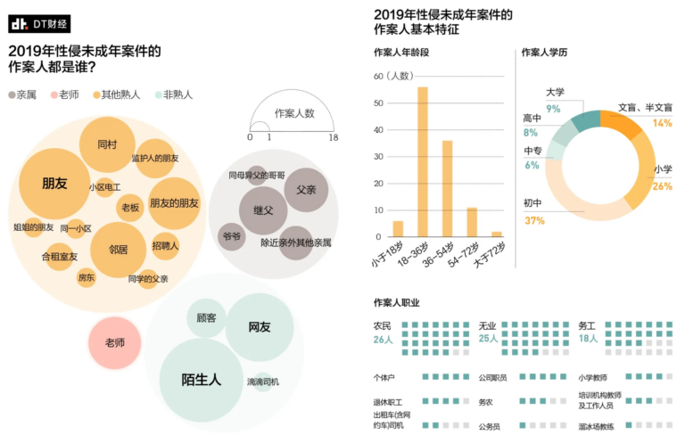

最近几年，未成年人防性侵问题得到广泛重视，包括未成年人保护法、未成年人学校保护规定等一系列法律法规出台，都强调要加强未成年人性侵预防，教育部门也专门部署开展全国预防性侵害学生工作，各地结合实际情况也制定了很多预防未成年人性侵问题的方案和措施。但总的来说，上述这些预防工作，大部分都集中在学校这一环节，对于社会层面，特别家庭和邻里之间发生的性侵未成年人问题并未过多提及，而智力障碍未成年人遭受性侵，很大比例就是在家庭和邻里之间发生。

---

## 1. 触目惊心的案例
简单在网络上搜索不难发现，未成年人在家时被性侵的案例屡见不鲜。这里挑选几个典型案例如下：

* 9岁女童被性侵案

广州一9岁女童被邻居性侵3年而父母竟浑然不知的不幸事件近日引发读者关注。目前，性侵女童的犯罪嫌疑人以涉嫌猥亵儿童罪被刑拘，律师称嫌疑人可判处10年以上有期徒刑。据悉该女童之所以被禽兽邻居长期性侵源于该禽兽邻居是熟人，而且长期对女童进行恐吓。[^1]  
  

* 12岁智力障碍女童被性侵案

今年10月，存在智力障碍问题的广东茂名未成年女孩小文怀孕，她即将接受人流手术。这是她八个月内再次遭到性侵、第二次怀孕。此前一次，是在今年3月，当时警方已介入调查，但类似悲剧在短时间内再次发生。[^2]  

* 智力障碍母女（13岁）被性侵案

四川省广安市邻水县两河镇上一对智障母女，成为当地多名老年男人的猎物，遭遇多次性侵。这一残酷事实的被揭开，源于13岁女儿被发现已怀孕5个多月，当地警方对全镇成年男性抽血做DNA排查，查出犯罪嫌疑人竟是一名84岁高龄的老人。[^3]

* 六旬老汉性侵同村智障女 领刑三年七个月

安徽亳州六旬老汉王某某明知同村张某某精神智能障碍，却仍与其发生性关系，殊不知其行为已构成强奸罪。近日，亳州市谯城区人民法院宣判了该案，法院一审以强奸罪判处被告人王某某有期徒刑三年七个月。[^4]

更进一步发现，一些媒体曾专门就这些进行过调查，这些文章除了讲述令人发指的故事情节外，更令人震惊的是文中引用的数字。例如，DT财经曾撰文称其调查的134个未成年人性侵受害者案件中，不足14岁的幼童占比达54.2%，存在智力障碍的占比达8.2%。作案人中既有随机作案的陌生人、滴滴司机、刚认识不久的网友等非熟人，也有包括朋友、亲属、邻居等在内的熟人。其中，家属作案的比例达到15.5%，是熟人作案中比例最高的群体。并且，在家属作案的案件中，多次性侵的比例高达94%。

>从2018年1月至2019年10月，22个月间，全国检察机关共起诉性侵害未成年人犯罪3.25万人，平均每天49人。
——DT财经[^5]

---

## 2. 立法层面的缺失

2020年修订后的未成年人保护法是预防性侵的主要法律依据，其中共提到性侵问题11次，包括以下方面内容。
* 未成年人父母和其他监护人不得委托曾实施性侵害未成年人的人员代为照护未成年人
* 学校、幼儿园应当建立预防性侵害制度
* 对性侵害未成年人的情况学校、幼儿园不得隐瞒
* 学校、幼儿园应当开展防性侵教育
* 对遭受性侵害的未成年人，学校、幼儿园应当采取保护措施
* 禁止对未成年人实施性侵害
* 密切接触未成年人的单位招聘工作人员时应审查应聘者是否具有性侵记录
* 国家建立性侵犯罪人员信息查询系统
* 国家机关对性侵未成年被害人及其家庭实施必要保护措施
* 司法机关办理未成年人遭受性侵害案件按照特殊程序规定

可以看到，在预防未成年人性侵方面，未成年人保护法主要将规则限定在学校范围。但在其他领域仍然存在不少漏洞。

* 家庭层面的漏洞

在家庭层面，未成年人保护法仅规定在未成年人的父母或者其他监护人因外出务工等原因不能完全履行监护职责时，不得委托具有性侵记录的人员代为照护未成年人。对于父母或监护人本身性侵未成年人等情况，未进行规制，只能参照适用相关兜底条款。

* 社会层面的漏洞

对于社会层面如何预防未成年人被性侵，除了限制具有性侵记录人员不得从事密切接触未成年人的职业外，亦未制定其他工作举措。

* 司法环节的漏洞

在司法环节，对于智力障碍未成年人的保护亦存在很大难点。因为被害人既是未成年人、又是智障儿童，不具有完全行为能力，对侵害行为的判断能力有限，不能理解这种行为的社会后果，不知道保护现场、保护证据，不能有效指证，造成取证困难，侦破困难。

>  安徽省休宁县溪口镇一名未满18岁的女孩从去年5月至今年1月份，先后遭到同村3人性侵并致怀孕，且报案后事情已过近半年，3名当事人仍逍遥法外。这一网帖引发众多网友关注。为此，当天上午记者和休宁警方就此取得联系，该局回应称，今年4月26日，公安部门接到报案后立即介入调查，后依法对犯罪嫌疑人王某采取了刑事强制措施，而案件在移送休宁县检察院审理后，检察机关依法作出了不予批捕决定，犯罪嫌疑人目前已被变更为监视居住。—— *曝安徽女孩遭3人性侵怀孕 检察机关作不批捕决定*[^6]

---

## 3. 智力障碍未成年人被性侵的底数

### 难以统计的人群数量
* 自媒体估算：280万*

中国智力障碍人群规模一直是个迷。有自媒体按照估算，称全国智障人口占比为1%，即1400万；其中50%未成年；每年新生儿智障人数约为110万。介于智障与正常之间（一般以智商低于70为确认标准）的“边缘智障”人群则更加庞大，约有数千万之巨。[^7]
*按照中国第七次人口普查公报中关于0—14岁人口占17.95%的数值进行估算，未成年人占人口比例约20%，下同。[^8]*

* 抽样调查：200万

我国1987年第一次全国残疾人抽样调查结果显示，智力残疾现残率为12.7‰ (含综合残疾中的智力残疾)。2006年第二次全国残疾人抽样调查显示，智力残疾人(含综合残疾中的智力残疾)约988万人，约占总人口的0.75%，占残疾人口的11.9%。[^9]

* 登记人数：43万

中国残联2008年启动建设全国残疾人人口基础数据库，结合第二代残疾人证核发工作进行持证残疾人的人口基础信息的收集与管理，并通过与公安部“全国公民身份信息服务系统”进行身份认证，建成了中国唯一一个权威的国家级残疾人基础信息数据库。，截至2013年6月3日，全国残疾人人口基础数据库中共收集3795.2万残疾人数据，其中智力残疾人215.7万人。[^10]

* 服务人数：17万

另外，从智力残疾人接受康复服务方面统计，根据中国残疾人联合会统计，2022年，中国共计有65.6万智力残疾人[^11]接受康复服务，比2020年的86.4万减少了20.8万。

> 上边各种大起大落的估算数据，一方面说明中国智力障碍人群的底数确实很难摸清，另一方面也印证着国家和社会对这个群体确实不够重视。毕竟在民间，智力障碍的简称“智障”，乃是一个常见的侮辱性词语。作为家庭来说，显然不可能主动上报自己小孩是“智障”，往往只能通过医院鉴定或者其他方式进行统计。但正如轰动全国的“徐州铁链女”一样[^12]，一些家庭将智力障碍人士长期囚禁起来的做法，客观上让这些数据很难被统计到位。

横向对比来看，全球年龄5岁以上的儿童中，智力残疾现患率约1%，其中严重智力残疾约占0.6%[^13]。美国国家儿童健康调查(National Survey of Children's Health)发现，2011年~2012年，2~17岁儿童智力残疾率约1.1%[^14]。国内学术研究通常以2006年抽样调查的0.75%结论作为研究该问题的基准。[^15]即按比例确定全国现存智力障碍未成年人数大约在200万左右。

但这种估算已经是最为保守的结论，事实上，由于智力障碍人士人均预期寿命显然比一般人还要短不少，在总计1000万左右的智力障碍人士中，实际未成年人数量占比应该还要高很多，300至400万之间是更为合理的。

### 更难以统计的受害人数

上世纪90年代，有国外研究发现，智力障碍群体是所有弱势群体中遭受性侵害比例最高的[^16]，90%的智力障碍人士遭受过性侵害，其中82%在18周岁以前遭受过性侵害[^17]，遭受10次以上性侵害的约占49%[^18]。由于长期以来我国公安部门不公布刑事案件发生率、破案率等数据，因此国内这方面数据很难摸清，有研究通过小范围列举式举例大致如下。[^19]

* 大陆地区学者王松波等人对康复期的住院精神障碍患者进行调查发现，29.9%的女性患者报告曾遭遇性侵害，其中的75.9%在报告遭遇过性侵害的同时也报告遭遇过躯体暴力。 
*  四川省泸县人民法院从2004年到2007年11月，共受理审结强奸案45 件， 其中被害人是智障者的就有21件， 占46.7%。 
*  北京密云法院2005 年到2007 年10月， 共审结强奸案86件，被害人是智障者的23件，占26.7％。 
*  江苏省如皋市人民法院从2005年到2007年5月，共审结强奸案35件，被害人是智障者的就有14件， 占40%。其中，2007 年1至4月审结强奸案4件，5 名被害人均为智力残疾。 

> 传统文化的影响， 我国女性历来比较重视贞操、名节，性侵害犯罪案件的报案率是偏低的， 在所有犯罪类型中性犯罪的司法“黑数”是最高的，因智障者无法揭发、 识别案件的性质等自身条件限制， 智障者性侵害案件往往是发生率高但揭发率偏低， 女性智障者遭遇性侵害，往往是怀孕数月之后，才被粗心的家人发现。 所以现实中有大量智障者性侵害案件未报案和被司法机关处理。 如果以国外的25%的标准推算， 那么我国智障者性侵害受害者应**不少于60万。**——*智障者性侵害问题研究综述*[^19]

此外，在上述研究还发现，智力障碍男性与女性遭受性侵害的几率几乎相同，并且智力障碍男性同时还是实施性侵犯罪的高风险群体。

---

## 4. 预防智力障碍未成年人被性侵工作中的难点

### 研究困难

目前，国内关于智力障碍未成年人防性侵的研究较为缺乏。例如，在防性侵教育方面，鲜有的防性侵教育研究中，量化研究较多，质性研究较少，研究内容大多是儿童防性侵现状及对策研究，但到底工作如何开展，教学方法、策略及有效性到底如何等方面内容，却少有关注。[^20]究其原因，主要包括以下几个方面。

1. **研究难度大**：对智力障碍未成年人的研究本身就具有一定的挑战性，因为性侵害事件可能因为种种原因（如受害者无法有效沟通、害怕报复等）而报告率较低，并且相关人群可能在沟通、理解和表达能力上存在较大困难，大幅增加了研究的难度。
 
2. **社会重视程度低**：目前，全社会对智力障碍人群的关注度还较低，导致相关研究得不到足够的支持和重视。就个人工作接触到的范围来看，对于智力障碍人群的关注度，远远低于对严重精神障碍患者、聋哑人等特殊群体的关注度，毕竟后者的肇事肇祸问题十分常见，社会危害性更大。
 
3. **专业人才缺乏**：智力障碍未成年人的研究需要具备特殊教育、心理健康、法律和社会工作等多方面的专业知识，而这类专业人才可能相对缺乏。我在研究过程中发现，不少该领域论文提出的对策、建议或者具体举措都与现实情况存在很大差距。

### 隐蔽性强

长期以来，由于社会文化偏见，人们普遍处于“谈性色变”的状态，对于性侵问题更是避而远之。至于智力障碍未成年人遭受性侵本身即叠加了多重偏见因素。

1. **边缘群体**
本身智力障碍者属于边缘群体，往往不被当作正常人看待，容易被社会排斥和歧视，其自身作为弱势群体的同时，家人亦背负着极大的精神压力和经济负担。家属对待智力障碍者时，很难保持理性选择，不少家庭囿于经济因素和各种原因，容易选择非人道方式对待智力障碍者。  
 

2. **未来出路**
很少有原生家庭能够一辈子照顾好智力障碍者，大多数家庭都会选择在智力障碍者成年后为其寻求一个归宿。
	* 对于女性智力障碍者而言，传统中国农村家庭往往会借助她们正常的生育能力，在其达到婚龄后被出嫁给同样属于弱势群体的“老光棍”“残疾人”“绝对贫困户”等群体，从而使得原生家庭摆脱“累赘”。家庭条件较好的家庭才有可能增加额外支出，为她们找一个稍微好一点的对象，我有一个表姐即是属于这种情况。
	* 对于男性智力障碍者而言，则更为悲惨，往往被家庭派出去干最苦最累或者最为简单的体力活，遭受最大的剥削。我有两个双胞胎表哥目前都是处于这种状态。
	*在此背景下，智力障碍者的原生家庭为了达成“出嫁”等目的，即便未成年人遭遇性侵依然可能隐瞒事实。*  
 
3. **亲属作案**
由于智力障碍者认知不足，且对于亲属具有高度依赖性，使得亲属有更多的机会单独与其亲密接触，客观上增加了亲属对其实施性侵害的可能性。而这种性侵，对于公权力和外界来说，极难查明。

---

## 5. 预防未成年人被性侵的总体思路

虽然未成年人保护法对于预防未成年人性侵的规定不尽如人意，但在其他法律和行政法规中，还是提出了不少措施和未来规划，但对于智力障碍未成年人受性侵问题并未给予特别关注。

### 法律层面
* 家庭教育促进法规定，未成年人的父母或者其他监护人应当针对不同年龄段未成年人的身心发展特点，关注未成年人心理健康，对其进行防性侵等方面的安全知识教育，帮助其掌握安全知识和技能，增强其自我保护的意识和能力。  

* 民法典对未成年人遭受性侵的赔偿请求权诉讼时效给予了保护性规定，自受害人年满十八周岁之日起计算。

### 行政法规层面
行政法规对预防未成年人性侵的主要规范是国务院印发的中国妇女发展纲要和中国儿童发展纲要的通知（2021—2030年），其中列举了近20项预防性措施规划，除与未成年人保护法中列举的相同措施之外，还有以下规划。

* 有效控制和严厉惩处强奸、猥亵、侮辱女童和智力、精神残疾妇女的违法犯罪行为，预防和依法严惩性侵害儿童违法犯罪行为。
* 依法严惩对儿童负有特殊职责人员实施的性侵害行为。
* 建立完善重点人群和家庭关爱服务机制、侵权案件发现报告机制、多部门联防联动机制和侵权案件推进工作督查制度。
* 提高儿童、家庭、学校、社区识别防范性侵害和发现报告的意识和能力。
* 探索建立性侵害儿童犯罪人员信息公开制度，严格落实外籍教师无犯罪证明备案制度。
* 加强立案和立案监督，完善立案标准和定罪量刑标准。
* 探索制定性侵害儿童案件特殊证据标准。
* 依法严惩利用网络性引诱、性侵害儿童的违法犯罪行为。

### 部门规章和地方规定
* 在部门规章层面，主要是教育、共青团、妇联等机构就预防性侵害学生作专门规定。例如，2018年12月教育部办公厅印发了关于进一步加强中小学（幼儿园）预防性侵害学生工作的通知（教督厅函〔2018〕9号），提出五方面工作措施。但措施内容大体上与未成年人保护法所列举措施相一致，主要区别在于强调了地方政府机构及学校的预防责任。
* 在地方法规以及地方政府规范性文件方面，主要是对未成年人保护法及国家层面其他法律法规的细化，大部分都是照抄原文，并未提出更多新的举措。例如，北京、山东等地未成年人保护条例，重庆市城乡留守儿童和困境儿童关爱服务质量提升三年行动实施方案，湖州市儿童友好城市建设方案（2023—2025年）等。

---

## 6. 预防智力障碍未成年人被性侵的特别制度

总体来说，对于在正常入学的智力障碍未成年人，目前国家在防性侵制度建设已经搭建了一套初步的预防体系。但对于接受完义务教育（一般为15岁）的智力障碍未成年人，部分无法正常入学的智力障碍未成年人，以及对于如何在家庭和社会层面预防智力障碍未成年人被性侵仍然有一定差距，个人认为还可以从以下几个方面建立预防智力障碍未成年人被性侵的特别制度。

1. **遗传干预**
主动介入智力障碍者家庭生育服务，帮助其解生育过程和可能的后果，让智力障碍家庭能够获得平等的机会和资源，以便他们能够做出适合自己的生育决策。必要时，对于智力障碍未成年人被性侵怀孕等特殊情况，应当主动介入终止妊娠的医疗服务，确保智力障碍未成年人的生殖权利得到尊重，避免不必要的新的社会悲剧。
 
2. **状态评估**
为智力障碍未成年人实施定期评估，通过医疗机构、社会福利机构、教育机构等相关机构合作，建立一个包括医生、护士、心理咨询师、社会工作者等多学科专业人员组成的团队，为智力障碍未成年人提供全面的状态评估服务，评估家庭和学校监管中可能存在的问题，并检查是否存在被性侵害以及其他暴力受害问题。
 
3. **家庭随访调查**
建立家庭面访制度，由教师、社会工作者等人员定期对智力障碍未成年人家庭开展家访服务，评估智力障碍未成年人在家庭的成长状态，调查可能存在的性侵害以及其他暴力受害问题。
 
4. **推广智能穿戴设备**
自媒体人马督公一直极力鼓吹要给所有未成年人戴上智能穿戴设备，用以避免可能遭遇的意外情形。虽然这种想法显然过于偏激，但如果只是在智力障碍未成年人群体中进行，或许是一个非常不错的做法，可以由政府部门免费提供设备，并持续监测使用情况，配套面访、评估等制度给予特殊保护。
 
5. **实施特殊法律规则**
充分发挥刑罚的预防效果，建立对性侵智力障碍未成年人案件的特殊侦破规则，避免因部分无法侦破的案件导致潜在犯罪分子更加有恃无恐。例如，对于智力障碍未成年人无法用语言表达被侵害情况的，可以借鉴国外和台湾地区做法，运用具有人体解剖学细节的玩偶进行肢体语言代替，视同被害人陈述。[^21]

> 台湾地区2001年开始在辖区家庭暴力与性侵害防治中心大量购买、使用侦讯辅助娃娃，台湾地区有关部门为协助幼龄儿童及智力障碍儿童性侵犯罪的侦查，提高起诉定罪率，研发制作不同性别的男女侦讯辅助娃娃作为辅助办案人员询问特定儿童被害人的工具，儿童被害人在诉讼过程中可借助侦讯辅助娃娃配合手势等肢体动作将表达意思传达给办案人员，描述相关性侵犯罪过程，增强其陈述语言的真实可信度，此外，还可以使用互动光碟、立体书、人体结构图等相关生活中常见的工具辅助询问未成年被害人。——*性侵未成年案件被害人陈述采信问题研究*[^22]

[^1]:[广州9岁女童被邻居性侵事件](https://baike.baidu.com/item/%E5%B9%BF%E5%B7%9E9%E5%B2%81%E5%A5%B3%E7%AB%A5%E8%A2%AB%E9%82%BB%E5%B1%85%E6%80%A7%E4%BE%B5%E4%BA%8B%E4%BB%B6/15499432)

[^2]:[茂名警方侦查“12岁智障女孩再遭性侵”，16日做人流手术](https://www.thepaper.cn/newsDetail_forward_4969911)

[^3]:[四川智障母女被性侵13岁女儿怀孕，犯罪嫌疑人系八旬老人](https://www.thepaper.cn/newsDetail_forward_8123360)

[^4]:[六旬老汉性侵同村智障女领刑三年七个月](https://www.chinacourt.org/article/detail/2016/02/id/1805666.shtml)

[^5]:[112件性侵未成年人案背后：谁在施暴？谁在求救？](https://mp.weixin.qq.com/s?__biz=Mzg5NDg2NjMyMg==&mid=2247645186&idx=1&sn=21d81746b2e48cd095e209dc9d649b90&source=41#wechat_redirect)

[^6]:[曝安徽女孩遭3人性侵怀孕检察机关作不批捕决定](https://www.guancha.cn/society/2016_10_12_376986.shtml)

[^7]:[轻率地让智障儿童接受普通教育本质上是抛弃](https://m.huxiu.com/article/233316.html?f=ydzx)

[^8]:[第七次全国人口普查公报](https://www.gov.cn/guoqing/2021-05/13/content_5606149.htm)

[^9]:[Wu L, Qiu Z, Wong D, et al. The research on the status, rehabilitation, education, vocational development, social integration and support services related to intellectual disability in China [J]. Res Dev Disabil, 2010, 31: 1216-1222.](https://www.sciencedirect.com/science/article/abs/pii/S0891422210001800)

[^10]:[张钧：全国残疾人人口基础数据库数据分析，统计调查，2013年第3期](https://kns.cnki.net/kcms2/article/abstract?v=yqeyU9EK6jThjnWu2Efe3BJgNWcBuU7yR4p6ul7RBWjnm7NtKbqC-87g-EM8EYtPsma5JqLDeX9A8hFJTVvh2FlGN5MxWAdDhTKnqfGNEaZnZOxSGux-DoM6iW5j6tDd&uniplatform=NZKPT&flag=copy)

[^11]:[中国残疾人事业主要业务进展情况](https://www.cdpf.org.cn/zwgk/zccx/ndsj/zhsjtj/2022zh/8a6c50f56bae42d9b4cad0440ce01931.htm)

[^12]:[丰县生育八孩女子事件](https://baike.baidu.com/item/%E4%B8%B0%E5%8E%BF%E7%94%9F%E8%82%B2%E5%85%AB%E5%AD%A9%E5%A5%B3%E5%AD%90%E4%BA%8B%E4%BB%B6/60063632)

[^13]:[Hughes-Mccormack LA, Rydzewska E, Henderson A, et al. Prevalence of mental health conditions and relationship with general health in a whole-country population of people with intellectual disabilities compared with the general population [J]. BJPsych Open, 2017, 3(5): 243-248](https://pubmed.ncbi.nlm.nih.gov/29034100/)

[^14]:[Momany E T, Damiano P C, Carter K D. Outcomes of care for Iowa medicaid enrollees: state fiscal year 2008. Final report to the Iowa Department of Human Services [R]. Iowa: University of Iowa, 2009.](https://ppc.uiowa.edu/publications/outcomes-care-iowa-medicaid-managed-care-enrollees-state-fiscal-year-2007-final-report)

[^15]:[王苗苗,卢国华,李安巧,邱卓英：智力残疾人的健康状况与健康服务研究,中国康复理论与实践.,2019,25(01)](https://kns.cnki.net/kcms2/article/abstract?v=yqeyU9EK6jSf4WUn2SYPcGi3NZBOsWvxhhepoldnHTRMKbwpM4qPlPs427JY5J0GSupIG4fvSdH9Xi7hyWkv7LuSPcnlmKTOrN-zgcUtXg6JWD1oqY6WQlqfHJDJrlpzvcnrb9ybNxk=&uniplatform=NZKPT&flag=copy)

[^16]:[Sobsey D,Doe T. Patterns of sexual abuse and assault.Journal of Sexuality and Disability,1991,9(3):243-259. ](https://psycnet.apa.org/record/1992-19972-001)

[^17]:[Stromsness, M. M. (1993). Sexually abused women with mental retardation: Hidden victims, absent resources. Women & Therapy, 14(3-4), 139–152.](https://psycnet.apa.org/record/1994-30217-001)

[^18]:[Glenn S Q.Sexuality education lesson plans for children with disabilities[M].The second edition.2010,10(2):22-23. ](https://www.sciencedirect.com/science/article/abs/pii/S019074092030685X)

[^19]:[廖怀高,熊少波,李巧艺.智障者性侵害问题研究综述[J].理论与改革,2011(4):156-160. ](https://kns.cnki.net/kcms2/article/abstract?v=yqeyU9EK6jTppwD7FdUsMZlXYTaj0Ek4xbYlZYFoF1HZKk197IDA0jp8r_IfBxG2aw1-g_F97fMfYIkRbC08VznT4MbKBHTKXH_cnCTbReZCQBLkHLImcyV_3ejdHbFqd0KeUJubOFc=&uniplatform=NZKPT&language=CHS)

[^20]:[李婷婷.特殊教育学校青春期智力障碍学生防性侵教育的行动研究，四川师范大学，2021年](https://kns.cnki.net/kcms2/article/abstract?v=yqeyU9EK6jRIcI9hXDesq8RSZcL2ExDxqHXASvnwXHRgRT9LFsx3LPCwHCrxUEmf84eK4kyq9HEMzqlAqLcUCfxnhVAdR7XjWlWXUeXQjN_Xn6qvgOGk8r67gH2_ftiJD5HtTvVA0SHXP3ribXbTpQ==&uniplatform=NZKPT&language=CHS)

[^21]:[戴紫君.国外未成年被害人询问方法比较研究及其启示,中国青年社会科学,2022年第2期](https://kns.cnki.net/kcms2/article/abstract?v=yqeyU9EK6jQ-ROOesWxOnWfdFF3fVISP76bzDlgjo-UScgEml5SLYmVG8jWYGC82o1eQJTLkBMDXvoA6u8Gvf9f3taaQAaIAMTBZpRsglj4zdbfg16d2G_IgQwhdQ8kB8y14hCbNcmrP_8vPMBAiEQ==&uniplatform=NZKPT&language=CHS)

[^22]:[潘星文.性侵未成年案件被害人陈述采信问题研究,华东政法大学,2023](https://kns.cnki.net/kcms2/article/abstract?v=yqeyU9EK6jSNxKBGfKgyQtvFJZMr9Mc93ma5fE80OhnQ6IBrzSQ_mQvAkgKOYV5JxpZANYrFGAV6FAECb06P90dJ45XHTx-zMjp0_Wl_yIPeoNbNNz50kjZDhfUoDOdwwqkU9t4VkR7hytdM1X7blg==&uniplatform=NZKPT&language=CHS)