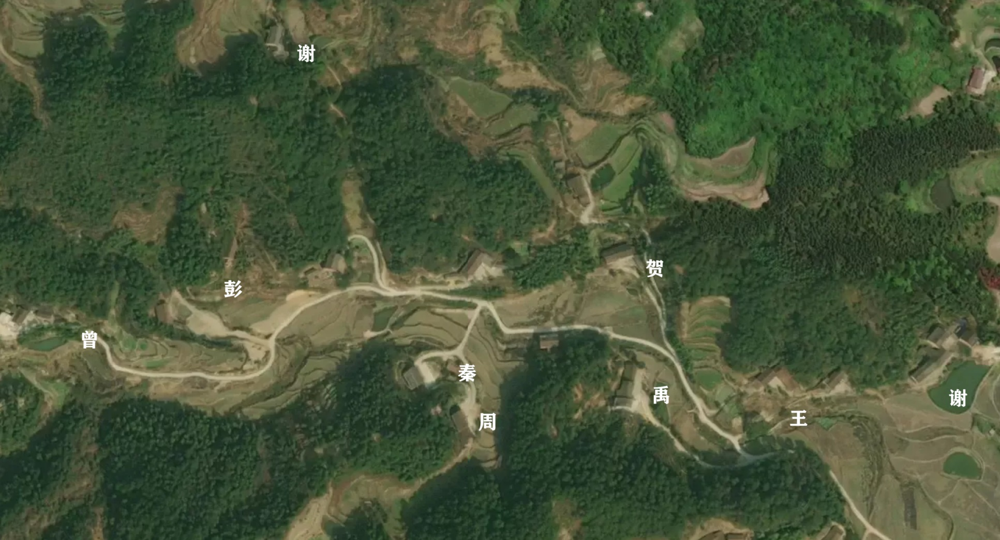

“一村一姓”是中国绝大多数村庄的基本情况。但因为我只对自己在湖南和广东生活地区比较了解，在我35岁之前，我一直以为中国只有广东、福建等传统汉族边疆地区才保留了这种人口分布格局，直到最近在与同事和其他湖南同乡好友讨论到这个问题的时候，才发现，原来自己对这个问题一直存在重大误解。

---

## 一村一姓制度

中国农村地区存在许多一村一姓的现象，这主要与中国历史悠久的宗族制度和传统的聚族而居的文化习俗有关。
1. **宗族制度**
中国古代社会以农业为基础，家族和宗族在社会结构中扮演着重要角色。宗族制度强调血缘关系的重要性，同姓的人通常被认为有共同的祖先，因此他们居住在一起，共同维护家族的荣誉和利益。
3. **土地制度**
在封建社会，土地是家族共有的重要财产。同一姓氏的家族成员共同耕作土地，形成了紧密的经济合作关系。这种经济上的合作也促进了他们在居住上的聚集。
5. **婚姻习俗**
传统上，同村的男女往往不通婚，这导致了姓氏在村落中的集中。婚姻往往在不同的村庄之间进行，进一步强化了一村一姓的现象。
7. **社会稳定**
同一姓氏的家族成员居住在一起，有助于形成稳定的社会结构。在古代，这样的结构有利于抵御外来的侵扰，并能在内部形成有效的社会管理和秩序维护。
9. **文化和宗教活动**
宗族制度还涉及到祭祀共同的祖先，同姓的家族成员会共同参与祭祀活动，这样的活动加深了家族成员之间的联系，也促进了一村一姓的居住模式。
11. **历史迁徙**
历史上，由于战乱、灾害等原因，一些家族集体迁徙到新的地方，他们往往在新地方建立村庄，并以其家族的姓氏命名，从而形成了一村一姓的格局。

---

## 误解形成原因

1. **出生地因素**
之所以这个问题误解我35年，让我从未认清中国农村的普遍现状，主要与我出生地有关。我出生在湖南中部一个偏远山区，在我家附近几百米范围内，按中国村庄的组织架构，都属于同一个村民小组，这个村民小组一共有20来户家庭，总计约70人。而这20来户家庭，却有着8个姓，最多的一个姓也只有几户人。包括：曾、彭、秦、周、贺、谢、禹、王等。

2. **家乡普遍情况**
如果把这个地图放大到我们整个村子约2平方公里范围内（大约600人），则这个姓氏分布还要庞大得多。即便我已经离开家乡近18年，但仍然记得村子里很多家庭的姓氏，除去上边8个姓氏之外，我们村子里至少还有以下这些姓：孙、胡、蒋、宋、葛、屈、陈、熊、廖、刘、李、龙、朱、苏、刘、雷、左、陈等，如果查询户籍名册，实际应该在30个姓以上。

3. **历史原因**
按照我家族谱记载，我们贺氏祖先，自公元924年从江西泰和县迁徙至湖南湘乡县，之后在湖南开枝散叶，形成贺氏在全中国最大的聚居区。根据公安部户政管理研究中心发布2021年中国姓名报告，湖南已经成为贺姓分布最多的省份，大约占全国贺氏15.3%。由于我只在湖南和广东长期生活，自然而然容易将两者进行对比，认为像我们贺氏一样的湖南姓氏形成的历史长达1000多年，而广东大多数村庄家族都是到15世纪明朝中后期才移民形成，自然会出现一个地方村庄姓氏杂乱，另一个地方村庄姓氏统一的情况。

4. **媒体原因**
在普遍的舆论和媒体印象中，广东、福建都被认为是中国“宗族势力”保留最多的地方，而提起“宗族”问题，我就立马想起来“一村一姓”现象，认为之所以广东、福建宗族氛围浓厚，就是因为“一村一姓”问题导致的。

---

## 楚门的世界

在通过跟众多湖南同乡朋友以及其他省份朋友了解后才知道，原来“一村一姓”真是全中国大部分农村的现状，包括湖南在内的多数地方都是”一村一姓“。这就奇了怪了，让我有了一种“原来自己才是小丑”的感觉。既然“一村一姓”是普遍情况，那我的家乡岂不成了特例。

> **行政区划问题**：我出生在湖南双峰县，但这个县是一个新的县，在1953年才设立，历史只有短短70年。而自公元前3年开始一直到1953年，在这接近2000年的时间里，双峰县一直属于湘乡县。我曾多次查阅过《双峰县志》，但从未看到过《双峰县志》中有关于姓氏分布问题存在特殊性的内容。仅仅是在对比《双峰县志》和广东的《南海县志》《中山县志》《番禺县志》等关于姓氏部分的内容中发现双峰县的姓氏数量确实远远多过广东这些县。

---

## 原因剖析

在刚确定我家乡姓氏分布存在特殊性之后，我还一度很怀疑这个结论。因为双峰是湖南一个普通的县，地理上位于湖南的中部，在整个湖南100多个县级行政区域中毫无特殊性可言。唯一能让我感觉到有所不同的是，双峰曾经诞生过近代湖南历史上第一位最重要的人物：曾国藩。故此在研究这个问题的过程中，我将大部分精力都放在与他有关的事情上。

> 事实上由于曾国藩故居距离我家仅有不到两公里，我从小便耳濡目染听着他的事迹长大，当问题线索指向与他有关时，我便已经猜测到了结论：战争的后遗症。

1. **清政府的就地遣散政策**
鸦片战争爆发后，西方列强接踵而至入侵中国。为对抗帝国主义，清政府在湖南组织大量士兵参战。但在鸦片战争结束后，由于战事稍息，清政府对包括湖南在内的南方各省所征募的士兵采取了就地遣散的办法，致使湖南大批散兵游勇脱离家乡四处离散。

2. **太平天国运动**
1852年6月，太平天国军队从广西进入湖南，打着基督教的旗号，号召广大贫苦大众踊跃参加太平军，共享天下太平之乐，期间大量湖南人参加了太平军。在不到一年时间内，太平军在湖南四进四出，席卷60余县，从初入湖南时不足1万人，至出境时已成为15万大军，而这些加入太平军的湖南人，除了部分归降湘军外，大部分都未能逃离灭亡的命运。
		**太平军进入湖南后，对湖南的宗族制度进行了毁灭性破坏**（谭件国《近代湖南宗族研究》）
	* 反对崇拜祖先，要求人们信奉唯一真神 “皇上帝” 对宗族祭祀祖先的场所一祠堂和祖先的神主牌位肆意焚烧和砸毁。正如曾国藩所说，太平军所到之处 “无庙不焚、无像不毁” 。如嘉禾县被太平军攻占后 “ 城则宜瘫、学宫、考棚乡则祠堂、庵观皆被毁” 。
	* 对与太平军对抗的宗族武装势力进行严厉打击和镇压。太平军入湘后湖南许多宗族纷纷组织宗族武装结寨，自保对抗太平军有的宗族甚至率族人四处围剿太平军。众多宗族武装在与太平军的厮杀斗争中死伤无数，元气大伤，有的甚至全族被消灭殆尽。如郴州地主曹魁隆率族中壮丁围剿太平军，旋被消灭。
	*  族人或被掳掠或遭残杀或被迫逃亡四处离散。有关这方面内容的记载，在各地方志中屡见不鲜。如在嘉禾县 “ 二族被掳者百余人阖邑之被掳者以万计，今虽陆续逃归而未归者尚有四分之一。” 东安城陷后，太平军 “ 尽戮城中男女千余人 ” 。在郴州太平军 “盘踞四出杀戮之惨莫此为甚。掳去居民不少生还者村落尽成灰烬几于十室九空。” 由此观之，宗族制度和宗族势力在这场轰轰烈烈的革命运动中遭受了一次沉重的破坏和打击开始走向衰微。

3. **湘军筹建**
曾国藩出生在湖南长沙府湘乡县兴乐乡荷塘二十四都大界里白杨坪，而今这里属于双峰县荷叶镇。在曾国藩筹建湘军的过程中，他大量启用本地人作为兵源。例如，曾国藩在筹建湘军水师时曾要求 “ 水手必须招至四千人，皆须湘乡人，不参用外县的” 。而曾国藩的弟弟曾国荃军中“ 不独尽用湘乡人，且尽用屋门口周围十余里内之人。”在1853-1869年，湘乡县有近10万人加入湘军，仅将领人数就达到7886人。在当时整个湘乡县人口不到50万人的情况下，几乎是家家户户都有人参军，而我家所在的荷叶镇（当时的湘乡县荷塘二十四都），参军比例更是湘乡县最高的地区。例如，曾国藩5兄弟中4人都从军。
>据同治《湘乡县志》记载，从咸丰三年到同治八年（1853～1869），湘乡将领共有7886人。这些将领分为两类：一类是武勋文职，包括总督、巡抚、布政使、按察使、道员、知府、运同、郎中、同知、知州、州同、知县、通判等文官，计358人。另一类武勋武职，包括提督、总兵、副将、参将、游击、都司、守备、千总、把总等武官，计7528人。其中有总督、巡抚8人，布政使、按察使、道员39人，知府、知州、知县283人，提督183人，总兵417人，副将、参将1132人。同治县志还记有阵亡和病故的义勇21335人。
4. **征伐十八省**
作为中国近代最富传奇色彩的传统军队，湘军对中国历史的发展进程起到了举足轻重的推动作用，半部中国近代史都或多或少与湘军存在千丝万缕的联系，特别是对湖南来说，湘军的出现让湖南这个几千年来默默无闻的地方一举推向前台，造就了无数英雄故事。例如，毛泽东的父亲就曾投奔到曾国藩创办的湘军。
19世纪后半页，整个中国到处留下了湘军的印记，湘乡甚至有“一县之兵征伐十八省”的战绩。正是在连年征战过程中，我家乡开始出现大量空巢家庭，不可避免需要加强内部人员流动，用以填补战争带来的人口损耗。加上一部分跟随曾国藩兄弟的湘军将士投奔而来，造成本地姓氏分布的复杂局面。

* **平定太平天国**：为抵抗太平天国运动，1852年，曾国藩开始筹建湘军，到1864年平定太平天国这12年间，湘军大多数时候都是打败仗，被称为“屡战屡败、屡败屡战”，期间湘军死伤无数。
* **平定捻军** ：太平天国运动失败后，一部分湘军被解散遣返原籍，但仍保留一部分继续从军。例如，在1867年（同治六年），湘军在湖北蕲水县遭遇捻军偷袭，一战死亡5281人，其中就有蔡和森（中国共产党创始人之一）的外祖父。
* **琅桥事件**：1874年（同治十三年），琉球国一渔船在海上遇飓风漂至台湾，与当地高山族居民发生冲突，54名琉球渔民被杀。日本借此事件派遣日军3000人于1874年5月在台湾南部登陆，发动侵台战争，湘军奉命进驻厦门，最终迫使日本从台湾撤军。
*  **收复新疆**：1876年（光绪二年），湘军将领左宗棠、刘锦棠率军进疆，到1878年1月2日（光绪三年），成功收复新疆。以湘军为后盾，曾国藩儿子曾纪泽于1881年（光绪七年）成功与沙俄议定《伊犁条约》，成功从沙俄手中收回伊犁。
* **淡水战役** ：1884年（清光绪十年）10月，在中法战争中，湘军在台湾淡水（新北市）抗击法军入侵的作战，取得中法战争后期清军在东南沿海战场的一次较大胜利。
* **镇南关大捷**：1883年11月，越法战事告急，为加强广西边防，左宗棠举荐湘军将领王德榜驻边，王德榜在湖南招募湘军协助冯子材参与镇南关战役，在镇南关大败法国侵略者。
* **牛庄战役**：1894年，中日甲午战争爆发，以李鸿章为首的淮军自平壤战役开始屡遭失败，一溃千里。湘军在历经剿发、剿捻、定回、平疆沉寂消亡并一度中兴担当保台、抗法己任后，再度被推上前台，在牛庄战役中1880名湘军战士壮烈牺牲，以身殉国，成为湘军最后的篇章。

---

## 需要补充的两个问题

1. **如何看待太平天国运动**
如何看待太平天国运动是中国近代史上无可回避的一个话题。在对待太平天国运动的问题上，不同时期有不同看法，而且一些观点之间水火不容，几乎找不到交集点。如果抛开“李秀成”不谈，我想多数人对太平天国的评价还是会较为理性的，只要仔细研究洪秀全及太平天国的历史，不难发现，这真的只是另一个农民起义的失败案例，跟捻军没有实质区别。运动所借助的基督教教义，包括零星体现出的反帝国主义运动性质，只是那个时代所必然具备的背景。但对太平天国的评价，一旦涉及到“李秀成”这个人，事情就变得复杂很多。1962年，在戚本禹发表《评李秀成自述》批判李秀成“忠王不忠”后很长一段时间，“李秀成”问题都是中国近代史中研究的热点，甚至一度成为近代历史人物中被研究最多的人。对李秀成的研究，究其根本，在于一个问题，即研究者到底是采取何种政治立场。如果站在自由主义立场，李秀成确实有引导太平天国演化为资本主义国家的趋势，足以被自由主义者奉为先驱；如果是采取阶级主义立场，李秀成背叛农民革命，确实是其人生最大的污点。特别是其在被俘后，劝曾国藩反清称帝的行为，基本可以判断太平天国仍然没有逃离旧式农民起义的桎梏，包括太平天国本身，也不过是另一个中道崩殂的封建王国罢了。

> “白纸黑字，铁证如山；忠王不终，不足为训。” ——毛泽东
> “天国徒恃一后起之秀的李秀成，只身支柱其间，而其余的政治军事，一切都不能和他配合。”——《中国通史》
> 李秀成生于贫雇农家庭，跟饥寒搏斗成长，入拜上帝会，金田起义，全家加入队伍。经过革命大洪炉的千锤百炼，从士兵一直提升到最高统帅，太平天国的军师。他一生“铁胆忠心”，英风烈迹，使人可歌可泣。不幸国破身虏，学姜维用假投降计，有碍革命气节教育。青史无情，难免批判，亦可慨已夫！——《太平天国史》
> 太平天国运动是中国历史中非常阴暗的一段，我一直想沉默以对。而运动早期的魅力和艰辛又让我敬畏。这场运动源起于崇高、夸张然而扭曲的理想，以突飞猛进的战略运动向前推进，威胁着清政府的统治。它摧枯拉朽、前赴后继，毁灭一切，又拒绝重建，试图推翻清廷却又无力统治国家。太平军烧杀掳掠，涂炭生灵，令大地满目疮痍，最后被清兵与外国军队联合镇压。这次运动预示，中国需要一场真正的政治变革，改变闭关锁国的状态，迎来新生，成为真正具有文明和人性的国家。——慕雅德

2. **如何看待湘军屠城问题**
湘军屠城问题一直是笼罩在湘军身上最大的污点，按照当代伦理，确实是这样。但在古代，战争的确就是这么血腥，包括太平天国在内，无不如此。只是因为湘军屠城的历史节点已经到了1860年代，距离当代比较近，所以显得异常出格，加之地点又是在南京，而73年后日本侵略者在此制造了惨绝人寰的大屠杀事件，导致很容易把这两件事拿来比较。这里我也不想“洗地”了，只是需要指出的是，有些人一边将湘军形成容魔鬼，另一边又把太平天国捧为白莲花，这就是非蠢即坏了。关于太平天国的黑历史，这里我也不再引用，只简单引用学者对于这个事件的看法，另外附上几个同时期的血腥事例。

>考察太平天国运动江南战乱期间人口巨量减损的问题，太平军和清军都存在甚至有时是严重的滥杀现象无疑是最为重要的原因。但是，随着时间推移、政权更迭以及各种政治因素的考量，两军存在的滥杀现象在不同的历史时期有不同的解读。在很长的一段时间内，由于太平天国运动作为农民起义的正当性，太平军在江南战乱期间的滥杀现象从某种程度上来说被其所谓的革命性淡化了。同时，随着近些年学术界对整个晚清历史的重新解读，清军在江南战乱期间所犯下的严重滥杀罪行在某种程度上来说也被有意无意地淡化了，甚至把战乱时期发生的滥杀现象更多地归结于太平军一方面，而对曾国藩及其湘军镇压太平天国给予充分的肯定甚至拔高。可以说，无论其中研究的侧重以及所持的立场如何，刻意夸大或回避其中一方的滥杀行为和反人类罪行，都不是客观的史学研究态度，只有严肃考虑获胜的清政府在话语权方面的优势以及江南士绅对太平天国所持态度等综合因素，并进一步将发现新的史料甚至从考古挖掘的范畴中发现新的证据补充到太平天国研究中来，才能够更好地还原太平天国运动以及这场残酷战争的历史本像。——邵建：《太平天国时期江南战乱中的滥杀现象讨论》

* **同治陕甘回变：死亡人数约2000万人**： 同治回乱自1862年起直至1873年结束，持续10余年后才被清廷镇压。根据复旦大学《中国人口史 第五卷清时期》的数据分析，浩劫过后，原本总人口1300多万的陕西死亡466万人，其中关中地区人口损失多达45.8%。原本1945万人口的甘肃死亡1455万人（当时的甘肃包含今天的甘肃、青海、宁夏等），其中原有280万左右人口的平凉府死亡高达249万，原有141万左右人口的庆阳府死亡高达128.7万人。很多村镇原本数万人口，浩劫过后，几乎是方圆十里无人烟。
* **太平天国起义：死亡人数约2000万人**：太平天国武装力量先后发展到广西、湖南、湖北、江西、安徽、江苏、河南、山西、直隶、山东、福建、浙江、贵州、四川、云南、陕西、甘肃、广东诸省，攻克过600余座城市。这场持续十多年、声势浩大的起义运动，给江苏、安徽、江西、浙江、湖北五省直接造成的过量死亡人口至少达5400万，如果再考虑到其他战场如湖南、广西、福建、四川等省的人口损失，那么太平天国战争给中国带来的人口损失至少在1亿以上，直接造成的过量死亡人口达7000万。
* **广东土客大械斗：死亡人数约100万人**：咸丰同治年间1854-1867广东土客（广府人与客家人）大械斗是一件被人们遗忘或曰忽略的重大历史事件。这场械斗起于粤中西部之鹤山，延及开平、恩平、高明、新兴、新宁、阳春等十几县，绵延十几载，屠杀过百万。

