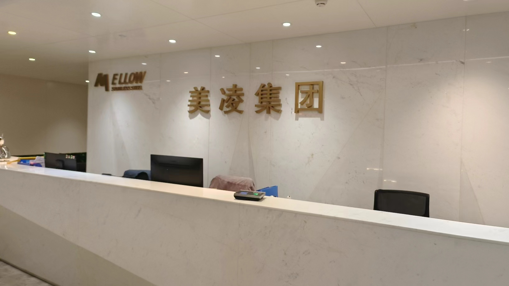
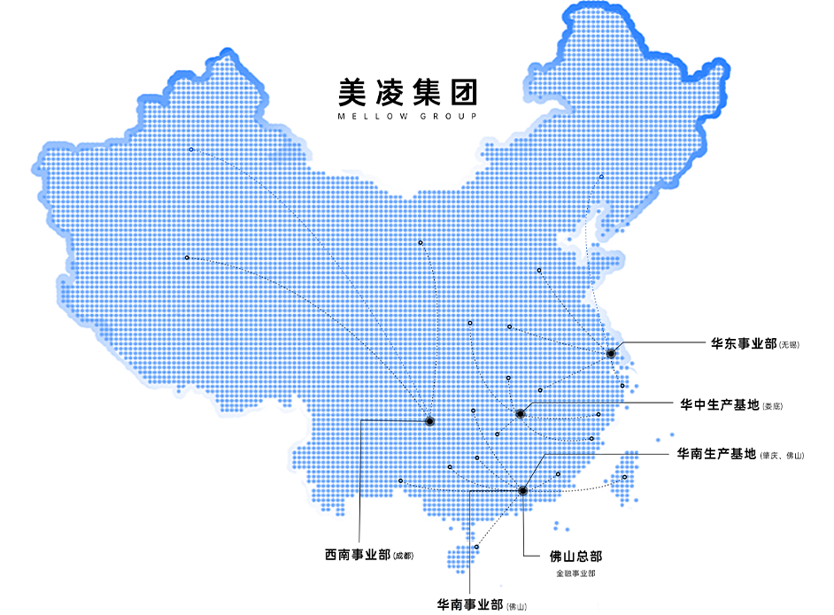
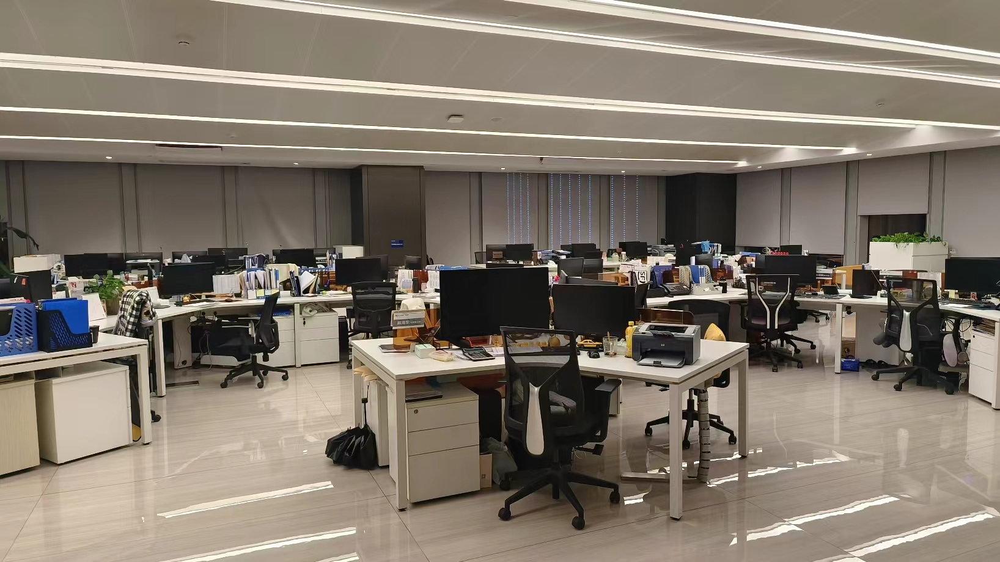
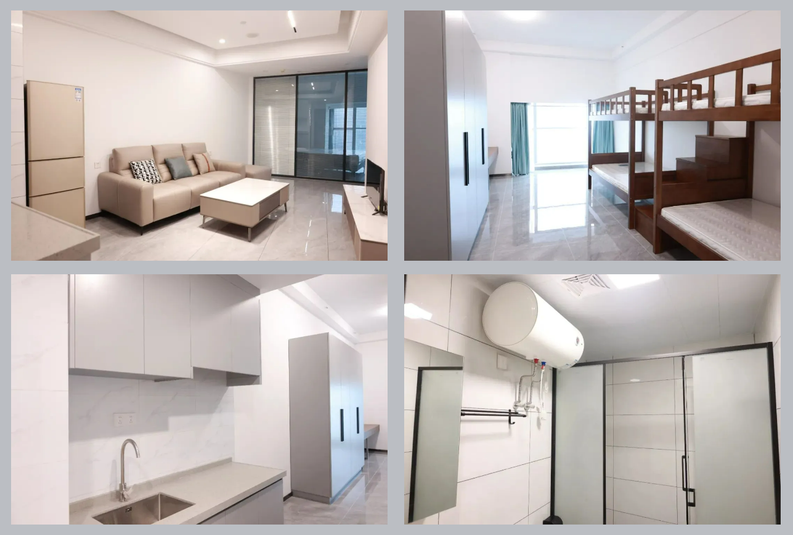
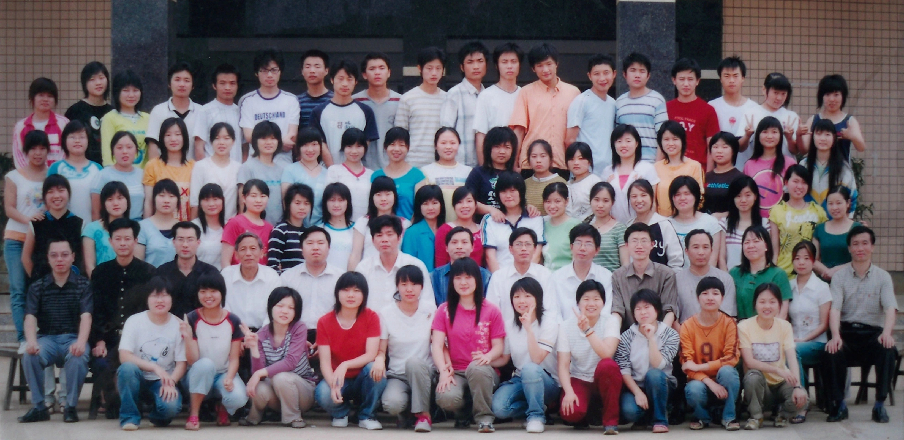

 昨晚受一名高中女同学邀请，我和老婆两人一起到她公司参观，主要是品尝从家乡带过来的腊肉、土鸡蛋等美食，同时在就餐之余，还顺便参观了一下这家企业。虽然我在工作中经常走访企业，但绝大多数时候都是严肃的业务活动，即便有就餐、参观环节，亦显得格外拘束，很少像这样以一个轻松的心态去参观一个企业。

> 这是一家从事不锈钢产品贸易的企业，背靠中国企业五百强之一的宏旺控股集团有限公司，是典型的家族企业。我这个同学是该贸易企业旗下一家公司的总经理，主要负责国内销售部分，另外该企业的不锈钢制品，例如不锈钢材料的家具、装饰建材等也销售往日本、韩国、沙特阿拉伯等国家。

## 宏旺集团

多年前我便听说过宏旺集团名声，这是改革开放后，湖南人南下广东打工创业的成功典型，其创始人来自我老家双峰县。除了扎根广东外，这家公司也反哺桑梓，在双峰县开发区投资建设了很大规模的制造业企业，解决了很多双峰老百姓的本地就业问题。

作为一家专业生产冷轧不锈钢、硅钢和配套精加工产品的企业集团，宏旺集体位列2023中国企业500强第459位，中国制造业企业500强第241位。在行业内享有很好的声誉。

## 美凌公司

这家企业位于佛山新城信保大厦顶楼，共两层办公楼。在企业参观过程中，整洁、干净和现代化的氛围给我留下了深刻印象。特别是在一栋几十层楼高的写字楼顶楼还搭建了一个小花园，确实别有一番味道。

另外，在交谈中了解，虽然该企业从各方面看都偏向现代化管理模式，但仍然保留了传统制造业企业的人性化特点。例如，该企业可以为所有员工提供免费住宿和就餐补贴，企业老板特意购买了数十套精装修公寓房供员工生活使用。

## 同学

这位同学是我我和我老婆共同的高中同学，同一个班级。虽然是女生，但在校期间，仍感觉她具有一种非凡的气质，很能镇得住场面，性格也很开朗，也就是学习成绩稍微差点。毕业后，我们虽然都在同一个城市工作，但只零星接触过她两次，这次去到她公司才有了更加深入的了解。

### 行业反差
讲起不锈钢这类金属材料行业，一般人都不会将其与女性联系起来，而恰好这位女同学就从事了一个这样的行业，并且还成为佛山不锈钢市场小有名气的人物，不由得让人印象深刻。

### 职位反差
多年前我在一次同学聚会上遇到这位女同学时，她当时还是一个普通业务员，直到这次才知道，原来她好几年前就已经成长为管理过几家公司的总经理，让我感觉非常震撼，因为我们同班的其他同学，大都数都仍然处于普通职员阶段。

### 性别反差
遥想当年，我们还在一个教室上课时，这位女同学还是一个懵懵懂懂的小女孩，没想到短短10来年，就已经成长为气场十足的职场女性精英。在照顾家庭、小孩的同时，还得处理公司繁杂的事务，并得到快速晋升，确实非常不容易。

