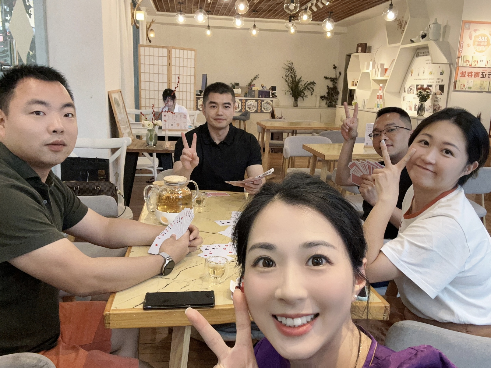

On May 13th, the Ministry of Education issued a public notice, indicating its intention to agree to the proposal by Foshan University of Science and Technology to change its name to Foshan University. This is the fifth renaming application by Foshan University of Science and Technology, and it seems that the matter has finally been settled. Initially, at the end of 2019, during the third renaming application to “Guangdong University of Science and Technology,” it seemed almost certain, as the Guangdong Provincial Department of Education had already publicized it and submitted it to the Ministry of Education for approval. However, due to the impact of the pandemic, the renaming inspection originally planned for the spring of 2020 did not proceed as scheduled, and this delay lasted for three years. By 2023, the Ministry of Education had introduced new naming rules for universities, making it almost impossible for Foshan University of Science and Technology to be approved for renaming as Guangdong University of Science and Technology. Consequently, when resubmitting the application, the school proposed the name “Foshan University,” which was actually one of the school’s previous names.

---

## A sudden arrangement for a class reunion

Like a stone stirring up a thousand ripples, the familiar Foshan University was finally returning, reviving the long-silent class and alumni groups. Consequently, a classmate proposed a weekend dinner gathering to celebrate this wonderful event. Due to the sudden nature of the event, only eight classmates nearby Foshan were able to attend, and one person couldn’t make it to the dinner due to a last-minute matter. However, to everyone’s surprise, what started as a joke in the class group ended up with the classmate who organized the event actually inviting the former dean of the college. This respected dean had also taught our “Jurisprudence” course during the 2007-2008 academic year.

---

## Listening to the teacher lecture again

For almost the first three hours of the dinner, it was mostly the teacher talking, or us students asking questions and the teacher answering.

---

### About the teacher himself

The teacher started with his experiences of traveling abroad after retiring in January this year and talked about his personal journey from starting to teach at Foshan University in 1992, through its renaming to Foshan University of Science and Technology, and the multiple attempts to revert to a university status. Especially after 2017, he shared his own health challenges and how, as a scholar, he conducted interdisciplinary research on his condition, overcame it, and took care of his health.

---

### About children’s education 
During the dinner, the teacher spent a long time talking about his own experiences and those of other teachers at the college in educating their children.

#### He emphasized the current importance of the high school entrance exam (Zhongkao)
Which he believes is now more significant than the college entrance exam (Gaokao). Since the late 1970s, the Gaokao has been considered the most important exam in China, with countless people relying on it to change their destinies. However, in recent years, due to the saturation of college enrollment, the university admission rate has approached 90%, and for most students attending ordinary high schools, even if they “lie flat,” they basically have no worries about not being able to attend university. Overall, the importance of the Gaokao is decreasing. But at the same time, due to the “general vocational分流” policy, during the process of entering high school, more than 55% of junior high school students in many places can only attend secondary vocational technical schools after graduation, and it is basically impossible for these schools to progress to ordinary universities. In this situation, if a child’s academic performance is not ideal in primary and junior high school, they may lose the opportunity to attend an ordinary university and can only take the vocational technical university route.

#### He talked about his methods of educating his children
Both he and his wife are highly educated, but they also faced difficulties in educating their children. He summed it up with the phrase **“parents are not good at teaching their children (academics).”** Parents can still play a decisive role in their children’s growth in life and other aspects, but their role in learning is very limited. He emphasized the importance of teachers and schools in improving children’s academic performance and cited a series of examples from his surroundings. He hoped that we would create a relaxed family atmosphere for our children, send them to the best schools within our means, and handle relationships with teachers well. He advised that we should mainly rely on schools and classrooms to enhance our children’s learning ability, rather than relying on family or off-campus tutoring.

#### He discussed the issue of children’s educational planning.
As a law major himself and with his wife studying medicine, he pointed out that fields like law, especially medicine, and computer science are highly competitive and require continuous learning and updating of knowledge to keep up with the times. Even in computer science, it’s quite possible to be unable to compete with younger people in their thirties and forties due to the physical and familial demands that come with age, making it easy to fall behind in the race for new technology. He stressed the importance of guiding children to develop hobbies and interests based on their personalities and interests, rather than just following trends. The teacher has only one daughter, who is almost our age. After graduating with a bachelor’s degree from a top art academy in China, she pursued a master’s degree at a well-ranked university in the United States, and later, a Ph.D. After completing her doctorate, she became a teacher at a domestic art academy and quickly grew to become one of the youngest professors there.

---

### About the development of the university
 As one of the earliest faculty members with a doctoral degree in law at our alma mater, the teacher has long served as the university’s legal advisor and is aware of many secrets behind the school’s development.
 
#### The development of a university is inseparable from the help of influential people. 
In the course of the development of Foshan University and later Foshan University of Science and Technology, the support of key figures was indispensable. In the early stages, two mayors of Foshan City, Yu Fei and Lu Ruihua, played significant roles. Without the attention and support of these two mayors, Foshan University would not have been established in 1986. *(Yu Fei: Served as the Vice-Governor of Guangdong Province but was expelled from the Communist Party in 1998 due to his children’s seeking private interests; Lu Ruihua: Served as the Governor of Guangdong Province. )*
In the last 10 years, Foshan University of Science and Technology has skyrocketed from outside the top 500 national university rankings to 219th nationwide, thanks in large part to the assistance of the former Secretary of the Guangdong Provincial Party Committee, Hu Chunhua. As a member of the Central Political Bureau, Hu Chunhua visited the school three times after 2015, proposed the goal of building Foshan University of Science and Technology into a high-level science and technology university in Guangdong, and the Guangdong provincial government allocated 500 million yuan specifically for support. Since then, the school’s development has entered the fast lane.

#### The development of a university cannot be separated from government support.
Since public universities dominate in China, the development of universities is driven by administrative resources, and the richness of these resources determines the height of university development. Decisive factors include the level of education and the allocation of funds, both of which are decided by administrative organs. As a university founded by the Foshan municipal government, Foshan University has inherent shortcomings because, compared to the financial strength of national or provincial governments, a prefecture-level city like Foshan falls far short. Moreover, although Foshan’s economic output ranks among the top 20 in the country, as an ordinary prefecture-level city in the Pearl River Delta, under the three-tier fiscal structure (about 50% of income goes to the central government, and of the remaining 50% tax, another 50% goes to the province, leaving about 25% actually retained), the financial resources that the Foshan municipal government can dispose of are far less than those of first-tier cities like Beijing, Shanghai, Guangzhou, and Shenzhen, as well as other sub-provincial cities and general provincial capitals. For example, the fiscal budget expenditure for Foshan University of Science and Technology in 2024 is 1.8 billion yuan, while the fiscal budget expenditure for the Foshan municipal government during the same period is 24 billion yuan, accounting for 7.5% of the total. Nearby universities such as Shenzhen University and Southern University of Science and Technology have fiscal expenditures of over 6 billion yuan, which is an amount that the Foshan city government, with a fiscal budget of 24 billion at the city level, cannot afford. Fortunately, Foshan University of Science and Technology is currently not large in scale, and if calculated by the per-student expenditure on funds, it ranks among the top in Guangdong’s higher education institutions.

#### The development of a university needs to go with the flow. 
In discussing the school’s development, the teacher specifically mentioned the construction of doctoral programs, which is one of the two biggest projects the school has undertaken in recent years, the other being the “renaming to a university” project. Currently, there are about 400 universities in China with doctoral programs. Although Foshan University of Science and Technology has seen its ranking climb continuously, the lack of a doctoral program has always been a major concern, and this has even led to the university’s president position being vacant for three years. The main reason is that the Foshan municipal government hopes to find an expert at the “Academician” level to serve as the president, and it is almost impossible to find an Academician willing to be the president of a school without a doctoral program. In this round of applying for a doctoral program, the school has put in a great deal of effort, especially the party committee secretary who has used all his skills to advance the discipline construction, focusing on mechanical engineering, a field he is highly proficient in. As of now, the application for a doctoral program has reached the most critical stage. In the list of Guangdong universities applying for doctoral program construction published by the Guangdong Provincial Department of Education, Foshan University of Science and Technology’s mechanical engineering doctoral program ranked first among 234 disciplines in 32 universities across the province, and veterinary and animal husbandry programs also ranked among the top five. It can be said that this is the closest the school has been to securing a doctoral program since it became a doctoral degree-granting institution in 2017.

---

### About personal growth
With his 32 years of work experience, the teacher shared several key aspects that we should focus on during our professional development.

#### Avoid speaking ill of others when they are not present. 
The teacher emphasized that Chinese society is heavily influenced by personal relationships, and we should never speak ill of others, regardless of how much we may dislike them or have had conflicts with them. Even a decade ago, we might not have fully appreciated the importance of this advice, but today, we deeply agree with it. Numerous examples around us confirm this point. However, as human beings, we have our limitations, and sometimes we inadvertently express our true feelings, leading to unforeseen consequences.

#### Don’t be too rigid.
The teacher cited several examples from his own experience, advising us to be flexible in handling work relationships and not to be overly pedantic or inflexible. Wearing the necessary masks and disguises is essential for self-protection, which is the foundation of growth. Throughout our development, we will encounter various setbacks and unavoidable conflicts of interest, but we should still approach them with a relaxed and optimistic attitude. Harmonious workplace relationships are crucial for our own well-being. We should not view potential competitors as adversaries but rather as companions, as work is only an eight-hour-a-day matter, while life is a lifelong journey.

#### Learn to be content and embrace ordinariness. 
The teacher used examples of students and leaders he has helped and supported over the years to advise us that as we enter middle age, we should start to learn satisfaction and contentment, and not overly concern ourselves with personal gains and losses. After all, as we reach middle age, the harmony of the family, the growth of our children, and our health are often more important than personal advancement. Especially within the system, the time most people can shine in their careers typically does not exceed 15 years. In the marathon of life, there can still be two to three decades after retirement. Even if some have held high positions and had power for a time, facing decades of retirement, if there are problems with the family, children, or their own health, it would all have been in vain.

---

### About legal work in law
As a senior law professor, the teacher offered some sound advice and suggestions for the work and development of several of us students based on his own experiences.

#### Regarding judicial work. 
Including myself, two of us present have worked in judicial authorities. Drawing on his long-term experience serving part-time in the National People’s Congress, the teacher offered two suggestions for those of us engaged in judicial work: First, the current workload in judicial authorities is generally high, with many cases and few people, a situation that is expected to persist for a long time, and the reward may not be proportional to the effort. For women, especially, who often have to invest more in family and childcare, choosing a career in the judiciary requires careful consideration. Second, within the judiciary, there is a significant level of internal competition, with a concentration of highly educated individuals, complex factions, and young and female leaders often having higher aspirations. It is important to know one’s limits, avoid confrontation, and advance steadily with modesty and caution.

#### Regarding arbitration work. 
One of the students present works in an arbitration institution. Based on his experience as an arbitrator, the teacher advised that students working in arbitration institutions should strengthen communication with law firms, businesses, and other industry organizations, improve communication skills, and develop a network of contacts. Outside of work, they should continuously study relevant trade laws, international trade management, and arbitration rules to maintain advanced and in-depth professional knowledge. However, he suggested that it might not be necessary to pursue a doctoral degree, as we have all been working for over a decade and have missed the optimal time to advance our careers with a doctoral degree. Moreover, at our age, with the pressures of work and life, the benefits of obtaining a PhD may not be significant.

#### Regarding notary work. 
Two students present work in notary institutions. The teacher, based on his experience, put forward several points: First, the notary industry is relatively closed, with a smaller number of notaries among legal professions, and the overall development space is narrow. Second, in recent years, the notary industry has been continuously promoting restructuring, with some notary institutions transitioning from traditional public institutions to social welfare organizations similar to law firms. In this process, the personal networks and channels established become extremely important, as work income will be directly related to the volume of business. Third, the notary industry is closely related to the legal profession, and it is important to pay attention to interactions with lawyers, guiding clients to resolve many common disputes through notarization.

#### Regarding lawyer practice. 
One student is a practicing lawyer, and the teacher himself has also served as a part-time lawyer, and I also work part-time as a public service lawyer. Because of concerns that continuing to practice law after retirement might affect retirement benefits, the teacher canceled his part-time lawyer’s license upon retirement and did not apply to convert it to a general lawyer’s practice certificate. The teacher offered several suggestions for legal practice, including the importance of maintaining client relationships, how to expand one’s network and case sources, and the need for lifelong learning.

#### Regarding corporate work. 
Two students work in central enterprises and large private enterprises in the IT and internet industry. As they are both female and have personal or family health issues, the teacher suggested that they should pay attention to their own and their family’s health while maintaining a positive attitude towards life and a proactive learning mindset. They should keep abreast of industry trends and maintain their level of expertise in law, seeking development opportunities through their comparative advantages in non-legal work.

#### Regarding work within the system. 
Including myself, out of the 7 students present, 5 of us are effectively working in “governmental, institutional, and enterprise units” within the system. The teacher offered a lot of opinions and suggestions on working within the system, also sharing many of his observations from working in the local system in Foshan. As some of the content is sensitive, it has not been written out.

---

## Epilogue
This gathering was indeed a rare opportunity. We arrived at 4 pm in the afternoon, and while waiting for the teacher and other classmates to arrive, we played the card game “Guan Dang” (Gentlemen’s Agreement) as we chatted, with one of our classmates working at a central enterprise saying, “It’s like not eating at all if you don’t play ‘Guan Dang’.” During the meal, we listened to the teacher “lecture” almost throughout, and the teacher even specifically commented on the phenomenon of “Guan Dang.” After the teacher left early due to time constraints, we chatted informally until almost 11 pm before dispersing.

### There is no template for choosing the path of life
The eight classmates who attended the reunion had all graduated from the same class but later embarked on completely different paths in life. If we extend this group to the entire class of over 40 students, their paths become even more diverse and complex. In general, however, we all stood at the same starting point at the same time, seeking different lives. The vast differences that followed may have been more related to each family’s and personal choices. Even among those who pursued the same profession, different classmates took different paths. For example, in our class, four students became ordinary lawyers, one of whom has been practicing law in Foshan for 13 years and has had a smooth career development; another student who did not attend the dinner began practicing law only 10 years after graduation and is still in the early stages; one student who practices law in Shenzhen opened their own law firm early on and has recently opened branches in other places; and another student who practices law in Chengdu pursued a master’s degree after graduation and initially chose to practice in Shenzhen before moving to Chengdu.

### The advantage brought by information gaps is gradually decreasing
When we graduated, information gaps were still a significant factor contributing to differences in life paths. Back then, in our class of over 40 students, only a few chose to take the civil service exam or participate in campus recruitment by enterprises and institutions, and only a few decided to become lawyers. It was only after entering the workforce that more people gradually realized the importance of their undergraduate degree in law. Including myself, many of us entered judicial and administrative organs through the civil service exam in the following years. It was not until 2017, when short video platforms began to thrive, that the advantages of employment in systems such as government agencies and state-owned enterprises were fully exposed, and this was only gradually recognized by the public. At this point, the difficulty of entering these professions compared to when we graduated from university had become unimaginable. For example, when I applied for a civil service position in the Pearl River Delta, there were only 13 applicants for the same position, with only 8 actually taking the exam. With no preparation at all, I even didn’t complete a complete practice test, and yet I managed to score 110 points (out of a total of 200 for two subjects) to become the first-ranked candidate, and was successfully employed. Every time I think back, I feel extremely lucky, with more luck than actual ability.

### There are no shortcuts in the marathon of life
The teacher used his rich personal experiences and insights to illustrate how individuals navigate this era. In the 1980s, when university students were still a “rare species,” the teacher, with his strong character and self-discipline, successfully enrolled in university and pursued a master’s degree. He then went south to Foshan University to pioneer, gradually advancing from lecturer to associate professor and then to professor, and serving as the dean of the college. Along the way, he pursued a doctoral degree and engaged in postdoctoral research at top universities in the industry, providing himself and his family with ample material and spiritual wealth. In the second century of struggle, in this era widely considered highly competitive, I believe that this era still offers opportunities for many to change their destinies. However, success can only be achieved through even greater effort, a more positive attitude, and unwavering perseverance. After all, the negative emotions of this era are already enough, with voices of “lying flat” and “tittytainment” products ubiquitous. Only by adhering to one’s original aspiration can one live up to oneself, one’s family, and this era.

