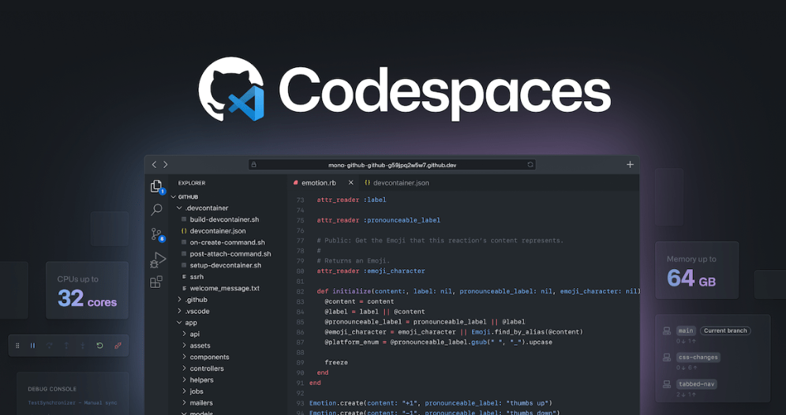
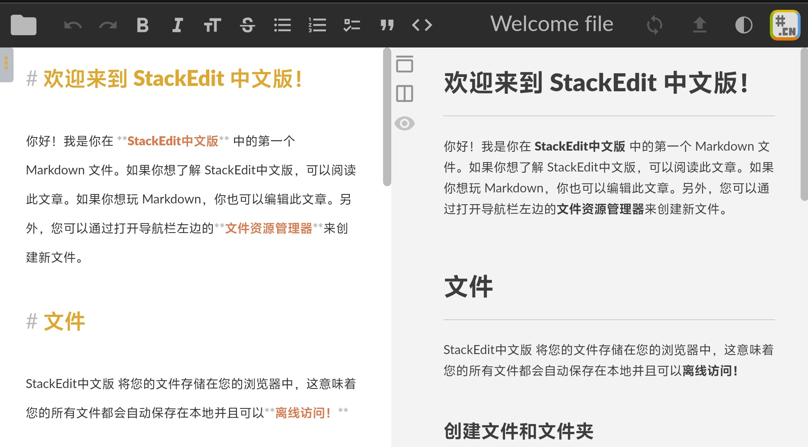
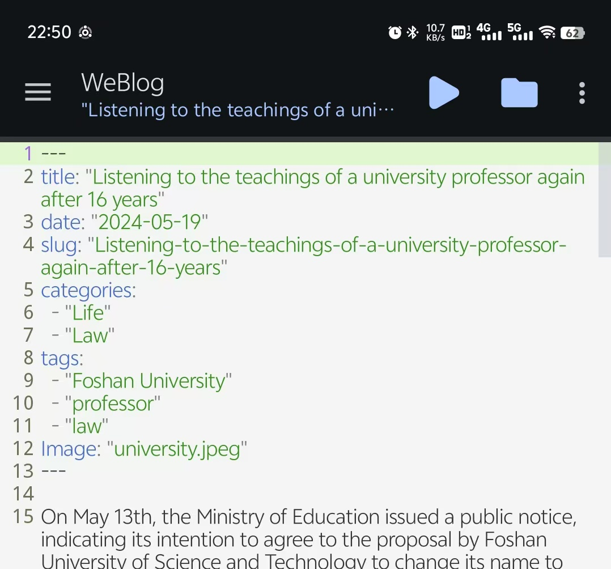
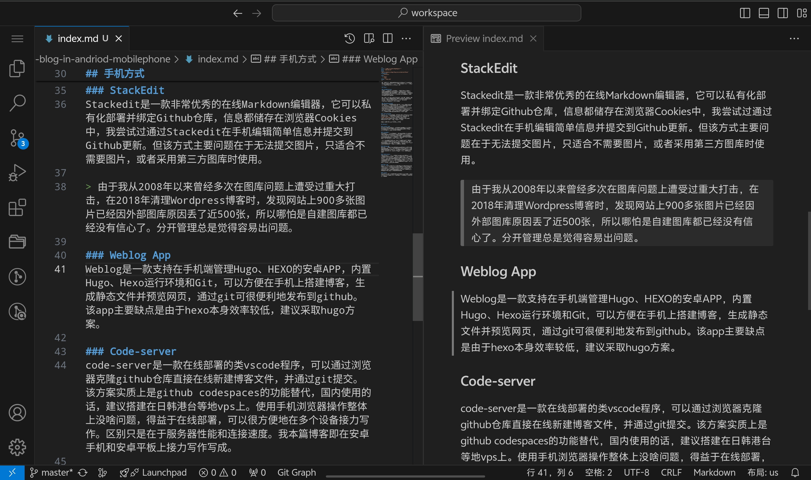
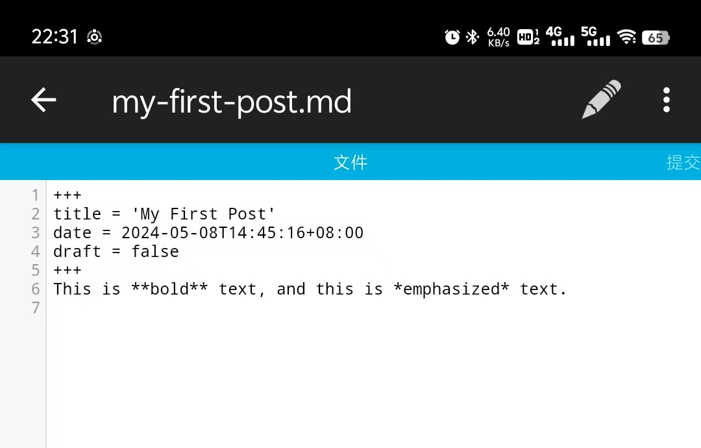

 众所周知，由于HUGO、HEXO、Jekyll等静态博客程序没有后端方案，因此发布博客过程一直很麻烦。此前我用过多种方式进行更新，但都必须是在PC上进行。

 ## PC方式

 ### VSCODE+Github
 我最初使用的方案是在VSCODE进行编辑，然后在本地通过Hugo命令生成Public静态文件，再提交到Github Pages直接发布。后来觉得用Hugo生成过程还是太繁琐，于是改成编辑后直接提交到Github，再使用Github Action生成博客文件发布到Github Pages。
 
 因为本站所有图片都托管在Github，而因为众所周知的原因，Github Pages访问速度仍存在问题，故后来抛弃了Github Action + Github Pages方案，而是通过Vercel或Clodflare Pages来进行自动部署。

 ### Obsidian+Github
 Obsidian是一个优秀的笔记软件，有着非常庞大的插件库。通过Obsidian + qucickadd插件 + Git插件可以很方便的在Obsidian直接提交博客到Github。但问题在于，Obsidian仅能发布文章内容，无法修改网站其他设定，并且直接用Obsidian管理Hugo的Posts目录，总觉得哪里怪怪的，除非是专门建一个博客仓库，不然在管理笔记的过程中，总感觉很容易误操作将笔记内容与博客内容搞乱。

### Joplin+Github
Joplin也是一款非常优秀的开源笔记软件，虽然Joplin插件较少，但是却有一款可以直接发布到Github Pages的插件[Pages Publisher](https://github.com/ylc395/joplin-plugin-pages-publisher) 。但这个插件用的人比较少，目前只有一款最原始的博客主题。

但无论怎样，这些方式必然要使用PC。

## 手机方式

### Github Code
Github仓库可以直接新建和修改文件，但这种方式麻烦点在于Github的国内直接访问并非时刻可用。最怕的就是编辑到一半，突然因网络原因导致页面被重置。Github Codespaces同理。

### StackEdit
Stackedit是一款非常优秀的在线Markdown编辑器，它可以私有化部署并绑定Github仓库，信息都储存在浏览器Cookies中，我尝试过通过Stackedit在手机编辑简单信息并提交到Github更新。但该方式主要问题在于无法提交图片，只适合不需要图片，或者采用第三方图库时使用。

> 由于我从2008年以来曾经多次在图库问题上遭受过重大打击，在2018年清理Wordpress博客时，发现网站上900多张图片已经因外部图库原因丢了近500张，所以哪怕是自建图库都已经没有信心了。分开管理总是觉得容易出问题。

### Weblog App
Weblog是一款支持在手机端管理Hugo、HEXO的安卓APP，内置Hugo、Hexo运行环境和Git，可以方便在手机上搭建博客，生成静态文件并预览网页，通过git可很便利地发布到github。但由于hexo本身效率较低，建议搭配hugo使用。该方案主要问题只支持新建md文件，不支持在app内上传照片，如果要上传照片还需要借助安卓自带文件管理器或第三方文件管理工具。

### Code-server
code-server是一款在线部署的类vscode程序，可以通过浏览器克隆github仓库直接在线新建博客文件，并通过git提交。该方案实质上是github codespaces的功能替代，国内使用的话，建议搭建在日韩港台等地vps上。使用手机浏览器操作整体上没啥问题，得益于在线部署，可以很方便地在多个设备接力写作。区别只是在于服务器性能和连接速度。我本篇博客即在安卓手机和安卓平板上接力写作写成。

### Mgit app
mgit是一款安卓上的git应用，可以很方便拉取github仓库到本地，然后用第三方markdown编辑器撰写博客，不少人就是使用obsidian作为博客编辑器，然后借助mgit在手机电脑间同步。缺点是mgit似乎很久没更新了，我在vivo x100手机上出现了无法直接在mgit中编辑文件的情况。

### termux
该方案我未尝试过，但很早就看到很多人推荐说可以在安卓系统中搭建一个linux环境，但如果只是为了更新博客，这种方式似乎有点用力过度了。

 