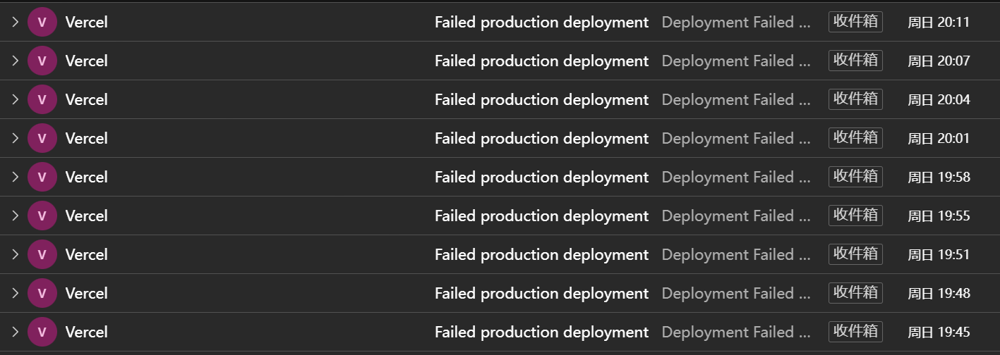

I previously wrote an article on how to publish a HUGO blog from a mobile phone, titled "[[How to Update a Hugo Blog on an Android Phone](https://hyruo.com/en/article/how-to-update-a-hugo-blog-on-an-android-phone/)]," but there were some issues in the description of the StackEdit section, mainly concerning the uploading of images.

> Stackedit is an excellent online Markdown editor that can be privately deployed and linked to Github repositories, with information stored in browser Cookies. I’ve tried editing simple information on my phone through Stackedit and submitting updates to Github. The main drawback of this method is that it cannot submit images, making it suitable only for situations where no images are needed or when using a third-party image library.

## The issue with Uploading Images

When I initially tested this, I was using the Android version of the Edge browser. In this browser, it is indeed not possible to directly paste images in the default mobile web version. However, subsequent tests revealed that I had a significant misunderstanding.


### Uploading in Landscape Mode or Desktop Mode on the Mobile Browser

StackEdit has its own editor toolbar, but on a mobile vertical web page, these editing tools only show the first two by default (depending on the minimum screen width setting of the phone, the Android setting method is System Settings – Developer Options – Minimum Width Setting). When the phone is rotated to landscape mode, the editor toolbar can display all the toolbar options. Alternatively, using the desktop mode of the browser can achieve the same effect.


### Uploading with Built-in Browsers and Other Browsers on Mobile


In the built-in browser of my VIVO phone, when I open the StackEdit editor, I can directly paste images from the phone's clipboard into the editor, including images copied from the phone gallery, web pages, WeChat, and other apps.


I also tested other commonly used browsers like Firefox and Chrome, but neither of them supports direct pasting of images. Among them, Firefox can only paste images copied from Firefox web pages.


Since I'm not very fond of the built-in VIVO browser (it has ads every time I open it), this method is slightly lacking for me. Using the mainstream browsers in landscape mode is the most convenient.


## How to Publish a Hugo Blog Using StackEdit

To use StackEdit, you can choose to deploy a StackEdit application on your own server or use an existing application on the network. Since StackEdit is a web-based application, all its data is stored in the user's browser cookies. Therefore, you can directly use the editor on the official Stackedit.cn website or any editor you find through a search, without worrying about information leakage.


### Docker Deployment
The official recommendation is to deploy using Docker only. The `docker-compose.yml` file is as follows:


```
version: "3.7"
services:
  stackedit:
    image: mafgwo/stackedit:【docker中央仓库找到最新版本】
    container_name: stackedit
    environment:
      - LISTENING_PORT=8080
      - ROOT_URL=/
      - USER_BUCKET_NAME=root
      - DROPBOX_APP_KEY=【不需要支持则删掉】
      - DROPBOX_APP_KEY_FULL=【不需要支持则删掉】
      - GITHUB_CLIENT_ID=【不需要支持则删掉】
      - GITHUB_CLIENT_SECRET=【不需要支持则删掉】
      - GITEE_CLIENT_ID=【不需要支持则删掉】
      - GITEE_CLIENT_SECRET=【不需要支持则删掉】
      - GOOGLE_CLIENT_ID=【不需要支持则删掉】
      - GOOGLE_API_KEY=【不需要支持则删掉】
      - GITEA_CLIENT_ID=【不需要支持则删掉】
      - GITEA_CLIENT_SECRET=【不需要支持则删掉】
      - GITEA_URL=【不需要支持则删掉】
      - GITLAB_CLIENT_ID=【不需要支持则删掉】
      - GITLAB_CLIENT_SECRET=【不需要支持则删掉】
      - GITLAB_URL=【不需要支持则删掉】
    ports:
      - 8080:8080/tcp
    network_mode: bridge
    restart: always
```

### Binding Your Own Repository


This article assumes that the deployment of Hugo on Github has already been completed. Next, you simply need to bind your Github repository in StackEdit.


#### Binding the Main Document Space

1. Add a Github Document Space
2. Enter the repository/path/branch, where the path is filled in as `/content/post` for the Hugo Post folder.
3. Manage the Document Space, and **turn off automatic synchronization** at the newly added document space.

> It is not recommended to directly enable automatic synchronization, especially for automatically deployed Hugos. This is because StackEdit's default synchronization time is 90 seconds, and direct synchronization of the repository can lead to the file being frequently uploaded to Github while it is being edited, triggering the automatic deployment function repeatedly.




3. You can also modify the StackEdit synchronization time to reduce the frequency of automatic deployment. Add the following code in the "Configuration": `autoSyncEvery: 900000` # The default unit is milliseconds, which sets automatic synchronization every 900 seconds.


> *Note: Whether you turn off automatic synchronization or extend the synchronization time, there is a certain risk involved. In the event of a browser page crash, the edited data may be lost.


### Synchronizing Files

Use the synchronization feature to upload blog files to the Github repository.


---

## Other Issues


Overall, StackEdit can indeed be used as a Hugo publishing tool on a mobile phone, but I still encountered several issues during use that were quite frustrating, making me feel that this method is not as good as Code Server.


1. My Hugo Post folder is quite large, and when I set the Post folder as the cloud space, StackEdit automatically pulls out hundreds of folders under my post folder, which can easily cause the browser to freeze, making the process quite distressing. (There is another solution to this problem, which is to create another folder in the Hugo Content directory to store articles. For example, `content/posts`, but the issue with this method is that it can lead to scattered articles, which is not conducive to management.)


If you want to set multiple directories in Hugo Content to store blog files, you also need to configure this in `hugo.toml` or `hugo.yaml`.


```
# Toml
[contentTypes]
  [contentTypes."post"]
    path = "post"
  [contentTypes."posts"]
    path = "posts"
```

```
# Stack Theme
permalinks:
    post: /post/:slug/
    posts: /post/:slug/ # 统一页面url
params:
    mainSections:
        - post
        - posts
```


2. My StackEdit application is hosted on an Oracle India server and is accelerated through Cloudflare, but the connection process is not very stable, often causing the application to freeze when clicking on the file area and the settings area. Of course, this is my own issue, not a problem with StackEdit itself.


3. The default image upload path in StackEdit is slightly different from that in Hugo. In Hugo, images are usually placed together with the index.md file for easy management. If StackEdit wants to upload to the same path, it needs to specify `/content/post/article-pyth/` when uploading each file. If a relative path like `./imgs` is used, it will automatically create a new path at the root of the repository.


> Hugo only has two ways to store images (not considering remote image libraries): one is the official recommended method, where images are placed in a separate directory with the md file; the other is to place images in the static directory. However, if article images are uploaded to the static directory, two problems arise. The first is that this path cannot be previewed locally; the second is that it is difficult to maintain when using other management tools like VScode, Obsidian, Joplin, etc.


```
# Hugo Content 默认目录
content/
├── post/
│   ├── Article-path1/
│   │   ├── images/
│   │   │   ├── funnier-cat.jpg
│   │   │   └── funny-cat.jpg
│   │   ├── index.zh-cn.md
│   │   └── index.md
│   ├── Article-path2/
│   │   ├── fetured.jpg
│   │   └── index.md
├── 1-logo.png
└── _index.md
```


> Written with [StackEdit Chinese Edition](https://editor.hyruo.com/).
