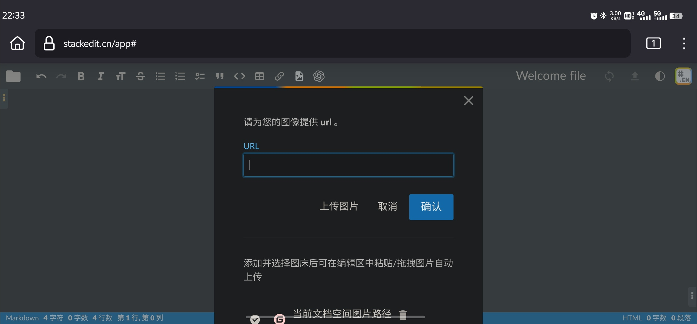

之前写过一篇如何在手机上发布HUGO博客的文章，[[怎样在安卓手机更新Hugo博客](https://hyruo.com/article/how-to-update-a-hugo-blog-on-an-android-phone/)]，但中间对StackEdit部分描述有点问题，主要是上传图片部分。

> Stackedit是一款非常优秀的在线Markdown编辑器，它可以私有化部署并绑定Github仓库，信息都储存在浏览器Cookies中，我尝试过通过Stackedit在手机编辑简单信息并提交到Github更新。但该方式主要问题在于无法提交图片，只适合不需要图片，或者采用第三方图库时使用。

## 上传图片问题

由于我最开始测试时，使用的是安卓版Edge浏览器，在该浏览器中，默认的手机版网页中确实无法直接粘贴图片。但在后续的测试中我自己存在重大误解。

### 直接使用手机浏览器横屏或桌面模式上传

StackEdit自带有编辑器工具栏，但是在手机竖版网页中，这些编辑工具默认只显示前两个（主要看手机屏幕最小宽度设置，安卓设置方法是系统设置——开发者选项——最小宽度设置），但在横屏使用后，编辑器工具栏可以显示所有工具选项。或者，使用浏览器的桌面模式，也能实现同样的效果。




### 使用手机内置浏览器等其他浏览器上传

在我的VIVO手机内置浏览器中，当我打开StackEdit编辑器时，可以直接将手机内剪贴板中的图片粘贴到编辑器中，包括从手机图库、网页、微信等APP中复制的图片，均能粘贴。

另外我也测试了其他常用Firefox, Chrome浏览器，但这两者均不支持直接粘贴图片。其中，Firefox仅可粘贴从firefox其他网页上复制的图片。

由于我对VIVO自带浏览器不是很喜欢（每次打开都有广告），所以这种方法对我来说还稍微欠缺一点，还是直接在主流浏览器中横屏使用最方便。


## 如何使用StackEdit发布Hugo博客

要使用stackedit，首先需要在自己的服务器部署一个stackedit应用，官方只推荐Docker部署方式，但由于stackedit本身是一个网页版应用，该应用的所有数据都储存在浏览器Cookies中，所以直接使用Stackedit.cn官网的编辑器就行了。

### Docker部署

`docker-compose.yml`如下：

```
version: "3.7"
services:
  stackedit:
    image: mafgwo/stackedit:【docker中央仓库找到最新版本】
    container_name: stackedit
    environment:
      - LISTENING_PORT=8080
      - ROOT_URL=/
      - USER_BUCKET_NAME=root
      - DROPBOX_APP_KEY=【不需要支持则删掉】
      - DROPBOX_APP_KEY_FULL=【不需要支持则删掉】
      - GITHUB_CLIENT_ID=【不需要支持则删掉】
      - GITHUB_CLIENT_SECRET=【不需要支持则删掉】
      - GITEE_CLIENT_ID=【不需要支持则删掉】
      - GITEE_CLIENT_SECRET=【不需要支持则删掉】
      - GOOGLE_CLIENT_ID=【不需要支持则删掉】
      - GOOGLE_API_KEY=【不需要支持则删掉】
      - GITEA_CLIENT_ID=【不需要支持则删掉】
      - GITEA_CLIENT_SECRET=【不需要支持则删掉】
      - GITEA_URL=【不需要支持则删掉】
      - GITLAB_CLIENT_ID=【不需要支持则删掉】
      - GITLAB_CLIENT_SECRET=【不需要支持则删掉】
      - GITLAB_URL=【不需要支持则删掉】
    ports:
      - 8080:8080/tcp
    network_mode: bridge
    restart: always
```

### 绑定自己的仓库

本文假定已经完成了Hugo在Github的部署工作。接下来，只需要在stackedit中绑定github仓库即可。

#### 绑定主文档空间
1. 新增Github文档空间
2. 输入仓库/路径/分支 其中路径填写Hugo POST文件夹 `/contet/posts`
3. 管理文档空间，在刚添加的文档空间处**关闭自动同步**

> 不建议直接开启自动同步，特别是自动部署的Hugo。因为Stackedit默认同步时间为90秒，如果直接同步仓库会导致正在编辑的文件被频繁上传到github而不断触发自动部署功能。

3. 也可以修改stackedit同步时间减缓自动部署频率。在“配置”中添加如下代码：
`autoSyncEvery: 900000` #默认单位为毫秒，这是设置900秒自动同步。

> *备注：无论是关闭自动同步还是延长同步时间，均存在一定风险，万一浏览器页面崩溃，已编辑数据可能存在丢失现象。

#### 同步文件
使用同步功能将博客文件上传到Github仓库。发布功能只适合无需使用Github作图床的情况。

---

总的来说StackEdit确实可以用作手机上的Hugo发布端，但是我在使用过程中还是发现几个问题比较头疼：

1. 我的Hugo Post文件夹较为庞大，当设定Post文件夹作为云空间时，StackEdit会自动将我的几百个文件夹全部拉去出来，容易导致浏览器假死，过程比较揪心。
2. 我的StackEdit应用搭建在甲骨文印度服务器上，通过Cloudflare加速，但连接过程不是很稳定，点击文件区域和设置区域时，经常假死。当然这是我自己的问题，并不是Stackedit的问题。
3. StackEdit默认上传图片路径与Hugo有点区别。我在Hugo中图片一般与index.md放在一块，方便管理。Stackedit如果想上传到同路径，需要在每篇文件上传时指定`/content/post/article-pyth/`，如果采取其他`./imgs`之类相对路径，会自动在仓库根目录重新创建路径。


> Written with [StackEdit中文版](https://editor.hyruo.com/).
