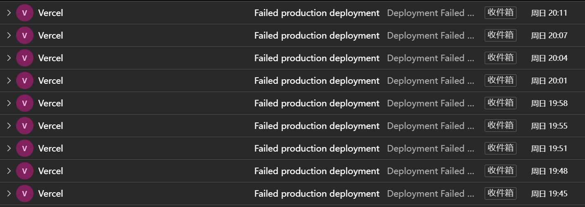

之前写过一篇如何在手机上发布 HUGO 博客的文章，[[怎样在安卓手机更新Hugo博客](https://hyruo.com/article/how-to-update-a-hugo-blog-on-an-android-phone/)]，但中间对 StackEdit 部分描述有点问题，主要是上传图片部分。

> Stackedit 是一款非常优秀的在线 Markdown 编辑器，它可以私有化部署并绑定 Github 仓库，信息都储存在浏览器 Cookies 中，我尝试过通过 Stackedit 在手机编辑简单信息并提交到Github更新。但该方式主要问题在于无法提交图片，只适合不需要图片，或者采用第三方图库时使用。

## 上传图片问题

由于我最开始测试时，使用的是安卓版 Edge 浏览器，在该浏览器中，默认的手机版网页中确实无法直接粘贴图片。但在后续的测试中发现这是我自己存在重大误解。

### 直接使用手机浏览器横屏或桌面模式上传

StackEdit 自带有编辑器工具栏，但是在手机竖版网页中，这些编辑工具默认只显示前两个（主要看手机屏幕最小宽度设置，安卓设置方法是系统设置——开发者选项——最小宽度设置）。在旋转手机变横屏后，编辑器工具栏就可以显示所有工具栏选项。或者，使用浏览器的桌面模式，也能实现同样的效果。


### 使用手机内置浏览器等其他浏览器上传

在我 VIVO 手机的内置浏览器中，当打开 StackEdit 编辑器时，可以直接将手机剪贴板中的图片粘贴到编辑器，包括从手机图库、网页、微信等 APP 中复制的图片，均能粘贴。

另外我也测试了其他常用 Firefox, Chrome 浏览器，但这两者均不支持直接粘贴图片。其中，Firefox 仅可粘贴从 Firefox 网页上复制的图片。

由于我对 VIVO 自带浏览器不是很喜欢（每次打开都有广告），所以这种方法对我来说还稍微欠缺一点。直接在主流浏览器中横屏使用最方便。


## 如何使用 StackEdit 发布 Hugo 博客

要使用stackedit，可以选择在自己的服务器部署一个 StackEdit 应用，也可以使用网络上现成的应用。因为 StackEdit 本身是一个网页版应用，该应用的所有数据都储存在使用者浏览器的 Cookies 中，所以直接使用像 Stackedit.cn 官网的编辑器或任意搜索到的编辑器都行，不存在信息泄露问题。

### Docker 部署
官方只推荐 Docker 部署这一种方式。
`docker-compose.yml`如下：

```
version: "3.7"
services:
  stackedit:
    image: mafgwo/stackedit:【docker中央仓库找到最新版本】
    container_name: stackedit
    environment:
      - LISTENING_PORT=8080
      - ROOT_URL=/
      - USER_BUCKET_NAME=root
      - DROPBOX_APP_KEY=【不需要支持则删掉】
      - DROPBOX_APP_KEY_FULL=【不需要支持则删掉】
      - GITHUB_CLIENT_ID=【不需要支持则删掉】
      - GITHUB_CLIENT_SECRET=【不需要支持则删掉】
      - GITEE_CLIENT_ID=【不需要支持则删掉】
      - GITEE_CLIENT_SECRET=【不需要支持则删掉】
      - GOOGLE_CLIENT_ID=【不需要支持则删掉】
      - GOOGLE_API_KEY=【不需要支持则删掉】
      - GITEA_CLIENT_ID=【不需要支持则删掉】
      - GITEA_CLIENT_SECRET=【不需要支持则删掉】
      - GITEA_URL=【不需要支持则删掉】
      - GITLAB_CLIENT_ID=【不需要支持则删掉】
      - GITLAB_CLIENT_SECRET=【不需要支持则删掉】
      - GITLAB_URL=【不需要支持则删掉】
    ports:
      - 8080:8080/tcp
    network_mode: bridge
    restart: always
```

### 绑定自己的仓库

本文假定已经完成了 Hugo 在 Github 的部署工作。接下来，只需要在 StackEdit 中绑定 Github 仓库即可。

#### 绑定主文档空间
1. 新增 Github 文档空间
2. 输入仓库/路径/分支，其中路径填写 Hugo Post 文件夹 `/contet/post`
3. 管理文档空间，在刚添加的文档空间处**关闭自动同步**

> 不建议直接开启自动同步，特别是自动部署的 Hugo。因为 Stackedit 默认同步时间为 90 秒，如果直接同步仓库会导致正在编辑的文件被频繁上传到 github 而不断触发自动部署功能。



3. 也可以修改 StackEdit 同步时间减缓自动部署频率。在“配置”中添加如下代码： 
`autoSyncEvery: 900000`  #默认单位为毫秒，这是设置 900 秒自动同步。

> *备注：无论是关闭自动同步还是延长同步时间，均存在一定风险。万一浏览器页面崩溃，已编辑数据可能存在丢失现象。

#### 同步文件
使用同步功能将博客文件上传到 Github 仓库。

---

## 其他问题

总的来说 StackEdit 确实可以用作手机上的 Hugo 发布端，但是我在使用过程中还是发现几个问题比较头疼，让我感觉这种方式还是不如 Code Server 好用。

1. 我的 Hugo Post 文件夹较为庞大，当设定 Post 文件夹作为云空间时，StackEdit 会自动将我 post 文件夹下几百个文件夹全部拉取出来，容易导致浏览器假死，过程比较揪心。
  (这个问题也有另一个解决办法，就是在 Hugo Content 目录中，新建另一个文件夹用于存放文章。例如，`content/posts` ，但该方法的问题是会导致文章分散，不利于管理。)

如果想在 Hugo Content 中设置多个目录存放博客文件，还需要在 `hugo.toml` 或者 `hugo.yaml` 进行设置。

```
# Toml
[contentTypes]
  [contentTypes."post"]
    path = "post"
  [contentTypes."posts"]
    path = "posts"
```

```
# Stack Theme
permalinks:
    post: /post/:slug/
    posts: /post/:slug/ # 统一页面url
params:
    mainSections:
        - post
        - posts
```


2. 我的 StackEdit 应用搭建在甲骨文印度服务器上，通过 Cloudflare 加速，但连接过程不是很稳定，点击文件区域和设置区域时经常假死。当然，这是我自己的问题，并不是 StackEdit 的问题。


3. StackEdit默认上传图片路径与 Hugo 有点区别。Hugo 中图片一般与 index.md 放在一块，方便管理。StackEdit 如果想上传到同路径，需要在每篇文件上传时指定 `/content/post/article-pyth/` ，如果采取其他 `./imgs` 之类相对路径，会自动在仓库根目录重新创建路径。

> HUGO 只有两种图片存储方式（不考虑远程图库），一种是官方推荐的方式，图片与 md 文件放在单独目录内；另一种是将图片放在 static 目录中。但如果将文章图片上传到 static 目录，会出现两个问题。1 是这种路径在本地无法预览；2 是在使用其他 VScode obsidian Joplin 等管理工具时很难维护。

```
# Hugo Content 默认目录
content/
├── post/
│   ├── Article-path1/
│   │   ├── images/
│   │   │   ├── funnier-cat.jpg
│   │   │   └── funny-cat.jpg
│   │   ├── index.zh-cn.md
│   │   └── index.md
│   ├── Article-path2/
│   │   ├── fetured.jpg
│   │   └── index.md
├── 1-logo.png
└── _index.md
```


> Written with [StackEdit 中文版](https://editor.hyruo.com/).
